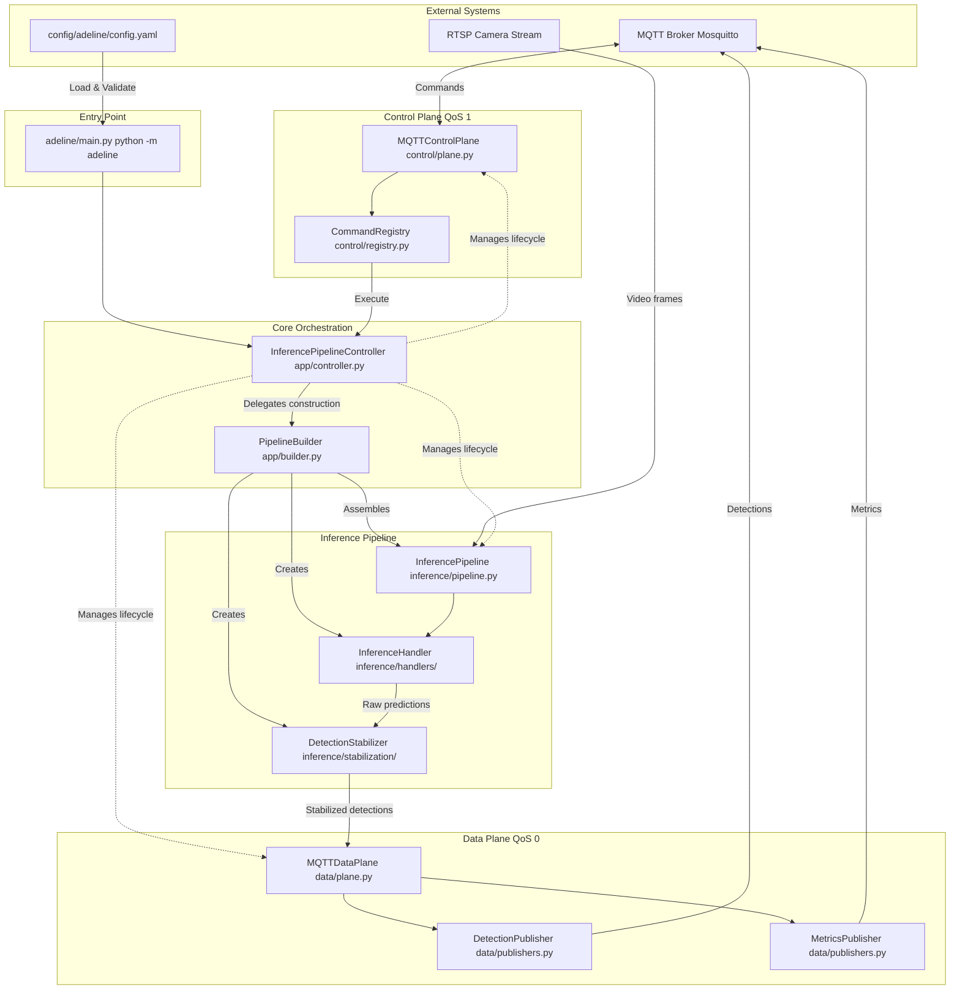
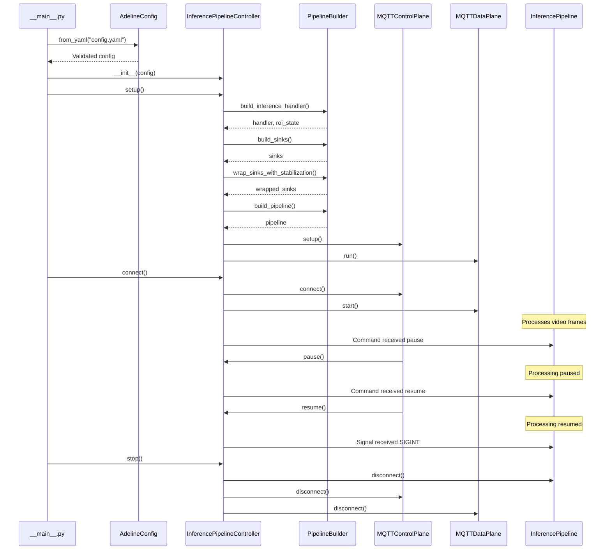

# Overview

Relevant source files

- [.gitignore](https://github.com/acare7/kata-inference-251021-clean4/blob/a0662727/.gitignore)
- [README.md](https://github.com/acare7/kata-inference-251021-clean4/blob/a0662727/README.md)
- [adeline/CLAUDE.md](https://github.com/acare7/kata-inference-251021-clean4/blob/a0662727/adeline/CLAUDE.md)
- [adeline/README.md](https://github.com/acare7/kata-inference-251021-clean4/blob/a0662727/adeline/README.md)

## Purpose and Scope

This document provides a high-level introduction to the Adeline inference pipeline system, its purpose as a fall detection system for geriatric residences, and the architecture that enables real-time, multi-person video inference with remote control capabilities.

For detailed information on specific subsystems, refer to:

- Core architectural components: [Core Architecture](https://deepwiki.com/acare7/kata-inference-251021-clean4/3-core-architecture)
- MQTT communication protocols: [MQTT Communication](https://deepwiki.com/acare7/kata-inference-251021-clean4/4-mqtt-communication)
- Detection processing pipeline: [Inference Pipeline](https://deepwiki.com/acare7/kata-inference-251021-clean4/5-inference-pipeline)
- Configuration system details: [Configuration System](https://deepwiki.com/acare7/kata-inference-251021-clean4/6-configuration-system)

## System Purpose

Adeline is a computer vision inference pipeline designed for **fall detection in geriatric residences**. The system processes RTSP video streams using YOLO models to detect persons and their postures, supporting **1-4 residents per room** with multi-object tracking capabilities.

The system is designed to:

- Continuously monitor video streams from residential rooms
- Detect persons and track their identities across frames
- Stabilize detections to reduce false alarms and flickering
- Publish detection results via MQTT for consumption by alert systems
- Support remote control for operational management (pause, resume, status checks)

Sources: [adeline/CLAUDE.md5-7](https://github.com/acare7/kata-inference-251021-clean4/blob/a0662727/adeline/CLAUDE.md#L5-L7) [README.md108-114](https://github.com/acare7/kata-inference-251021-clean4/blob/a0662727/README.md#L108-L114)

## High-Level Architecture

The Adeline system implements a **dual-plane architecture** that separates control operations from data flow, with a builder-based component construction system.

### System Architecture Diagram





**Key Architectural Decisions:**

1. **Separation of Control and Data**: Control commands (pause, resume, stop) use QoS 1 for reliability, while detection publishing uses QoS 0 for performance
2. **Builder Pattern**: `PipelineBuilder` constructs all components, separating construction logic from orchestration
3. **Registry Pattern**: `CommandRegistry` explicitly registers available commands, preventing runtime errors from unsupported operations
4. **Strategy Pattern**: ROI modes and stabilization strategies are selected at build time based on configuration

Sources: [adeline/CLAUDE.md56-88](https://github.com/acare7/kata-inference-251021-clean4/blob/a0662727/adeline/CLAUDE.md#L56-L88) [adeline/CLAUDE.md90-102](https://github.com/acare7/kata-inference-251021-clean4/blob/a0662727/adeline/CLAUDE.md#L90-L102) Diagram 1 from context

## System Entry Point and Lifecycle

### Entry Point

The system is invoked as a Python module:

```
python -m adeline
```

The entry point at [adeline/__main__.py](https://github.com/acare7/kata-inference-251021-clean4/blob/a0662727/adeline/__main__.py) loads the configuration, instantiates the `InferencePipelineController`, and delegates to it for orchestration.

### Component Lifecycle




**Lifecycle Phases:**

1. **Configuration Loading**: Pydantic validation ensures fail-fast behavior at load time
2. **Component Construction**: `PipelineBuilder` assembles all components through factory delegation
3. **Setup**: Control and data planes establish MQTT connections
4. **Run**: Pipeline starts processing video frames
5. **Runtime Control**: Commands modify pipeline state without restart
6. **Shutdown**: Graceful cleanup of all resources

Sources: [adeline/CLAUDE.md68-88](https://github.com/acare7/kata-inference-251021-clean4/blob/a0662727/adeline/CLAUDE.md#L68-L88) [adeline/CLAUDE.md130-142](https://github.com/acare7/kata-inference-251021-clean4/blob/a0662727/adeline/CLAUDE.md#L130-L142) Diagram 3 from context

## Key Components Overview

### InferencePipelineController

[app/controller.py](https://github.com/acare7/kata-inference-251021-clean4/blob/a0662727/app/controller.py)

The central orchestrator responsible for:

- Lifecycle management (setup, start, stop, pause, resume)
- Signal handling (SIGINT, SIGTERM)
- Component coordination without knowing construction details
- Delegating to `PipelineBuilder` for component assembly

For detailed information, see [InferencePipelineController](https://deepwiki.com/acare7/kata-inference-251021-clean4/3.1-inferencepipelinecontroller).

### PipelineBuilder

[app/builder.py](https://github.com/acare7/kata-inference-251021-clean4/blob/a0662727/app/builder.py)

Implements the Builder pattern to construct the inference pipeline:

- Creates inference handlers via `InferenceHandlerFactory`
- Builds output sinks via `SinkFactory` with priority ordering
- Wraps sinks with stabilization via `StrategyFactory`
- Assembles the complete `InferencePipeline`

Configuration drives all construction decisions. For detailed information, see [PipelineBuilder](https://deepwiki.com/acare7/kata-inference-251021-clean4/3.2-pipelinebuilder).

### MQTT Control Plane

[control/plane.py](https://github.com/acare7/kata-inference-251021-clean4/blob/a0662727/control/plane.py)

Manages reliable command reception using QoS 1:

- Subscribes to `inference/control/commands` topic
- Uses `CommandRegistry` for explicit command registration
- Executes registered commands (pause, resume, stop, status, metrics)
- Publishes status updates to `inference/control/status`

For detailed information, see [Control Plane](https://deepwiki.com/acare7/kata-inference-251021-clean4/4.1-control-plane).

### MQTT Data Plane

[data/plane.py](https://github.com/acare7/kata-inference-251021-clean4/blob/a0662727/data/plane.py)

Manages high-throughput data publishing using QoS 0:

- Publishes detections to `inference/data/detections` via `DetectionPublisher`
- Publishes metrics to `inference/data/metrics` via `MetricsPublisher`
- Best-effort delivery optimized for performance

For detailed information, see [Data Plane](https://deepwiki.com/acare7/kata-inference-251021-clean4/4.2-data-plane).

### InferencePipeline

[inference/pipeline.py](https://github.com/acare7/kata-inference-251021-clean4/blob/a0662727/inference/pipeline.py)

The core video processing pipeline:

- Reads frames from RTSP streams
- Passes frames through `InferenceHandler` for ROI processing and YOLO inference
- Applies `DetectionStabilizer` for temporal filtering
- Distributes results to multiple output sinks

For detailed information, see [Inference Pipeline](https://deepwiki.com/acare7/kata-inference-251021-clean4/5-inference-pipeline).

Sources: [adeline/CLAUDE.md65-88](https://github.com/acare7/kata-inference-251021-clean4/blob/a0662727/adeline/CLAUDE.md#L65-L88) [adeline/CLAUDE.md90-102](https://github.com/acare7/kata-inference-251021-clean4/blob/a0662727/adeline/CLAUDE.md#L90-L102)

## Component Interaction Map

This diagram shows how the main code entities interact during runtime operation:

```mermaid

flowchart TB

  subgraph RUNTIME[Runtime Operation]

    subgraph CMD[Command Processing Flow]
      CP_MSG[MQTTControlPlane._on_message]
      REG_EXEC[CommandRegistry.execute]
      IPC_CMD[InferencePipelineController.pause InferencePipelineController.resume InferencePipelineController.stop]

      CP_MSG -->|Command| REG_EXEC
      REG_EXEC -->|pause/resume/stop| IPC_CMD
    end

    subgraph VID[Video Processing Flow]
      IPC_RUN[InferencePipelineController.run]
      IP_CONSUME[InferencePipeline._consume_stream]
      IH_INFER[InferenceHandler.infer]
      STAB_FILTER[DetectionStabilizer.filter]
      SINK_PROCESS[Sink.process]

      IPC_RUN -->|Starts thread| IP_CONSUME
      IP_CONSUME -->|Frame| IH_INFER
      IH_INFER -->|Predictions| STAB_FILTER
      STAB_FILTER -->|Stabilized| SINK_PROCESS
    end

    subgraph PUB[Data Publishing Flow]
      DPUB_PUB[DetectionPublisher.publish]
      MPUB_PUB[MetricsPublisher.publish]
      DP_SEND[MQTTDataPlane.publish]

      SINK_PROCESS -->|Detections| DPUB_PUB
      DPUB_PUB -->|Formatted| DP_SEND
      SINK_PROCESS -->|Metrics| MPUB_PUB
      MPUB_PUB -->|Formatted| DP_SEND
    end

    IPC_CMD -. Controls .-> IP_CONSUME
  end

```



**Runtime Flow Summary:**

1. **Video Thread**: `InferencePipeline` continuously consumes frames, processes through handler and stabilizer, distributes to sinks
2. **Command Thread**: `MQTTControlPlane` receives commands, registry executes them on controller, which modifies pipeline state
3. **Publishing**: Sinks format detections/metrics and publish via `MQTTDataPlane` asynchronously

Sources: [adeline/CLAUDE.md65-88](https://github.com/acare7/kata-inference-251021-clean4/blob/a0662727/adeline/CLAUDE.md#L65-L88) Diagram 1 and Diagram 2 from context

## Technology Stack

|Component|Technology|Purpose|
|---|---|---|
|**Video Processing**|OpenCV|Frame capture and image operations|
|**Object Detection**|YOLO (via Roboflow inference or Ultralytics)|Person detection and classification|
|**Computer Vision Utilities**|Supervision|Detection utilities and tracking|
|**Messaging**|paho-mqtt|MQTT protocol implementation|
|**RTSP Proxy**|go2rtc|RTSP stream management|
|**Configuration**|Pydantic v2|Type-safe configuration with validation|
|**Language**|Python 3.11+|Core implementation|

Sources: [README.md164-171](https://github.com/acare7/kata-inference-251021-clean4/blob/a0662727/README.md#L164-L171) [adeline/CLAUDE.md130-135](https://github.com/acare7/kata-inference-251021-clean4/blob/a0662727/adeline/CLAUDE.md#L130-L135)

## Configuration-Driven Architecture

The system uses **Pydantic v2** for type-safe, validated configuration at [config/schemas.py](https://github.com/acare7/kata-inference-251021-clean4/blob/a0662727/config/schemas.py):

- `AdelineConfig.from_yaml()` loads and validates configuration at startup
- Validation errors cause immediate failure (fail-fast philosophy)
- Configuration determines component selection (ROI mode, stabilization strategy)
- No runtime configuration changes; restart required for config modifications

**Key Configuration Sections:**

|Section|Schema|Purpose|
|---|---|---|
|Pipeline|`PipelineSettings`|RTSP URL, max FPS|
|Models|`ModelsSettings`|YOLO model selection, image size|
|MQTT|`MQTTSettings`|Broker connection, topics, QoS levels|
|Stabilization|`DetectionStabilizationSettings`|Temporal filtering, hysteresis thresholds|
|ROI|`ROIStrategySettings`|ROI mode (none/adaptive/fixed)|
|Logging|`LoggingSettings`|Log levels and formatting|

For comprehensive configuration documentation, see [Configuration System](https://deepwiki.com/acare7/kata-inference-251021-clean4/6-configuration-system).

Sources: [adeline/CLAUDE.md128-135](https://github.com/acare7/kata-inference-251021-clean4/blob/a0662727/adeline/CLAUDE.md#L128-L135) [adeline/CLAUDE.md166-171](https://github.com/acare7/kata-inference-251021-clean4/blob/a0662727/adeline/CLAUDE.md#L166-L171) Diagram 5 from context

## Design Philosophy

The Adeline system follows these core principles:

**"Complejidad por diseño, no por accidente"** (Complexity by design, not by accident)

- Architectural boundaries manage complexity intentionally
- Pattern-based design (Builder, Strategy, Registry, Factory)
- Separation of concerns at every level

**Fail Fast**

- Pydantic validation at load time, not runtime
- Invalid configurations prevent startup entirely
- Explicit error messages with validation context

**Explicit Over Implicit**

- `CommandRegistry` requires explicit command registration
- No optional callbacks or dynamic command discovery
- Conditional registration based on system capabilities

**Performance by Design**

- Zero-copy NumPy views for ROI cropping
- QoS levels tuned per use case (QoS 1 for commands, QoS 0 for data)
- Vectorized coordinate transformations

For detailed design principles, see [Design Philosophy](https://deepwiki.com/acare7/kata-inference-251021-clean4/1.2-design-philosophy).

Sources: [adeline/CLAUDE.md58-64](https://github.com/acare7/kata-inference-251021-clean4/blob/a0662727/adeline/CLAUDE.md#L58-L64) [adeline/CLAUDE.md90-102](https://github.com/acare7/kata-inference-251021-clean4/blob/a0662727/adeline/CLAUDE.md#L90-L102)

## Getting Started

To begin using the Adeline system:

1. **Installation**: See [Installation](https://deepwiki.com/acare7/kata-inference-251021-clean4/2.1-installation) for setup instructions
2. **Configuration**: See [Configuration](https://deepwiki.com/acare7/kata-inference-251021-clean4/2.2-configuration) for config.yaml setup
3. **Running**: See [Running the Pipeline](https://deepwiki.com/acare7/kata-inference-251021-clean4/2.3-running-the-pipeline) for startup and control commands

For development and extending the system, see [Development Guide](https://deepwiki.com/acare7/kata-inference-251021-clean4/9-development-guide).