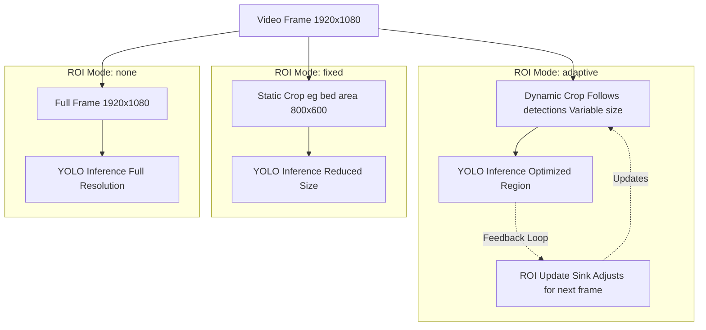
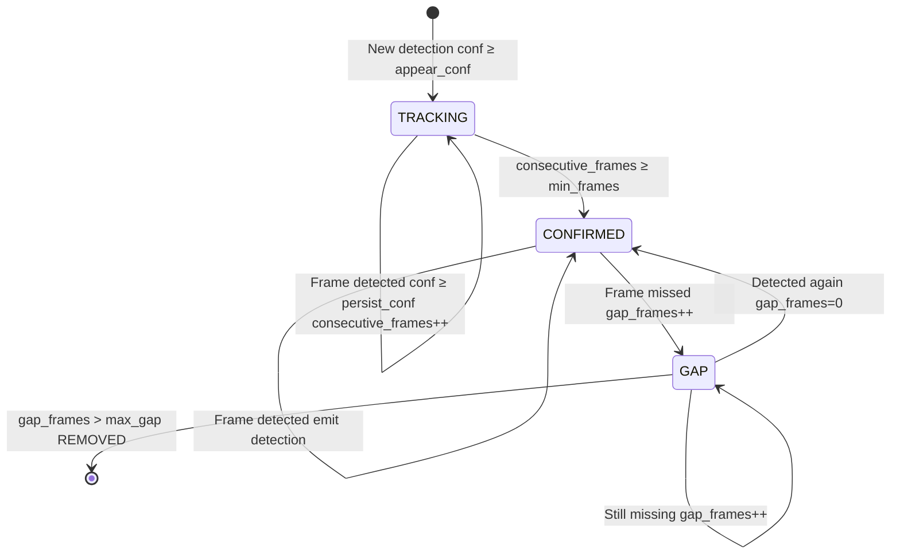
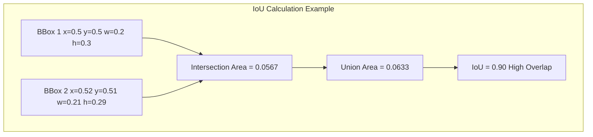
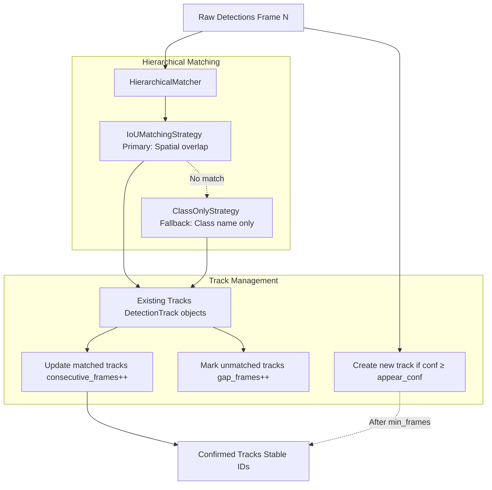
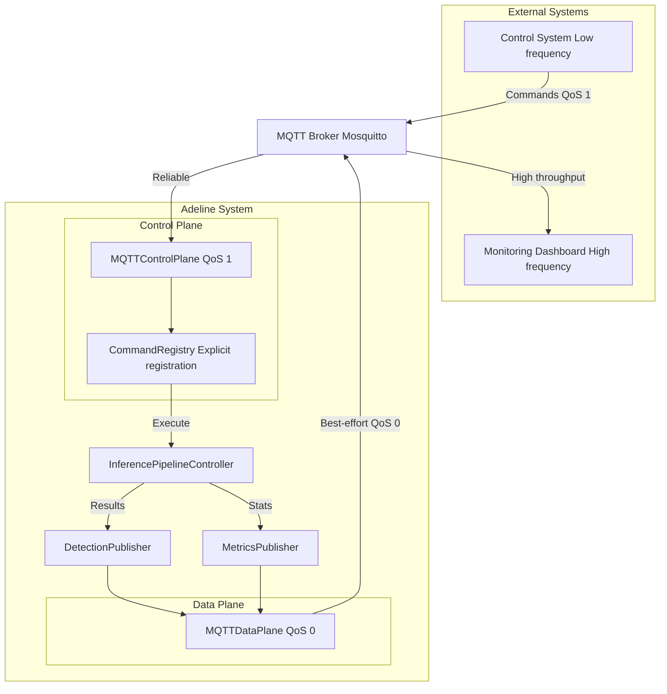

# Core Concepts

Relevant source files

- [adeline/CLAUDE.md](https://github.com/acare7/kata-inference-251021-clean4/blob/a0662727/adeline/CLAUDE.md)
- [adeline/inference/stabilization/core.py](https://github.com/acare7/kata-inference-251021-clean4/blob/a0662727/adeline/inference/stabilization/core.py)
- [adeline/inference/stabilization/matching.py](https://github.com/acare7/kata-inference-251021-clean4/blob/a0662727/adeline/inference/stabilization/matching.py)

This page explains the fundamental concepts and terminology used throughout the Adeline inference pipeline system. Understanding these concepts is essential for working with the configuration, extending the system, or debugging issues. For architectural details about how these concepts are implemented, see [Core Architecture](https://deepwiki.com/acare7/kata-inference-251021-clean4/3-core-architecture). For step-by-step configuration of these features, see [Configuration](https://deepwiki.com/acare7/kata-inference-251021-clean4/2.2-configuration).

---

## ROI (Region of Interest)

**Region of Interest (ROI)** refers to a rectangular subsection of the video frame that is processed by the inference model, rather than processing the entire frame. ROI processing is a performance optimization that reduces computational load while maintaining detection accuracy in the area that matters.

### Why ROI Matters

Processing full HD frames (1920×1080) through a YOLO model is computationally expensive. In typical deployment scenarios (e.g., monitoring a hospital bed), objects of interest occupy only 20-40% of the frame. By cropping to the relevant region, we can:

- **Reduce inference time** by 40-60% (smaller input to model)
- **Improve detection accuracy** by allocating more pixels to objects of interest
- **Lower bandwidth** requirements for RTSP streams

### ROI Modes

The system supports three ROI modes, configured via `ROI_MODE` in [config/adeline/config.yaml](https://github.com/acare7/kata-inference-251021-clean4/blob/a0662727/config/adeline/config.yaml) Each mode is implemented as a separate handler class following the Strategy pattern.

|Mode|Description|Use Case|Handler Class|
|---|---|---|---|
|`none`|Full frame processing|Initial deployment, unknown scene layout|`StandardInferenceHandler`|
|`fixed`|Static pre-configured crop region|Fixed camera, known monitoring area (e.g., hospital bed)|`FixedROIInferenceHandler`|
|`adaptive`|Dynamic ROI that tracks detected objects|Moving subjects, multi-person scenarios|`AdaptiveInferenceHandler`|

**Diagram: ROI Processing Modes**



### Key Implementation Details

- **Zero-copy cropping**: Adaptive and fixed modes use NumPy array views (not copies) for performance [inference/roi/adaptive.py180-200](https://github.com/acare7/kata-inference-251021-clean4/blob/a0662727/inference/roi/adaptive.py#L180-L200)
- **Coordinate transformation**: Detections from cropped regions are transformed back to full-frame coordinates [inference/handlers/adaptive.py150-170](https://github.com/acare7/kata-inference-251021-clean4/blob/a0662727/inference/handlers/adaptive.py#L150-L170)
- **Square constraint**: Adaptive ROI maintains square aspect ratio to prevent model distortion [inference/roi/adaptive.py220-240](https://github.com/acare7/kata-inference-251021-clean4/blob/a0662727/inference/roi/adaptive.py#L220-L240)

**Sources:** [adeline/CLAUDE.md105-113](https://github.com/acare7/kata-inference-251021-clean4/blob/a0662727/adeline/CLAUDE.md#L105-L113) [adeline/inference/roi/adaptive.py](https://github.com/acare7/kata-inference-251021-clean4/blob/a0662727/adeline/inference/roi/adaptive.py) [config/adeline/config.yaml](https://github.com/acare7/kata-inference-251021-clean4/blob/a0662727/config/adeline/config.yaml)

---

## Detection Stabilization

**Detection Stabilization** is a temporal filtering system that reduces false positives and "flickering" (on-off-on) detections across consecutive frames. Without stabilization, small models running at high frame rates often produce intermittent false negatives, causing tracks to appear and disappear erratically.

### The Flickering Problem

YOLO models, especially smaller/faster variants (e.g., YOLOv8n), can produce unstable detections:

```
Frame 1: [person, confidence=0.52] ✓
Frame 2: [person, confidence=0.28] ✗ (below threshold)
Frame 3: [person, confidence=0.55] ✓
Frame 4: [no detection] ✗
Frame 5: [person, confidence=0.61] ✓
```

This creates "flickering" where the same person appears to enter and exit the scene repeatedly, triggering false alarms in fall detection systems.

### Temporal Filtering

Temporal filtering requires a detection to appear in **N consecutive frames** before being confirmed. This filters out transient false positives caused by motion blur, occlusion, or model uncertainty.



**Diagram: Detection Track State Machine**

Configuration parameters:

- `temporal_min_frames`: Consecutive frames required to confirm (default: 3)
- `temporal_max_gap`: Frames tolerated without detection before removal (default: 2)

### Hysteresis Thresholds

**Hysteresis** uses dual confidence thresholds to prevent rapid on-off transitions:

- `hysteresis_appear_conf` (default: 0.5): High threshold for **new** detections to appear
- `hysteresis_persist_conf` (default: 0.3): Lower threshold for **confirmed** detections to persist

This asymmetry prevents flickering at the confidence boundary:

```
Without Hysteresis (single threshold=0.5):
Frame 1: conf=0.52 → APPEAR ✓
Frame 2: conf=0.48 → DISAPPEAR ✗
Frame 3: conf=0.51 → APPEAR ✓
Frame 4: conf=0.49 → DISAPPEAR ✗
(flickering)

With Hysteresis (appear=0.5, persist=0.3):
Frame 1: conf=0.52 → APPEAR ✓
Frame 2: conf=0.48 → PERSIST ✓ (above 0.3)
Frame 3: conf=0.51 → PERSIST ✓
Frame 4: conf=0.49 → PERSIST ✓
(stable tracking)
```

**Sources:** [adeline/inference/stabilization/core.py1-24](https://github.com/acare7/kata-inference-251021-clean4/blob/a0662727/adeline/inference/stabilization/core.py#L1-L24) [adeline/inference/stabilization/core.py176-248](https://github.com/acare7/kata-inference-251021-clean4/blob/a0662727/adeline/inference/stabilization/core.py#L176-L248)

---

## IoU (Intersection over Union)

**Intersection over Union (IoU)** is a spatial similarity metric that measures the overlap between two bounding boxes. It is the primary mechanism for associating new detections with existing tracks in multi-object tracking scenarios.

### Mathematical Definition

IoU is calculated as the ratio of the intersection area to the union area of two bounding boxes:

```
IoU = (Area of Overlap) / (Area of Union)
```

IoU ranges from 0.0 (no overlap) to 1.0 (perfect match).

**Diagram: IoU Calculation Flow**




### IoU Thresholds and Interpretation

|IoU Value|Interpretation|Typical Meaning|
|---|---|---|
|0.0 - 0.2|No overlap or minimal|Different objects or large movement|
|0.3 - 0.5|Low-medium overlap|**Typical threshold for "same object"**|
|0.5 - 0.7|Medium-high overlap|Same object, moderate movement|
|0.7 - 1.0|High overlap|Same object, minimal movement|
|1.0|Perfect match|Identical bounding box|

The system uses `iou_threshold=0.3` by default [adeline/inference/stabilization/core.py206](https://github.com/acare7/kata-inference-251021-clean4/blob/a0662727/adeline/inference/stabilization/core.py#L206-L206) which is a conservative threshold suitable for geriatric monitoring where residents may move slowly or change posture.

### Properties and Characteristics

IoU has mathematically useful properties:

- **Symmetry**: IoU(A, B) = IoU(B, A)
- **Bounded**: 0.0 ≤ IoU ≤ 1.0
- **Identity**: IoU(A, A) = 1.0
- **Disjoint**: IoU(A, B) = 0.0 if bounding boxes don't overlap

Implementation: [adeline/inference/stabilization/matching.py39-116](https://github.com/acare7/kata-inference-251021-clean4/blob/a0662727/adeline/inference/stabilization/matching.py#L39-L116)

**Sources:** [adeline/inference/stabilization/matching.py39-81](https://github.com/acare7/kata-inference-251021-clean4/blob/a0662727/adeline/inference/stabilization/matching.py#L39-L81) [adeline/CLAUDE.md119-127](https://github.com/acare7/kata-inference-251021-clean4/blob/a0662727/adeline/CLAUDE.md#L119-L127)

---

## Multi-Object Tracking

**Multi-Object Tracking** is the system's ability to maintain stable identities for 2-4 people simultaneously across video frames. This is critical in geriatric residences where rooms are often shared, and the system must correctly identify which specific individual has fallen.

### The Identity Problem

In multi-person scenarios, naive frame-by-frame detection cannot distinguish individuals:

```
Frame N:   [Person A at x=0.3, Person B at x=0.7]
Frame N+1: [Person at x=0.32, Person at x=0.68]

Question: Which detection corresponds to Person A vs Person B?
```

Without proper tracking, detections can "swap" identities when people cross paths or move simultaneously, causing incorrect fall attribution.

### Track Lifecycle and State Management

Each detected person is tracked using a `DetectionTrack` object [adeline/inference/stabilization/core.py68-117](https://github.com/acare7/kata-inference-251021-clean4/blob/a0662727/adeline/inference/stabilization/core.py#L68-L117) that maintains:

- **Spatial state**: Current bounding box (x, y, width, height)
- **Temporal state**: `consecutive_frames`, `gap_frames`
- **Confirmation state**: `confirmed` boolean
- **History**: `confidences` deque (last 10 frames)

**Diagram: Multi-Object Tracking Pipeline**




### Hierarchical Matching Strategy

The system uses a **chain-of-responsibility** pattern for track matching [adeline/inference/stabilization/matching.py280-380](https://github.com/acare7/kata-inference-251021-clean4/blob/a0662727/adeline/inference/stabilization/matching.py#L280-L380):

1. **IoUMatchingStrategy** (primary): Spatial overlap matching
    
    - Calculates IoU between new detection and all existing tracks
    - Selects best match above `iou_threshold=0.3`
    - Handles people moving, changing posture, or crossing paths
2. **ClassOnlyStrategy** (fallback): Class-name-only matching
    
    - Used when IoU finds no spatial match
    - Only safe when there's one object of that class
    - Backward compatible with simple tracking

This hierarchy ensures robust tracking even when people are far apart (low IoU) while preventing identity swaps when they're close together (high IoU required).

### Test Case Scenarios

The multi-object tracking system is validated against field test cases with actors:

|Test Case|Scenario|Challenge|
|---|---|---|
|TC-006|2 people, 1 changes posture|Must maintain correct identity during pose change|
|TC-009|4 people, 1 changes posture|Most complex: identify which of 4 people changed|

**Sources:** [adeline/inference/stabilization/core.py68-117](https://github.com/acare7/kata-inference-251021-clean4/blob/a0662727/adeline/inference/stabilization/core.py#L68-L117) [adeline/inference/stabilization/matching.py177-239](https://github.com/acare7/kata-inference-251021-clean4/blob/a0662727/adeline/inference/stabilization/matching.py#L177-L239) [adeline/CLAUDE.md119-127](https://github.com/acare7/kata-inference-251021-clean4/blob/a0662727/adeline/CLAUDE.md#L119-L127)

---

## Dual-Plane MQTT Architecture

The system separates MQTT communication into two independent **planes** with different Quality of Service (QoS) levels optimized for their distinct purposes.

### Why Two Planes?

Control commands (pause/resume/stop) require **reliability** - a lost command could leave the system in an unknown state. In contrast, detection results require **high throughput** - occasional packet loss is acceptable since new detections arrive every frame.

Using a single MQTT connection for both creates a tradeoff:

- QoS 1 (reliable): Adds latency and overhead, bottlenecks high-frequency data
- QoS 0 (fast): Risks losing critical control commands

The dual-plane architecture optimizes each plane independently.

### Control Plane (QoS 1)

**Purpose**: Receive and execute system control commands

**Characteristics**:

- QoS 1 (At least once delivery)
- Low message volume (~1-10 messages/minute)
- Synchronous request-response semantics
- Publishes status acknowledgments

**Implementation**: `MQTTControlPlane` [adeline/control/plane.py](https://github.com/acare7/kata-inference-251021-clean4/blob/a0662727/adeline/control/plane.py)

**Topics**:

- Subscribe: `inference/control/commands`
- Publish: `inference/control/status`

**Available Commands**:

|Command|Description|Response|
|---|---|---|
|`pause`|Pause inference pipeline|Status: PAUSED|
|`resume`|Resume from paused state|Status: RUNNING|
|`stop`|Graceful shutdown|Status: STOPPED|
|`status`|Query current state|Status + metrics|
|`metrics`|Request performance stats|Metrics payload|
|`toggle_crop`|Enable/disable ROI dynamically|Status update|
|`stabilization_stats`|Query tracking statistics|Stats payload|

Commands are registered via `CommandRegistry` [adeline/control/registry.py](https://github.com/acare7/kata-inference-251021-clean4/blob/a0662727/adeline/control/registry.py) which prevents runtime errors from undefined commands.

### Data Plane (QoS 0)

**Purpose**: Publish inference results and metrics at high frequency

**Characteristics**:

- QoS 0 (At most once delivery, best effort)
- High message volume (1-30 messages/second at 2-30 FPS)
- Fire-and-forget semantics
- Minimal latency overhead

**Implementation**: `MQTTDataPlane` [adeline/data/plane.py](https://github.com/acare7/kata-inference-251021-clean4/blob/a0662727/adeline/data/plane.py)

**Publishers**:

- `DetectionPublisher`: Sends detection results [adeline/data/publishers.py](https://github.com/acare7/kata-inference-251021-clean4/blob/a0662727/adeline/data/publishers.py)
- `MetricsPublisher`: Sends pipeline performance metrics [adeline/data/publishers.py](https://github.com/acare7/kata-inference-251021-clean4/blob/a0662727/adeline/data/publishers.py)

**Topics**:

- Publish: `inference/data/detections` (QoS 0)
- Publish: `inference/data/metrics` (QoS 0)

### Separation Benefits


**Diagram: Dual-Plane MQTT Architecture**

The separation ensures that high-frequency detection publishing (Data Plane) cannot congest or delay critical control commands (Control Plane), and vice versa.

**Sources:** [adeline/CLAUDE.md90-102](https://github.com/acare7/kata-inference-251021-clean4/blob/a0662727/adeline/CLAUDE.md#L90-L102) [adeline/control/plane.py](https://github.com/acare7/kata-inference-251021-clean4/blob/a0662727/adeline/control/plane.py) [adeline/data/plane.py](https://github.com/acare7/kata-inference-251021-clean4/blob/a0662727/adeline/data/plane.py)

---

## Summary

These core concepts form the foundation of the Adeline inference pipeline:

- **ROI**: Performance optimization through selective frame cropping (none/fixed/adaptive modes)
- **Detection Stabilization**: Temporal filtering + hysteresis to reduce flickering and false positives
- **IoU Matching**: Spatial similarity metric for associating detections with tracks
- **Multi-Object Tracking**: Maintaining stable identities for 2-4 people across frames
- **Dual-Plane MQTT**: Separated control (QoS 1, reliable) and data (QoS 0, fast) communication

For implementation details and class hierarchies, see [Core Architecture](https://deepwiki.com/acare7/kata-inference-251021-clean4/3-core-architecture). For configuration of these features, see [Configuration System](https://deepwiki.com/acare7/kata-inference-251021-clean4/6-configuration-system).