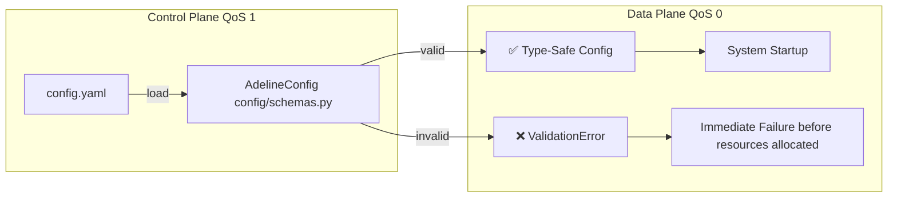
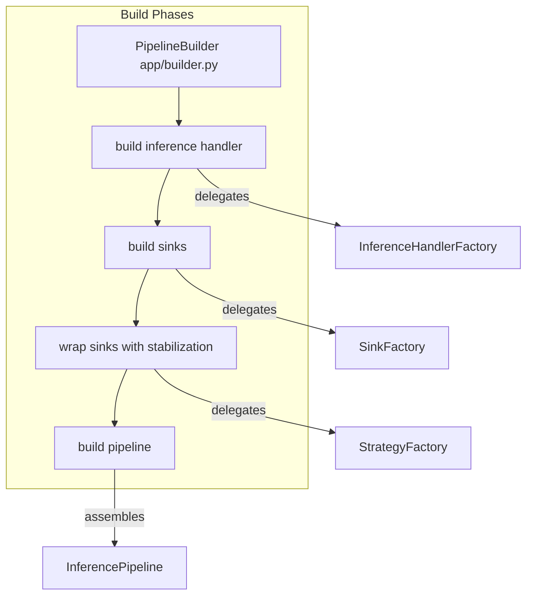
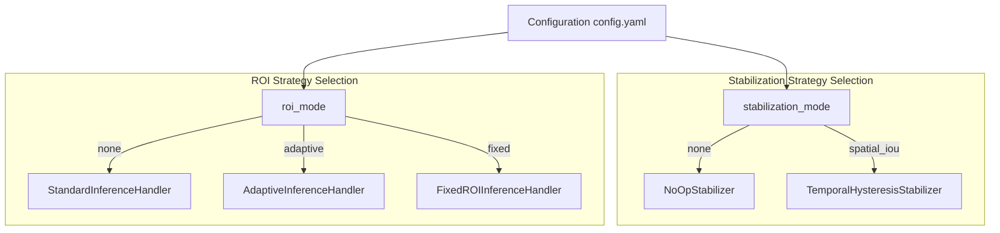
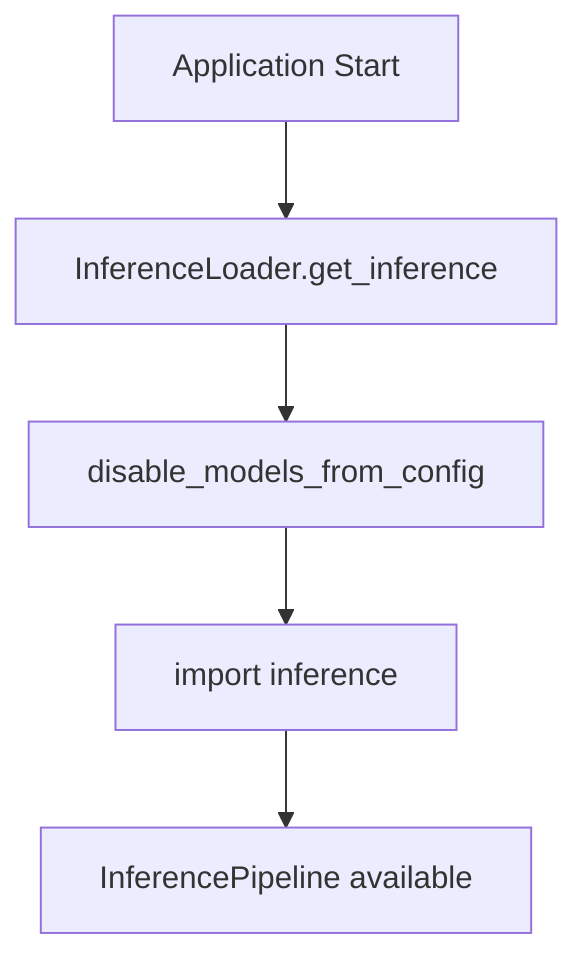

# Design Philosophy

Relevant source files

- [adeline/CLAUDE.md](https://github.com/acare7/kata-inference-251021-clean4/blob/a0662727/adeline/CLAUDE.md)
- [adeline/app/builder.py](https://github.com/acare7/kata-inference-251021-clean4/blob/a0662727/adeline/app/builder.py)

## Purpose and Scope

This document describes the architectural design principles that guide the Adeline inference pipeline system. It explains the deliberate design choices made to manage complexity, ensure reliability, and enable extensibility. This page covers the foundational philosophies that inform component design, separation of concerns, validation strategies, and performance optimizations.

For concrete implementations of these principles, see [Core Architecture](https://deepwiki.com/acare7/kata-inference-251021-clean4/3-core-architecture). For configuration-specific design, see [Configuration System](https://deepwiki.com/acare7/kata-inference-251021-clean4/6-configuration-system).

---

## Core Principle: Complexity by Design, Not by Accident

The Adeline system follows the philosophy **"Complejidad por diseño, no por accidente"** (Complexity by design, not by accident). This means complexity is deliberately attacked through **architectural boundaries** rather than through complicated code.

### Key Manifestation

The system maintains strict boundaries between different concerns:

|Concern|Component|Responsibility|
|---|---|---|
|**Orchestration**|`InferencePipelineController`|Lifecycle management, signal handling, high-level coordination|
|**Construction**|`PipelineBuilder`|Assembling components, orchestrating factories|
|**Component Creation**|Factories (`HandlerFactory`, `SinkFactory`, `StrategyFactory`)|Creating concrete implementations based on configuration|
|**Business Logic**|Handlers, Stabilizers, Sinks|Domain-specific processing|

The controller **never** knows construction details. The builder **never** performs lifecycle management. Factories **never** orchestrate. Each component has a single, well-defined responsibility.

```mermaid
flowchart TD
  Controller[InferencePipelineController app/controller.py]
  Builder[PipelineBuilder app/builder.py]

  subgraph Factory Layer
    HF[InferenceHandlerFactory inference/factories/handler_factory.py]
    SF[SinkFactory app/factories/sink_factory.py]
    STF[StrategyFactory inference/factories/strategy_factory.py]
  end

  subgraph Component Layer
    Handler[BaseInferenceHandler]
    Sinks[List Callable]
    Stabilizer[BaseStabilizer]
  end

  Controller -- delegates construction --> Builder
  Builder -- calls create --> HF
  Builder -- calls create_sinks --> SF
  Builder -- calls create_stabilization_strategy --> STF
  HF -- returns --> Handler
  SF -- returns --> Sinks
  STF -- returns --> Stabilizer
  Builder -- returns assembled components --> Controller
  Controller -- manages lifecycle --> Handler
  Controller -- manages lifecycle --> Sinks
  ```
  

**Sources:** [adeline/CLAUDE.md58-64](https://github.com/acare7/kata-inference-251021-clean4/blob/a0662727/adeline/CLAUDE.md#L58-L64) [adeline/app/builder.py14-17](https://github.com/acare7/kata-inference-251021-clean4/blob/a0662727/adeline/app/builder.py#L14-L17)

---

## Separation of Concerns

### Dual-Plane MQTT Architecture

The system separates communication into two independent planes with different QoS guarantees:

|Plane|QoS Level|Purpose|Implementation|
|---|---|---|---|
|**Control Plane**|QoS 1|Reliable command delivery (pause, resume, stop)|`MQTTControlPlane`|
|**Data Plane**|QoS 0|Best-effort, high-throughput data publishing|`MQTTDataPlane`|

This separation ensures that critical control commands are never lost, while detection data can be published at maximum throughput without delivery guarantees that would create backpressure.
```mermaid
flowchart TD
  Broker[MQTT Broker]

  subgraph Control Plane QoS 1
    CP[MQTTControlPlane control/plane.py]
    CR[CommandRegistry control/registry.py]
  end

  subgraph Data Plane QoS 0
    DP[MQTTDataPlane data/plane.py]
    DPUB[DetectionPublisher data/publishers.py]
    MPUB[MetricsPublisher data/publishers.py]
  end

  IPC[InferencePipelineController]

  Broker -- commands QoS 1 --> CP
  CP --> CR
  CR -- execute --> IPC
  IPC -- results --> DP
  DPUB -- publish --> DP
  MPUB -- publish --> DP
  DP -- detections metrics QoS 0 --> Broker


```
**Sources:** [adeline/CLAUDE.md90-102](https://github.com/acare7/kata-inference-251021-clean4/blob/a0662727/adeline/CLAUDE.md#L90-L102)

### Handler-State Separation

Inference handlers are separated from their state objects:

- **Handlers** (`StandardInferenceHandler`, `AdaptiveInferenceHandler`, `FixedROIInferenceHandler`) contain processing logic
- **State Objects** (`ROIState`, `FixedROIState`) contain mutable state that evolves across frames

This separation enables:

1. Testability - State can be inspected and modified independently
2. Thread safety - State updates are isolated
3. Multiple handlers sharing state - Different handlers can reference the same state object

**Sources:** [adeline/app/builder.py71-83](https://github.com/acare7/kata-inference-251021-clean4/blob/a0662727/adeline/app/builder.py#L71-L83)

---

## Fail-Fast Philosophy

### Load-Time Validation

The system validates all configuration at **load time**, not runtime. This is achieved through Pydantic v2 schemas that enforce constraints before the pipeline starts.



### Validation Examples

|Constraint Type|Example|Enforcement|
|---|---|---|
|**Type Safety**|`max_fps: int`|Pydantic type checking|
|**Enum Validation**|`roi_mode: Literal["none", "adaptive", "fixed"]`|Invalid values rejected|
|**Numeric Ranges**|`imgsz % 32 == 0`|Custom validators|
|**Cross-Field Dependencies**|`persist_conf <= appear_conf`|Model validators|
|**Conditional Fields**|Fixed ROI requires `fixed` config section|Field validators|

This design prevents runtime errors from invalid configurations. The pipeline either starts with correct configuration, or fails immediately with actionable error messages.

**Sources:** [adeline/CLAUDE.md130-135](https://github.com/acare7/kata-inference-251021-clean4/blob/a0662727/adeline/CLAUDE.md#L130-L135) [adeline/config/schemas.py](https://github.com/acare7/kata-inference-251021-clean4/blob/a0662727/adeline/config/schemas.py) (referenced)

---

## Pattern-Based Architecture

### Builder Pattern

The `PipelineBuilder` encapsulates all construction logic, separating it from lifecycle management:




**Key Design Decisions:**

1. **Immutable Operations** - `wrap_sinks_with_stabilization()` returns a **new list** rather than modifying the input [adeline/app/builder.py112-151](https://github.com/acare7/kata-inference-251021-clean4/blob/a0662727/adeline/app/builder.py#L112-L151)
2. **Centralized Logic** - All construction knowledge is in one place [adeline/app/builder.py14-17](https://github.com/acare7/kata-inference-251021-clean4/blob/a0662727/adeline/app/builder.py#L14-L17)
3. **Factory Delegation** - Builder orchestrates, factories construct [adeline/app/builder.py82-83](https://github.com/acare7/kata-inference-251021-clean4/blob/a0662727/adeline/app/builder.py#L82-L83)

**Sources:** [adeline/app/builder.py41-208](https://github.com/acare7/kata-inference-251021-clean4/blob/a0662727/adeline/app/builder.py#L41-L208)

### Factory Pattern

Factories create concrete implementations based on configuration mode:

|Factory|Input|Output Examples|
|---|---|---|
|`InferenceHandlerFactory`|`roi_mode: str`|`StandardInferenceHandler`, `AdaptiveInferenceHandler`, `FixedROIInferenceHandler`|
|`StrategyFactory`|`stabilization_mode: str`|`NoOpStabilizer`, `TemporalHysteresisStabilizer`|
|`SinkFactory`|`config: PipelineConfig`|List of sinks with explicit priorities|

This pattern enables configuration-driven component creation without conditional logic scattered throughout the codebase.

**Sources:** [adeline/CLAUDE.md143-149](https://github.com/acare7/kata-inference-251021-clean4/blob/a0662727/adeline/CLAUDE.md#L143-L149)

### Strategy Pattern

Different processing strategies are selected at configuration time and remain fixed during pipeline execution:





The strategy pattern avoids runtime conditionals. Instead, the correct implementation is selected once during construction, and polymorphism handles execution.

**Sources:** [adeline/CLAUDE.md105-113](https://github.com/acare7/kata-inference-251021-clean4/blob/a0662727/adeline/CLAUDE.md#L105-L113) [adeline/CLAUDE.md119-127](https://github.com/acare7/kata-inference-251021-clean4/blob/a0662727/adeline/CLAUDE.md#L119-L127)

### Registry Pattern

The `CommandRegistry` requires **explicit registration** of commands. There are no optional callbacks or dynamic command discovery:

|Design Choice|Rationale|
|---|---|
|**Explicit Registration**|Commands must be registered in `control/registry.py` before use|
|**No Optional Callbacks**|If a command isn't registered, it doesn't exist|
|**Conditional Registration**|Commands register only if capabilities support them (e.g., `toggle_crop` only if `handler.supports_toggle`)|

This prevents runtime errors from unsupported commands and makes the available command surface explicit and auditable.

**Sources:** [adeline/CLAUDE.md61](https://github.com/acare7/kata-inference-251021-clean4/blob/a0662727/adeline/CLAUDE.md#L61-L61) [adeline/CLAUDE.md92-98](https://github.com/acare7/kata-inference-251021-clean4/blob/a0662727/adeline/CLAUDE.md#L92-L98)

---

## Performance by Design

### Zero-Copy Operations

ROI cropping uses NumPy views instead of copies:

```
# Zero-copy crop using array slicing
cropped = frame[y_min:y_max, x_min:x_max]  # View, not copy
```

This design choice eliminates unnecessary memory allocation and copying, critical for real-time video processing.

### QoS Tuning by Use Case

|Traffic Type|QoS Level|Rationale|
|---|---|---|
|Control commands|QoS 1|Cannot tolerate message loss (pause/stop must arrive)|
|Detection data|QoS 0|High volume, best-effort acceptable (missing one frame is fine)|
|Status updates|QoS 1|Reliability for monitoring systems|

This differentiation optimizes for both reliability (where needed) and throughput (where appropriate).

### Lazy Loading Pattern

The `InferenceLoader` ensures model downloads are disabled before importing inference dependencies:

This pattern prevents unnecessary network calls during testing or when inference is disabled, enforced by the module loading order rather than comments.




**Sources:** [adeline/CLAUDE.md137-142](https://github.com/acare7/kata-inference-251021-clean4/blob/a0662727/adeline/CLAUDE.md#L137-L142)

### Square ROI Constraints

Adaptive ROI expansion enforces square boxes with sides that are multiples of the model's `imgsz` parameter. This design choice:

1. Eliminates unnecessary resizing operations
2. Maintains aspect ratio for model compatibility
3. Simplifies coordinate transformations

**Sources:** [adeline/CLAUDE.md58-64](https://github.com/acare7/kata-inference-251021-clean4/blob/a0662727/adeline/CLAUDE.md#L58-L64) (performance optimizations)

---

## Immutability and Functional Principles

### Functional Purity in Pipeline Construction

The `wrap_sinks_with_stabilization()` method demonstrates functional purity:

```
# Does NOT modify input
def wrap_sinks_with_stabilization(self, sinks: List[Callable]) -> List[Callable]:
    # ...
    new_sinks = [stabilized_sink] + sinks[1:]  # NEW list
    return new_sinks
```

This approach:

- Makes testing easier (no side effects on input)
- Enables pipeline reconstruction without state corruption
- Clarifies data flow (input → transformation → output)

**Sources:** [adeline/app/builder.py112-151](https://github.com/acare7/kata-inference-251021-clean4/blob/a0662727/adeline/app/builder.py#L112-L151)

### Configuration Immutability

Configuration objects are loaded once and treated as immutable throughout the pipeline lifecycle. Changes require pipeline restart, preventing inconsistent state during execution.

---

## Design Principles Summary

|Principle|Manifestation|Benefit|
|---|---|---|
|**Complexity by Design**|Strict architectural boundaries|Complexity managed through structure, not code|
|**Separation of Concerns**|Dual-plane MQTT, handler-state separation|Independent evolution of subsystems|
|**Fail-Fast**|Load-time Pydantic validation|Errors caught before resource allocation|
|**Builder Pattern**|`PipelineBuilder` orchestrates construction|Controller doesn't know construction details|
|**Strategy Pattern**|ROI and stabilization modes|Configuration-driven polymorphism|
|**Registry Pattern**|Explicit command registration|No runtime errors from unsupported operations|
|**Zero-Copy**|NumPy views for ROI|Eliminates memory allocation overhead|
|**QoS Tuning**|Control plane vs data plane|Reliability where needed, throughput where appropriate|
|**Lazy Loading**|`InferenceLoader`|Prevents unnecessary model downloads|
|**Immutability**|Functional transformations|Predictable data flow, easier testing|

These principles work together to create a system that is both powerful and maintainable, where complexity is intentionally managed rather than accidentally accumulated.

**Sources:** [adeline/CLAUDE.md58-64](https://github.com/acare7/kata-inference-251021-clean4/blob/a0662727/adeline/CLAUDE.md#L58-L64) [adeline/app/builder.py1-208](https://github.com/acare7/kata-inference-251021-clean4/blob/a0662727/adeline/app/builder.py#L1-L208)