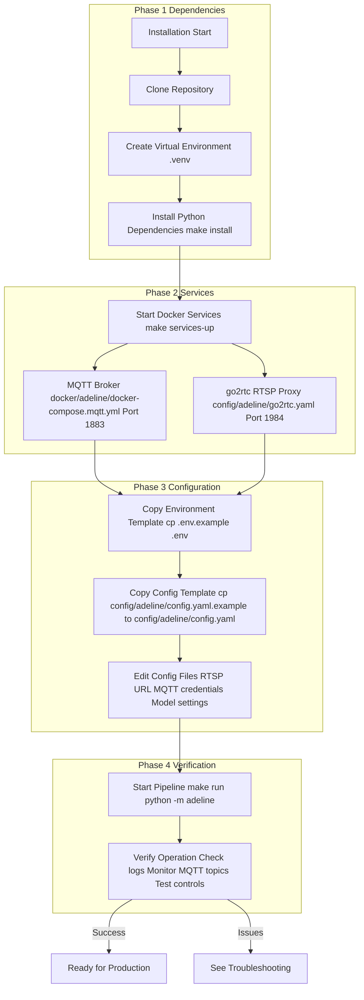
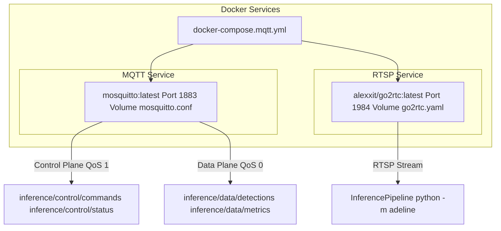
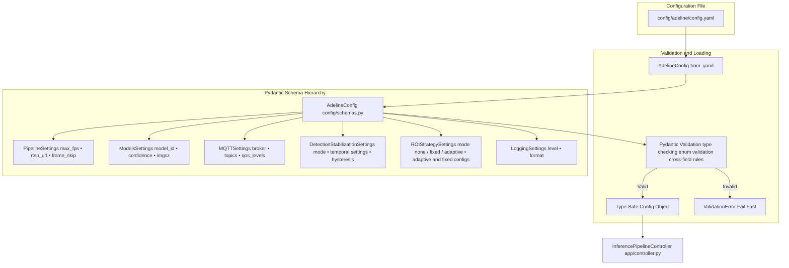
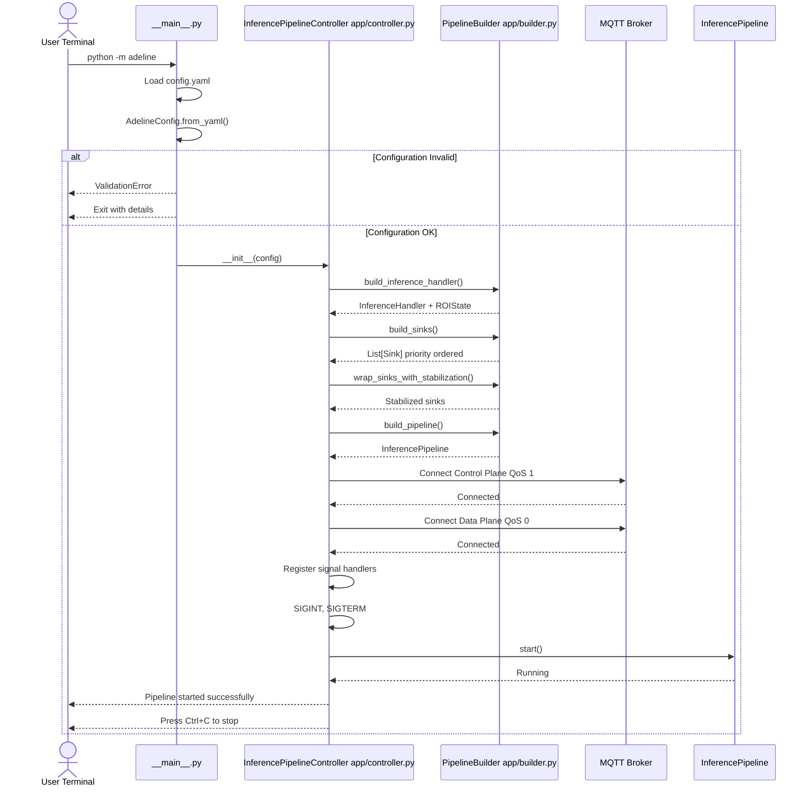
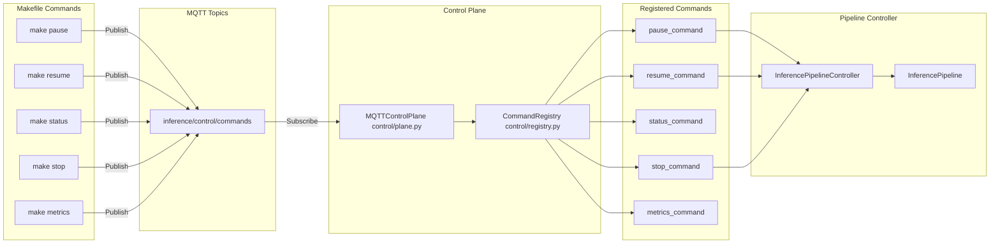

# Getting Started

Relevant source files

- [](https://github.com/acare7/kata-inference-251021-clean4/blob/a0662727/.gitignore)
- [](https://github.com/acare7/kata-inference-251021-clean4/blob/a0662727/README.md)
- [](https://github.com/acare7/kata-inference-251021-clean4/blob/a0662727/adeline/CLAUDE.md)
- [](https://github.com/acare7/kata-inference-251021-clean4/blob/a0662727/adeline/README.md)

This guide covers the initial installation, configuration, and first run of the Adeline inference pipeline system. By the end of this guide, you will have a working installation capable of processing video streams and publishing detection results via MQTT.

**Scope**: This page provides setup instructions for development and testing environments. For detailed configuration options, see [Configuration](https://deepwiki.com/acare7/kata-inference-251021-clean4/2.2-configuration). For production deployment considerations, see [Overview](https://deepwiki.com/acare7/kata-inference-251021-clean4/1-overview). For the complete architecture explanation, see [Core Architecture](https://deepwiki.com/acare7/kata-inference-251021-clean4/3-core-architecture).

---

## Prerequisites

Before installing Adeline, ensure your system meets the following requirements:

|Requirement|Specification|Notes|
|---|---|---|
|**Operating System**|Linux (Ubuntu 20.04+) or macOS|Windows support via WSL2|
|**Python**|3.8+|Python 3.10+ recommended|
|**Docker**|20.10+|Required for MQTT broker and go2rtc services|
|**Docker Compose**|v2.0+|Used for service orchestration|
|**Network**|RTSP camera access|Or test video stream|
|**Disk Space**|~2GB|For models and dependencies|

**Sources**: [README.md56-64](https://github.com/acare7/kata-inference-251021-clean4/blob/a0662727/README.md#L56-L64) [CLAUDE.md12-17](https://github.com/acare7/kata-inference-251021-clean4/blob/a0662727/CLAUDE.md#L12-L17)

---

## Installation Overview

The installation process follows a three-phase approach: dependency installation, service setup, and configuration. The diagram below shows the complete installation flow and the key files involved:





**Sources**: [README.md54-103](https://github.com/acare7/kata-inference-251021-clean4/blob/a0662727/README.md#L54-L103) [Makefile](https://github.com/acare7/kata-inference-251021-clean4/blob/a0662727/Makefile) [CLAUDE.md10-17](https://github.com/acare7/kata-inference-251021-clean4/blob/a0662727/CLAUDE.md#L10-L17)

---

## Step-by-Step Installation

### Step 1: Clone Repository and Setup Environment

```
# Clone the repository
git clone https://github.com/acare7/kata-inference-251021-clean4
cd kata-inference-251021-clean4

# Create and activate virtual environment
python -m venv .venv
source .venv/bin/activate  # On macOS/Linux
# .venv\Scripts\activate   # On Windows
```

**Sources**: [README.md1-52](https://github.com/acare7/kata-inference-251021-clean4/blob/a0662727/README.md#L1-L52)

### Step 2: Install Dependencies

The project uses `pyproject.toml` for dependency management and provides a Makefile for common operations:

```
# Install all Python dependencies
make install
```

This command installs the following key dependencies:

|Dependency|Purpose|Version Constraint|
|---|---|---|
|`inference`|Roboflow inference SDK|Latest|
|`ultralytics`|YOLO model support|Latest|
|`supervision`|Computer vision utilities|Latest|
|`paho-mqtt`|MQTT client library|Latest|
|`opencv-python`|Image processing|Latest|
|`pydantic`|Configuration validation|v2.x|
|`pyyaml`|YAML parsing|Latest|

**Sources**: [README.md59-60](https://github.com/acare7/kata-inference-251021-clean4/blob/a0662727/README.md#L59-L60) [pyproject.toml](https://github.com/acare7/kata-inference-251021-clean4/blob/a0662727/pyproject.toml)

### Step 3: Start Infrastructure Services

Adeline requires two external services: an MQTT broker and optionally the go2rtc RTSP proxy:

```
# Start all services (MQTT broker + go2rtc)
make services-up

# Check service status
make services-status

# View service logs
make services-logs
```

The services are defined in Docker Compose configuration:




**Service Details**:

- **MQTT Broker**: Handles all command and data communication. Uses Mosquitto with configuration at [docker/adeline/mosquitto.conf](https://github.com/acare7/kata-inference-251021-clean4/blob/a0662727/docker/adeline/mosquitto.conf)
- **go2rtc**: RTSP proxy for camera streams (optional if you have direct RTSP access)

**Sources**: [README.md183-200](https://github.com/acare7/kata-inference-251021-clean4/blob/a0662727/README.md#L183-L200) [docker/adeline/docker-compose.mqtt.yml](https://github.com/acare7/kata-inference-251021-clean4/blob/a0662727/docker/adeline/docker-compose.mqtt.yml) [README.md108-114](https://github.com/acare7/kata-inference-251021-clean4/blob/a0662727/README.md#L108-L114)

---

## Configuration

### Step 4: Setup Environment Variables

Copy the environment template and configure sensitive values:

```
# Copy environment template
cp .env.example .env

# Edit with your editor
nano .env  # or vim, code, etc.
```

The `.env` file stores sensitive credentials that should never be committed to version control:

```
# MQTT Broker Configuration
MQTT_BROKER_HOST=localhost
MQTT_BROKER_PORT=1883
MQTT_USERNAME=your_username
MQTT_PASSWORD=your_password

# Roboflow API (if using cloud models)
ROBOFLOW_API_KEY=your_api_key

# Optional: Model paths
MODEL_PATH=/path/to/local/model.onnx
```

**Sources**: [README.md67-75](https://github.com/acare7/kata-inference-251021-clean4/blob/a0662727/README.md#L67-L75) [.gitignore20-26](https://github.com/acare7/kata-inference-251021-clean4/blob/a0662727/.gitignore#L20-L26)

### Step 5: Setup Main Configuration

Copy the configuration template and customize for your deployment:

```
# Copy configuration template
cp config/adeline/config.yaml.example config/adeline/config.yaml

# Edit configuration
nano config/adeline/config.yaml
```

The configuration file is validated by Pydantic schemas at load time. The structure maps directly to the `AdelineConfig` class hierarchy:

aquí tienes la versión en **Mermaid**, sin `<br/>` y sin paréntesis en los labels:




**Minimal Working Configuration Example**:

```
# Pipeline Settings
PIPELINE:
  MAX_FPS: 10
  RTSP_URL: "rtsp://localhost:8554/stream"  # Your camera URL
  FRAME_SKIP: 1

# Model Settings (choose one approach)
MODELS:
  MODEL_ID: "yolov8n"  # Local model
  CONFIDENCE: 0.5
  IMGSZ: 640
  IOU: 0.7
  CLASSES: [0]  # 0 = person

# MQTT Settings
MQTT:
  BROKER_HOST: "localhost"
  BROKER_PORT: 1883
  
# Detection Stabilization (reduces flickering)
DETECTION_STABILIZATION:
  MODE: "temporal"  # none | temporal
  
# ROI Strategy (performance optimization)
ROI_STRATEGY:
  MODE: "none"  # none | fixed | adaptive
```

For detailed configuration options, see [Configuration](https://deepwiki.com/acare7/kata-inference-251021-clean4/2.2-configuration). For Pydantic validation rules, see [Configuration Schema Reference](https://deepwiki.com/acare7/kata-inference-251021-clean4/6.1-configuration-schema-reference).

**Sources**: [README.md67-75](https://github.com/acare7/kata-inference-251021-clean4/blob/a0662727/README.md#L67-L75) [CLAUDE.md128-135](https://github.com/acare7/kata-inference-251021-clean4/blob/a0662727/CLAUDE.md#L128-L135) [config/schemas.py](https://github.com/acare7/kata-inference-251021-clean4/blob/a0662727/config/schemas.py)

---

## First Run

### Step 6: Start the Inference Pipeline

Once configuration is complete, start the pipeline:

```
# Start the inference pipeline
make run

# This is equivalent to:
# python -m adeline
```

The startup sequence follows this flow:





```
INFO: Loading configuration from config/adeline/config.yaml
INFO: Configuration validated successfully
INFO: Building inference handler (mode: none)
INFO: Building sinks (MQTT, ROI update, visualization)
INFO: Connecting to MQTT broker at localhost:1883
INFO: Connected to MQTT broker
INFO: Control plane listening on inference/control/commands
INFO: Data plane publishing to inference/data/detections
INFO: Starting inference pipeline
INFO: Pipeline started successfully. Press Ctrl+C to stop.
```

**Sources**: [adeline/__main__.py](https://github.com/acare7/kata-inference-251021-clean4/blob/a0662727/adeline/__main__.py) [app/controller.py](https://github.com/acare7/kata-inference-251021-clean4/blob/a0662727/app/controller.py) [app/builder.py](https://github.com/acare7/kata-inference-251021-clean4/blob/a0662727/app/builder.py) [CLAUDE.md12-17](https://github.com/acare7/kata-inference-251021-clean4/blob/a0662727/CLAUDE.md#L12-L17)

---

## Verification

### Step 7: Verify System Operation

Once the pipeline is running, verify correct operation using the following checks:

#### Check 1: Monitor Detection Data

In a new terminal, monitor the detection output:

```
# Monitor detection messages
make monitor-data

# This subscribes to: inference/data/detections
```

Expected output when detections occur:

```
{
  "timestamp": "2024-01-15T10:30:45.123456",
  "detections": [
    {
      "class": "person",
      "confidence": 0.87,
      "bbox": [100, 200, 300, 500],
      "track_id": "person_1_0"
    }
  ],
  "frame_number": 1523,
  "source_id": "camera_01"
}
```

#### Check 2: Monitor Status Updates

```
# Monitor status messages
make monitor-status

# This subscribes to: inference/control/status
```

#### Check 3: Test Pipeline Controls

Test the MQTT command interface:

```
# In separate terminals, try each command:

# Pause inference
make pause

# Resume inference
make resume

# Request status
make status

# Request metrics
make metrics

# Stop pipeline (graceful shutdown)
make stop
```

The control commands map to the `CommandRegistry` system:





**Sources**: [README.md80-102](https://github.com/acare7/kata-inference-251021-clean4/blob/a0662727/README.md#L80-L102) [control/plane.py](https://github.com/acare7/kata-inference-251021-clean4/blob/a0662727/control/plane.py) [control/registry.py](https://github.com/acare7/kata-inference-251021-clean4/blob/a0662727/control/registry.py) [CLAUDE.md92-97](https://github.com/acare7/kata-inference-251021-clean4/blob/a0662727/CLAUDE.md#L92-L97)

---

## Common Installation Issues

### Issue 1: MQTT Connection Failed

**Symptom**: `ERROR: Failed to connect to MQTT broker at localhost:1883`

**Solution**:

```
# Check if services are running
make services-status

# Restart services if needed
make services-down
make services-up

# Check Docker logs
make services-logs
```

### Issue 2: Configuration Validation Error

**Symptom**: `pydantic_core._pydantic_core.ValidationError`

**Solution**: The Pydantic validation system provides detailed error messages. Review the error output for:

- Invalid enum values (e.g., `ROI_MODE` must be `none`, `fixed`, or `adaptive`)
- Type mismatches (e.g., `MAX_FPS` must be an integer)
- Cross-field validation failures (e.g., `imgsz % 32 != 0`)

Example error message:

```
1 validation error for AdelineConfig
MODELS.imgsz
  Value error, imgsz must be a multiple of 32 (got 635) [type=value_error]
```

Fix by editing [config/adeline/config.yaml](https://github.com/acare7/kata-inference-251021-clean4/blob/a0662727/config/adeline/config.yaml) according to the validation rules. See [Validation Rules](https://deepwiki.com/acare7/kata-inference-251021-clean4/6.2-validation-rules) for complete reference.

### Issue 3: Model Download Fails

**Symptom**: `ERROR: Failed to download model`

**Solution**:

- Check internet connectivity if using Roboflow cloud models
- Verify `ROBOFLOW_API_KEY` in `.env` file
- For local models, ensure `MODEL_PATH` points to existing `.onnx` or `.pt` file
- Check disk space for model downloads

**Sources**: [CLAUDE.md137-142](https://github.com/acare7/kata-inference-251021-clean4/blob/a0662727/CLAUDE.md#L137-L142)

### Issue 4: RTSP Stream Not Accessible

**Symptom**: `ERROR: Failed to open RTSP stream`

**Solution**:

```
# Test RTSP URL manually
ffplay rtsp://your_camera_url

# If using go2rtc, check its logs
docker logs adeline-go2rtc

# Verify go2rtc configuration
cat config/adeline/go2rtc.yaml
```

**Sources**: [README.md183-200](https://github.com/acare7/kata-inference-251021-clean4/blob/a0662727/README.md#L183-L200)

---

## Next Steps

Once you have verified the installation, proceed to:

1. **[Configuration](https://deepwiki.com/acare7/kata-inference-251021-clean4/2.2-configuration)**: Learn about all configuration options, Pydantic schemas, and validation rules
2. **[Running the Pipeline](https://deepwiki.com/acare7/kata-inference-251021-clean4/2.3-running-the-pipeline)**: Master pipeline lifecycle management, MQTT controls, and monitoring
3. **[Core Architecture](https://deepwiki.com/acare7/kata-inference-251021-clean4/3-core-architecture)**: Understand the system's internal architecture and design patterns
4. **[ROI Strategies](https://deepwiki.com/acare7/kata-inference-251021-clean4/5.1-roi-strategies)**: Configure adaptive or fixed ROI for performance optimization
5. **[Detection Stabilization](https://deepwiki.com/acare7/kata-inference-251021-clean4/5.2-detection-stabilization)**: Enable temporal filtering to reduce detection flickering

For command reference, see:

- **[Command Reference](https://deepwiki.com/acare7/kata-inference-251021-clean4/4.3-command-reference)**: Complete MQTT command documentation
- **Development commands**: [CLAUDE.md9-54](https://github.com/acare7/kata-inference-251021-clean4/blob/a0662727/CLAUDE.md#L9-L54)

**Sources**: [README.md156-163](https://github.com/acare7/kata-inference-251021-clean4/blob/a0662727/README.md#L156-L163) [CLAUDE.md1-181](https://github.com/acare7/kata-inference-251021-clean4/blob/a0662727/CLAUDE.md#L1-L181)

Ask Devin about acare7/kata-inference-251021-clean4

Fast

Getting Started | acare7/kata-inference-251021-clean4 | DeepWiki

Add to ContextPress Q