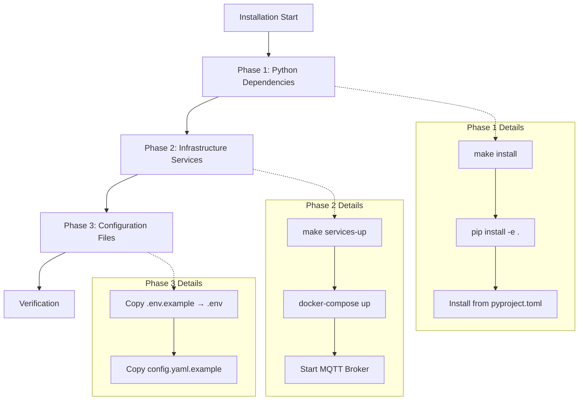
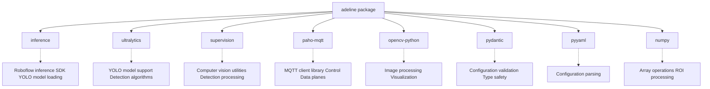
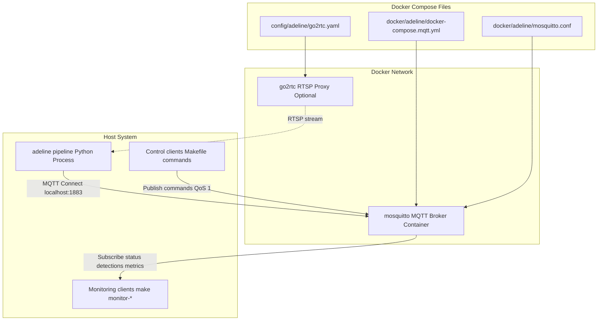
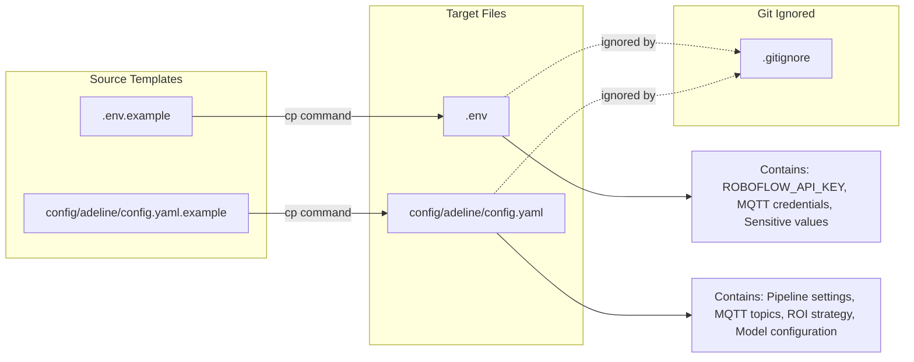
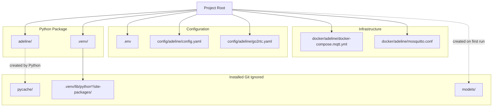

# Installation

Relevant source files

- [.gitignore](https://github.com/acare7/kata-inference-251021-clean4/blob/a0662727/.gitignore)
- [README.md](https://github.com/acare7/kata-inference-251021-clean4/blob/a0662727/README.md)
- [adeline/README.md](https://github.com/acare7/kata-inference-251021-clean4/blob/a0662727/adeline/README.md)

This document provides step-by-step instructions for installing the Adeline inference pipeline system and its required infrastructure services. Installation includes setting up Python dependencies, MQTT broker, and RTSP streaming services. For information about configuring the system after installation, see [Configuration](https://deepwiki.com/acare7/kata-inference-251021-clean4/2.2-configuration). For information about running the pipeline once installed, see [Running the Pipeline](https://deepwiki.com/acare7/kata-inference-251021-clean4/2.3-running-the-pipeline).

## Prerequisites

Before installing Adeline, ensure your system has the following requirements:

|Requirement|Version|Purpose|
|---|---|---|
|Python|3.8+|Core runtime for inference pipeline|
|pip|Latest|Python package management|
|Docker|20.10+|Infrastructure services (MQTT broker)|
|Docker Compose|1.29+|Service orchestration|
|Make|3.81+|Build automation|

**Sources:** [README.md54-64](https://github.com/acare7/kata-inference-251021-clean4/blob/a0662727/README.md#L54-L64)

## Installation Overview

The installation process consists of three main phases:



**Sources:** [README.md54-76](https://github.com/acare7/kata-inference-251021-clean4/blob/a0662727/README.md#L54-L76)

## Phase 1: Python Dependencies

### Install Using Make

The simplest installation method uses the provided Makefile target:

```
make install
```

This command performs the following operations:

1. Creates a Python virtual environment (if not exists)
2. Installs the package in editable mode
3. Installs all dependencies from `pyproject.toml`

**Sources:** [README.md59-60](https://github.com/acare7/kata-inference-251021-clean4/blob/a0662727/README.md#L59-L60) [Makefile](https://github.com/acare7/kata-inference-251021-clean4/blob/a0662727/Makefile)

### Manual Installation

If you prefer manual installation or need more control:

```
# Create virtual environment
python -m venv .venv

# Activate virtual environment
source .venv/bin/activate  # Linux/Mac
# or
.venv\Scripts\activate  # Windows

# Install package in editable mode
pip install -e .
```

### Dependency Structure

The system installs dependencies defined in `pyproject.toml`:





**Sources:** [README.md165-171](https://github.com/acare7/kata-inference-251021-clean4/blob/a0662727/README.md#L165-L171)

### Verification: Python Installation

Verify the Python installation:

```
# Test Python imports
make test-imports

# Or manually verify
python -c "import adeline; print(adeline.__name__)"
```

Expected output: `adeline`

If the import fails, ensure the virtual environment is activated and dependencies are installed.

**Sources:** [README.md142](https://github.com/acare7/kata-inference-251021-clean4/blob/a0662727/README.md#L142-L142)

## Phase 2: Infrastructure Services

The Adeline system requires external infrastructure services that run in Docker containers.

### Service Architecture





**Sources:** [README.md16-18](https://github.com/acare7/kata-inference-251021-clean4/blob/a0662727/README.md#L16-L18) [README.md183-199](https://github.com/acare7/kata-inference-251021-clean4/blob/a0662727/README.md#L183-L199)

### Start Infrastructure Services

Start all required services using the Makefile:

```
make services-up
```

This command:

1. Reads `docker/adeline/docker-compose.mqtt.yml`
2. Starts the Mosquitto MQTT broker container
3. Exposes port `1883` on localhost
4. Applies configuration from `docker/adeline/mosquitto.conf`

**Sources:** [README.md62-63](https://github.com/acare7/kata-inference-251021-clean4/blob/a0662727/README.md#L62-L63) [README.md183-186](https://github.com/acare7/kata-inference-251021-clean4/blob/a0662727/README.md#L183-L186)

### Service Configuration Files

|File|Purpose|Created By|
|---|---|---|
|`docker/adeline/docker-compose.mqtt.yml`|Service definitions|Pre-existing|
|`docker/adeline/mosquitto.conf`|MQTT broker configuration|Pre-existing|
|`config/adeline/go2rtc.yaml`|RTSP proxy configuration (optional)|Pre-existing|

**Sources:** [README.md16-18](https://github.com/acare7/kata-inference-251021-clean4/blob/a0662727/README.md#L16-L18)

### Verification: Services Running

Verify that services are running:

```
# Check service status
make services-status

# View service logs
make services-logs
```

Expected output from `services-status`:

```
NAME                COMMAND             SERVICE    STATUS    PORTS
mosquitto           ...                 mqtt       Up        0.0.0.0:1883->1883/tcp
```

**Sources:** [README.md187-191](https://github.com/acare7/kata-inference-251021-clean4/blob/a0662727/README.md#L187-L191)

### Stopping Services

To stop infrastructure services when not in use:

```
make services-down
```

**Sources:** [README.md193-194](https://github.com/acare7/kata-inference-251021-clean4/blob/a0662727/README.md#L193-L194)

## Phase 3: Configuration Files

The system requires configuration files that are created from example templates.

### File Copy Operations



**Sources:** [README.md67-76](https://github.com/acare7/kata-inference-251021-clean4/blob/a0662727/README.md#L67-L76) [.gitignore21-26](https://github.com/acare7/kata-inference-251021-clean4/blob/a0662727/.gitignore#L21-L26)

### Create Configuration Files

Copy the example templates to create your configuration files:

```
# Copy environment variables template
cp .env.example .env

# Copy main configuration template
cp config/adeline/config.yaml.example config/adeline/config.yaml
```

**Important:** These files are excluded from version control via `.gitignore` to prevent accidental commits of sensitive data.

**Sources:** [README.md68-75](https://github.com/acare7/kata-inference-251021-clean4/blob/a0662727/README.md#L68-L75) [.gitignore22-25](https://github.com/acare7/kata-inference-251021-clean4/blob/a0662727/.gitignore#L22-L25)

### Configuration File Purposes

|File|Purpose|Sensitive|Documented In|
|---|---|---|---|
|`.env`|API keys, credentials, secrets|Yes|[Configuration](https://deepwiki.com/acare7/kata-inference-251021-clean4/2.2-configuration)|
|`config/adeline/config.yaml`|Pipeline settings, MQTT topics, ROI, stabilization|No|[Configuration](https://deepwiki.com/acare7/kata-inference-251021-clean4/2.2-configuration)|
|`config/adeline/go2rtc.yaml`|RTSP stream sources (optional)|No|External docs|

**Note:** Detailed configuration of these files is covered in [Configuration](https://deepwiki.com/acare7/kata-inference-251021-clean4/2.2-configuration). At this stage, the example templates contain working defaults for local development.

**Sources:** [README.md173-179](https://github.com/acare7/kata-inference-251021-clean4/blob/a0662727/README.md#L173-L179)

## Installation Complete: System Structure

After successful installation, your directory structure should include:



**Sources:** [README.md7-52](https://github.com/acare7/kata-inference-251021-clean4/blob/a0662727/README.md#L7-L52) [.gitignore1-32](https://github.com/acare7/kata-inference-251021-clean4/blob/a0662727/.gitignore#L1-L32)

## Makefile Command Reference

The following Makefile commands are available for installation and service management:

|Command|Purpose|Phase|
|---|---|---|
|`make install`|Install Python dependencies|Phase 1|
|`make test-imports`|Verify Python package installation|Phase 1|
|`make services-up`|Start infrastructure services|Phase 2|
|`make services-status`|Check service health|Phase 2|
|`make services-logs`|View service logs|Phase 2|
|`make services-down`|Stop infrastructure services|Phase 2|
|`make clean`|Clean temporary files|Maintenance|
|`make help`|Show all available commands|Reference|

**Sources:** [README.md127-143](https://github.com/acare7/kata-inference-251021-clean4/blob/a0662727/README.md#L127-L143)

## Post-Installation Next Steps

After completing installation:

1. **Configure the system**: See [Configuration](https://deepwiki.com/acare7/kata-inference-251021-clean4/2.2-configuration) for details on:
    
    - Setting up `.env` with API keys
    - Configuring `config.yaml` for your deployment
    - Understanding Pydantic validation
2. **Run the pipeline**: See [Running the Pipeline](https://deepwiki.com/acare7/kata-inference-251021-clean4/2.3-running-the-pipeline) for:
    
    - Starting the inference pipeline
    - Using MQTT control commands
    - Monitoring system output
3. **Verify operation**:
    
    ```
    # Start the pipeline
    make run
    
    # In another terminal, check status
    make status
    ```
    

**Sources:** [README.md78-102](https://github.com/acare7/kata-inference-251021-clean4/blob/a0662727/README.md#L78-L102)

## Troubleshooting

### Python Import Errors

If `make test-imports` fails:

1. Verify virtual environment is activated
2. Reinstall dependencies: `make install`
3. Check Python version: `python --version` (must be 3.8+)

### Service Connection Errors

If the pipeline cannot connect to MQTT broker:

1. Verify services are running: `make services-status`
2. Check port availability: `netstat -an | grep 1883`
3. Review service logs: `make services-logs`
4. Restart services: `make services-down && make services-up`

### Missing Configuration Files

If the system reports missing configuration:

1. Verify `.env` exists in project root
2. Verify `config/adeline/config.yaml` exists
3. Check file permissions (must be readable)
4. Refer to [Configuration](https://deepwiki.com/acare7/kata-inference-251021-clean4/2.2-configuration) for valid structure

**Sources:** [README.md183-199](https://github.com/acare7/kata-inference-251021-clean4/blob/a0662727/README.md#L183-L199)