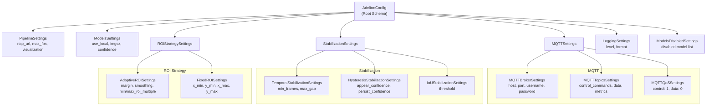
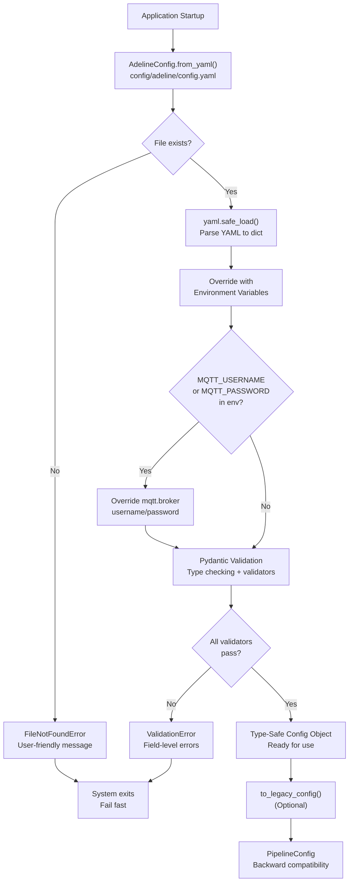
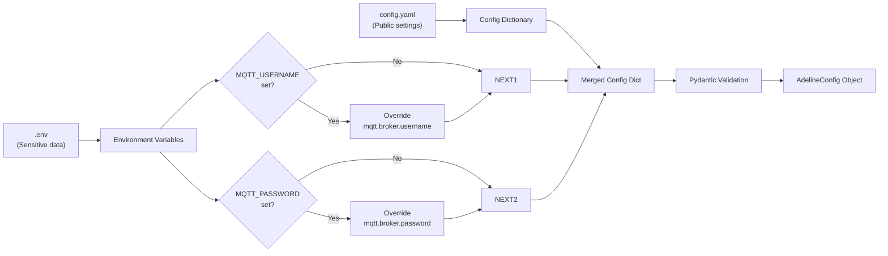
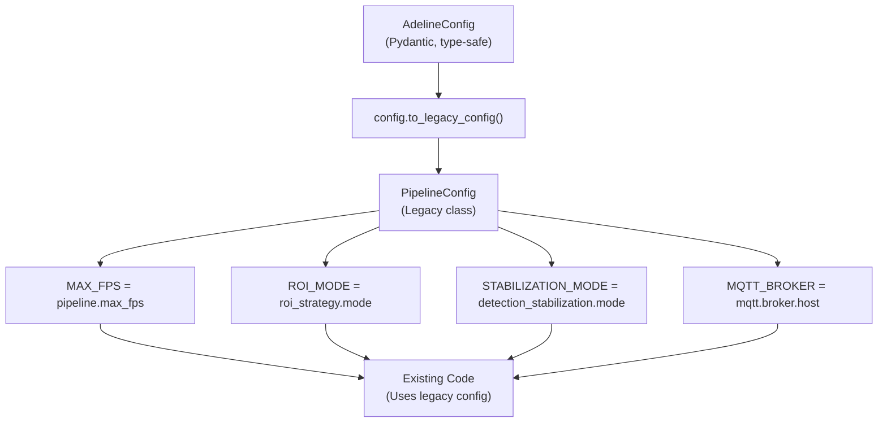

# Configuration

Relevant source files

- [adeline/.gitignore](https://github.com/acare7/kata-inference-251021-clean4/blob/a0662727/adeline/.gitignore)
- [adeline/CLAUDE.md](https://github.com/acare7/kata-inference-251021-clean4/blob/a0662727/adeline/CLAUDE.md)
- [adeline/TEST_CASES_FUNCIONALES.md](https://github.com/acare7/kata-inference-251021-clean4/blob/a0662727/adeline/TEST_CASES_FUNCIONALES.md)
- [adeline/config/__init__.py](https://github.com/acare7/kata-inference-251021-clean4/blob/a0662727/adeline/config/__init__.py)
- [adeline/config/schemas.py](https://github.com/acare7/kata-inference-251021-clean4/blob/a0662727/adeline/config/schemas.py)
- [adeline/test_pydantic_validation.py](https://github.com/acare7/kata-inference-251021-clean4/blob/a0662727/adeline/test_pydantic_validation.py)

## Purpose and Scope

This document describes the configuration system for the Adeline inference pipeline, including configuration files, the Pydantic validation schema, loading mechanisms, and available settings. The configuration system provides type-safe, validated settings with fail-fast error detection at load time.

For installation instructions including setup of configuration files, see [Installation](https://deepwiki.com/acare7/kata-inference-251021-clean4/2.1-installation). For information on running the pipeline with these configurations, see [Running the Pipeline](https://deepwiki.com/acare7/kata-inference-251021-clean4/2.3-running-the-pipeline). For details on specific subsystems (ROI, stabilization, MQTT), see their respective pages: [ROI Strategies](https://deepwiki.com/acare7/kata-inference-251021-clean4/5.1-roi-strategies), [Detection Stabilization](https://deepwiki.com/acare7/kata-inference-251021-clean4/5.2-detection-stabilization), and [MQTT Communication](https://deepwiki.com/acare7/kata-inference-251021-clean4/4-mqtt-communication).

---

## Configuration Files

The Adeline system uses two primary configuration files:

### config.yaml

**Location:** `config/adeline/config.yaml`

The main configuration file defining all pipeline settings. This file uses YAML syntax and is structured hierarchically with the following top-level sections:

- `pipeline`: Basic inference pipeline settings (RTSP URL, FPS, visualization)
- `models`: Model configuration (local vs Roboflow, imgsz, confidence thresholds)
- `mqtt`: MQTT broker connection, topics, and QoS settings
- `detection_stabilization`: Temporal filtering and stabilization parameters
- `roi_strategy`: Region of Interest processing modes and parameters
- `logging`: Log levels and format strings
- `models_disabled`: List of models to disable (prevents warnings)

**Example structure:**

```
pipeline:
  rtsp_url: "rtsp://127.0.0.1:8554/live"
  max_fps: 2
  enable_visualization: true

models:
  use_local: false
  imgsz: 320
  confidence: 0.25

mqtt:
  broker:
    host: "localhost"
    port: 1883
  qos:
    control: 1
    data: 0

detection_stabilization:
  mode: temporal
  temporal:
    min_frames: 3
    max_gap: 2
  iou:
    threshold: 0.3

roi_strategy:
  mode: none
```

**Sources:** [config/schemas.py390-407](https://github.com/acare7/kata-inference-251021-clean4/blob/a0662727/config/schemas.py#L390-L407) [CLAUDE.md168](https://github.com/acare7/kata-inference-251021-clean4/blob/a0662727/CLAUDE.md#L168-L168)

### .env

**Location:** `.env` (root directory, not committed to git)

Environment file for sensitive credentials and API keys. Values in `.env` override corresponding values in `config.yaml`.

**Expected variables:**

```
# MQTT Authentication (optional)
MQTT_USERNAME=your_username
MQTT_PASSWORD=your_password

# Roboflow API Key (required only if using Roboflow models)
ROBOFLOW_API_KEY=your_api_key
```

**Security note:** The `.env` file is excluded via `.gitignore` to prevent committing credentials to version control.

**Sources:** [config/schemas.py441-445](https://github.com/acare7/kata-inference-251021-clean4/blob/a0662727/config/schemas.py#L441-L445) [.gitignore43-49](https://github.com/acare7/kata-inference-251021-clean4/blob/a0662727/.gitignore#L43-L49)

---

## Configuration Schema Architecture

The configuration system uses Pydantic v2 for declarative validation with nested models. Each component subsystem has its own schema model, composed into a root `AdelineConfig` model.

### Schema Model Hierarchy





**Schema model composition pattern**: Each subsystem (MQTT, Stabilization, ROI) has its own namespace of settings. This separation of concerns allows independent validation of each component while maintaining a single, type-safe configuration object.

**Sources:** [config/schemas.py28-407](https://github.com/acare7/kata-inference-251021-clean4/blob/a0662727/config/schemas.py#L28-L407)

---

## Loading Configuration

### Loading Flow





**Fail-fast philosophy**: Configuration errors are caught at load time before any pipeline components are initialized. Invalid configurations produce clear error messages indicating the specific field and constraint violated.

**Sources:** [config/schemas.py409-448](https://github.com/acare7/kata-inference-251021-clean4/blob/a0662727/config/schemas.py#L409-L448) [config/schemas.py450-526](https://github.com/acare7/kata-inference-251021-clean4/blob/a0662727/config/schemas.py#L450-L526)

### Loading in Code

Configuration loading occurs in the application entry point:

**Entry point:** [app/controller.py130](https://github.com/acare7/kata-inference-251021-clean4/blob/a0662727/app/controller.py#L130-L130) (approximately)

```
# Load and validate configuration
config = AdelineConfig.from_yaml("config/adeline/config.yaml")

# Access type-safe settings
print(config.pipeline.max_fps)  # IDE autocomplete works
print(config.detection_stabilization.mode)  # Validated enum

# Convert to legacy format if needed
legacy_config = config.to_legacy_config()
```

**Key methods:**

- `AdelineConfig.from_yaml(config_path: str)`: Loads YAML, validates, returns typed config object
- `config.to_legacy_config()`: Converts to legacy `PipelineConfig` format for backward compatibility

**Sources:** [config/schemas.py409-448](https://github.com/acare7/kata-inference-251021-clean4/blob/a0662727/config/schemas.py#L409-L448) [config/__init__.py1-40](https://github.com/acare7/kata-inference-251021-clean4/blob/a0662727/config/__init__.py#L1-L40)

---

## Validation System

### Validation Rules

The Pydantic validation system enforces constraints at load time using field validators and model validators.

**Field-level validators:**

|Validator|Field|Rule|Error Example|
|---|---|---|---|
|`validate_imgsz_multiple_of_32`|`models.imgsz`|Must be multiple of 32 (YOLO requirement)|"imgsz must be multiple of 32, got 333"|
|`ge`, `le` constraints|Numeric fields|Range validation|"max_fps must be >= 1 and <= 30"|
|`Literal` enums|Mode fields|Must match allowed values|"mode must be one of ['none', 'temporal']"|

**Model-level validators (cross-field dependencies):**

|Validator|Fields|Rule|Error Example|
|---|---|---|---|
|`validate_hysteresis_order`|`hysteresis.appear_confidence`, `hysteresis.persist_confidence`|persist ≤ appear|"persist_confidence (0.5) must be <= appear_confidence (0.3)"|
|`validate_bounds`|`fixed.x_min`, `fixed.x_max`|min < max|"x_min (0.8) must be < x_max (0.2)"|
|`validate_roi_multiples`|`adaptive.min_roi_multiple`, `adaptive.max_roi_multiple`|min ≤ max|"min_roi_multiple (4) must be <= max_roi_multiple (2)"|

**Sources:** [config/schemas.py83-89](https://github.com/acare7/kata-inference-251021-clean4/blob/a0662727/config/schemas.py#L83-L89) [config/schemas.py190-198](https://github.com/acare7/kata-inference-251021-clean4/blob/a0662727/config/schemas.py#L190-L198) [config/schemas.py265-273](https://github.com/acare7/kata-inference-251021-clean4/blob/a0662727/config/schemas.py#L265-L273) [config/schemas.py311-322](https://github.com/acare7/kata-inference-251021-clean4/blob/a0662727/config/schemas.py#L311-L322)

### Validation Error Handling

When validation fails, Pydantic raises a `ValidationError` with structured error information:

```
from pydantic import ValidationError

try:
    config = AdelineConfig.from_yaml("config/adeline/config.yaml")
except ValidationError as e:
    for error in e.errors():
        field_path = " -> ".join(str(loc) for loc in error['loc'])
        print(f"Error in {field_path}: {error['msg']}")
        print(f"  Value: {error.get('input', 'N/A')}")
```

**Example error output:**

```
Error in models -> imgsz: imgsz must be multiple of 32, got 333
  Value: 333
Error in detection_stabilization -> hysteresis -> persist_confidence: persist_confidence (0.5) must be <= appear_confidence (0.3)
  Value: 0.5
```

**Validation test script:** [test_pydantic_validation.py1-138](https://github.com/acare7/kata-inference-251021-clean4/blob/a0662727/test_pydantic_validation.py#L1-L138) demonstrates validation scenarios including valid configs, invalid hysteresis, invalid imgsz, and invalid ROI bounds.

**Sources:** [test_pydantic_validation.py11-103](https://github.com/acare7/kata-inference-251021-clean4/blob/a0662727/test_pydantic_validation.py#L11-L103)

---

## Configuration Reference

### Pipeline Settings

**Schema:** `PipelineSettings`

|Field|Type|Default|Range|Description|
|---|---|---|---|---|
|`rtsp_url`|`str`|`"rtsp://127.0.0.1:8554/live"`|-|RTSP stream URL|
|`model_id`|`str`|`"yolov11n-640"`|-|Roboflow model ID (if not using local)|
|`max_fps`|`int`|`2`|`1-30`|Maximum frames per second|
|`enable_visualization`|`bool`|`true`|-|Enable OpenCV visualization window|
|`display_statistics`|`bool`|`true`|-|Display statistics in visualization|

**Sources:** [config/schemas.py28-52](https://github.com/acare7/kata-inference-251021-clean4/blob/a0662727/config/schemas.py#L28-L52)

### Models Settings

**Schema:** `ModelsSettings`

|Field|Type|Default|Range|Description|Validation|
|---|---|---|---|---|---|
|`use_local`|`bool`|`false`|-|Use local ONNX model instead of Roboflow|-|
|`local_path`|`str`|`"models/yolov11n-320.onnx"`|-|Path to local ONNX model|-|
|`imgsz`|`int`|`320`|`64-1280`|Model input size|**Must be multiple of 32**|
|`confidence`|`float`|`0.25`|`0.0-1.0`|Detection confidence threshold|-|
|`iou_threshold`|`float`|`0.45`|`0.0-1.0`|IoU threshold for NMS|-|

**Critical validation:** `imgsz` must be a multiple of 32 due to YOLO architecture requirements. This is enforced by `validate_imgsz_multiple_of_32`.

**Sources:** [config/schemas.py54-90](https://github.com/acare7/kata-inference-251021-clean4/blob/a0662727/config/schemas.py#L54-L90)

### MQTT Settings

**Schema:** `MQTTSettings` (composed of `MQTTBrokerSettings`, `MQTTTopicsSettings`, `MQTTQoSSettings`)

**Broker configuration:**

|Field|Type|Default|Description|
|---|---|---|---|
|`broker.host`|`str`|`"localhost"`|MQTT broker hostname|
|`broker.port`|`int`|`1883`|MQTT broker port (1-65535)|
|`broker.username`|`Optional[str]`|`None`|Username (override from `MQTT_USERNAME` env)|
|`broker.password`|`Optional[str]`|`None`|Password (override from `MQTT_PASSWORD` env)|

**Topics configuration:**

|Field|Type|Default|Description|
|---|---|---|---|
|`topics.control_commands`|`str`|`"inference/control/commands"`|Control commands topic (QoS 1)|
|`topics.control_status`|`str`|`"inference/control/status"`|Control status topic|
|`topics.data`|`str`|`"inference/data/detections"`|Detections topic (QoS 0)|
|`topics.metrics`|`str`|`"inference/data/metrics"`|Metrics topic|

**QoS configuration:**

|Field|Type|Default|Description|
|---|---|---|---|
|`qos.control`|`Literal[0, 1, 2]`|`1`|Control plane QoS (reliable delivery)|
|`qos.data`|`Literal[0, 1, 2]`|`0`|Data plane QoS (best-effort, high throughput)|

**Design rationale:** Control plane uses QoS 1 for reliability (commands cannot be lost), while data plane uses QoS 0 for performance (detections are high-frequency, best-effort). See [Control Plane](https://deepwiki.com/acare7/kata-inference-251021-clean4/4.1-control-plane) and [Data Plane](https://deepwiki.com/acare7/kata-inference-251021-clean4/4.2-data-plane) for details.

**Sources:** [config/schemas.py96-155](https://github.com/acare7/kata-inference-251021-clean4/blob/a0662727/config/schemas.py#L96-L155)

### Detection Stabilization Settings

**Schema:** `StabilizationSettings` (composed of `TemporalStabilizationSettings`, `HysteresisStabilizationSettings`, `IoUStabilizationSettings`)

|Field|Type|Default|Range|Description|Validation|
|---|---|---|---|---|---|
|`mode`|`Literal['none', 'temporal']`|`'none'`|-|Stabilization mode|-|
|`temporal.min_frames`|`int`|`3`|`≥1`|Minimum consecutive frames to confirm detection|-|
|`temporal.max_gap`|`int`|`2`|`≥0`|Maximum gap frames before removing track|-|
|`hysteresis.appear_confidence`|`float`|`0.5`|`0.0-1.0`|High threshold for new detections|-|
|`hysteresis.persist_confidence`|`float`|`0.3`|`0.0-1.0`|Low threshold for confirmed detections|**Must be ≤ appear_confidence**|
|`iou.threshold`|`float`|`0.3`|`0.0-1.0`|Minimum IoU to consider same object|-|

**Hysteresis invariant:** The `persist_confidence` must be less than or equal to `appear_confidence`. This ensures detections require higher confidence to appear but can persist at lower confidence once confirmed. Enforced by `validate_hysteresis_order` model validator.

**Sources:** [config/schemas.py161-226](https://github.com/acare7/kata-inference-251021-clean4/blob/a0662727/config/schemas.py#L161-L226)

### ROI Strategy Settings

**Schema:** `ROIStrategySettings` (composed of `AdaptiveROISettings`, `FixedROISettings`)

**Mode selection:**

|Field|Type|Default|Description|
|---|---|---|---|
|`mode`|`Literal['none', 'adaptive', 'fixed']`|`'none'`|ROI processing mode|

**Adaptive ROI settings:**

|Field|Type|Default|Range|Description|Validation|
|---|---|---|---|---|---|
|`adaptive.margin`|`float`|`0.2`|`0.0-1.0`|Expansion margin around detections|-|
|`adaptive.smoothing`|`float`|`0.3`|`0.0-1.0`|Temporal smoothing factor|-|
|`adaptive.min_roi_multiple`|`int`|`1`|`≥1`|Minimum ROI size (multiple of imgsz)|-|
|`adaptive.max_roi_multiple`|`int`|`4`|`≥1`|Maximum ROI size (multiple of imgsz)|**Must be ≥ min_roi_multiple**|
|`adaptive.show_statistics`|`bool`|`true`|-|Show ROI statistics in visualization|-|
|`adaptive.resize_to_model`|`bool`|`false`|-|Resize ROI to model size (zoom) vs padding|-|

**Fixed ROI settings (normalized coordinates 0.0-1.0):**

|Field|Type|Default|Range|Description|Validation|
|---|---|---|---|---|---|
|`fixed.x_min`|`float`|`0.2`|`0.0-1.0`|Left boundary (normalized)|-|
|`fixed.y_min`|`float`|`0.2`|`0.0-1.0`|Top boundary (normalized)|-|
|`fixed.x_max`|`float`|`0.8`|`0.0-1.0`|Right boundary (normalized)|**Must be > x_min**|
|`fixed.y_max`|`float`|`0.8`|`0.0-1.0`|Bottom boundary (normalized)|**Must be > y_min**|
|`fixed.show_overlay`|`bool`|`true`|-|Show fixed ROI overlay|-|
|`fixed.resize_to_model`|`bool`|`false`|-|Resize ROI to model size vs padding|-|

**Bounds invariants:** For fixed ROI, `x_min < x_max` and `y_min < y_max`. Enforced by `validate_bounds` model validator.

**Sources:** [config/schemas.py232-336](https://github.com/acare7/kata-inference-251021-clean4/blob/a0662727/config/schemas.py#L232-L336)

### Logging Settings

**Schema:** `LoggingSettings`

|Field|Type|Default|Description|
|---|---|---|---|
|`level`|`Literal['DEBUG', 'INFO', 'WARNING', 'ERROR', 'CRITICAL']`|`'INFO'`|Application log level|
|`format`|`str`|`'%(asctime)s - %(name)s - %(levelname)s - %(message)s'`|Log format string|
|`paho_level`|`Literal['DEBUG', 'INFO', 'WARNING', 'ERROR', 'CRITICAL']`|`'WARNING'`|Paho MQTT library log level|

**Sources:** [config/schemas.py343-357](https://github.com/acare7/kata-inference-251021-clean4/blob/a0662727/config/schemas.py#L343-L357)

### Models Disabled Settings

**Schema:** `ModelsDisabledSettings`

|Field|Type|Default|Description|
|---|---|---|---|
|`disabled`|`List[str]`|`[List of model names]`|Models to disable (prevents `ModelDependencyMissing` warnings)|

**Default disabled models:** `PALIGEMMA`, `FLORENCE2`, `QWEN_2_5`, `CORE_MODEL_SAM`, `CORE_MODEL_SAM2`, `CORE_MODEL_CLIP`, `CORE_MODEL_GAZE`, `SMOLVLM2`, `DEPTH_ESTIMATION`, `MOONDREAM2`, `CORE_MODEL_TROCR`, `CORE_MODEL_GROUNDINGDINO`, `CORE_MODEL_YOLO_WORLD`, `CORE_MODEL_PE`.

**Purpose:** Prevents Roboflow Inference from attempting to load models not used by Adeline, eliminating unnecessary warnings during startup.

**Sources:** [config/schemas.py363-384](https://github.com/acare7/kata-inference-251021-clean4/blob/a0662727/config/schemas.py#L363-L384)

---

## Environment Variable Override

The configuration system supports environment variable overrides for sensitive data. This follows the twelve-factor app methodology of separating config from code.

### Override Mechanism





**Override implementation:** [config/schemas.py441-445](https://github.com/acare7/kata-inference-251021-clean4/blob/a0662727/config/schemas.py#L441-L445)

```
# Override sensitive data from environment variables
if 'mqtt' in config_dict and 'broker' in config_dict['mqtt']:
    if os.getenv('MQTT_USERNAME'):
        config_dict['mqtt']['broker']['username'] = os.getenv('MQTT_USERNAME')
    if os.getenv('MQTT_PASSWORD'):
        config_dict['mqtt']['broker']['password'] = os.getenv('MQTT_PASSWORD')
```

### Supported Environment Variables

|Environment Variable|Overrides Field|Purpose|
|---|---|---|
|`MQTT_USERNAME`|`mqtt.broker.username`|MQTT authentication username|
|`MQTT_PASSWORD`|`mqtt.broker.password`|MQTT authentication password|
|`ROBOFLOW_API_KEY`|(Legacy config only)|Roboflow API key for model download|

**Security best practice:** Always use environment variables for credentials, never commit them to `config.yaml`. The `.gitignore` file ensures `.env` is not tracked by version control.

**Sources:** [config/schemas.py441-445](https://github.com/acare7/kata-inference-251021-clean4/blob/a0662727/config/schemas.py#L441-L445)

---

## Backward Compatibility

### Legacy Configuration System

The Adeline system maintains backward compatibility with a legacy `PipelineConfig` class through the `to_legacy_config()` conversion method.

**Legacy config class:** `PipelineConfig` (defined in `legacy_config.py`)

**Conversion flow:**





**Conversion method:** [config/schemas.py450-526](https://github.com/acare7/kata-inference-251021-clean4/blob/a0662727/config/schemas.py#L450-L526)

The `to_legacy_config()` method manually maps Pydantic fields to legacy class attributes, allowing gradual migration without breaking existing code.

**Example field mappings:**

|New (Pydantic)|Legacy (PipelineConfig)|
|---|---|
|`config.pipeline.max_fps`|`legacy.MAX_FPS`|
|`config.roi_strategy.mode`|`legacy.ROI_MODE`|
|`config.detection_stabilization.mode`|`legacy.STABILIZATION_MODE`|
|`config.mqtt.broker.host`|`legacy.MQTT_BROKER`|
|`config.detection_stabilization.iou.threshold`|`legacy.STABILIZATION_IOU_THRESHOLD`|

**Usage pattern:**

```
# Load new config
config = AdelineConfig.from_yaml("config/adeline/config.yaml")

# Use new config directly (preferred)
print(config.pipeline.max_fps)

# Convert to legacy for backward compatibility
legacy_config = config.to_legacy_config()
print(legacy_config.MAX_FPS)  # Same value
```

**Migration strategy:** New code should use `AdelineConfig` directly for type safety and IDE support. Legacy code can continue using `PipelineConfig` through the conversion method until fully migrated.

**Sources:** [config/schemas.py450-526](https://github.com/acare7/kata-inference-251021-clean4/blob/a0662727/config/schemas.py#L450-L526) [config/__init__.py26](https://github.com/acare7/kata-inference-251021-clean4/blob/a0662727/config/__init__.py#L26-L26)