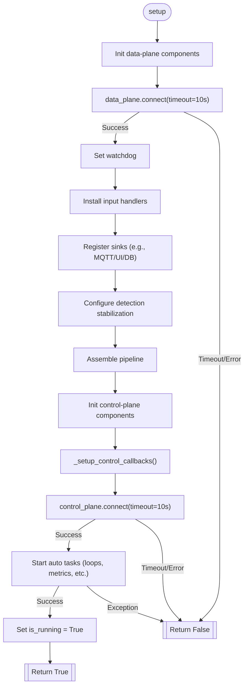
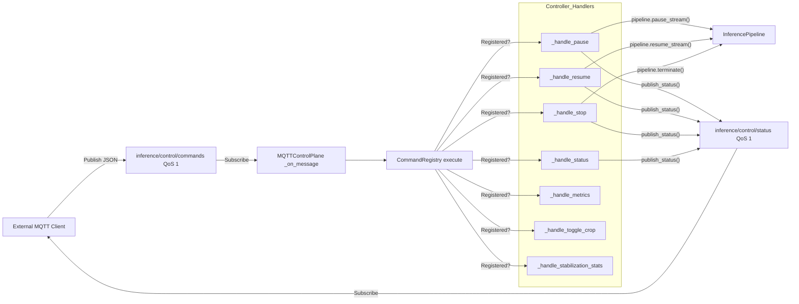
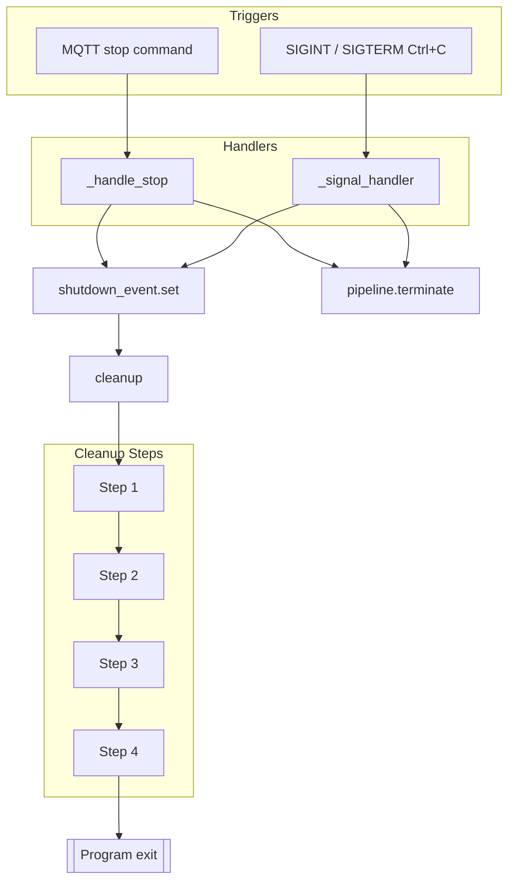
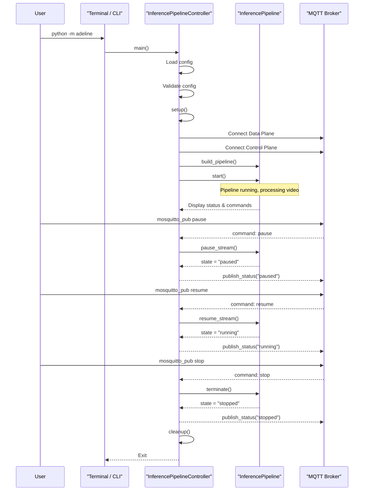

# Running the Pipeline

Relevant source files

- [adeline/README.md](https://github.com/acare7/kata-inference-251021-clean4/blob/a0662727/adeline/README.md)
- [adeline/app/controller.py](https://github.com/acare7/kata-inference-251021-clean4/blob/a0662727/adeline/app/controller.py)
- [adeline/control/plane.py](https://github.com/acare7/kata-inference-251021-clean4/blob/a0662727/adeline/control/plane.py)
- [adeline/control/registry.py](https://github.com/acare7/kata-inference-251021-clean4/blob/a0662727/adeline/control/registry.py)

**Purpose and Scope**: This page covers the operational aspects of running the inference pipeline, including starting, stopping, pausing, and monitoring. For configuration setup, see [Configuration](https://deepwiki.com/acare7/kata-inference-251021-clean4/2.2-configuration). For architectural details about the controller and pipeline components, see [InferencePipelineController](https://deepwiki.com/acare7/kata-inference-251021-clean4/3.1-inferencepipelinecontroller).

## Starting the Pipeline

### Entry Point

The pipeline is started through the `main()` function, which serves as the application entry point:

```
python -m adeline
```

The entry point implementation in [adeline/app/controller.py449-503](https://github.com/acare7/kata-inference-251021-clean4/blob/a0662727/adeline/app/controller.py#L449-L503) performs the following steps:

1. Load configuration from `config/adeline/config.yaml`
2. Validate configuration with Pydantic schemas
3. Convert to `PipelineConfig` (legacy format)
4. Configure logging based on settings
5. Create `InferencePipelineController` instance
6. Execute `controller.run()`

### Configuration Loading

The system uses a fail-fast validation approach:

- If configuration file exists: Load and validate with `AdelineConfig.from_yaml()`
- If validation fails: Print clear error messages and exit with code 1
- If file missing: Use default configuration values

Example validation error output:

```
❌ Invalid configuration:
   • models.imgsz: ensure this value is a multiple of 32
   • detection_stabilization.hysteresis.persist_conf: persist_conf must be <= appear_conf

Please fix config/adeline/config.yaml and try again.
```

### Auto-Start Behavior

The pipeline automatically starts on successful initialization [adeline/app/controller.py183-191](https://github.com/acare7/kata-inference-251021-clean4/blob/a0662727/adeline/app/controller.py#L183-L191) There is no separate START command - the pipeline begins processing immediately after setup completes:

```
✅ Setup completado
▶️ Iniciando pipeline automáticamente...
✅ Pipeline iniciado y corriendo
```

**Sources:**

- [adeline/app/controller.py449-503](https://github.com/acare7/kata-inference-251021-clean4/blob/a0662727/adeline/app/controller.py#L449-L503)

## Pipeline Setup Process

The `setup()` method [adeline/app/controller.py92-194](https://github.com/acare7/kata-inference-251021-clean4/blob/a0662727/adeline/app/controller.py#L92-L194) orchestrates the initialization sequence:





### Setup Phases

**Phase 1: Data Plane Setup** [adeline/app/controller.py109-125](https://github.com/acare7/kata-inference-251021-clean4/blob/a0662727/adeline/app/controller.py#L109-L125)

- Create `MQTTDataPlane` instance with broker connection parameters
- Connect to MQTT broker with 10-second timeout
- If connection fails, abort setup and return `False`
- Attach `BasePipelineWatchDog` for metrics collection

**Phase 2-5: Component Construction** (delegated to `PipelineBuilder`)

- Build `InferenceHandler` with ROI strategy [adeline/app/controller.py130](https://github.com/acare7/kata-inference-251021-clean4/blob/a0662727/adeline/app/controller.py#L130-L130)
- Build sinks (MQTT, ROI update, visualization) [adeline/app/controller.py135-139](https://github.com/acare7/kata-inference-251021-clean4/blob/a0662727/adeline/app/controller.py#L135-L139)
- Wrap sinks with stabilization decorator if enabled [adeline/app/controller.py144-148](https://github.com/acare7/kata-inference-251021-clean4/blob/a0662727/adeline/app/controller.py#L144-L148)
- Build final `InferencePipeline` instance [adeline/app/controller.py153-158](https://github.com/acare7/kata-inference-251021-clean4/blob/a0662727/adeline/app/controller.py#L153-L158)

**Phase 6: Control Plane Setup** [adeline/app/controller.py163-178](https://github.com/acare7/kata-inference-251021-clean4/blob/a0662727/adeline/app/controller.py#L163-L178)

- Create `MQTTControlPlane` instance
- Register command callbacks via `_setup_control_callbacks()`
- Connect to MQTT broker with 10-second timeout
- If connection fails, abort setup and return `False`

**Phase 7: Auto-Start** [adeline/app/controller.py183-191](https://github.com/acare7/kata-inference-251021-clean4/blob/a0662727/adeline/app/controller.py#L183-L191)

- Set `is_running = True`
- Call `pipeline.start()` to begin video processing
- Log success or catch exceptions and return `False`

**Sources:**

- [adeline/app/controller.py92-194](https://github.com/acare7/kata-inference-251021-clean4/blob/a0662727/adeline/app/controller.py#L92-L194)

## Pipeline Lifecycle States

The pipeline operates in three primary states:

|State|Description|`is_running` Flag|
|---|---|---|
|**running**|Actively processing video frames|`True`|
|**paused**|Processing temporarily suspended, can resume|`True`|
|**stopped**|Fully terminated, requires restart|`False`|

State transitions are managed through MQTT commands or signal handlers.

**Sources:**

- [adeline/app/controller.py88-90](https://github.com/acare7/kata-inference-251021-clean4/blob/a0662727/adeline/app/controller.py#L88-L90)

## MQTT Command Interface

### Command Architecture

The system uses a dual-plane MQTT architecture with different Quality of Service (QoS) levels:

|Plane|Topics|QoS|Purpose|
|---|---|---|---|
|**Control Plane**|`inference/control/commands`  <br>`inference/control/status`|1|Reliable command delivery and status updates|
|**Data Plane**|`inference/data/detections`  <br>`inference/data/metrics`|0|Best-effort, high-throughput data publishing|

### Command Flow




### Available Commands

Commands are registered in [adeline/app/controller.py196-219](https://github.com/acare7/kata-inference-251021-clean4/blob/a0662727/adeline/app/controller.py#L196-L219) using the `CommandRegistry` pattern. This ensures only explicitly supported commands are available, preventing runtime errors.

#### Basic Commands (Always Available)

|Command|Handler|Description|Implementation|
|---|---|---|---|
|`pause`|`_handle_pause()`|Pauses video processing|[adeline/app/controller.py246-257](https://github.com/acare7/kata-inference-251021-clean4/blob/a0662727/adeline/app/controller.py#L246-L257)|
|`resume`|`_handle_resume()`|Resumes after pause|[adeline/app/controller.py259-270](https://github.com/acare7/kata-inference-251021-clean4/blob/a0662727/adeline/app/controller.py#L259-L270)|
|`stop`|`_handle_stop()`|Terminates pipeline and exits program|[adeline/app/controller.py228-244](https://github.com/acare7/kata-inference-251021-clean4/blob/a0662727/adeline/app/controller.py#L228-L244)|
|`status`|`_handle_status()`|Queries current state|[adeline/app/controller.py272-276](https://github.com/acare7/kata-inference-251021-clean4/blob/a0662727/adeline/app/controller.py#L272-L276)|
|`metrics`|`_handle_metrics()`|Publishes pipeline metrics via MQTT|[adeline/app/controller.py278-284](https://github.com/acare7/kata-inference-251021-clean4/blob/a0662727/adeline/app/controller.py#L278-L284)|

#### Conditional Commands

These commands register only if system capabilities support them:

|Command|Condition|Handler|Description|
|---|---|---|---|
|`toggle_crop`|`inference_handler.supports_toggle == True`|`_handle_toggle_crop()`|Toggles adaptive ROI on/off ([adeline/app/controller.py286-306](https://github.com/acare7/kata-inference-251021-clean4/blob/a0662727/adeline/app/controller.py#L286-L306))|
|`stabilization_stats`|`stabilizer is not None`|`_handle_stabilization_stats()`|Shows stabilization statistics ([adeline/app/controller.py308-343](https://github.com/acare7/kata-inference-251021-clean4/blob/a0662727/adeline/app/controller.py#L308-L343))|

Conditional registration logic [adeline/app/controller.py212-219](https://github.com/acare7/kata-inference-251021-clean4/blob/a0662727/adeline/app/controller.py#L212-L219):

```
# Comando TOGGLE_CROP solo si handler soporta toggle
if self.inference_handler and self.inference_handler.supports_toggle:
    registry.register('toggle_crop', self._handle_toggle_crop, "Toggle adaptive ROI crop")
    
# Comando STABILIZATION_STATS solo si stabilization habilitado
if self.stabilizer is not None:
    registry.register('stabilization_stats', self._handle_stabilization_stats, "...")
```

### Command Format

All commands use JSON format:

```
{"command": "command_name"}
```

Example command to pause:

```
mosquitto_pub -h localhost -t inference/control/commands \
  -m '{"command": "pause"}' -q 1
```

### CommandRegistry Pattern

The `CommandRegistry` class [adeline/control/registry.py28-141](https://github.com/acare7/kata-inference-251021-clean4/blob/a0662727/adeline/control/registry.py#L28-L141) provides:

- **Explicit Registration**: Only explicitly registered commands are available
- **Early Validation**: Unregistered commands fail with clear error messages
- **Introspection**: List available commands via `available_commands` property

When an invalid command is received [adeline/control/plane.py120-128](https://github.com/acare7/kata-inference-251021-clean4/blob/a0662727/adeline/control/plane.py#L120-L128):

```
⚠️ Command 'invalid_cmd' not available. Available commands: pause, resume, stop, status, metrics
💡 Comandos disponibles: metrics, pause, resume, status, stop
```

**Sources:**

- [adeline/app/controller.py196-343](https://github.com/acare7/kata-inference-251021-clean4/blob/a0662727/adeline/app/controller.py#L196-L343)
- [adeline/control/plane.py103-133](https://github.com/acare7/kata-inference-251021-clean4/blob/a0662727/adeline/control/plane.py#L103-L133)
- [adeline/control/registry.py28-141](https://github.com/acare7/kata-inference-251021-clean4/blob/a0662727/adeline/control/registry.py#L28-L141)

## Command Reference

### pause Command

**Availability**: Always  
**Handler**: `_handle_pause()` [adeline/app/controller.py246-257](https://github.com/acare7/kata-inference-251021-clean4/blob/a0662727/adeline/app/controller.py#L246-L257)

Temporarily suspends video processing while keeping the pipeline alive.

```
mosquitto_pub -h localhost -t inference/control/commands \
  -m '{"command": "pause"}' -q 1
```

**Behavior**:

- Calls `pipeline.pause_stream()`
- Publishes `"paused"` status
- Pipeline can be resumed with `resume` command
- Warning logged if pipeline not running

**Log Output**:

```
⏸️ Comando PAUSE recibido
✅ Pipeline pausado (usa RESUME para continuar)
📤 Status publicado: paused
```

### resume Command

**Availability**: Always  
**Handler**: `_handle_resume()` [adeline/app/controller.py259-270](https://github.com/acare7/kata-inference-251021-clean4/blob/a0662727/adeline/app/controller.py#L259-L270)

Resumes video processing after a pause.

```
mosquitto_pub -h localhost -t inference/control/commands \
  -m '{"command": "resume"}' -q 1
```

**Behavior**:

- Calls `pipeline.resume_stream()`
- Publishes `"running"` status
- Warning logged if pipeline not running

**Log Output**:

```
▶️ Comando RESUME recibido
✅ Pipeline resumido
📤 Status publicado: running
```

### stop Command

**Availability**: Always  
**Handler**: `_handle_stop()` [adeline/app/controller.py228-244](https://github.com/acare7/kata-inference-251021-clean4/blob/a0662727/adeline/app/controller.py#L228-L244)

Terminates the pipeline and exits the program.

```
mosquitto_pub -h localhost -t inference/control/commands \
  -m '{"command": "stop"}' -q 1
```

**Behavior**:

- Calls `pipeline.terminate()`
- Sets `is_running = False`
- Publishes `"stopped"` status
- Sets `shutdown_event` to trigger cleanup
- Program exits after cleanup

**Log Output**:

```
⏹️ Comando STOP recibido
✅ Pipeline detenido
📤 Status publicado: stopped
🛑 Finalizando servicio...
```

### status Command

**Availability**: Always  
**Handler**: `_handle_status()` [adeline/app/controller.py272-276](https://github.com/acare7/kata-inference-251021-clean4/blob/a0662727/adeline/app/controller.py#L272-L276)

Queries the current pipeline state.

```
mosquitto_pub -h localhost -t inference/control/commands \
  -m '{"command": "status"}' -q 1
```

**Response** (published to `inference/control/status`):

```
{
  "status": "running",
  "timestamp": "2024-01-15T10:30:45.123456",
  "client_id": "inference_control"
}
```

**Behavior**:

- Determines state from `is_running` flag
- Publishes status message with QoS 1, retained

### metrics Command

**Availability**: Always  
**Handler**: `_handle_metrics()` [adeline/app/controller.py278-284](https://github.com/acare7/kata-inference-251021-clean4/blob/a0662727/adeline/app/controller.py#L278-L284)

Publishes pipeline performance metrics.

```
mosquitto_pub -h localhost -t inference/control/commands \
  -m '{"command": "metrics"}' -q 1
```

**Response** (published to `inference/data/metrics`):

- FPS (frames per second)
- Frame counts
- Watchdog statistics

Subscribe to metrics:

```
mosquitto_sub -h localhost -t inference/data/metrics -q 0
```

### toggle_crop Command

**Availability**: Only if `ROI_MODE=adaptive` and handler supports toggle  
**Handler**: `_handle_toggle_crop()` [adeline/app/controller.py286-306](https://github.com/acare7/kata-inference-251021-clean4/blob/a0662727/adeline/app/controller.py#L286-L306)

Dynamically enables/disables adaptive ROI cropping at runtime.

```
mosquitto_pub -h localhost -t inference/control/commands \
  -m '{"command": "toggle_crop"}' -q 1
```

**Behavior**:

- If enabled: Calls `inference_handler.disable()` (resets ROI to full frame)
- If disabled: Calls `inference_handler.enable()`
- Warning logged if handler doesn't support toggle

**Registration Check** [adeline/app/controller.py212-214](https://github.com/acare7/kata-inference-251021-clean4/blob/a0662727/adeline/app/controller.py#L212-L214):

```
if self.inference_handler and self.inference_handler.supports_toggle:
    registry.register('toggle_crop', self._handle_toggle_crop, "Toggle adaptive ROI crop")
```

**Log Output**:

```
🔲 Comando TOGGLE_CROP recibido
✅ Adaptive ROI disabled (full frame processing)
```

### stabilization_stats Command

**Availability**: Only if `STABILIZATION_MODE != 'none'`  
**Handler**: `_handle_stabilization_stats()` [adeline/app/controller.py308-343](https://github.com/acare7/kata-inference-251021-clean4/blob/a0662727/adeline/app/controller.py#L308-L343)

Displays detection stabilization statistics.

```
mosquitto_pub -h localhost -t inference/control/commands \
  -m '{"command": "stabilization_stats"}' -q 1
```

**Behavior**:

- Calls `stabilizer.get_stats(source_id=0)`
- Logs comprehensive statistics to console

**Registration Check** [adeline/app/controller.py217-219](https://github.com/acare7/kata-inference-251021-clean4/blob/a0662727/adeline/app/controller.py#L217-L219):

```
if self.stabilizer is not None:
    registry.register('stabilization_stats', self._handle_stabilization_stats, "...")
```

**Example Output**:

```
📊 Comando STABILIZATION_STATS recibido
📈 Detection Stabilization Stats:
   Mode: temporal
   Total detected: 150
   Total confirmed: 120
   Total ignored: 20
   Total removed: 10
   Active tracks: 3
   Confirm ratio: 80.00%
   Tracks by class:
     - person: 3
```

**Sources:**

- [adeline/app/controller.py228-343](https://github.com/acare7/kata-inference-251021-clean4/blob/a0662727/adeline/app/controller.py#L228-L343)

## Monitoring the Pipeline

### Console Output

When the pipeline starts, the controller displays operational information [adeline/app/controller.py351-368](https://github.com/acare7/kata-inference-251021-clean4/blob/a0662727/adeline/app/controller.py#L351-L368):

```
======================================================================
🎬 InferencePipeline con MQTT activo y corriendo
======================================================================
📡 Control Topic: inference/control/commands
📊 Data Topic: inference/data/detections
▶️  Estado: RUNNING

💡 Comandos MQTT disponibles:
   PAUSE:   {"command": "pause"}   - Pausa el procesamiento
   RESUME:  {"command": "resume"}  - Reanuda el procesamiento
   STOP:    {"command": "stop"}    - Detiene y finaliza
   STATUS:  {"command": "status"}  - Consulta estado actual
   METRICS: {"command": "metrics"} - Publica métricas del pipeline

⌨️  Presiona Ctrl+C para salir
======================================================================
```

Conditional commands appear only if available:

```
   TOGGLE_CROP: {"command": "toggle_crop"} - Toggle adaptive ROI crop (solo modo adaptive)
   STABILIZATION_STATS: {"command": "stabilization_stats"} - Estadísticas de detección estabilizada
```

### Status Subscription

Subscribe to status updates:

```
mosquitto_sub -h localhost -t inference/control/status -q 1 -v
```

Status messages are published with QoS 1 and retained flag, ensuring subscribers always receive the latest state.

### Metrics Subscription

Subscribe to performance metrics:

```
mosquitto_sub -h localhost -t inference/data/metrics -q 0 -v
```

Metrics are published with QoS 0 for best-effort, high-throughput delivery.

### Detection Output Subscription

Subscribe to detection results:

```
mosquitto_sub -h localhost -t inference/data/detections -q 0 -v
```

Detection messages contain:

- Bounding boxes
- Confidence scores
- Class labels
- Track IDs (if stabilization enabled)

**Sources:**

- [adeline/app/controller.py345-368](https://github.com/acare7/kata-inference-251021-clean4/blob/a0662727/adeline/app/controller.py#L345-L368)

## Stopping the Pipeline

### Graceful Shutdown Methods





#### Method 1: MQTT stop Command

Send stop command via MQTT [adeline/app/controller.py228-244](https://github.com/acare7/kata-inference-251021-clean4/blob/a0662727/adeline/app/controller.py#L228-L244):

```
mosquitto_pub -h localhost -t inference/control/commands \
  -m '{"command": "stop"}' -q 1
```

**Flow**:

1. `_handle_stop()` called
2. `pipeline.terminate()` stops video processing
3. `is_running` set to `False`
4. Publishes `"stopped"` status
5. Sets `shutdown_event`
6. Main loop exits and calls `cleanup()`

#### Method 2: Signal Handler (Ctrl+C)

Press Ctrl+C or send SIGINT/SIGTERM [adeline/app/controller.py385-396](https://github.com/acare7/kata-inference-251021-clean4/blob/a0662727/adeline/app/controller.py#L385-L396):

**Flow**:

1. `_signal_handler()` invoked
2. Sets `shutdown_event`
3. Calls `pipeline.terminate()` immediately
4. Main loop exits and calls `cleanup()`

**Signal Registration** [adeline/app/controller.py370-372](https://github.com/acare7/kata-inference-251021-clean4/blob/a0662727/adeline/app/controller.py#L370-L372):

```
signal.signal(signal.SIGINT, self._signal_handler)
signal.signal(signal.SIGTERM, self._signal_handler)
```

### Cleanup Process

The `cleanup()` method [adeline/app/controller.py398-443](https://github.com/acare7/kata-inference-251021-clean4/blob/a0662727/adeline/app/controller.py#L398-L443) handles orderly resource release:

#### Step 1: Terminate Pipeline

```
self.pipeline.terminate()
self.pipeline.join(timeout=10.0)  # Wait up to 10 seconds
```

- Stops video processing threads
- 10-second timeout prevents indefinite blocking
- Increased from 3s in previous versions for reliability

#### Step 2: Disconnect Control Plane

```
self.control_plane.disconnect()
```

- Publishes `"disconnected"` status
- Stops MQTT message loop
- Disconnects from broker

#### Step 3: Disconnect Data Plane

```
stats = self.data_plane.get_stats()
logger.info(f"📊 Data Plane stats: {stats}")
self.data_plane.disconnect()
```

- Logs final statistics (messages published, errors)
- Stops publisher threads
- Disconnects from broker

#### Step 4: Log Farewell

```
logger.info("👋 Hasta luego!")
```

All cleanup steps use try/except blocks to prevent cascading failures.

**Sources:**

- [adeline/app/controller.py228-244](https://github.com/acare7/kata-inference-251021-clean4/blob/a0662727/adeline/app/controller.py#L228-L244)
- [adeline/app/controller.py370-396](https://github.com/acare7/kata-inference-251021-clean4/blob/a0662727/adeline/app/controller.py#L370-L396)
- [adeline/app/controller.py398-443](https://github.com/acare7/kata-inference-251021-clean4/blob/a0662727/adeline/app/controller.py#L398-L443)

## Main Loop

After successful setup, the controller enters a wait loop [adeline/app/controller.py374-383](https://github.com/acare7/kata-inference-251021-clean4/blob/a0662727/adeline/app/controller.py#L374-L383):

```
try:
    while not self.shutdown_event.is_set():
        self.shutdown_event.wait(timeout=1.0)
except KeyboardInterrupt:
    logger.info("\n\n⚠️ Interrupción forzada...")
    self.shutdown_event.set()
```

**Behavior**:

- Checks `shutdown_event` every second (1.0s timeout)
- Responds to MQTT commands via registered callbacks (asynchronous)
- Exits loop when `shutdown_event` is set
- Handles forced `KeyboardInterrupt` (double Ctrl+C)
- Calls `cleanup()` after loop exits

The pipeline continues processing video in separate threads while the main loop waits for shutdown signals.

**Sources:**

- [adeline/app/controller.py345-383](https://github.com/acare7/kata-inference-251021-clean4/blob/a0662727/adeline/app/controller.py#L345-L383)

## Error Handling

### Connection Failures

If MQTT connections fail during setup [adeline/app/controller.py120-122](https://github.com/acare7/kata-inference-251021-clean4/blob/a0662727/adeline/app/controller.py#L120-L122):

```
if not self.data_plane.connect(timeout=10):
    logger.error("❌ No se pudo conectar Data Plane")
    return False
```

**Behavior**:

- `setup()` returns `False`
- Pipeline does not start
- Error logged with connection details
- Program exits cleanly

Similar check for Control Plane [adeline/app/controller.py176-178](https://github.com/acare7/kata-inference-251021-clean4/blob/a0662727/adeline/app/controller.py#L176-L178)

### Invalid Commands

When an unregistered command is received [adeline/control/plane.py120-128](https://github.com/acare7/kata-inference-251021-clean4/blob/a0662727/adeline/control/plane.py#L120-L128):

```
try:
    self.command_registry.execute(command)
except CommandNotAvailableError as e:
    logger.warning(f"⚠️ {e}")
    available = ', '.join(sorted(self.command_registry.available_commands))
    logger.info(f"💡 Comandos disponibles: {available}")
```

**Output Example**:

```
⚠️ Command 'unknown_cmd' not available. Available commands: metrics, pause, resume, status, stop
💡 Comandos disponibles: metrics, pause, resume, status, stop
```

No action taken, pipeline continues normally.

### Conditional Command Unavailability

If a conditional command is attempted when not registered:

Example - `toggle_crop` in `ROI_MODE=none`:

```
⚠️ Command 'toggle_crop' not available. Available commands: metrics, pause, resume, status, stop
💡 Comandos disponibles: metrics, pause, resume, status, stop
```

The `CommandRegistry` prevents registration of unsupported commands, ensuring clear error messages.

### Configuration Validation Errors

Validation happens before pipeline starts [adeline/app/controller.py454-477](https://github.com/acare7/kata-inference-251021-clean4/blob/a0662727/adeline/app/controller.py#L454-L477):

```
try:
    pydantic_config = AdelineConfig.from_yaml(config_path)
    print(f"✅ Config loaded and validated from {config_path}")
except ValidationError as e:
    print(f"❌ Invalid configuration:")
    for error in e.errors():
        field = " -> ".join(str(loc) for loc in error['loc'])
        print(f"   • {field}: {error['msg']}")
    print(f"\nPlease fix {config_path} and try again.")
    sys.exit(1)
```

**Example Output**:

```
❌ Invalid configuration:
   • models -> imgsz: ensure this value is a multiple of 32
   • detection_stabilization -> hysteresis -> persist_conf: persist_conf must be <= appear_conf

Please fix config/adeline/config.yaml and try again.
```

The fail-fast approach prevents running with invalid configuration.

**Sources:**

- [adeline/app/controller.py120-122](https://github.com/acare7/kata-inference-251021-clean4/blob/a0662727/adeline/app/controller.py#L120-L122)
- [adeline/app/controller.py176-178](https://github.com/acare7/kata-inference-251021-clean4/blob/a0662727/adeline/app/controller.py#L176-L178)
- [adeline/app/controller.py454-477](https://github.com/acare7/kata-inference-251021-clean4/blob/a0662727/adeline/app/controller.py#L454-L477)
- [adeline/control/plane.py120-128](https://github.com/acare7/kata-inference-251021-clean4/blob/a0662727/adeline/control/plane.py#L120-L128)
- [adeline/control/registry.py79-101](https://github.com/acare7/kata-inference-251021-clean4/blob/a0662727/adeline/control/registry.py#L79-L101)

## Operational Workflow

Typical operational sequence:




**Sources:**

- [adeline/app/controller.py58-503](https://github.com/acare7/kata-inference-251021-clean4/blob/a0662727/adeline/app/controller.py#L58-L503)