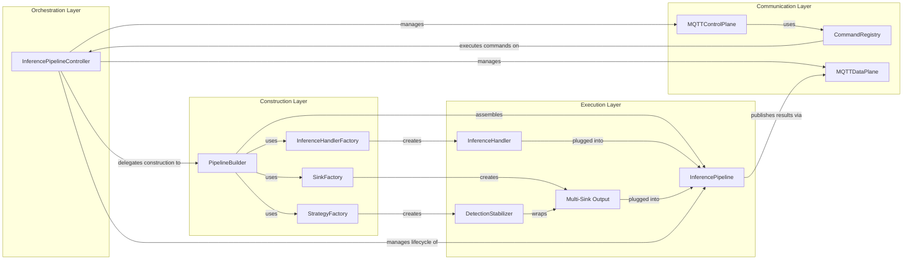
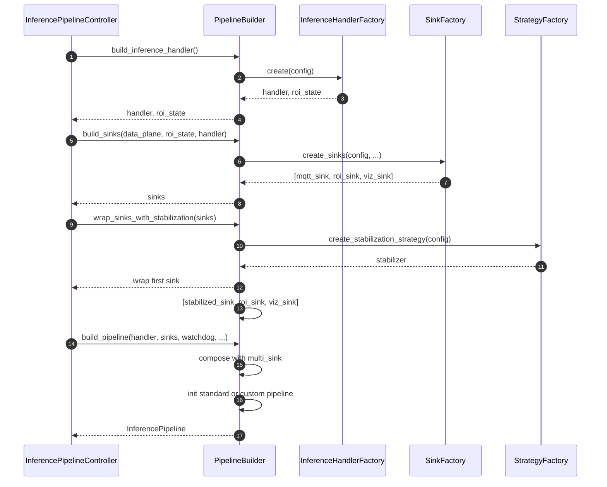
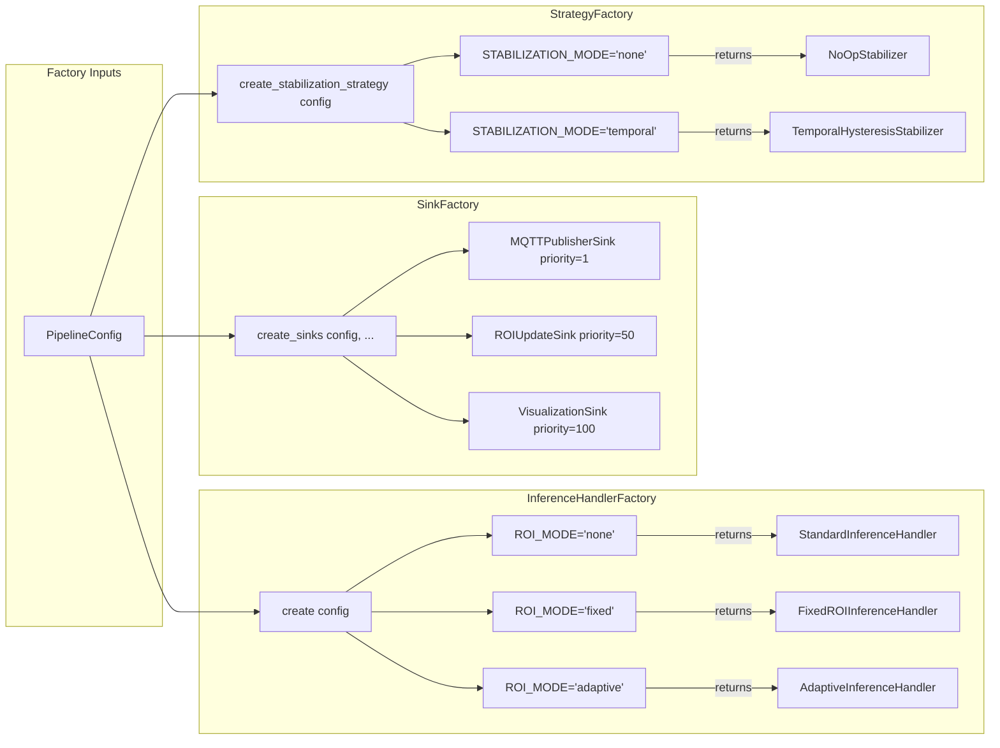
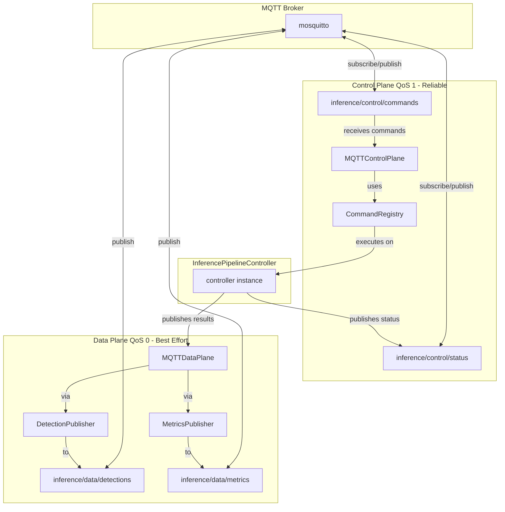
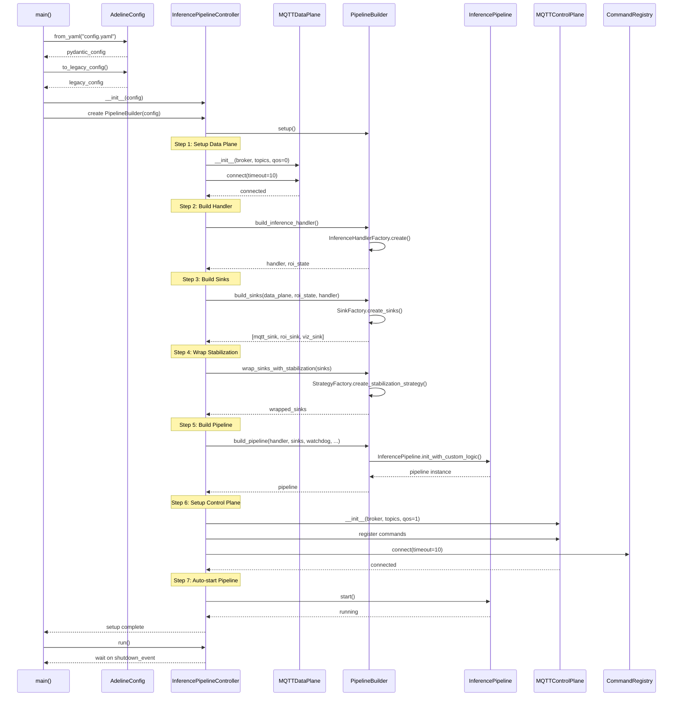
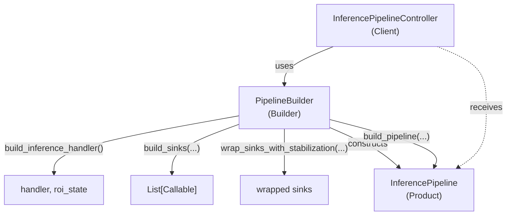
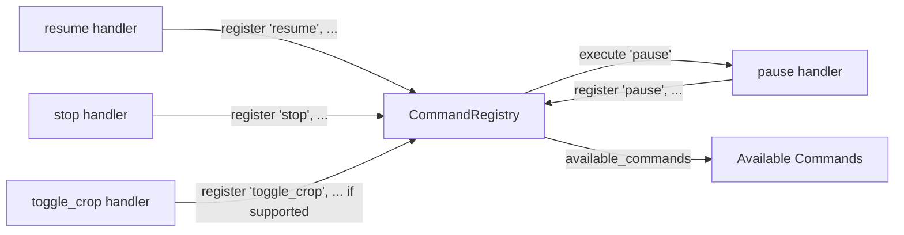
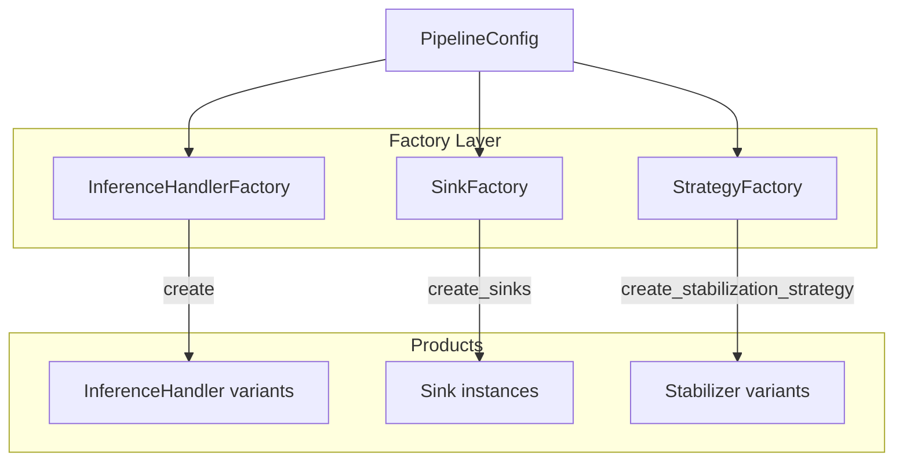

# Core Architecture

Relevant source files

- [adeline/CLAUDE.md](https://github.com/acare7/kata-inference-251021-clean4/blob/a0662727/adeline/CLAUDE.md)
- [adeline/app/builder.py](https://github.com/acare7/kata-inference-251021-clean4/blob/a0662727/adeline/app/builder.py)
- [adeline/app/controller.py](https://github.com/acare7/kata-inference-251021-clean4/blob/a0662727/adeline/app/controller.py)
- [adeline/control/plane.py](https://github.com/acare7/kata-inference-251021-clean4/blob/a0662727/adeline/control/plane.py)
- [adeline/control/registry.py](https://github.com/acare7/kata-inference-251021-clean4/blob/a0662727/adeline/control/registry.py)

## Purpose and Scope

This document provides a detailed explanation of the Adeline inference pipeline's core architectural components, their responsibilities, and how they interact. The architecture follows a "Complexity by design, not by accident" philosophy, using intentional structural patterns to manage system complexity.

**Scope:**

- Main orchestration components: `InferencePipelineController` and `PipelineBuilder`
- Factory pattern system for component construction
- MQTT dual-plane architecture for control and data
- Separation of concerns and dependency injection flow

**For specific details about:**

- Configuration validation and schemas, see [Configuration System](https://deepwiki.com/acare7/kata-inference-251021-clean4/6-configuration-system)
- Inference processing and ROI strategies, see [Inference Pipeline](https://deepwiki.com/acare7/kata-inference-251021-clean4/5-inference-pipeline)
- Detection stabilization and tracking, see [Multi-Object Tracking](https://deepwiki.com/acare7/kata-inference-251021-clean4/5.3-multi-object-tracking)

## Architectural Overview

The Adeline system is organized around three primary architectural layers:




**Sources:** [adeline/CLAUDE.md65-88](https://github.com/acare7/kata-inference-251021-clean4/blob/a0662727/adeline/CLAUDE.md#L65-L88) [adeline/app/controller.py58-91](https://github.com/acare7/kata-inference-251021-clean4/blob/a0662727/adeline/app/controller.py#L58-L91) [adeline/app/builder.py41-70](https://github.com/acare7/kata-inference-251021-clean4/blob/a0662727/adeline/app/builder.py#L41-L70)

## Component Responsibilities

### InferencePipelineController

The `InferencePipelineController` class serves as the main orchestrator with the following responsibilities:

|Responsibility|Description|Code Location|
|---|---|---|
|**Lifecycle Management**|Handles start, stop, pause, resume operations|[adeline/app/controller.py58-91](https://github.com/acare7/kata-inference-251021-clean4/blob/a0662727/adeline/app/controller.py#L58-L91)|
|**Setup Orchestration**|Coordinates component initialization sequence|[adeline/app/controller.py92-194](https://github.com/acare7/kata-inference-251021-clean4/blob/a0662727/adeline/app/controller.py#L92-L194)|
|**Signal Handling**|Manages Ctrl+C and SIGTERM signals|[adeline/app/controller.py385-396](https://github.com/acare7/kata-inference-251021-clean4/blob/a0662727/adeline/app/controller.py#L385-L396)|
|**Resource Cleanup**|Ensures proper shutdown of all components|[adeline/app/controller.py398-443](https://github.com/acare7/kata-inference-251021-clean4/blob/a0662727/adeline/app/controller.py#L398-L443)|
|**Command Delegation**|Registers MQTT command handlers|[adeline/app/controller.py196-219](https://github.com/acare7/kata-inference-251021-clean4/blob/a0662727/adeline/app/controller.py#L196-L219)|

**Key Design Principle:** The controller **orchestrates but does not construct**. All construction logic is delegated to `PipelineBuilder`.

**Sources:** [adeline/app/controller.py58-91](https://github.com/acare7/kata-inference-251021-clean4/blob/a0662727/adeline/app/controller.py#L58-L91) [adeline/CLAUDE.md65-88](https://github.com/acare7/kata-inference-251021-clean4/blob/a0662727/adeline/CLAUDE.md#L65-L88)

### PipelineBuilder

The `PipelineBuilder` class implements the Builder pattern, encapsulating all component construction logic:

|Method|Purpose|Returns|
|---|---|---|
|`build_inference_handler()`|Creates inference handler based on `ROI_MODE`|`(BaseInferenceHandler, roi_state)`|
|`build_sinks()`|Constructs output sinks based on configuration|`List[Callable]`|
|`wrap_sinks_with_stabilization()`|Wraps sinks with stabilization if enabled|`List[Callable]`|
|`build_pipeline()`|Assembles final `InferencePipeline`|`InferencePipeline`|

**Construction Flow:**




**Sources:** [adeline/app/builder.py41-70](https://github.com/acare7/kata-inference-251021-clean4/blob/a0662727/adeline/app/builder.py#L41-L70) [adeline/app/builder.py71-208](https://github.com/acare7/kata-inference-251021-clean4/blob/a0662727/adeline/app/builder.py#L71-L208)

### Factory Pattern System

Three specialized factories handle component creation based on configuration:





**Factory Characteristics:**

- **InferenceHandlerFactory**: Creates handlers implementing the Strategy pattern for different ROI modes (detailed in [#3.3.1](https://deepwiki.com/acare7/kata-inference-251021-clean4/3.3.1-inferencehandlerfactory))
- **SinkFactory**: Uses registry pattern with explicit priorities for sink ordering (detailed in [#3.3.2](https://deepwiki.com/acare7/kata-inference-251021-clean4/3.3.2-sinkfactory))
- **StrategyFactory**: Creates stabilization strategies based on configuration (detailed in [#3.3.3](https://deepwiki.com/acare7/kata-inference-251021-clean4/3.3.3-strategyfactory))

**Sources:** [adeline/CLAUDE.md83-87](https://github.com/acare7/kata-inference-251021-clean4/blob/a0662727/adeline/CLAUDE.md#L83-L87) [adeline/app/builder.py82-83](https://github.com/acare7/kata-inference-251021-clean4/blob/a0662727/adeline/app/builder.py#L82-L83) [adeline/app/builder.py104-110](https://github.com/acare7/kata-inference-251021-clean4/blob/a0662727/adeline/app/builder.py#L104-L110) [adeline/app/builder.py137-138](https://github.com/acare7/kata-inference-251021-clean4/blob/a0662727/adeline/app/builder.py#L137-L138)

## MQTT Dual-Plane Architecture

The system separates control commands from data publishing using two independent MQTT planes with different QoS guarantees:




### Control Plane (QoS 1)

The `MQTTControlPlane` receives and executes control commands:

|Feature|Implementation|Purpose|
|---|---|---|
|**QoS Level**|1 (At least once delivery)|Ensures critical commands are not lost|
|**Command Registry**|`CommandRegistry` class|Explicit registration of available commands|
|**Conditional Commands**|Registered based on capabilities|Only registers `toggle_crop` if handler supports it|
|**Command Topic**|`inference/control/commands`|Receives JSON command payloads|
|**Status Topic**|`inference/control/status`|Publishes pipeline state changes|

**Command Registration Pattern:**

```
# From controller._setup_control_callbacks()
registry = self.control_plane.command_registry

# Always available
registry.register('pause', self._handle_pause, "Pausa el procesamiento")
registry.register('resume', self._handle_resume, "Reanuda el procesamiento")
registry.register('stop', self._handle_stop, "Detiene y finaliza el pipeline")

# Conditional - only if handler supports toggle
if self.inference_handler and self.inference_handler.supports_toggle:
    registry.register('toggle_crop', self._handle_toggle_crop, "Toggle adaptive ROI crop")

# Conditional - only if stabilization enabled
if self.stabilizer is not None:
    registry.register('stabilization_stats', self._handle_stabilization_stats, ...)
```

**Sources:** [adeline/control/plane.py26-54](https://github.com/acare7/kata-inference-251021-clean4/blob/a0662727/adeline/control/plane.py#L26-L54) [adeline/control/registry.py28-53](https://github.com/acare7/kata-inference-251021-clean4/blob/a0662727/adeline/control/registry.py#L28-L53) [adeline/app/controller.py196-219](https://github.com/acare7/kata-inference-251021-clean4/blob/a0662727/adeline/app/controller.py#L196-L219)

### Data Plane (QoS 0)

The `MQTTDataPlane` publishes inference results and metrics:

|Feature|Implementation|Purpose|
|---|---|---|
|**QoS Level**|0 (Fire and forget)|High throughput, acceptable data loss|
|**Publishers**|`DetectionPublisher`, `MetricsPublisher`|Formats and publishes different data types|
|**Detection Topic**|`inference/data/detections`|Publishes inference results|
|**Metrics Topic**|`inference/data/metrics`|Publishes pipeline performance metrics|

**Sources:** [adeline/CLAUDE.md90-102](https://github.com/acare7/kata-inference-251021-clean4/blob/a0662727/adeline/CLAUDE.md#L90-L102) [adeline/app/controller.py107-125](https://github.com/acare7/kata-inference-251021-clean4/blob/a0662727/adeline/app/controller.py#L107-L125)

## Component Interaction Flow

The following diagram shows the complete initialization and execution flow:




**Sources:** [adeline/app/controller.py92-194](https://github.com/acare7/kata-inference-251021-clean4/blob/a0662727/adeline/app/controller.py#L92-L194) [adeline/app/builder.py71-208](https://github.com/acare7/kata-inference-251021-clean4/blob/a0662727/adeline/app/builder.py#L71-L208) [adeline/app/controller.py449-503](https://github.com/acare7/kata-inference-251021-clean4/blob/a0662727/adeline/app/controller.py#L449-L503)

## Separation of Concerns

The architecture enforces strict separation of concerns:

|Component|**Knows About**|**Does NOT Know About**|
|---|---|---|
|**InferencePipelineController**|- Lifecycle management  <br>- Component coordination  <br>- Signal handling|- How to construct components  <br>- Factory implementation details  <br>- Inference algorithm details|
|**PipelineBuilder**|- Construction sequence  <br>- Factory interfaces  <br>- Component assembly|- Runtime lifecycle  <br>- Command handling  <br>- MQTT communication|
|**Factories**|- Configuration schema  <br>- Component types  <br>- Creation logic|- When to create components  <br>- Pipeline lifecycle  <br>- Other factories|
|**MQTTControlPlane**|- Command reception  <br>- CommandRegistry  <br>- Status publishing|- Command implementation  <br>- Pipeline internals  <br>- Data plane details|
|**MQTTDataPlane**|- Result publishing  <br>- Metrics formatting  <br>- QoS settings|- Inference logic  <br>- Command handling  <br>- Control plane details|

**Design Benefits:**

1. **Single Responsibility**: Each component has one clear purpose
2. **Testability**: Components can be tested in isolation
3. **Extensibility**: New handlers/sinks/strategies added via factories without touching controller
4. **Maintainability**: Changes localized to specific components

**Sources:** [adeline/CLAUDE.md59-64](https://github.com/acare7/kata-inference-251021-clean4/blob/a0662727/adeline/CLAUDE.md#L59-L64) [adeline/CLAUDE.md65-88](https://github.com/acare7/kata-inference-251021-clean4/blob/a0662727/adeline/CLAUDE.md#L65-L88)

## Key Design Patterns

### Builder Pattern

The `PipelineBuilder` separates complex construction from usage:




**Sources:** [adeline/app/builder.py41-70](https://github.com/acare7/kata-inference-251021-clean4/blob/a0662727/adeline/app/builder.py#L41-L70)

### Registry Pattern

The `CommandRegistry` provides explicit command registration:




**Benefits:**

- No optional callbacks
- Clear error messages for unavailable commands
- Runtime introspection of available commands
- Conditional command registration based on capabilities

**Sources:** [adeline/control/registry.py28-142](https://github.com/acare7/kata-inference-251021-clean4/blob/a0662727/adeline/control/registry.py#L28-L142) [adeline/CLAUDE.md90-97](https://github.com/acare7/kata-inference-251021-clean4/blob/a0662727/adeline/CLAUDE.md#L90-L97)

### Strategy Pattern

Different strategies are selected at runtime based on configuration:

|Strategy Type|Configuration Key|Implementations|
|---|---|---|
|**ROI Strategy**|`ROI_MODE`|`none`, `fixed`, `adaptive`|
|**Stabilization Strategy**|`STABILIZATION_MODE`|`none`, `temporal`|

**Sources:** [adeline/CLAUDE.md103-127](https://github.com/acare7/kata-inference-251021-clean4/blob/a0662727/adeline/CLAUDE.md#L103-L127)

### Factory Pattern

Factories encapsulate creation logic:



**Sources:** [adeline/CLAUDE.md83-87](https://github.com/acare7/kata-inference-251021-clean4/blob/a0662727/adeline/CLAUDE.md#L83-L87)

### Lazy Loading Pattern

The `InferenceLoader` ensures model configuration happens before importing inference modules:

```
# From controller.py
from ..inference.loader import InferenceLoader

inference_module = InferenceLoader.get_inference()
InferencePipeline = inference_module.InferencePipeline
```

This pattern prevents unnecessary model downloads by ensuring `disable_models_from_config()` runs before importing inference modules.

**Sources:** [adeline/app/controller.py22-30](https://github.com/acare7/kata-inference-251021-clean4/blob/a0662727/adeline/app/controller.py#L22-L30) [adeline/CLAUDE.md137-141](https://github.com/acare7/kata-inference-251021-clean4/blob/a0662727/adeline/CLAUDE.md#L137-L141)