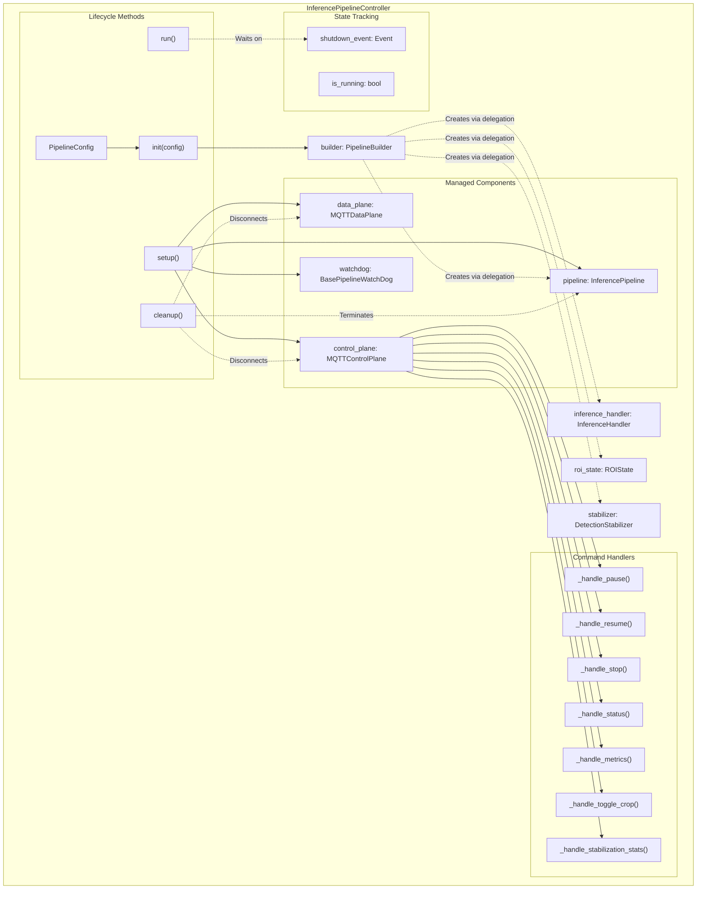
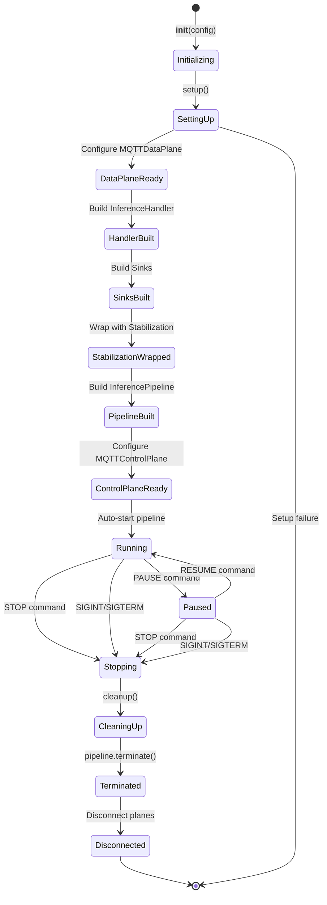
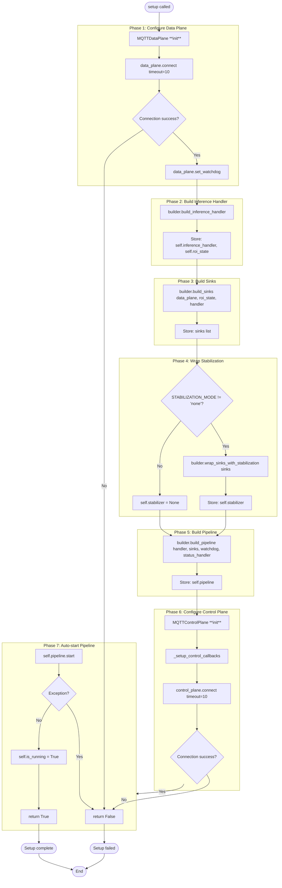
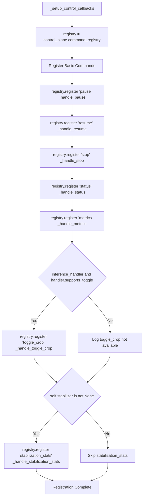
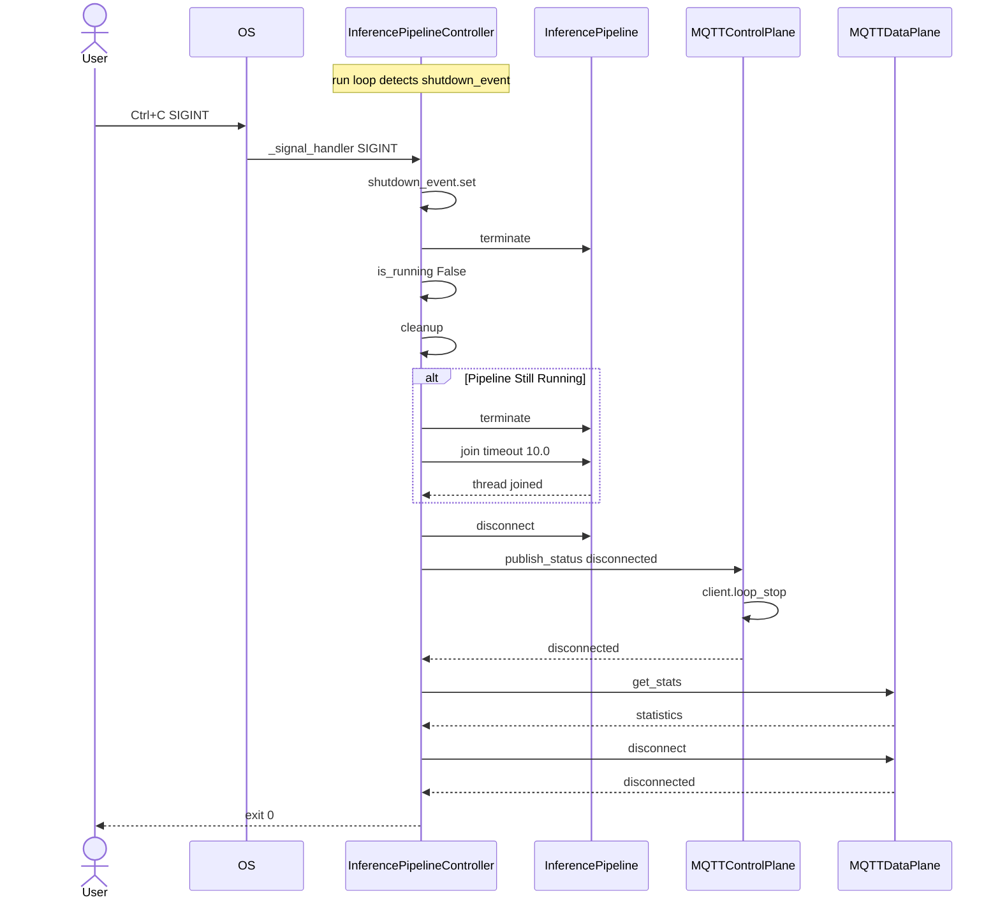
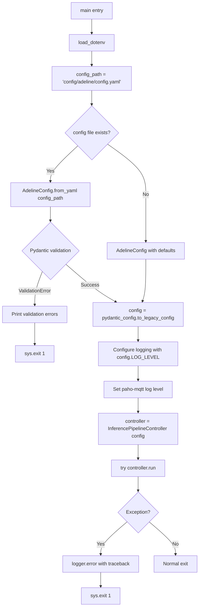
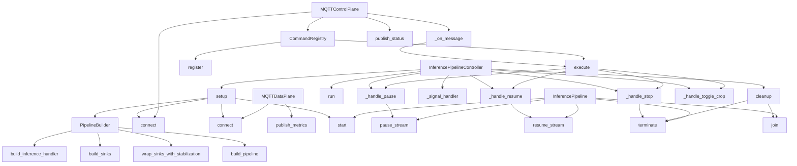

# InferencePipelineController

Relevant source files

- [adeline/CLAUDE.md](https://github.com/acare7/kata-inference-251021-clean4/blob/a0662727/adeline/CLAUDE.md)
- [adeline/app/controller.py](https://github.com/acare7/kata-inference-251021-clean4/blob/a0662727/adeline/app/controller.py)
- [adeline/control/plane.py](https://github.com/acare7/kata-inference-251021-clean4/blob/a0662727/adeline/control/plane.py)
- [adeline/control/registry.py](https://github.com/acare7/kata-inference-251021-clean4/blob/a0662727/adeline/control/registry.py)

The `InferencePipelineController` is the main orchestrator for the Adeline inference pipeline system. It manages the complete lifecycle of the video processing pipeline, coordinates MQTT communication planes, and handles graceful startup and shutdown procedures.

**Scope**: This page covers the controller's orchestration responsibilities, setup process, lifecycle management, and signal handling. For details on how components are constructed, see [PipelineBuilder](https://deepwiki.com/acare7/kata-inference-251021-clean4/3.2-pipelinebuilder). For MQTT command handling details, see [Control Plane](https://deepwiki.com/acare7/kata-inference-251021-clean4/4.1-control-plane) and [Data Plane](https://deepwiki.com/acare7/kata-inference-251021-clean4/4.2-data-plane). For inference handler specifics, see [ROI Strategies](https://deepwiki.com/acare7/kata-inference-251021-clean4/5.1-roi-strategies).

## Core Responsibilities

The `InferencePipelineController` class implements the following responsibilities:

|Responsibility|Description|
|---|---|
|**Orchestration**|Coordinates setup of Control Plane, Data Plane, and InferencePipeline components|
|**Lifecycle Management**|Handles start, stop, pause, resume operations via MQTT commands|
|**Delegation**|Delegates component construction to `PipelineBuilder`, maintaining separation of concerns|
|**Signal Handling**|Intercepts SIGINT (Ctrl+C) and SIGTERM for graceful shutdown|
|**Resource Cleanup**|Ensures proper disconnection and resource release on termination|
|**Command Registration**|Conditionally registers MQTT commands based on system capabilities|

**Design Philosophy**: The controller follows the Single Responsibility Principle by orchestrating component interactions without knowing construction details. It delegates all component building to `PipelineBuilder` [adeline/app/controller.py75](https://github.com/acare7/kata-inference-251021-clean4/blob/a0662727/adeline/app/controller.py#L75-L75)

Sources: [adeline/app/controller.py58-71](https://github.com/acare7/kata-inference-251021-clean4/blob/a0662727/adeline/app/controller.py#L58-L71) [adeline/CLAUDE.md65-88](https://github.com/acare7/kata-inference-251021-clean4/blob/a0662727/adeline/CLAUDE.md#L65-L88)

## Controller Architecture




**Separation of Concerns**: The controller owns lifecycle and orchestration. `PipelineBuilder` owns construction logic. Factories own instantiation details. This layered architecture prevents the controller from becoming a "God class" with too many responsibilities.

Sources: [adeline/app/controller.py58-91](https://github.com/acare7/kata-inference-251021-clean4/blob/a0662727/adeline/app/controller.py#L58-L91) [adeline/CLAUDE.md67-88](https://github.com/acare7/kata-inference-251021-clean4/blob/a0662727/adeline/CLAUDE.md#L67-L88)

## Lifecycle State Management




**Lifecycle Flow**: The controller progresses through distinct phases. Setup is sequential and fails fast if any step fails. Once running, the pipeline can transition between running and paused states via MQTT commands. Termination can be triggered by STOP command or OS signals, both leading to the same cleanup path.

Sources: [adeline/app/controller.py92-194](https://github.com/acare7/kata-inference-251021-clean4/blob/a0662727/adeline/app/controller.py#L92-L194) [adeline/app/controller.py345-396](https://github.com/acare7/kata-inference-251021-clean4/blob/a0662727/adeline/app/controller.py#L345-L396)

## Setup Process

The `setup()` method [adeline/app/controller.py92-194](https://github.com/acare7/kata-inference-251021-clean4/blob/a0662727/adeline/app/controller.py#L92-L194) orchestrates initialization in seven sequential phases

### Setup Phase Breakdown





**Fail-Fast Design**: Each phase checks for errors before proceeding. MQTT connections have 10-second timeouts [adeline/app/controller.py120-176](https://github.com/acare7/kata-inference-251021-clean4/blob/a0662727/adeline/app/controller.py#L120-L176) If any phase fails, the method returns `False` immediately, preventing partial initialization.

**Order Dependencies**:

- Data Plane must be ready before building sinks (sinks need MQTT publisher)
- Handler must exist before building sinks (ROI update sink needs handler reference)
- Sinks must be built before stabilization wrapping (stabilizer wraps first sink)
- Control Plane is configured last (after all components exist for command handling)

Sources: [adeline/app/controller.py92-194](https://github.com/acare7/kata-inference-251021-clean4/blob/a0662727/adeline/app/controller.py#L92-L194)

## Command Registration System

The controller uses `CommandRegistry` for explicit, type-safe command registration. Commands are registered conditionally based on system capabilities:

### Command Registration Logic





**Conditional Registration**: Commands are only registered if the system supports them. This prevents runtime errors when users send commands that the current configuration doesn't support.

|Command|Always Available?|Condition|
|---|---|---|
|`pause`|✓ Yes|-|
|`resume`|✓ Yes|-|
|`stop`|✓ Yes|-|
|`status`|✓ Yes|-|
|`metrics`|✓ Yes|-|
|`toggle_crop`|✗ Conditional|`handler.supports_toggle == True`|
|`stabilization_stats`|✗ Conditional|`STABILIZATION_MODE != 'none'`|

Sources: [adeline/app/controller.py196-219](https://github.com/acare7/kata-inference-251021-clean4/blob/a0662727/adeline/app/controller.py#L196-L219) [adeline/control/registry.py28-142](https://github.com/acare7/kata-inference-251021-clean4/blob/a0662727/adeline/control/registry.py#L28-L142)

### Command Handler Implementation

Each command handler follows a consistent pattern:

**PAUSE Handler** [adeline/app/controller.py246-257](https://github.com/acare7/kata-inference-251021-clean4/blob/a0662727/adeline/app/controller.py#L246-L257):

```
# Checks is_running flag
# Calls pipeline.pause_stream()
# Publishes status via control_plane
```

**RESUME Handler** [adeline/app/controller.py259-270](https://github.com/acare7/kata-inference-251021-clean4/blob/a0662727/adeline/app/controller.py#L259-L270):

```
# Checks is_running flag
# Calls pipeline.resume_stream()
# Publishes status via control_plane
```

**STOP Handler** [adeline/app/controller.py228-244](https://github.com/acare7/kata-inference-251021-clean4/blob/a0662727/adeline/app/controller.py#L228-L244):

```
# Calls pipeline.terminate()
# Sets is_running = False
# Publishes status
# Sets shutdown_event to trigger cleanup
```

**STATUS Handler** [adeline/app/controller.py272-276](https://github.com/acare7/kata-inference-251021-clean4/blob/a0662727/adeline/app/controller.py#L272-L276):

```
# Returns current is_running state
# Publishes via control_plane
```

**METRICS Handler** [adeline/app/controller.py278-284](https://github.com/acare7/kata-inference-251021-clean4/blob/a0662727/adeline/app/controller.py#L278-L284):

```
# Delegates to data_plane.publish_metrics()
# Publishes watchdog metrics via MQTT
```

**TOGGLE_CROP Handler** [adeline/app/controller.py286-307](https://github.com/acare7/kata-inference-251021-clean4/blob/a0662727/adeline/app/controller.py#L286-L307):

```
# Validates handler.supports_toggle
# Calls handler.disable() or handler.enable()
# Uses handler's built-in toggle logic
```

**STABILIZATION_STATS Handler** [adeline/app/controller.py308-343](https://github.com/acare7/kata-inference-251021-clean4/blob/a0662727/adeline/app/controller.py#L308-L343):

```
# Validates STABILIZATION_MODE != 'none'
# Calls stabilizer.get_stats(source_id=0)
# Logs statistics breakdown
```

Sources: [adeline/app/controller.py228-343](https://github.com/acare7/kata-inference-251021-clean4/blob/a0662727/adeline/app/controller.py#L228-L343)

## Signal Handling and Graceful Shutdown

The controller implements proper signal handling for graceful termination:




**Signal Handler** [adeline/app/controller.py385-396](https://github.com/acare7/kata-inference-251021-clean4/blob/a0662727/adeline/app/controller.py#L385-L396):

- Registered for SIGINT (Ctrl+C) and SIGTERM
- Sets `shutdown_event` to break `run()` loop
- Immediately terminates pipeline
- Sets `is_running = False`

**Run Loop** [adeline/app/controller.py345-383](https://github.com/acare7/kata-inference-251021-clean4/blob/a0662727/adeline/app/controller.py#L345-L383):

- Calls `setup()` and validates success
- Logs available commands and configuration
- Waits on `shutdown_event` with 1-second timeout (allows interrupt checking)
- Catches `KeyboardInterrupt` as fallback
- Calls `cleanup()` on exit

**Cleanup Process** [adeline/app/controller.py398-443](https://github.com/acare7/kata-inference-251021-clean4/blob/a0662727/adeline/app/controller.py#L398-L443):

1. Terminates pipeline if still running
2. Waits for pipeline threads with 10-second timeout (increased from 3s)
3. Disconnects Control Plane (publishes "disconnected" status)
4. Gets Data Plane stats and logs them
5. Disconnects Data Plane
6. Returns normally (no `os._exit()` to allow Python cleanup)

**Improved Reliability**: The cleanup timeout was increased from 3 seconds to 10 seconds [adeline/app/controller.py418](https://github.com/acare7/kata-inference-251021-clean4/blob/a0662727/adeline/app/controller.py#L418-L418) to handle slow network disconnections. Error handling wraps each disconnect operation to ensure partial cleanup on failures.

Sources: [adeline/app/controller.py345-443](https://github.com/acare7/kata-inference-251021-clean4/blob/a0662727/adeline/app/controller.py#L345-L443) [adeline/CLAUDE.md65-88](https://github.com/acare7/kata-inference-251021-clean4/blob/a0662727/adeline/CLAUDE.md#L65-L88)

## Main Entry Point

The `main()` function [adeline/app/controller.py449-500](https://github.com/acare7/kata-inference-251021-clean4/blob/a0662727/adeline/app/controller.py#L449-L500) provides the application entry point:

### Configuration Loading Flow




**Fail-Fast Validation**: Configuration is validated at load time using Pydantic. Invalid configurations print clear error messages showing which fields failed validation and why [adeline/app/controller.py467-474](https://github.com/acare7/kata-inference-251021-clean4/blob/a0662727/adeline/app/controller.py#L467-L474) This prevents runtime errors from misconfiguration.

**Environment Variables**: The `load_dotenv()` call [adeline/app/controller.py19](https://github.com/acare7/kata-inference-251021-clean4/blob/a0662727/adeline/app/controller.py#L19-L19) loads sensitive values (MQTT credentials) from `.env` file before configuration parsing.

**Logging Configuration**: Log levels are set from configuration [adeline/app/controller.py480-483](https://github.com/acare7/kata-inference-251021-clean4/blob/a0662727/adeline/app/controller.py#L480-L483) including reduced verbosity for the `paho-mqtt` library [adeline/app/controller.py490](https://github.com/acare7/kata-inference-251021-clean4/blob/a0662727/adeline/app/controller.py#L490-L490)

Sources: [adeline/app/controller.py449-503](https://github.com/acare7/kata-inference-251021-clean4/blob/a0662727/adeline/app/controller.py#L449-L503) [adeline/config/schemas.py1-250](https://github.com/acare7/kata-inference-251021-clean4/blob/a0662727/adeline/config/schemas.py#L1-L250)

## Component Interaction Map

This diagram bridges natural language concepts to code entities by showing exact class and method names:





**Code Navigation**: This diagram shows the exact method calls between components. To trace command execution: `MQTTControlPlane._on_message()` → `CommandRegistry.execute()` → `InferencePipelineController._handle_*()` methods → `InferencePipeline.pause_stream()` / `resume_stream()` / `terminate()`.

Sources: [adeline/app/controller.py58-503](https://github.com/acare7/kata-inference-251021-clean4/blob/a0662727/adeline/app/controller.py#L58-L503) [adeline/app/builder.py1-200](https://github.com/acare7/kata-inference-251021-clean4/blob/a0662727/adeline/app/builder.py#L1-L200) [adeline/control/plane.py26-172](https://github.com/acare7/kata-inference-251021-clean4/blob/a0662727/adeline/control/plane.py#L26-L172) [adeline/control/registry.py28-142](https://github.com/acare7/kata-inference-251021-clean4/blob/a0662727/adeline/control/registry.py#L28-L142)

## Key Design Patterns

The controller implements several design patterns:

|Pattern|Implementation|Benefit|
|---|---|---|
|**Builder**|Delegates construction to `PipelineBuilder`|Separates construction complexity from orchestration|
|**Registry**|Uses `CommandRegistry` for command handling|Explicit command registration, no optional callbacks|
|**Observer**|`_status_update_handler` for pipeline events|Decouples status monitoring from main logic|
|**Event-Driven**|`shutdown_event` for coordination|Clean thread synchronization without polling|
|**Fail-Fast**|Validation in `setup()` and `main()`|Errors detected early, not during runtime|

**Single Responsibility**: The controller orchestrates but doesn't construct. It manages lifecycle but doesn't know implementation details. This follows the "Complexity by design, not by accident" philosophy [adeline/CLAUDE.md59](https://github.com/acare7/kata-inference-251021-clean4/blob/a0662727/adeline/CLAUDE.md#L59-L59) by using architectural boundaries to manage complexity.

Sources: [adeline/app/controller.py58-503](https://github.com/acare7/kata-inference-251021-clean4/blob/a0662727/adeline/app/controller.py#L58-L503) [adeline/CLAUDE.md56-150](https://github.com/acare7/kata-inference-251021-clean4/blob/a0662727/adeline/CLAUDE.md#L56-L150)

## Configuration Dependencies

The controller requires these configuration values from `PipelineConfig`:

**MQTT Settings**:

- `MQTT_BROKER`, `MQTT_PORT` - Broker connection details
- `MQTT_USERNAME`, `MQTT_PASSWORD` - Authentication credentials
- `CONTROL_COMMAND_TOPIC`, `CONTROL_STATUS_TOPIC` - Control Plane topics
- `DATA_TOPIC`, `METRICS_TOPIC` - Data Plane topics
- `DATA_QOS` - Quality of service level for data publishing

**Pipeline Settings**:

- `ROI_MODE` - Determines if `toggle_crop` command is available
- `STABILIZATION_MODE` - Determines if `stabilization_stats` command is available

**Logging Settings**:

- `LOG_LEVEL` - Application log level
- `LOG_FORMAT` - Log message format
- `PAHO_LOG_LEVEL` - MQTT library log level

For complete configuration schema details, see [Configuration System](https://deepwiki.com/acare7/kata-inference-251021-clean4/6-configuration-system) and [Configuration Schema Reference](https://deepwiki.com/acare7/kata-inference-251021-clean4/6.1-configuration-schema-reference).

Sources: [adeline/app/controller.py73-91](https://github.com/acare7/kata-inference-251021-clean4/blob/a0662727/adeline/app/controller.py#L73-L91) [adeline/config/schemas.py1-250](https://github.com/acare7/kata-inference-251021-clean4/blob/a0662727/adeline/config/schemas.py#L1-L250)