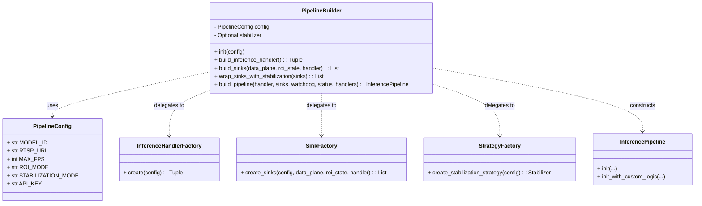
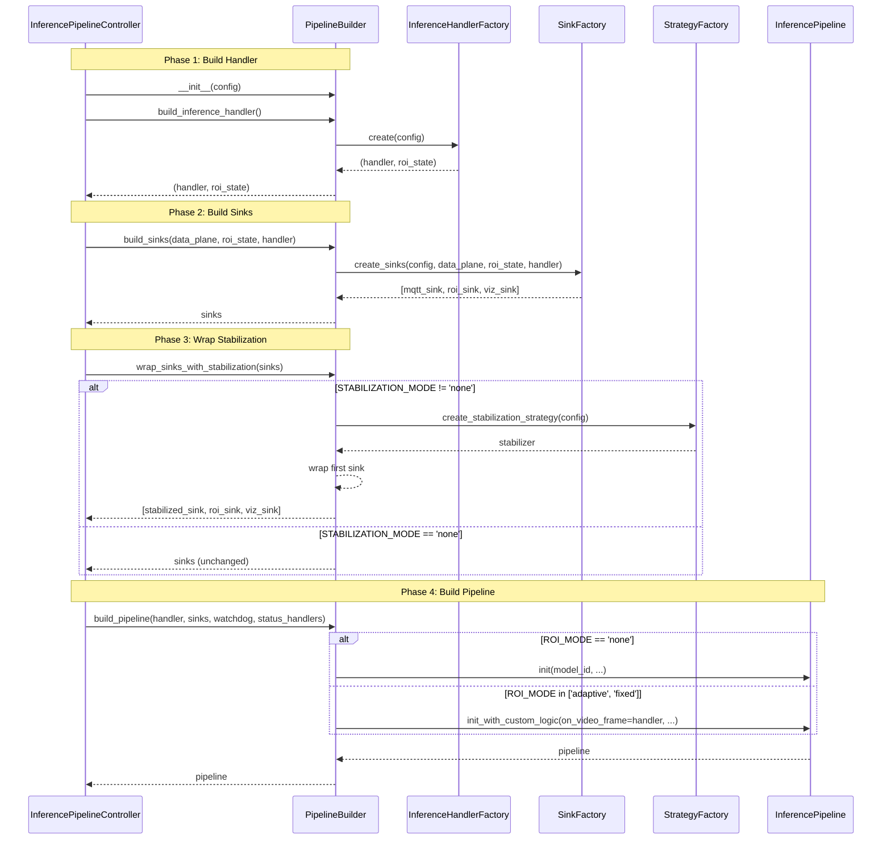
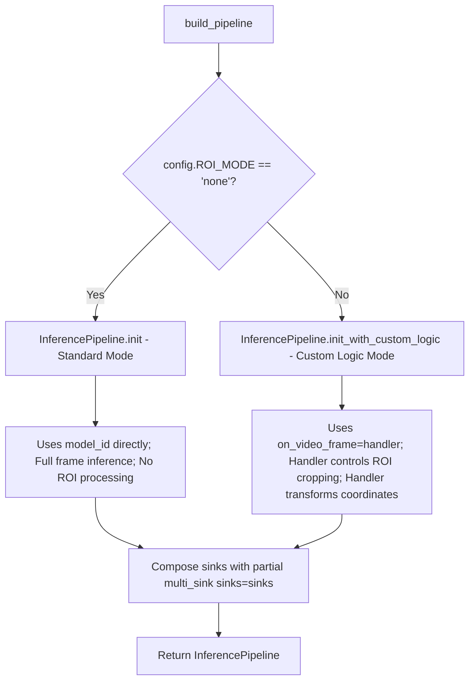
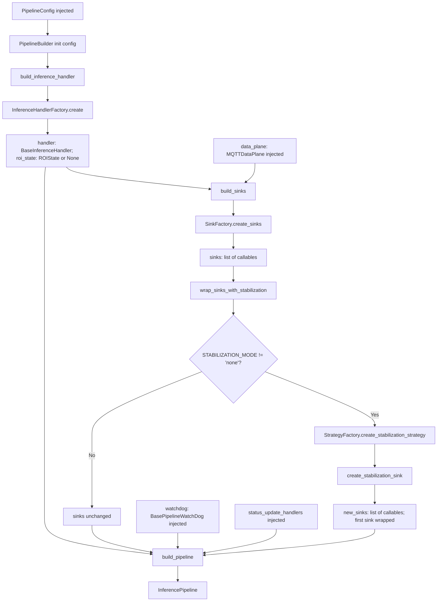
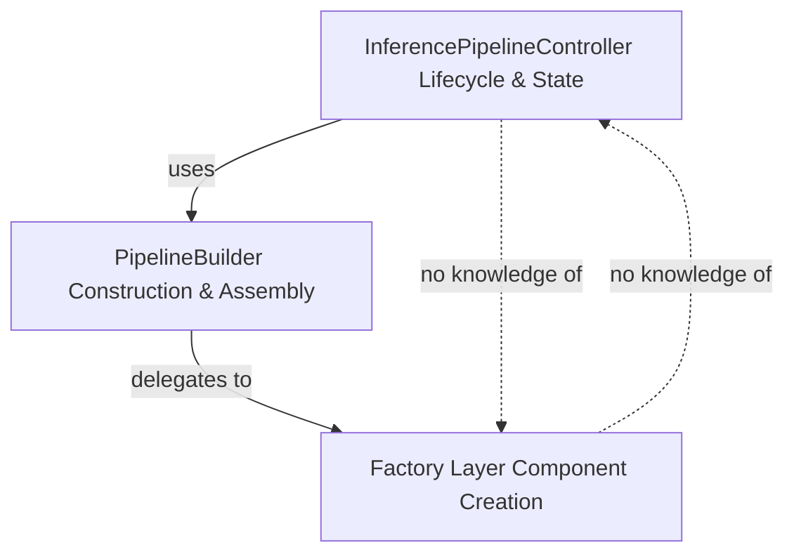

# PipelineBuilder

Relevant source files

- [adeline/CLAUDE.md](https://github.com/acare7/kata-inference-251021-clean4/blob/a0662727/adeline/CLAUDE.md)
- [adeline/app/builder.py](https://github.com/acare7/kata-inference-251021-clean4/blob/a0662727/adeline/app/builder.py)

## Purpose and Scope

The `PipelineBuilder` class implements the Builder pattern to construct and assemble all components required for the inference pipeline. It orchestrates the creation of handlers, sinks, and the `InferencePipeline` itself by delegating to specialized factories. This page describes the construction process, dependency injection flow, and how the builder maintains separation of concerns.

For information about the controller that uses this builder, see [InferencePipelineController](https://deepwiki.com/acare7/kata-inference-251021-clean4/3.1-inferencepipelinecontroller). For details on the factories that PipelineBuilder delegates to, see [Factory Pattern System](https://deepwiki.com/acare7/kata-inference-251021-clean4/3.3-factory-pattern-system).

**Sources:** [adeline/app/builder.py1-18](https://github.com/acare7/kata-inference-251021-clean4/blob/a0662727/adeline/app/builder.py#L1-L18) [adeline/CLAUDE.md68-88](https://github.com/acare7/kata-inference-251021-clean4/blob/a0662727/adeline/CLAUDE.md#L68-L88)

---

## Overview

The `PipelineBuilder` centralizes all component construction logic that was previously scattered across the controller. Its responsibilities are:

- Orchestrate factory calls to create components
- Build inference handlers via `InferenceHandlerFactory`
- Build sinks via `SinkFactory`
- Conditionally wrap sinks with stabilization via `StrategyFactory`
- Assemble the final `InferencePipeline` (standard or custom logic mode)

The builder does **not** manage lifecycle, state, or control flow — those remain the responsibility of `InferencePipelineController`. This separation follows the principle: "Builder orchestrates, Factories construct, Controller manages."

**Sources:** [adeline/app/builder.py1-18](https://github.com/acare7/kata-inference-251021-clean4/blob/a0662727/adeline/app/builder.py#L1-L18) [adeline/CLAUDE.md56-88](https://github.com/acare7/kata-inference-251021-clean4/blob/a0662727/adeline/CLAUDE.md#L56-L88)

---

## Class Structure




**PipelineBuilder Method Responsibilities**

|Method|Purpose|Factory Used|Returns|
|---|---|---|---|
|`build_inference_handler()`|Create handler for ROI processing|`InferenceHandlerFactory`|`(handler, roi_state)`|
|`build_sinks()`|Create output sinks (MQTT, viz, ROI update)|`SinkFactory`|`List[Callable]`|
|`wrap_sinks_with_stabilization()`|Wrap first sink with stabilizer (if enabled)|`StrategyFactory`|`List[Callable]` (new)|
|`build_pipeline()`|Assemble final pipeline|None (direct construction)|`InferencePipeline`|

**Sources:** [adeline/app/builder.py41-69](https://github.com/acare7/kata-inference-251021-clean4/blob/a0662727/adeline/app/builder.py#L41-L69) [adeline/app/builder.py71-208](https://github.com/acare7/kata-inference-251021-clean4/blob/a0662727/adeline/app/builder.py#L71-L208)

---

## Four-Phase Construction Process

The `PipelineBuilder` executes a four-phase construction process, typically orchestrated by `InferencePipelineController.setup()`:




**Sources:** [adeline/app/builder.py41-208](https://github.com/acare7/kata-inference-251021-clean4/blob/a0662727/adeline/app/builder.py#L41-L208)

---

## Phase 1: Build Inference Handler

The `build_inference_handler()` method delegates to `InferenceHandlerFactory` to create the appropriate handler based on `config.ROI_MODE`.

```
# From app/builder.py:71-83
def build_inference_handler(self) -> Tuple[BaseInferenceHandler, Optional[Any]]:
    """
    Construye inference handler según configuración.
    
    Returns:
        (handler, roi_state)
            - handler: BaseInferenceHandler
            - roi_state: ROIState | FixedROIState | None
    """
    logger.info("🔧 Building inference handler...")
    return InferenceHandlerFactory.create(self.config)
```

**Handler Selection Logic**

|`config.ROI_MODE`|Handler Type|State Type|Factory Method|
|---|---|---|---|
|`'none'`|`StandardInferenceHandler`|`None`|`InferenceHandlerFactory.create()`|
|`'adaptive'`|`AdaptiveInferenceHandler`|`ROIState`|`InferenceHandlerFactory.create()`|
|`'fixed'`|`FixedROIInferenceHandler`|`FixedROIState`|`InferenceHandlerFactory.create()`|

The returned `roi_state` is later passed to `build_sinks()` to enable ROI update sinks when applicable.

**Sources:** [adeline/app/builder.py71-83](https://github.com/acare7/kata-inference-251021-clean4/blob/a0662727/adeline/app/builder.py#L71-L83) [adeline/CLAUDE.md105-113](https://github.com/acare7/kata-inference-251021-clean4/blob/a0662727/adeline/CLAUDE.md#L105-L113)

---

## Phase 2: Build Sinks

The `build_sinks()` method delegates to `SinkFactory` to create a priority-ordered list of output sinks.

```
# From app/builder.py:85-110
def build_sinks(
    self,
    data_plane: Any,  # MQTTDataPlane
    roi_state: Optional[Any] = None,
    inference_handler: Optional[BaseInferenceHandler] = None,
) -> List[Callable]:
    """
    Construye sinks según configuración.
    
    Args:
        data_plane: MQTTDataPlane
        roi_state: ROIState | FixedROIState | None
        inference_handler: BaseInferenceHandler | None
    
    Returns:
        Lista de sinks para multi_sink()
    """
    logger.info("🔧 Building sinks...")
    return SinkFactory.create_sinks(
        config=self.config,
        data_plane=data_plane,
        roi_state=roi_state,
        inference_handler=inference_handler,
    )
```

**Sink Priority Order**

The `SinkFactory` uses a registry pattern with explicit priorities (see [SinkFactory](https://deepwiki.com/acare7/kata-inference-251021-clean4/3.3.2-sinkfactory)):

|Priority|Sink Type|Condition|Purpose|
|---|---|---|---|
|1|MQTT Sink|Always|Publish detections to MQTT broker|
|50|ROI Update Sink|`roi_state is not None`|Update adaptive ROI state|
|100|Visualization Sink|`config.ENABLE_DISPLAY`|OpenCV display window|

The returned list is ordered by priority (lowest first), which is important because stabilization wrapping (Phase 3) assumes the MQTT sink is first.

**Sources:** [adeline/app/builder.py85-110](https://github.com/acare7/kata-inference-251021-clean4/blob/a0662727/adeline/app/builder.py#L85-L110)

---

## Phase 3: Wrap Stabilization

The `wrap_sinks_with_stabilization()` method conditionally wraps the first sink (MQTT) with a stabilization decorator.

```
# From app/builder.py:112-151
def wrap_sinks_with_stabilization(self, sinks: List[Callable]) -> List[Callable]:
    """
    Wrappea primer sink (MQTT) con stabilization si está habilitado.
    
    Args:
        sinks: Lista de sinks (NO se modifica)
    
    Returns:
        NUEVA lista con primer sink wrappeado
    
    Side effects:
        - Setea self.stabilizer si stabilization habilitado
    
    Note:
        Functional purity: No modifica input, retorna nuevo array.
    """
    if self.config.STABILIZATION_MODE == 'none':
        logger.info("🔲 Stabilization wrapper: SKIPPED (mode=none)")
        self.stabilizer = None
        return sinks
    
    logger.info("🔧 Wrapping sink with stabilization...")
    
    from ..inference.stabilization import create_stabilization_sink
    
    # Crear stabilizer usando factory
    self.stabilizer = StrategyFactory.create_stabilization_strategy(self.config)
    
    # Wrappear primer sink (MQTT sink)
    mqtt_sink = sinks[0]
    stabilized_sink = create_stabilization_sink(
        stabilizer=self.stabilizer,
        downstream_sink=mqtt_sink,
    )
    
    # NUEVO array con wrapped sink (immutable operation)
    new_sinks = [stabilized_sink] + sinks[1:]
    
    logger.info(f"✅ Stabilization wrapper: {self.config.STABILIZATION_MODE.upper()}")
    return new_sinks
```

**Key Design Decisions**

1. **Immutability**: The method returns a **new list** rather than modifying the input. This follows functional programming principles and prevents side effects: `new_sinks = [stabilized_sink] + sinks[1:]`
    
2. **First Sink Assumption**: Only the MQTT sink (priority 1, index 0) gets wrapped. ROI update and visualization sinks receive raw detections.
    
3. **Factory Delegation**: The stabilizer itself is created by `StrategyFactory.create_stabilization_strategy()`, which selects between `NoOpStabilizer` and `TemporalHysteresisStabilizer` based on `config.STABILIZATION_MODE`.
    
4. **State Preservation**: The created `stabilizer` is stored in `self.stabilizer` for later access (e.g., for the `stabilization_stats` MQTT command).
    

**Sources:** [adeline/app/builder.py112-151](https://github.com/acare7/kata-inference-251021-clean4/blob/a0662727/adeline/app/builder.py#L112-L151)

---

## Phase 4: Build Pipeline

The `build_pipeline()` method assembles the final `InferencePipeline`, selecting between **standard mode** (model ID-based) or **custom logic mode** (handler-based).

```
# From app/builder.py:153-208
def build_pipeline(
    self,
    inference_handler: BaseInferenceHandler,
    sinks: List[Callable],
    watchdog: BasePipelineWatchDog,
    status_update_handlers: List[Callable],
) -> InferencePipeline:
    """
    Construye InferencePipeline (standard o custom logic).
    """
    logger.info("🔧 Building InferencePipeline...")
    
    # Composición de sinks
    on_prediction = partial(multi_sink, sinks=sinks)
    
    # Standard vs Custom Logic
    if self.config.ROI_MODE == 'none':
        # Standard pipeline (model_id based)
        pipeline = InferencePipeline.init(
            max_fps=self.config.MAX_FPS,
            model_id=self.config.MODEL_ID,
            video_reference=self.config.RTSP_URL,
            on_prediction=on_prediction,
            api_key=self.config.API_KEY,
            watchdog=watchdog,
            status_update_handlers=status_update_handlers,
        )
    else:
        # Custom logic pipeline (ROI based)
        pipeline = InferencePipeline.init_with_custom_logic(
            video_reference=self.config.RTSP_URL,
            on_video_frame=inference_handler,
            on_prediction=on_prediction,
            max_fps=self.config.MAX_FPS,
            watchdog=watchdog,
            status_update_handlers=status_update_handlers,
        )
    
    logger.info("✅ Pipeline created successfully")
    return pipeline
```

**Pipeline Mode Selection**





**Comparison**

|Aspect|Standard Mode (`ROI_MODE='none'`)|Custom Logic Mode (`ROI_MODE='adaptive'` or `'fixed'`)|
|---|---|---|
|Constructor|`InferencePipeline.init()`|`InferencePipeline.init_with_custom_logic()`|
|Inference Control|Uses `model_id` parameter|Uses `on_video_frame=handler` parameter|
|Frame Processing|Full frame → YOLO model|Handler crops → YOLO model → Handler transforms|
|ROI Support|No|Yes|
|Use Case|Simple full-frame detection|Adaptive/fixed ROI optimization|

**Sink Composition**

Both modes use `functools.partial()` to compose the multi-sink:

```
on_prediction = partial(multi_sink, sinks=sinks)
```

This creates a callable that will invoke all sinks in order when predictions are ready. The `multi_sink` function is provided by the inference library.

**Sources:** [adeline/app/builder.py153-208](https://github.com/acare7/kata-inference-251021-clean4/blob/a0662727/adeline/app/builder.py#L153-L208) [adeline/CLAUDE.md105-113](https://github.com/acare7/kata-inference-251021-clean4/blob/a0662727/adeline/CLAUDE.md#L105-L113)

---

## Dependency Injection Flow

The following diagram shows how dependencies flow through the builder to create the final pipeline:




**Injected Dependencies**

The builder receives dependencies from `InferencePipelineController` at different phases:

|Phase|Injected Dependency|Source|Purpose|
|---|---|---|---|
|Constructor|`PipelineConfig`|Controller init|Configuration for all phases|
|Phase 2|`MQTTDataPlane`|Controller setup|MQTT publishing capability|
|Phase 2|`ROIState`|Phase 1 output|ROI update sink creation|
|Phase 2|`BaseInferenceHandler`|Phase 1 output|Handler capability checks|
|Phase 4|`BasePipelineWatchDog`|Controller setup|Metrics collection|
|Phase 4|`List[Callable]` (status handlers)|Controller setup|Status callbacks|

**Sources:** [adeline/app/builder.py41-208](https://github.com/acare7/kata-inference-251021-clean4/blob/a0662727/adeline/app/builder.py#L41-L208)

---

## Lazy Loading Pattern

The builder uses the `InferenceLoader` pattern to ensure inference modules are loaded correctly:

```
# From app/builder.py:23-27
from ..inference.loader import InferenceLoader

inference_module = InferenceLoader.get_inference()
InferencePipeline = inference_module.InferencePipeline
```

**Why Lazy Loading?**

The `InferenceLoader.get_inference()` method ensures `disable_models_from_config()` runs **before** importing inference modules. This prevents unnecessary model downloads when not needed (e.g., during testing or when inference is disabled).

This pattern is enforced by design:

1. All code must import `InferencePipeline` through `InferenceLoader`, not directly
2. The loader handles the disable logic internally
3. Import order is guaranteed by the loader's implementation

For more details, see [Lazy Loading and Model Management](https://deepwiki.com/acare7/kata-inference-251021-clean4/8.2-lazy-loading-and-model-management).

**Sources:** [adeline/app/builder.py23-27](https://github.com/acare7/kata-inference-251021-clean4/blob/a0662727/adeline/app/builder.py#L23-L27) [adeline/CLAUDE.md137-142](https://github.com/acare7/kata-inference-251021-clean4/blob/a0662727/adeline/CLAUDE.md#L137-L142)

---

## Design Principles

### Separation of Concerns

The builder enforces clear boundaries:

- **Controller**: Lifecycle management (start/stop/pause/resume), state transitions
- **Builder**: Component construction, assembly, dependency orchestration
- **Factories**: Component creation logic, configuration interpretation

This separation means:

- Controller code has **zero knowledge** of construction details (model IDs, handler types, etc.)
- Builder code has **zero knowledge** of lifecycle state (running/paused/stopped)
- Factories have **zero knowledge** of how components are assembled



**Sources:** [adeline/CLAUDE.md56-88](https://github.com/acare7/kata-inference-251021-clean4/blob/a0662727/adeline/CLAUDE.md#L56-L88) [adeline/app/builder.py1-18](https://github.com/acare7/kata-inference-251021-clean4/blob/a0662727/adeline/app/builder.py#L1-L18)

### Immutable Operations

The `wrap_sinks_with_stabilization()` method demonstrates functional purity:

```
# Does NOT modify input
def wrap_sinks_with_stabilization(self, sinks: List[Callable]) -> List[Callable]:
    # ...
    new_sinks = [stabilized_sink] + sinks[1:]  # NEW list
    return new_sinks  # Input unchanged
```

This prevents subtle bugs where modifying a list has unintended side effects on other parts of the system.

**Sources:** [adeline/app/builder.py112-151](https://github.com/acare7/kata-inference-251021-clean4/blob/a0662727/adeline/app/builder.py#L112-L151)

### Factory Delegation

Every component creation is delegated to a specialized factory:

|Component|Factory|Method|
|---|---|---|
|Inference Handler|`InferenceHandlerFactory`|`create(config)`|
|Sinks|`SinkFactory`|`create_sinks(...)`|
|Stabilizer|`StrategyFactory`|`create_stabilization_strategy(config)`|

The builder **never** directly instantiates components. This ensures:

- Construction logic is centralized in factories
- Adding new component types only requires factory changes
- Builder logic remains stable across feature additions

**Sources:** [adeline/app/builder.py71-151](https://github.com/acare7/kata-inference-251021-clean4/blob/a0662727/adeline/app/builder.py#L71-L151)

---

## Usage Example

Typical usage from `InferencePipelineController.setup()`:

```
# 1. Create builder
builder = PipelineBuilder(self.config)

# 2. Build handler (Phase 1)
handler, roi_state = builder.build_inference_handler()

# 3. Build sinks (Phase 2)
sinks = builder.build_sinks(
    data_plane=self.data_plane,
    roi_state=roi_state,
    inference_handler=handler
)

# 4. Wrap stabilization (Phase 3)
if self.config.STABILIZATION_MODE != 'none':
    sinks = builder.wrap_sinks_with_stabilization(sinks)
    self.stabilizer = builder.stabilizer  # Store for commands

# 5. Build pipeline (Phase 4)
self.pipeline = builder.build_pipeline(
    inference_handler=handler,
    sinks=sinks,
    watchdog=self.watchdog,
    status_update_handlers=self.status_update_handlers
)
```

**Sources:** [adeline/app/builder.py41-61](https://github.com/acare7/kata-inference-251021-clean4/blob/a0662727/adeline/app/builder.py#L41-L61)