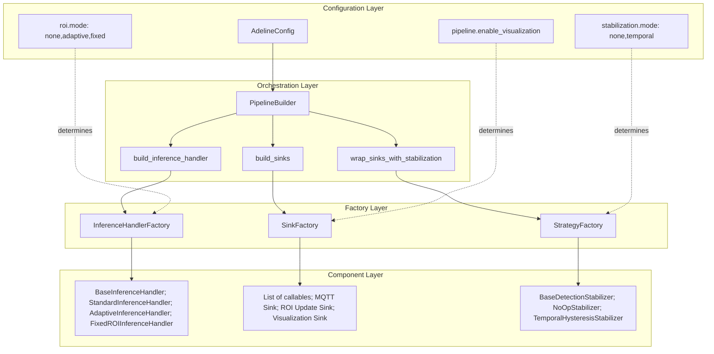
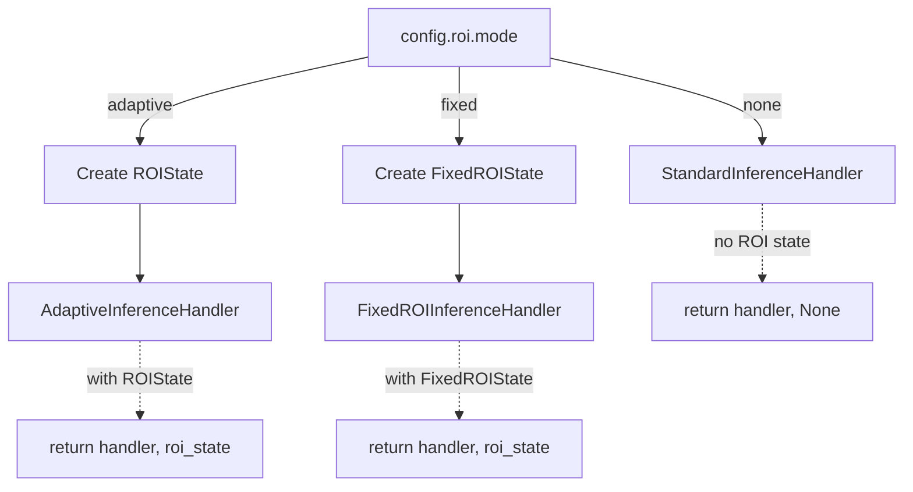
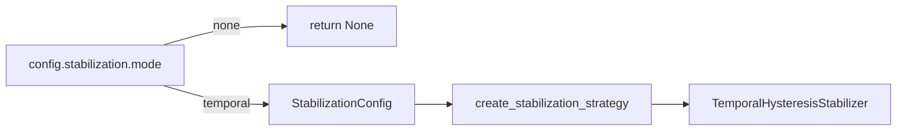
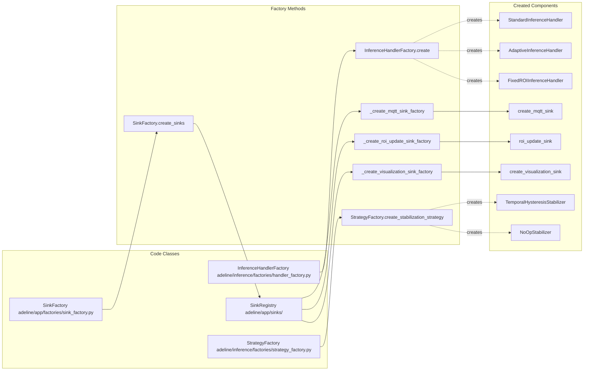
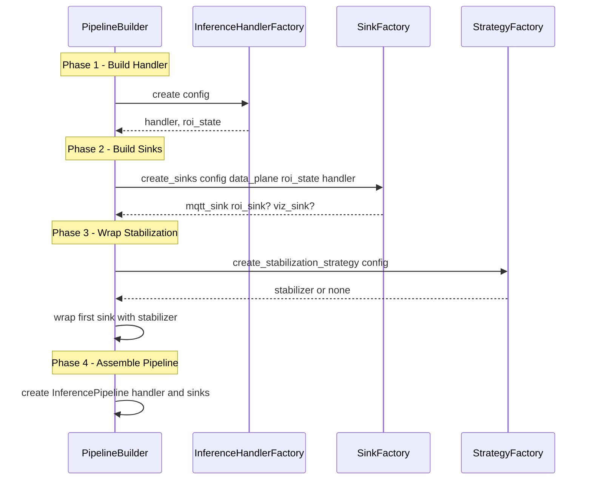
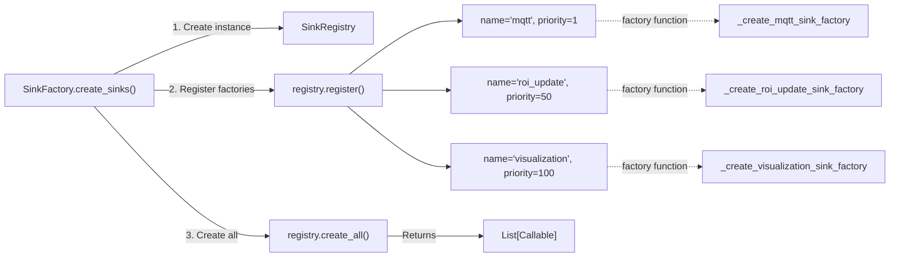

# Factory Pattern System

Relevant source files

- [adeline/app/factories/sink_factory.py](https://github.com/acare7/kata-inference-251021-clean4/blob/a0662727/adeline/app/factories/sink_factory.py)
- [adeline/inference/factories/handler_factory.py](https://github.com/acare7/kata-inference-251021-clean4/blob/a0662727/adeline/inference/factories/handler_factory.py)
- [adeline/inference/factories/strategy_factory.py](https://github.com/acare7/kata-inference-251021-clean4/blob/a0662727/adeline/inference/factories/strategy_factory.py)

## Purpose and Scope

The Factory Pattern System is the component creation layer of the Adeline inference pipeline. This system consists of three specialized factories that construct pipeline components based on configuration:

- **InferenceHandlerFactory** - Creates inference handlers with ROI strategies
- **SinkFactory** - Creates output sinks with priority ordering
- **StrategyFactory** - Creates stabilization strategies

Each factory encapsulates complex construction logic, enabling the `PipelineBuilder` to orchestrate assembly without knowing implementation details. For information about how these factories are invoked during pipeline construction, see [PipelineBuilder](https://deepwiki.com/acare7/kata-inference-251021-clean4/3.2-pipelinebuilder). For details about individual factory implementations, see sections [3.3.1](https://deepwiki.com/acare7/kata-inference-251021-clean4/3.3.1-inferencehandlerfactory), [3.3.2](https://deepwiki.com/acare7/kata-inference-251021-clean4/3.3.2-sinkfactory), and [3.3.3](https://deepwiki.com/acare7/kata-inference-251021-clean4/3.3.3-strategyfactory).

## Factory Architecture Overview

The factory system implements a strict separation between **construction** (what to build) and **orchestration** (when to build). The `PipelineBuilder` orchestrates the construction sequence, while each factory determines which concrete implementation to instantiate based on configuration.




**Sources:** [adeline/inference/factories/handler_factory.py1-153](https://github.com/acare7/kata-inference-251021-clean4/blob/a0662727/adeline/inference/factories/handler_factory.py#L1-L153) [adeline/app/factories/sink_factory.py1-137](https://github.com/acare7/kata-inference-251021-clean4/blob/a0662727/adeline/app/factories/sink_factory.py#L1-L137) [adeline/inference/factories/strategy_factory.py1-77](https://github.com/acare7/kata-inference-251021-clean4/blob/a0662727/adeline/inference/factories/strategy_factory.py#L1-L77)

## Design Principles

The factory system adheres to these architectural principles:

|Principle|Implementation|Benefit|
|---|---|---|
|**Encapsulation**|Each factory contains all construction logic for its domain|`PipelineBuilder` doesn't need to know how components are built|
|**Configuration-Driven**|All decisions based on validated `AdelineConfig`|Type-safe, fail-fast construction|
|**Single Responsibility**|One factory per component type|Clear boundaries, easy to extend|
|**Registry Pattern**|`SinkFactory` uses `SinkRegistry` internally|Decoupled sink registration with explicit priorities|
|**Fail Fast**|Validation occurs at factory creation time|Errors surface immediately, not during runtime|

## The Three Factories

### Factory Responsibilities Matrix

|Factory|Input|Output|Configuration Keys|
|---|---|---|---|
|`InferenceHandlerFactory`|`AdelineConfig`|`(BaseInferenceHandler, Optional[ROIState])`|`roi.mode`, `roi.adaptive.*`, `roi.fixed.*`, `models.*`|
|`SinkFactory`|`AdelineConfig`, `MQTTDataPlane`, `Optional[ROIState]`, `Optional[InferenceHandler]`|`List[Callable]`|`pipeline.enable_visualization`, `pipeline.display_statistics`, `roi.mode`|
|`StrategyFactory`|`AdelineConfig`|`Optional[BaseDetectionStabilizer]`|`stabilization.mode`, `stabilization.temporal.*`, `stabilization.hysteresis.*`, `stabilization.iou.*`|

### InferenceHandlerFactory

Creates the appropriate inference handler based on ROI mode. This factory also creates and manages the `ROIState` object that tracks region of interest across frames.

**Decision Logic:**



**Sources:** [adeline/inference/factories/handler_factory.py32-153](https://github.com/acare7/kata-inference-251021-clean4/blob/a0662727/adeline/inference/factories/handler_factory.py#L32-L153)

### SinkFactory

Creates output sinks with explicit priority ordering. Uses `SinkRegistry` internally to manage sink creation and composition.

**Sink Priority Order:**

|Priority|Sink Name|Factory Function|Condition|
|---|---|---|---|
|1|MQTT|`_create_mqtt_sink_factory`|Always created|
|50|ROI Update|`_create_roi_update_sink_factory`|Only if `config.roi.mode == 'adaptive'`|
|100|Visualization|`_create_visualization_sink_factory`|Only if `config.pipeline.enable_visualization == True`|

Lower priority numbers are created first. Priority 1 (MQTT sink) is wrapped by stabilization, ensuring filtered detections are published.

**Sources:** [adeline/app/factories/sink_factory.py71-137](https://github.com/acare7/kata-inference-251021-clean4/blob/a0662727/adeline/app/factories/sink_factory.py#L71-L137) [adeline/app/factories/sink_factory.py29-69](https://github.com/acare7/kata-inference-251021-clean4/blob/a0662727/adeline/app/factories/sink_factory.py#L29-L69)

### StrategyFactory

Creates stabilization strategies based on the configured mode. Returns `None` if stabilization is disabled.

**Decision Logic:**




**Sources:** [adeline/inference/factories/strategy_factory.py20-77](https://github.com/acare7/kata-inference-251021-clean4/blob/a0662727/adeline/inference/factories/strategy_factory.py#L20-L77)

## Code Entity Mapping

This diagram maps the factory system's natural language concepts to concrete code entities:



**Sources:** [adeline/inference/factories/handler_factory.py32-153](https://github.com/acare7/kata-inference-251021-clean4/blob/a0662727/adeline/inference/factories/handler_factory.py#L32-L153) [adeline/app/factories/sink_factory.py71-137](https://github.com/acare7/kata-inference-251021-clean4/blob/a0662727/adeline/app/factories/sink_factory.py#L71-L137) [adeline/inference/factories/strategy_factory.py36-77](https://github.com/acare7/kata-inference-251021-clean4/blob/a0662727/adeline/inference/factories/strategy_factory.py#L36-L77)

## Configuration-Driven Creation

Each factory receives a validated `AdelineConfig` object and extracts only the configuration parameters it needs. This table shows the configuration-to-factory mapping:

|Configuration Section|Factory|Key Parameters|
|---|---|---|
|`config.roi.mode`|`InferenceHandlerFactory`|Determines which handler class to instantiate|
|`config.roi.adaptive.*`|`InferenceHandlerFactory`|Parameters for `ROIState` construction|
|`config.roi.fixed.*`|`InferenceHandlerFactory`|Parameters for `FixedROIState` construction|
|`config.models.*`|`InferenceHandlerFactory`|Model loading parameters|
|`config.pipeline.enable_visualization`|`SinkFactory`|Determines if visualization sink is created|
|`config.stabilization.mode`|`StrategyFactory`|Determines if stabilization is enabled|
|`config.stabilization.temporal.*`|`StrategyFactory`|Temporal filtering parameters|
|`config.stabilization.hysteresis.*`|`StrategyFactory`|Hysteresis threshold parameters|
|`config.stabilization.iou.*`|`StrategyFactory`|IoU matching parameters|

**Sources:** [adeline/inference/factories/handler_factory.py49-153](https://github.com/acare7/kata-inference-251021-clean4/blob/a0662727/adeline/inference/factories/handler_factory.py#L49-L153) [adeline/app/factories/sink_factory.py84-136](https://github.com/acare7/kata-inference-251021-clean4/blob/a0662727/adeline/app/factories/sink_factory.py#L84-L136) [adeline/inference/factories/strategy_factory.py36-77](https://github.com/acare7/kata-inference-251021-clean4/blob/a0662727/adeline/inference/factories/strategy_factory.py#L36-L77)

## Interaction with PipelineBuilder

The `PipelineBuilder` invokes factories in a specific sequence to assemble the complete pipeline:



**Sources:** [adeline/inference/factories/handler_factory.py49-153](https://github.com/acare7/kata-inference-251021-clean4/blob/a0662727/adeline/inference/factories/handler_factory.py#L49-L153) [adeline/app/factories/sink_factory.py84-136](https://github.com/acare7/kata-inference-251021-clean4/blob/a0662727/adeline/app/factories/sink_factory.py#L84-L136) [adeline/inference/factories/strategy_factory.py36-77](https://github.com/acare7/kata-inference-251021-clean4/blob/a0662727/adeline/inference/factories/strategy_factory.py#L36-L77)

## Factory Implementation Details

### InferenceHandlerFactory Static Method

The factory exposes a single static method `create()` that encapsulates all handler creation logic:

**Method Signature:**

```
@staticmethod
def create(config: Any) -> Tuple[BaseInferenceHandler, Optional[Any]]
```

**Return Values:**

- Tuple containing handler and optional ROI state
- ROI state is `None` for standard mode, `ROIState` for adaptive mode, `FixedROIState` for fixed mode

**Sources:** [adeline/inference/factories/handler_factory.py48-153](https://github.com/acare7/kata-inference-251021-clean4/blob/a0662727/adeline/inference/factories/handler_factory.py#L48-L153)

### SinkFactory Registry Pattern

The `SinkFactory` uses the registry pattern internally to decouple sink creation:



Factory functions return `None` if the sink should not be created, allowing conditional sink creation without complex branching logic.

**Sources:** [adeline/app/factories/sink_factory.py84-136](https://github.com/acare7/kata-inference-251021-clean4/blob/a0662727/adeline/app/factories/sink_factory.py#L84-L136) [adeline/app/factories/sink_factory.py29-69](https://github.com/acare7/kata-inference-251021-clean4/blob/a0662727/adeline/app/factories/sink_factory.py#L29-L69)

### StrategyFactory Configuration Validation

The `StrategyFactory` creates a `StabilizationConfig` object before invoking the stabilization factory function. This ensures all parameters are validated before construction begins:

**Configuration Object Creation:**

```
stab_config = StabilizationConfig(
    mode=config.STABILIZATION_MODE,
    temporal_min_frames=config.STABILIZATION_MIN_FRAMES,
    temporal_max_gap=config.STABILIZATION_MAX_GAP,
    hysteresis_appear_conf=config.STABILIZATION_APPEAR_CONF,
    hysteresis_persist_conf=config.STABILIZATION_PERSIST_CONF,
    iou_threshold=config.STABILIZATION_IOU_THRESHOLD,
)
```

This configuration object is then passed to `create_stabilization_strategy()`, which constructs the appropriate stabilizer implementation.

**Sources:** [adeline/inference/factories/strategy_factory.py62-76](https://github.com/acare7/kata-inference-251021-clean4/blob/a0662727/adeline/inference/factories/strategy_factory.py#L62-L76)

## Extension Points

The factory system is designed for extension:

|Extension Point|How to Extend|
|---|---|
|**New ROI Mode**|Add new mode to `InferenceHandlerFactory.create()` and create new handler class|
|**New Sink Type**|Add new factory function and register with `SinkRegistry` in `SinkFactory.create_sinks()`|
|**New Stabilization Strategy**|Add new mode to `StrategyFactory.create_stabilization_strategy()` and implement `BaseDetectionStabilizer`|

Each factory follows the same pattern: configuration determines which concrete class to instantiate, and the factory encapsulates all construction complexity.

**Sources:** [adeline/inference/factories/handler_factory.py1-153](https://github.com/acare7/kata-inference-251021-clean4/blob/a0662727/adeline/inference/factories/handler_factory.py#L1-L153) [adeline/app/factories/sink_factory.py1-137](https://github.com/acare7/kata-inference-251021-clean4/blob/a0662727/adeline/app/factories/sink_factory.py#L1-L137) [adeline/inference/factories/strategy_factory.py1-77](https://github.com/acare7/kata-inference-251021-clean4/blob/a0662727/adeline/inference/factories/strategy_factory.py#L1-L77)