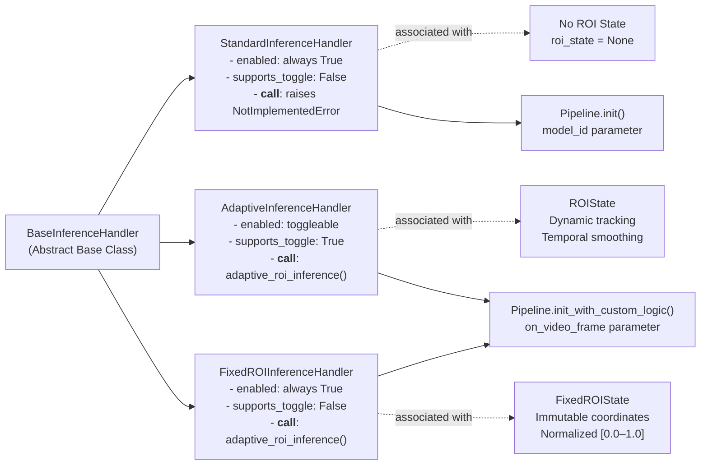
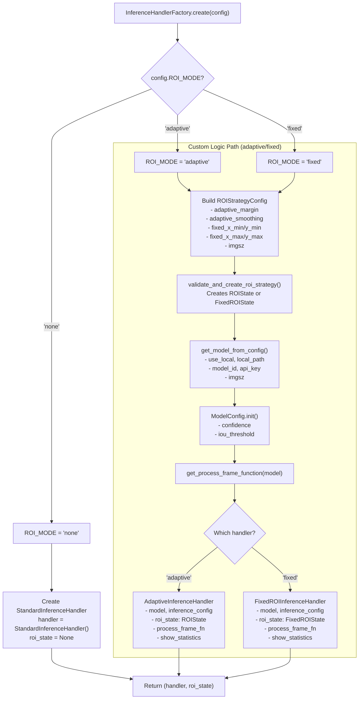
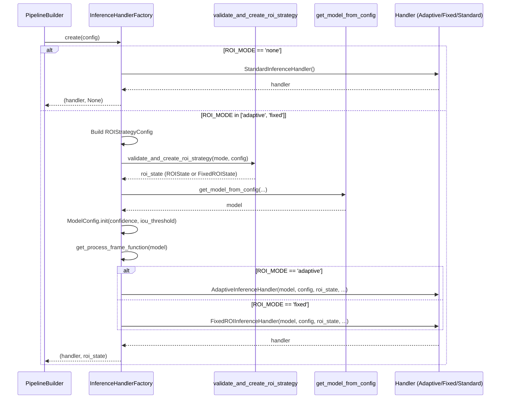

# InferenceHandlerFactory

Relevant source files

- [adeline/inference/factories/handler_factory.py](https://github.com/acare7/kata-inference-251021-clean4/blob/a0662727/adeline/inference/factories/handler_factory.py)
- [adeline/inference/handlers/__init__.py](https://github.com/acare7/kata-inference-251021-clean4/blob/a0662727/adeline/inference/handlers/__init__.py)
- [adeline/inference/handlers/base.py](https://github.com/acare7/kata-inference-251021-clean4/blob/a0662727/adeline/inference/handlers/base.py)
- [adeline/inference/handlers/standard.py](https://github.com/acare7/kata-inference-251021-clean4/blob/a0662727/adeline/inference/handlers/standard.py)
- [adeline/inference/roi/fixed.py](https://github.com/acare7/kata-inference-251021-clean4/blob/a0662727/adeline/inference/roi/fixed.py)

The `InferenceHandlerFactory` is responsible for creating inference handlers based on the ROI mode configuration. It encapsulates the decision logic for selecting and constructing the appropriate handler type (`StandardInferenceHandler`, `AdaptiveInferenceHandler`, or `FixedROIInferenceHandler`) along with their associated dependencies (ROI state, model, inference configuration).

For information about how these handlers process video frames, see [Inference Pipeline](https://deepwiki.com/acare7/kata-inference-251021-clean4/5-inference-pipeline). For details on ROI strategies themselves, see [ROI Strategies](https://deepwiki.com/acare7/kata-inference-251021-clean4/5.1-roi-strategies). For information about the broader factory pattern system, see [Factory Pattern System](https://deepwiki.com/acare7/kata-inference-251021-clean4/3.3-factory-pattern-system).

---

## Purpose and Responsibilities

The `InferenceHandlerFactory` centralizes handler construction logic that was previously embedded in the `InferencePipelineController`. Its primary responsibilities are:

|Responsibility|Description|
|---|---|
|**ROI Mode Validation**|Determines which handler type to create based on `ROI_MODE` configuration (`none`, `adaptive`, `fixed`)|
|**ROI State Creation**|Delegates to `validate_and_create_roi_strategy()` to construct appropriate ROI state objects|
|**Model Creation**|Creates YOLO model instances (local ONNX or Roboflow) using `get_model_from_config()`|
|**Handler Assembly**|Constructs the appropriate handler with all required dependencies|
|**Configuration Mapping**|Maps configuration parameters to handler-specific settings|

The factory implements a single static method `create()` that returns a tuple `(handler, roi_state)`.

**Sources:** [adeline/inference/factories/handler_factory.py1-15](https://github.com/acare7/kata-inference-251021-clean4/blob/a0662727/adeline/inference/factories/handler_factory.py#L1-L15) [adeline/inference/factories/handler_factory.py32-46](https://github.com/acare7/kata-inference-251021-clean4/blob/a0662727/adeline/inference/factories/handler_factory.py#L32-L46)

---

## Handler Types Overview

The factory can create three distinct handler types, each with different capabilities:

|Handler Type|Class|ROI Mode|Toggle Support|Description|
|---|---|---|---|---|
|**Standard**|`StandardInferenceHandler`|`none`|No|No ROI processing; pipeline uses `model_id` directly with `.init()`|
|**Adaptive**|`AdaptiveInferenceHandler`|`adaptive`|Yes|Dynamic ROI adjustment based on detections; supports runtime enable/disable|
|**Fixed**|`FixedROIInferenceHandler`|`fixed`|No|Static ROI with pre-configured coordinates; immutable|

All handlers implement the `BaseInferenceHandler` abstract interface, ensuring consistent behavior across the system.

**Sources:** [adeline/inference/handlers/base.py18-32](https://github.com/acare7/kata-inference-251021-clean4/blob/a0662727/adeline/inference/handlers/base.py#L18-L32) [adeline/inference/handlers/standard.py22-41](https://github.com/acare7/kata-inference-251021-clean4/blob/a0662727/adeline/inference/handlers/standard.py#L22-L41) [adeline/inference/roi/fixed.py137-159](https://github.com/acare7/kata-inference-251021-clean4/blob/a0662727/adeline/inference/roi/fixed.py#L137-L159)

---

## Handler Type Comparison



**Sources:** [adeline/inference/handlers/base.py18-107](https://github.com/acare7/kata-inference-251021-clean4/blob/a0662727/adeline/inference/handlers/base.py#L18-L107) [adeline/inference/handlers/standard.py22-67](https://github.com/acare7/kata-inference-251021-clean4/blob/a0662727/adeline/inference/handlers/standard.py#L22-L67) [adeline/inference/roi/fixed.py137-199](https://github.com/acare7/kata-inference-251021-clean4/blob/a0662727/adeline/inference/roi/fixed.py#L137-L199)

---

## Factory Creation Flow

The `create()` method follows a structured decision and construction flow:




**Sources:** [adeline/inference/factories/handler_factory.py48-152](https://github.com/acare7/kata-inference-251021-clean4/blob/a0662727/adeline/inference/factories/handler_factory.py#L48-L152)

---

## ROI Mode Decision Logic

The factory's primary decision point is the `ROI_MODE` configuration value, which determines the entire construction path:

### Mode: `none`

When `config.ROI_MODE == 'none'`:

- Creates `StandardInferenceHandler` [adeline/inference/handlers/standard.py22-41](https://github.com/acare7/kata-inference-251021-clean4/blob/a0662727/adeline/inference/handlers/standard.py#L22-L41)
- Returns `roi_state = None`
- Pipeline uses standard initialization: `InferencePipeline.init(model_id=...)`
- No custom logic callback is provided to the pipeline

### Mode: `adaptive` or `fixed`

When `config.ROI_MODE` is `'adaptive'` or `'fixed'`, the factory enters the "custom logic path":

1. **ROI Configuration Construction** [adeline/inference/factories/handler_factory.py82-100](https://github.com/acare7/kata-inference-251021-clean4/blob/a0662727/adeline/inference/factories/handler_factory.py#L82-L100)
    
    - Creates `ROIStrategyConfig` with all adaptive and fixed parameters
    - Includes `imgsz` for model size coordination
2. **ROI State Validation and Creation** [adeline/inference/factories/handler_factory.py102-105](https://github.com/acare7/kata-inference-251021-clean4/blob/a0662727/adeline/inference/factories/handler_factory.py#L102-L105)
    
    - Calls `validate_and_create_roi_strategy(mode, config)`
    - Validates parameters (e.g., `x_min < x_max`, normalized coordinates)
    - Returns `ROIState` for adaptive or `FixedROIState` for fixed
3. **Model Creation** [adeline/inference/factories/handler_factory.py107-114](https://github.com/acare7/kata-inference-251021-clean4/blob/a0662727/adeline/inference/factories/handler_factory.py#L107-L114)
    
    - Uses `get_model_from_config()` to create YOLO model
    - Supports both local ONNX models and Roboflow models
    - Applies `imgsz` parameter for model input size
4. **Inference Configuration** [adeline/inference/factories/handler_factory.py116-120](https://github.com/acare7/kata-inference-251021-clean4/blob/a0662727/adeline/inference/factories/handler_factory.py#L116-L120)
    
    - Creates `ModelConfig` with `confidence` and `iou_threshold`
5. **Process Function Selection** [adeline/inference/factories/handler_factory.py122-123](https://github.com/acare7/kata-inference-251021-clean4/blob/a0662727/adeline/inference/factories/handler_factory.py#L122-L123)
    
    - Determines the appropriate processing function based on model type
6. **Handler Construction** [adeline/inference/factories/handler_factory.py125-150](https://github.com/acare7/kata-inference-251021-clean4/blob/a0662727/adeline/inference/factories/handler_factory.py#L125-L150)
    
    - Creates `AdaptiveInferenceHandler` or `FixedROIInferenceHandler`
    - Passes all dependencies to handler constructor

**Sources:** [adeline/inference/factories/handler_factory.py66-152](https://github.com/acare7/kata-inference-251021-clean4/blob/a0662727/adeline/inference/factories/handler_factory.py#L66-L152)

---

## Configuration Parameter Mapping

The factory maps configuration parameters from the `config` object to handler-specific settings:

```mermaid
flowchart TD
  %% =========================
  %% CONFIGURATION CLUSTER
  %% =========================
  subgraph CONF["Configuration (config object)"]
    direction TB

    subgraph MP["Model Parameters"]
      ROI_MODE[ROI_MODE]
      MODEL_IMGSZ[MODEL_IMGSZ]
      USE_LOCAL[USE_LOCAL_MODEL]
      LOCAL_PATH[LOCAL_MODEL_PATH]
      MODEL_ID[MODEL_ID]
      API_KEY[API_KEY]
      CONFIDENCE[MODEL_CONFIDENCE]
      IOU[MODEL_IOU_THRESHOLD]
    end

    subgraph FP["Fixed Parameters"]
      FXMIN[FIXED_X_MIN]
      FYMIN[FIXED_Y_MIN]
      FXMAX[FIXED_X_MAX]
      FYMAX[FIXED_Y_MAX]
      FOVERLAY[FIXED_SHOW_OVERLAY]
      FRESIZE[FIXED_RESIZE_TO_MODEL]
    end

    subgraph AP["Adaptive Parameters"]
      CMARGIN[CROP_MARGIN]
      CSMOOTH[CROP_SMOOTHING]
      CMIN[CROP_MIN_ROI_MULTIPLE]
      CMAX[CROP_MAX_ROI_MULTIPLE]
      CSTATS[CROP_SHOW_STATISTICS]
      ADAPT_RESIZE[ADAPTIVE_RESIZE_TO_MODEL]
    end
  end

  %% =========================
  %% MODEL CREATION
  %% =========================
  subgraph MC["Model Creation"]
    direction TB
    MODEL_OBJ["YOLO model object<br/>From get_model_from_config()"]
  end

  %% =========================
  %% MODEL CONFIG
  %% =========================
  subgraph MCFG["ModelConfig"]
    INF_CFG["ModelConfig object<br/>confidence, iou_threshold"]
  end

  %% =========================
  %% ROI STRATEGY CONFIG
  %% =========================
  subgraph ROIC["ROIStrategyConfig"]
    ROI_CFG["ROIStrategyConfig object<br/>Passed to validate_and_create_roi_strategy()"]
  end

  %% =========================
  %% HANDLER
  %% =========================
  subgraph HC["Handler Construction"]
    HANDLER["AdaptiveInferenceHandler<br/>or<br/>FixedROIInferenceHandler"]
  end

  %% --- Edges: Model object inputs ---
  USE_LOCAL --> MODEL_OBJ
  LOCAL_PATH --> MODEL_OBJ
  MODEL_ID --> MODEL_OBJ
  API_KEY --> MODEL_OBJ
  MODEL_IMGSZ --> MODEL_OBJ

  %% --- Edges: ModelConfig inputs ---
  CONFIDENCE --> INF_CFG
  IOU --> INF_CFG

  %% --- Edges: ROI config from Fixed params ---
  FXMIN --> ROI_CFG
  FYMIN --> ROI_CFG
  FXMAX --> ROI_CFG
  FYMAX --> ROI_CFG
  FRESIZE --> ROI_CFG
  FOVERLAY -.-> HANDLER

  %% --- Edges: ROI config from Adaptive params ---
  CMARGIN --> ROI_CFG
  CSMOOTH --> ROI_CFG
  CMIN --> ROI_CFG
  CMAX --> ROI_CFG
  ADAPT_RESIZE --> ROI_CFG
  CSTATS -.-> HANDLER

  %% --- Model imgsz also informs ROI config ---
  MODEL_IMGSZ --> ROI_CFG

  %% --- ROI mode influences path/handler selection ---
  ROI_MODE -.-> |determines| ROI_CFG

  %% --- Assemble handler ---
  MODEL_OBJ --> HANDLER
  INF_CFG --> HANDLER
  ROI_CFG --> HANDLER
```




**Sources:** [adeline/inference/factories/handler_factory.py82-144](https://github.com/acare7/kata-inference-251021-clean4/blob/a0662727/adeline/inference/factories/handler_factory.py#L82-L144)

---

## Handler Construction Details

### StandardInferenceHandler

```
# adeline/inference/factories/handler_factory.py:71-74
handler = StandardInferenceHandler()
return handler, None
```

The standard handler requires no dependencies. It's a placeholder that maintains interface consistency. The actual inference is handled internally by `InferencePipeline.init(model_id=...)`.

**Key Properties:**

- `enabled`: Always `True` [adeline/inference/handlers/standard.py44-46](https://github.com/acare7/kata-inference-251021-clean4/blob/a0662727/adeline/inference/handlers/standard.py#L44-L46)
- `supports_toggle`: Always `False` [adeline/inference/handlers/standard.py48-51](https://github.com/acare7/kata-inference-251021-clean4/blob/a0662727/adeline/inference/handlers/standard.py#L48-L51)
- `__call__`: Raises `NotImplementedError` [adeline/inference/handlers/standard.py53-67](https://github.com/acare7/kata-inference-251021-clean4/blob/a0662727/adeline/inference/handlers/standard.py#L53-L67)

### AdaptiveInferenceHandler

```
# adeline/inference/factories/handler_factory.py:126-134
handler = AdaptiveInferenceHandler(
    model=model,                          # YOLO model instance
    inference_config=inference_config,    # ModelConfig with confidence, iou
    roi_state=roi_state,                  # ROIState with dynamic tracking
    process_frame_fn=process_frame_fn,    # Model-specific processing
    show_statistics=config.CROP_SHOW_STATISTICS,
)
```

**Dependencies:**

- `model`: YOLO model for inference [adeline/inference/factories/handler_factory.py108-114](https://github.com/acare7/kata-inference-251021-clean4/blob/a0662727/adeline/inference/factories/handler_factory.py#L108-L114)
- `inference_config`: `ModelConfig` with thresholds [adeline/inference/factories/handler_factory.py117-120](https://github.com/acare7/kata-inference-251021-clean4/blob/a0662727/adeline/inference/factories/handler_factory.py#L117-L120)
- `roi_state`: `ROIState` from validation [adeline/inference/factories/handler_factory.py102-105](https://github.com/acare7/kata-inference-251021-clean4/blob/a0662727/adeline/inference/factories/handler_factory.py#L102-L105)
- `process_frame_fn`: Function from `get_process_frame_function()` [adeline/inference/factories/handler_factory.py123](https://github.com/acare7/kata-inference-251021-clean4/blob/a0662727/adeline/inference/factories/handler_factory.py#L123-L123)
- `show_statistics`: Logging flag [adeline/inference/factories/handler_factory.py89](https://github.com/acare7/kata-inference-251021-clean4/blob/a0662727/adeline/inference/factories/handler_factory.py#L89-L89)

**Key Features:**

- Supports runtime toggle via `enable()`/`disable()` methods
- Uses `adaptive_roi_inference()` for zero-copy cropping
- Maintains `ROIState` for temporal smoothing
- Provides feedback loop to update ROI based on detections

### FixedROIInferenceHandler

```
# adeline/inference/factories/handler_factory.py:136-144
handler = FixedROIInferenceHandler(
    model=model,
    inference_config=inference_config,
    roi_state=roi_state,                  # FixedROIState with immutable coords
    process_frame_fn=process_frame_fn,
    show_statistics=config.CROP_SHOW_STATISTICS,
)
```

**Dependencies:**

- Same as `AdaptiveInferenceHandler` except:
- `roi_state`: `FixedROIState` with immutable normalized coordinates [adeline/inference/roi/fixed.py18-75](https://github.com/acare7/kata-inference-251021-clean4/blob/a0662727/adeline/inference/roi/fixed.py#L18-L75)

**Key Features:**

- Immutable ROI coordinates [adeline/inference/roi/fixed.py60-71](https://github.com/acare7/kata-inference-251021-clean4/blob/a0662727/adeline/inference/roi/fixed.py#L60-L71)
- No toggle support (always enabled) [adeline/inference/roi/fixed.py176-183](https://github.com/acare7/kata-inference-251021-clean4/blob/a0662727/adeline/inference/roi/fixed.py#L176-L183)
- Reuses `adaptive_roi_inference()` for consistency [adeline/inference/roi/fixed.py188-198](https://github.com/acare7/kata-inference-251021-clean4/blob/a0662727/adeline/inference/roi/fixed.py#L188-L198)
- Caches pixel coordinates for repeated frame sizes [adeline/inference/roi/fixed.py73-109](https://github.com/acare7/kata-inference-251021-clean4/blob/a0662727/adeline/inference/roi/fixed.py#L73-L109)

**Sources:** [adeline/inference/factories/handler_factory.py71-152](https://github.com/acare7/kata-inference-251021-clean4/blob/a0662727/adeline/inference/factories/handler_factory.py#L71-L152) [adeline/inference/handlers/standard.py22-67](https://github.com/acare7/kata-inference-251021-clean4/blob/a0662727/adeline/inference/handlers/standard.py#L22-L67) [adeline/inference/roi/fixed.py137-199](https://github.com/acare7/kata-inference-251021-clean4/blob/a0662727/adeline/inference/roi/fixed.py#L137-L199)

---

## Integration with PipelineBuilder

The `InferenceHandlerFactory` is called by the `PipelineBuilder` during the first phase of pipeline construction:





The `PipelineBuilder` uses the returned handler and ROI state for subsequent construction steps:

1. Handler is passed to `InferencePipeline.init_with_custom_logic()` if ROI mode is not `'none'`
2. ROI state is stored for potential use by sinks (e.g., `ROIUpdateSink`)

**Sources:** [adeline/inference/factories/handler_factory.py48-152](https://github.com/acare7/kata-inference-251021-clean4/blob/a0662727/adeline/inference/factories/handler_factory.py#L48-L152)

---

## Validation and Error Handling

The factory implements fail-fast validation at multiple levels:

### ROI Mode Validation

```
# adeline/inference/factories/handler_factory.py:146-150
else:
    raise ValueError(
        f"Invalid ROI mode: '{roi_mode}'. "
        f"Must be 'none', 'adaptive', or 'fixed'"
    )
```

This catch-all ensures that only the three valid ROI modes are accepted.

### Delegated Validation

The factory delegates most validation to specialized functions:

|Validation Type|Delegated To|Validated Items|
|---|---|---|
|**ROI Parameters**|`validate_and_create_roi_strategy()`|Normalized coordinates, parameter consistency|
|**Model Configuration**|`get_model_from_config()`|Model path existence, API key presence, imgsz validity|
|**Fixed Coordinates**|`FixedROIState.__init__()`|`x_min < x_max`, `y_min < y_max`, range `[0.0, 1.0]`|

### Example: Fixed ROI Coordinate Validation

```
# adeline/inference/roi/fixed.py:61-64
if not (0.0 <= x_min < x_max <= 1.0):
    raise ValueError(f"Invalid x coordinates: x_min={x_min}, x_max={x_max}")
if not (0.0 <= y_min < y_max <= 1.0):
    raise ValueError(f"Invalid y coordinates: y_min={y_min}, y_max={y_max}")
```

### Logging

The factory provides structured logging for visibility:

```
# Standard mode
logger.info("📦 InferenceHandler: STANDARD (no ROI)")

# Adaptive mode
logger.info("🔄 Creating AdaptiveInferenceHandler (dynamic ROI)")

# Fixed mode  
logger.info("📍 Creating FixedROIInferenceHandler (static ROI)")
```

**Sources:** [adeline/inference/factories/handler_factory.py66-152](https://github.com/acare7/kata-inference-251021-clean4/blob/a0662727/adeline/inference/factories/handler_factory.py#L66-L152) [adeline/inference/roi/fixed.py60-64](https://github.com/acare7/kata-inference-251021-clean4/blob/a0662727/adeline/inference/roi/fixed.py#L60-L64)

---

## Return Value

The factory returns a tuple `(handler, roi_state)`:

|Element|Type|Description|
|---|---|---|
|`handler`|`BaseInferenceHandler`|Concrete handler instance (Standard/Adaptive/Fixed)|
|`roi_state`|`ROIState` \| `FixedROIState` \| `None`|ROI state object, or `None` for standard mode|

### Usage Pattern

```
# In PipelineBuilder
handler, roi_state = InferenceHandlerFactory.create(config)

if config.ROI_MODE == 'none':
    # Standard pipeline: handler is placeholder, not used
    pipeline = InferencePipeline.init(
        model_id=config.MODEL_ID,
        max_fps=config.MAX_FPS,
        ...
    )
else:
    # Custom logic: handler is callable passed to pipeline
    pipeline = InferencePipeline.init_with_custom_logic(
        on_video_frame=handler,  # AdaptiveInferenceHandler or FixedROIInferenceHandler
        max_fps=config.MAX_FPS,
        ...
    )

# Store roi_state for potential use by sinks
self.roi_state = roi_state
```

**Sources:** [adeline/inference/factories/handler_factory.py49-57](https://github.com/acare7/kata-inference-251021-clean4/blob/a0662727/adeline/inference/factories/handler_factory.py#L49-L57)

---

## Design Rationale

The `InferenceHandlerFactory` embodies several key design principles:

### Separation of Concerns

|Concern|Owner|
|---|---|
|**When to construct**|`PipelineBuilder`|
|**How to construct**|`InferenceHandlerFactory`|
|**What to construct with**|`validate_and_create_roi_strategy`, `get_model_from_config`|
|**How to use**|`InferencePipelineController`|

The factory knows **how** but not **when** or **why**. The builder knows **when** but not **how**.

### Centralized Decision Logic

Previously, handler selection logic was embedded in `InferencePipelineController.setup()` [adeline/inference/factories/handler_factory.py7-8](https://github.com/acare7/kata-inference-251021-clean4/blob/a0662727/adeline/inference/factories/handler_factory.py#L7-L8) The factory pattern extracts this into a dedicated, testable component.

### Fail-Fast Validation

All validation happens at construction time, not runtime. Invalid configurations are rejected before the pipeline starts processing video.

### Type Safety

The factory returns typed objects (`BaseInferenceHandler`, not generic `Any`), enabling static type checking and IDE autocomplete.

**Sources:** [adeline/inference/factories/handler_factory.py1-14](https://github.com/acare7/kata-inference-251021-clean4/blob/a0662727/adeline/inference/factories/handler_factory.py#L1-L14)