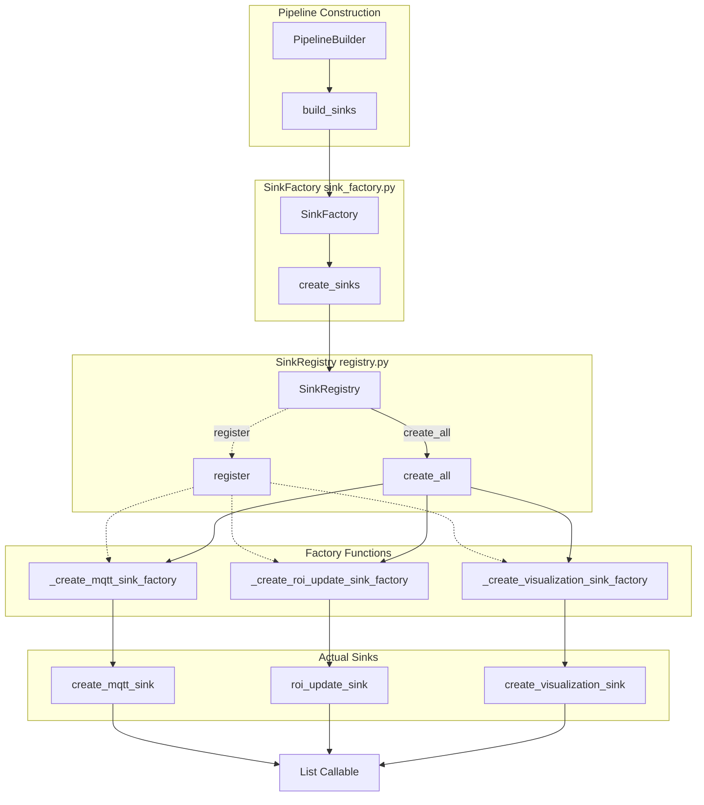
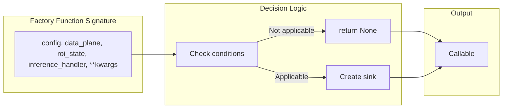
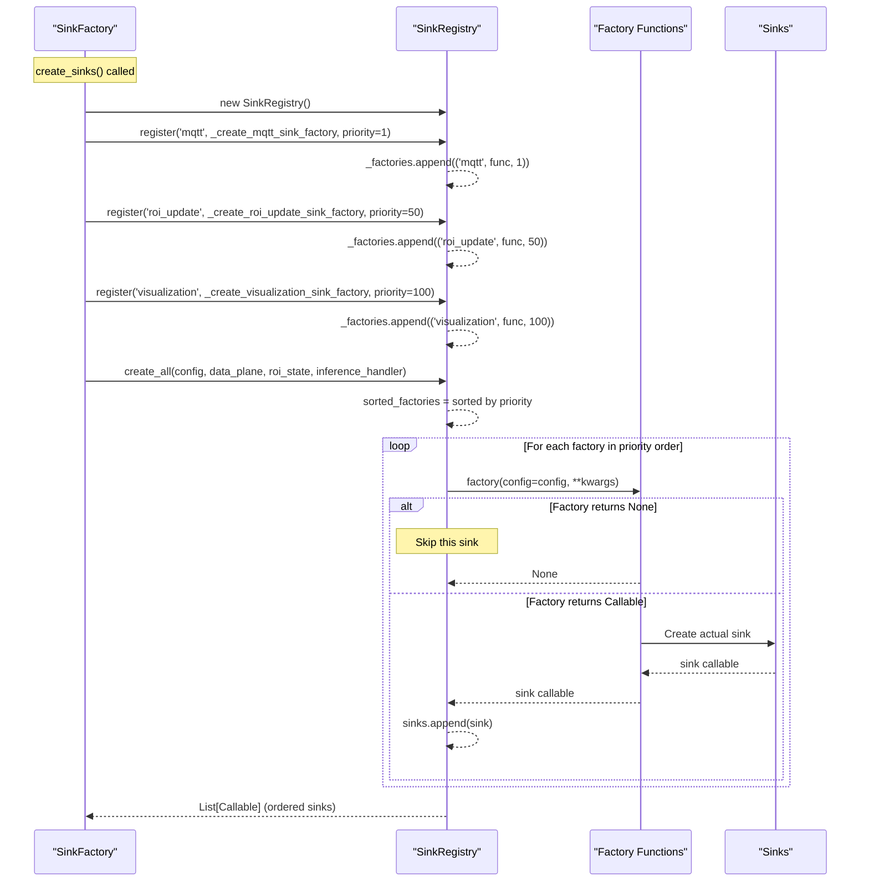
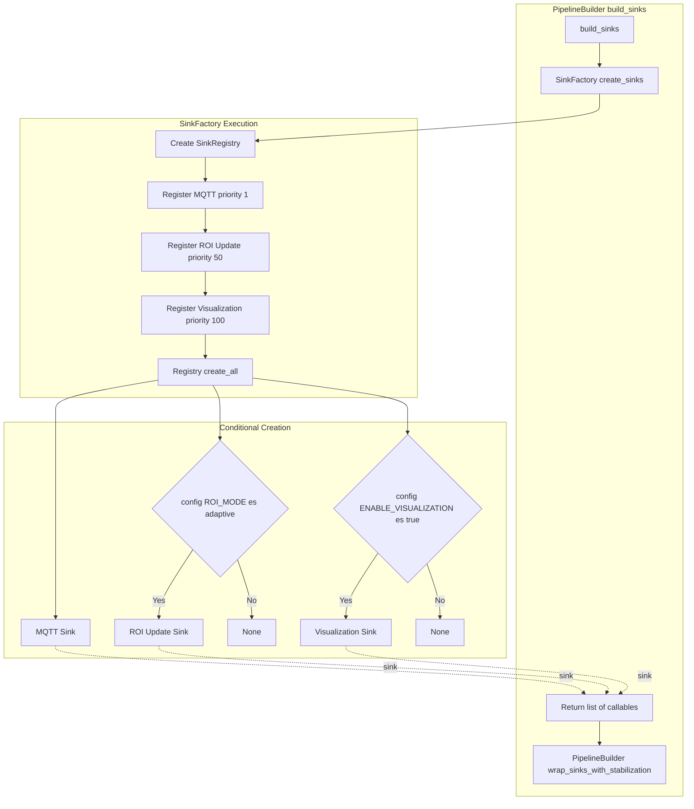

# SinkFactory

Relevant source files

- [adeline/app/factories/sink_factory.py](https://github.com/acare7/kata-inference-251021-clean4/blob/a0662727/adeline/app/factories/sink_factory.py)
- [adeline/app/sinks/__init__.py](https://github.com/acare7/kata-inference-251021-clean4/blob/a0662727/adeline/app/sinks/__init__.py)
- [adeline/app/sinks/registry.py](https://github.com/acare7/kata-inference-251021-clean4/blob/a0662727/adeline/app/sinks/registry.py)

## Purpose and Scope

The `SinkFactory` is responsible for creating and composing output sinks for the inference pipeline. It uses a registry-based architecture to decouple sink creation from the pipeline builder, enabling conditional sink instantiation based on configuration and explicit priority ordering.

This document covers the factory mechanism for creating sinks. For the runtime behavior of individual sinks, see [Output Sinks](https://deepwiki.com/acare7/kata-inference-251021-clean4/5.4-output-sinks). For how the factory is invoked during pipeline construction, see [PipelineBuilder](https://deepwiki.com/acare7/kata-inference-251021-clean4/3.2-pipelinebuilder).

**Sources:** [adeline/app/factories/sink_factory.py1-15](https://github.com/acare7/kata-inference-251021-clean4/blob/a0662727/adeline/app/factories/sink_factory.py#L1-L15)

---

## Architecture Overview

The `SinkFactory` implements a registry-based factory pattern that separates sink registration from sink creation. The factory delegates to `SinkRegistry` for managing sink registration and priority-based instantiation.

### Registry-Based Design





**Sources:** [adeline/app/factories/sink_factory.py71-136](https://github.com/acare7/kata-inference-251021-clean4/blob/a0662727/adeline/app/factories/sink_factory.py#L71-L136) [adeline/app/sinks/registry.py22-110](https://github.com/acare7/kata-inference-251021-clean4/blob/a0662727/adeline/app/sinks/registry.py#L22-L110)

---

## Priority-Based Sink Ordering

The factory uses explicit priority values to control sink execution order. Lower priority values execute first, ensuring deterministic behavior.

### Priority Table

|Priority|Sink Type|Factory Function|Always Created|Rationale|
|---|---|---|---|---|
|1|MQTT|`_create_mqtt_sink_factory`|Yes|First sink to receive stabilized detections; stabilization wrapper targets this sink|
|50|ROI Update|`_create_roi_update_sink_factory`|Conditional|Middle priority; updates ROI state for next frame in adaptive mode|
|100|Visualization|`_create_visualization_sink_factory`|Conditional|Last priority; slowest operation (OpenCV rendering)|

**Critical Design Decision:** The MQTT sink has priority 1 because the stabilization wrapper in `PipelineBuilder.wrap_sinks_with_stabilization()` wraps **only the first sink**. This ensures detection filtering happens before MQTT publishing.

**Sources:** [adeline/app/factories/sink_factory.py110-126](https://github.com/acare7/kata-inference-251021-clean4/blob/a0662727/adeline/app/factories/sink_factory.py#L110-L126)

---

## Sink Factory Functions

Each sink type has a dedicated factory function that handles conditional creation based on configuration.

### Factory Function Pattern




**Sources:** [adeline/app/factories/sink_factory.py29-68](https://github.com/acare7/kata-inference-251021-clean4/blob/a0662727/adeline/app/factories/sink_factory.py#L29-L68)

### MQTT Sink Factory

The MQTT sink is always created and publishes detection results to the data plane.

```
# Simplified logic from sink_factory.py:29-34
def _create_mqtt_sink_factory(config: Any, data_plane: Any, **kwargs) -> Callable:
    """Factory para MQTT sink (siempre presente)."""
    from ...data import create_mqtt_sink
    sink = create_mqtt_sink(data_plane)
    logger.info("✅ MQTT sink added")
    return sink
```

**Characteristics:**

- **Always created:** No conditional logic
- **Receives:** `data_plane` for publishing
- **Returns:** Callable that publishes to MQTT topics
- **Priority:** 1 (first to execute)

**Sources:** [adeline/app/factories/sink_factory.py29-34](https://github.com/acare7/kata-inference-251021-clean4/blob/a0662727/adeline/app/factories/sink_factory.py#L29-L34)

### ROI Update Sink Factory

The ROI update sink is conditionally created only in adaptive ROI mode.

```
# Simplified logic from sink_factory.py:37-45
def _create_roi_update_sink_factory(config: Any, roi_state: Any, **kwargs) -> Optional[Callable]:
    """Factory para ROI update sink (solo adaptive mode)."""
    if config.ROI_MODE != 'adaptive' or roi_state is None:
        return None  # Skip
    
    from ...inference.roi import roi_update_sink
    sink = partial(roi_update_sink, roi_state=roi_state)
    logger.info("✅ ROI update sink added (adaptive mode)")
    return sink
```

**Conditional Logic:**

|Condition|Result|
|---|---|
|`config.ROI_MODE != 'adaptive'`|Returns `None` (skipped)|
|`roi_state is None`|Returns `None` (skipped)|
|Both checks pass|Creates sink with `partial(roi_update_sink, roi_state=roi_state)`|

**Purpose:** Updates the `ROIState` with detection bounding boxes to compute the dynamic ROI for the next frame. See [Adaptive ROI](https://deepwiki.com/acare7/kata-inference-251021-clean4/5.1.1-adaptive-roi) for details on the feedback loop.

**Sources:** [adeline/app/factories/sink_factory.py37-45](https://github.com/acare7/kata-inference-251021-clean4/blob/a0662727/adeline/app/factories/sink_factory.py#L37-L45)

### Visualization Sink Factory

The visualization sink is conditionally created when visualization is enabled in configuration.

```
# Simplified logic from sink_factory.py:48-68
def _create_visualization_sink_factory(config: Any, roi_state: Any, inference_handler: Any, **kwargs) -> Optional[Callable]:
    """Factory para visualization sink (si habilitado)."""
    if not config.ENABLE_VISUALIZATION:
        return None  # Skip
    
    from ...visualization import create_visualization_sink
    
    # Window name según estrategia
    if config.ROI_MODE == 'none':
        window_name = "Inference Pipeline (Standard)"
    else:
        window_name = f"Inference Pipeline ({config.ROI_MODE.capitalize()} ROI)"
    
    sink = create_visualization_sink(
        roi_state=roi_state,
        inference_handler=inference_handler,
        display_stats=config.DISPLAY_STATISTICS,
        window_name=window_name,
    )
    logger.info(f"✅ Visualization sink added: {window_name}")
    return sink
```

**Conditional Logic:**

|Condition|Result|
|---|---|
|`config.ENABLE_VISUALIZATION == False`|Returns `None` (skipped)|
|`config.ENABLE_VISUALIZATION == True`|Creates sink with mode-specific window name|

**Window Name Selection:**

- **Standard mode:** `"Inference Pipeline (Standard)"`
- **Adaptive/Fixed mode:** `"Inference Pipeline (Adaptive ROI)"` or `"Inference Pipeline (Fixed ROI)"`

**Sources:** [adeline/app/factories/sink_factory.py48-68](https://github.com/acare7/kata-inference-251021-clean4/blob/a0662727/adeline/app/factories/sink_factory.py#L48-L68)

---

## SinkRegistry Implementation

The `SinkRegistry` provides the underlying mechanism for decoupled sink registration and priority-based instantiation.

### Registration Flow




**Sources:** [adeline/app/sinks/registry.py68-109](https://github.com/acare7/kata-inference-251021-clean4/blob/a0662727/adeline/app/sinks/registry.py#L68-L109)

### Registry API

The `SinkRegistry` class provides two primary methods:

#### `register(name, factory, priority)`

Registers a sink factory function with a given priority.

**Parameters:**

- `name: str` - Unique identifier for the sink (e.g., `'mqtt'`, `'visualization'`)
- `factory: Callable` - Factory function with signature `factory(config, **kwargs) -> Callable | None`
- `priority: int` - Execution order (lower = earlier), default is 100

**Example:**

```
registry.register('mqtt', mqtt_factory, priority=1)
```

**Sources:** [adeline/app/sinks/registry.py44-66](https://github.com/acare7/kata-inference-251021-clean4/blob/a0662727/adeline/app/sinks/registry.py#L44-L66)

#### `create_all(config, **kwargs)`

Instantiates all registered sinks in priority order, filtering out `None` returns.

**Parameters:**

- `config` - Pipeline configuration object
- `**kwargs` - Additional arguments passed to factory functions (e.g., `data_plane`, `roi_state`)

**Returns:**

- `List[Callable]` - Ordered list of instantiated sinks

**Filtering Behavior:**

- If a factory returns `None`, the sink is skipped (logged as `⏭️ Sink skipped`)
- Only non-`None` sinks are added to the output list

**Sources:** [adeline/app/sinks/registry.py68-109](https://github.com/acare7/kata-inference-251021-clean4/blob/a0662727/adeline/app/sinks/registry.py#L68-L109)

---

## Usage in PipelineBuilder

The `SinkFactory` is invoked during the `build_sinks()` phase of pipeline construction.

### Integration with Builder





# From PipelineBuilder (conceptual)

```
sinks = SinkFactory.create_sinks(
    config=self.config,
    data_plane=self.data_plane,
    roi_state=roi_state,  # May be None
    inference_handler=inference_handler,
)
```

**Sources:** [adeline/app/factories/sink_factory.py84-136](https://github.com/acare7/kata-inference-251021-clean4/blob/a0662727/adeline/app/factories/sink_factory.py#L84-L136)

---

## Conditional Sink Creation

The factory pattern allows sinks to opt out of creation by returning `None`, enabling clean conditional instantiation without complex branching logic in the builder.

### Decision Matrix

|Configuration State|MQTT Sink|ROI Update Sink|Visualization Sink|
|---|---|---|---|
|ROI_MODE='none', VIZ=False|✅ Created|❌ Skipped|❌ Skipped|
|ROI_MODE='adaptive', VIZ=False|✅ Created|✅ Created|❌ Skipped|
|ROI_MODE='fixed', VIZ=False|✅ Created|❌ Skipped|❌ Skipped|
|ROI_MODE='none', VIZ=True|✅ Created|❌ Skipped|✅ Created|
|ROI_MODE='adaptive', VIZ=True|✅ Created|✅ Created|✅ Created|
|ROI_MODE='fixed', VIZ=True|✅ Created|❌ Skipped|✅ Created|

**Key Observations:**

- MQTT sink is **always** created (no conditional logic)
- ROI Update sink requires `ROI_MODE='adaptive'` AND `roi_state is not None`
- Visualization sink requires `ENABLE_VISUALIZATION=True`

**Sources:** [adeline/app/factories/sink_factory.py29-68](https://github.com/acare7/kata-inference-251021-clean4/blob/a0662727/adeline/app/factories/sink_factory.py#L29-L68)

---

## Extensibility

The registry-based architecture enables straightforward addition of new sink types.

### Adding a New Sink

To add a new sink type (e.g., a database logger):

1. **Create factory function** in `sink_factory.py`:
    
    ```
    def _create_database_sink_factory(config: Any, **kwargs) -> Optional[Callable]:
        if not config.ENABLE_DATABASE_LOGGING:
            return None
        
        from ...database import create_db_sink
        sink = create_db_sink(config.DATABASE_URL)
        logger.info("✅ Database sink added")
        return sink
    ```
    
2. **Register in `SinkFactory.create_sinks()`**:
    
    ```
    registry.register(
        name='database',
        factory=_create_database_sink_factory,
        priority=25  # Between MQTT and ROI
    )
    ```
    
3. **No changes required** in:
    
    - `PipelineBuilder` - uses factory API generically
    - `SinkRegistry` - already handles arbitrary sinks
    - `InferencePipeline` - consumes `List[Callable]` agnostically

**Design Benefit:** The registry pattern isolates sink creation complexity from the builder, following the Open-Closed Principle (open for extension, closed for modification).

**Sources:** [adeline/app/factories/sink_factory.py1-15](https://github.com/acare7/kata-inference-251021-clean4/blob/a0662727/adeline/app/factories/sink_factory.py#L1-L15) [adeline/app/sinks/registry.py1-15](https://github.com/acare7/kata-inference-251021-clean4/blob/a0662727/adeline/app/sinks/registry.py#L1-L15)

---

## Code Entity Reference

### Classes

|Class|File Path|Line Numbers|
|---|---|---|
|`SinkFactory`|`adeline/app/factories/sink_factory.py`|[71-136](https://github.com/acare7/kata-inference-251021-clean4/blob/a0662727/71-136)|
|`SinkRegistry`|`adeline/app/sinks/registry.py`|[22-110](https://github.com/acare7/kata-inference-251021-clean4/blob/a0662727/22-110)|

### Factory Functions

|Function|Purpose|File Path|Line Numbers|
|---|---|---|---|
|`_create_mqtt_sink_factory`|Creates MQTT sink (always)|`adeline/app/factories/sink_factory.py`|[29-34](https://github.com/acare7/kata-inference-251021-clean4/blob/a0662727/29-34)|
|`_create_roi_update_sink_factory`|Creates ROI update sink (conditional)|`adeline/app/factories/sink_factory.py`|[37-45](https://github.com/acare7/kata-inference-251021-clean4/blob/a0662727/37-45)|
|`_create_visualization_sink_factory`|Creates visualization sink (conditional)|`adeline/app/factories/sink_factory.py`|[48-68](https://github.com/acare7/kata-inference-251021-clean4/blob/a0662727/48-68)|

### Registry Methods

|Method|Signature|File Path|Line Numbers|
|---|---|---|---|
|`register()`|`register(name: str, factory: Callable, priority: int = 100) -> None`|`adeline/app/sinks/registry.py`|[44-66](https://github.com/acare7/kata-inference-251021-clean4/blob/a0662727/44-66)|
|`create_all()`|`create_all(config, **kwargs) -> List[Callable]`|`adeline/app/sinks/registry.py`|[68-109](https://github.com/acare7/kata-inference-251021-clean4/blob/a0662727/68-109)|

**Sources:** [adeline/app/factories/sink_factory.py1-137](https://github.com/acare7/kata-inference-251021-clean4/blob/a0662727/adeline/app/factories/sink_factory.py#L1-L137) [adeline/app/sinks/registry.py1-110](https://github.com/acare7/kata-inference-251021-clean4/blob/a0662727/adeline/app/sinks/registry.py#L1-L110)