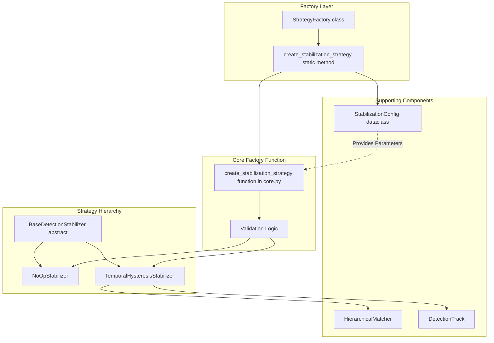
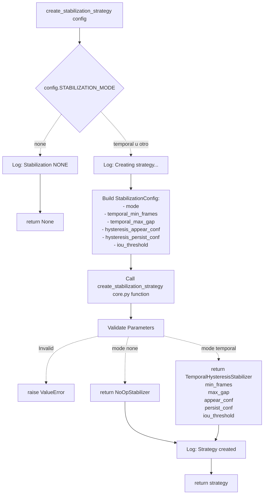
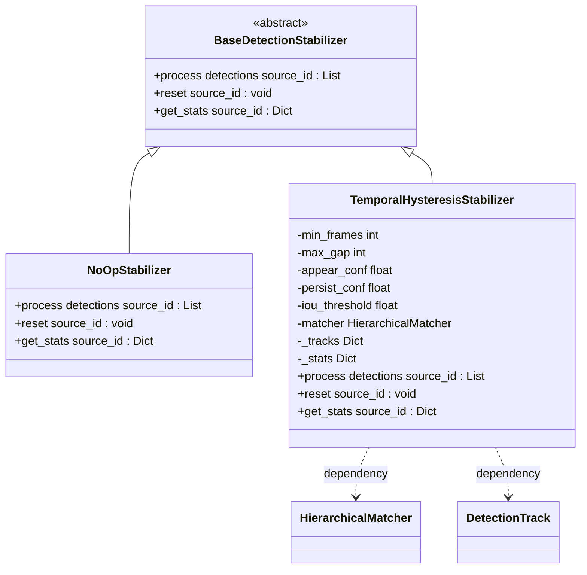
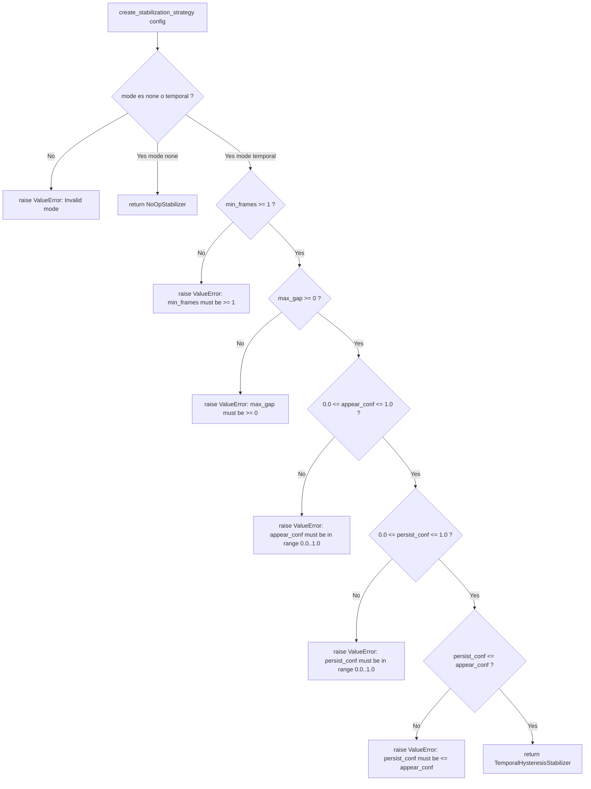
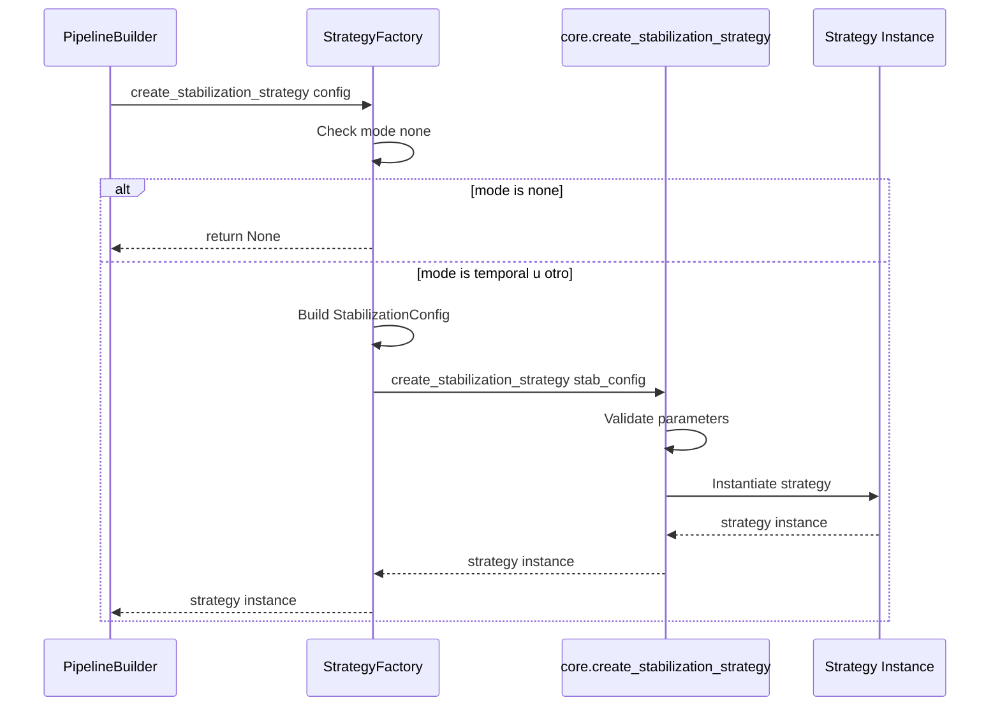

# StrategyFactory

Relevant source files

- [adeline/inference/factories/strategy_factory.py](https://github.com/acare7/kata-inference-251021-clean4/blob/a0662727/adeline/inference/factories/strategy_factory.py)
- [adeline/inference/stabilization/core.py](https://github.com/acare7/kata-inference-251021-clean4/blob/a0662727/adeline/inference/stabilization/core.py)
- [adeline/inference/stabilization/matching.py](https://github.com/acare7/kata-inference-251021-clean4/blob/a0662727/adeline/inference/stabilization/matching.py)

## Purpose and Scope

The `StrategyFactory` is responsible for creating detection stabilization strategies based on configuration settings. It translates configuration parameters into concrete strategy instances (`NoOpStabilizer` or `TemporalHysteresisStabilizer`) that implement temporal filtering and detection tracking logic.

This page covers the factory's creation logic, configuration mapping, and validation. For details on the stabilization strategies themselves, see [Detection Stabilization](https://deepwiki.com/acare7/kata-inference-251021-clean4/5.2-detection-stabilization). For information on how the factory integrates into pipeline construction, see [PipelineBuilder](https://deepwiki.com/acare7/kata-inference-251021-clean4/3.2-pipelinebuilder). For other factory types in the system, see [Factory Pattern System](https://deepwiki.com/acare7/kata-inference-251021-clean4/3.3-factory-pattern-system).

**Sources:** [adeline/inference/factories/strategy_factory.py1-77](https://github.com/acare7/kata-inference-251021-clean4/blob/a0662727/adeline/inference/factories/strategy_factory.py#L1-L77)

---

## Factory Architecture

The `StrategyFactory` follows a two-level factory pattern: a factory class that delegates to a factory function for actual strategy construction and validation.

### Factory Class Structure




**Diagram: StrategyFactory Architecture and Delegation Flow**

The `StrategyFactory` class provides a clean public API while delegating validation and construction logic to specialized components.

**Sources:** [adeline/inference/factories/strategy_factory.py20-77](https://github.com/acare7/kata-inference-251021-clean4/blob/a0662727/adeline/inference/factories/strategy_factory.py#L20-L77) [adeline/inference/stabilization/core.py472-532](https://github.com/acare7/kata-inference-251021-clean4/blob/a0662727/adeline/inference/stabilization/core.py#L472-L532)

---

## Strategy Creation Process

### Factory Method

The `StrategyFactory.create_stabilization_strategy()` static method orchestrates strategy creation:




**Diagram: Strategy Creation Flow**

The factory follows a fail-fast validation approach: invalid configurations raise `ValueError` before any strategy is instantiated.

**Sources:** [adeline/inference/factories/strategy_factory.py36-77](https://github.com/acare7/kata-inference-251021-clean4/blob/a0662727/adeline/inference/factories/strategy_factory.py#L36-L77) [adeline/inference/stabilization/core.py472-532](https://github.com/acare7/kata-inference-251021-clean4/blob/a0662727/adeline/inference/stabilization/core.py#L472-L532)

### Code Flow

The factory method executes in these phases:

1. **Early Return for 'none' Mode** [adeline/inference/factories/strategy_factory.py56-58](https://github.com/acare7/kata-inference-251021-clean4/blob/a0662727/adeline/inference/factories/strategy_factory.py#L56-L58)
    
    - If `config.STABILIZATION_MODE == 'none'`, return `None` immediately
    - No strategy object is created, avoiding unnecessary overhead
2. **Configuration Object Construction** [adeline/inference/factories/strategy_factory.py63-70](https://github.com/acare7/kata-inference-251021-clean4/blob/a0662727/adeline/inference/factories/strategy_factory.py#L63-L70)
    
    - Creates `StabilizationConfig` dataclass from pipeline config
    - Maps pipeline config fields to stabilization config fields
3. **Delegation to Core Factory** [adeline/inference/factories/strategy_factory.py73](https://github.com/acare7/kata-inference-251021-clean4/blob/a0662727/adeline/inference/factories/strategy_factory.py#L73-L73)
    
    - Calls `create_stabilization_strategy(stab_config)` from `core.py`
    - Validation and instantiation happen in the core factory function
4. **Return Strategy Instance**
    
    - Returns either `NoOpStabilizer` or `TemporalHysteresisStabilizer`
    - Or `None` if mode is 'none'

**Sources:** [adeline/inference/factories/strategy_factory.py36-77](https://github.com/acare7/kata-inference-251021-clean4/blob/a0662727/adeline/inference/factories/strategy_factory.py#L36-L77)

---

## Configuration Mapping

### Pipeline Config to Stabilization Config

The factory translates pipeline configuration parameters into `StabilizationConfig`:

|Pipeline Config Field|StabilizationConfig Field|Type|Description|
|---|---|---|---|
|`STABILIZATION_MODE`|`mode`|`str`|Strategy mode: 'none' or 'temporal'|
|`STABILIZATION_MIN_FRAMES`|`temporal_min_frames`|`int`|Consecutive frames required for confirmation|
|`STABILIZATION_MAX_GAP`|`temporal_max_gap`|`int`|Maximum gap tolerance before track removal|
|`STABILIZATION_APPEAR_CONF`|`hysteresis_appear_conf`|`float`|Confidence threshold for new detections|
|`STABILIZATION_PERSIST_CONF`|`hysteresis_persist_conf`|`float`|Confidence threshold for confirmed tracks|
|`STABILIZATION_IOU_THRESHOLD`|`iou_threshold`|`float`|IoU threshold for spatial matching|

**Sources:** [adeline/inference/factories/strategy_factory.py63-70](https://github.com/acare7/kata-inference-251021-clean4/blob/a0662727/adeline/inference/factories/strategy_factory.py#L63-L70)

### StabilizationConfig Structure

The `StabilizationConfig` dataclass [adeline/inference/stabilization/core.py42-62](https://github.com/acare7/kata-inference-251021-clean4/blob/a0662727/adeline/inference/stabilization/core.py#L42-L62) provides:

```
@dataclass
class StabilizationConfig:
    mode: str  # 'none', 'temporal'
    
    # Temporal Filtering params
    temporal_min_frames: int = 3
    temporal_max_gap: int = 2
    
    # Hysteresis params
    hysteresis_appear_conf: float = 0.5
    hysteresis_persist_conf: float = 0.3
    
    # IoU Tracking params
    iou_threshold: float = 0.3
```

**Sources:** [adeline/inference/stabilization/core.py42-62](https://github.com/acare7/kata-inference-251021-clean4/blob/a0662727/adeline/inference/stabilization/core.py#L42-L62)

---

## Strategy Types

### Strategy Hierarchy




**Diagram: Strategy Class Hierarchy**

**Sources:** [adeline/inference/stabilization/core.py123-170](https://github.com/acare7/kata-inference-251021-clean4/blob/a0662727/adeline/inference/stabilization/core.py#L123-L170) [adeline/inference/stabilization/core.py446-465](https://github.com/acare7/kata-inference-251021-clean4/blob/a0662727/adeline/inference/stabilization/core.py#L446-L465) [adeline/inference/stabilization/core.py176-439](https://github.com/acare7/kata-inference-251021-clean4/blob/a0662727/adeline/inference/stabilization/core.py#L176-L439)

### NoOpStabilizer

The `NoOpStabilizer` [adeline/inference/stabilization/core.py446-465](https://github.com/acare7/kata-inference-251021-clean4/blob/a0662727/adeline/inference/stabilization/core.py#L446-L465) is a pass-through strategy that performs no stabilization:

- **Purpose:** Baseline for comparison, disables all stabilization
- **Behavior:** Returns input detections unchanged
- **Use Case:** When stabilization is explicitly disabled (`mode='none'`)
- **Performance:** Zero overhead, direct pass-through

**Method Implementations:**

- `process()`: Returns detections unmodified
- `reset()`: No-op, no state to reset
- `get_stats()`: Returns `{'mode': 'none'}`

**Sources:** [adeline/inference/stabilization/core.py446-465](https://github.com/acare7/kata-inference-251021-clean4/blob/a0662727/adeline/inference/stabilization/core.py#L446-L465)

### TemporalHysteresisStabilizer

The `TemporalHysteresisStabilizer` [adeline/inference/stabilization/core.py176-439](https://github.com/acare7/kata-inference-251021-clean4/blob/a0662727/adeline/inference/stabilization/core.py#L176-L439) implements temporal filtering with hysteresis thresholds:

**Core Mechanisms:**

1. **Temporal Filtering** [adeline/inference/stabilization/core.py186-197](https://github.com/acare7/kata-inference-251021-clean4/blob/a0662727/adeline/inference/stabilization/core.py#L186-L197)
    
    - Requires `min_frames` consecutive detections to confirm track
    - Tolerates `max_gap` frames without detection before removing track
2. **Hysteresis Thresholds** [adeline/inference/stabilization/core.py186-197](https://github.com/acare7/kata-inference-251021-clean4/blob/a0662727/adeline/inference/stabilization/core.py#L186-L197)
    
    - `appear_conf`: High threshold for new detections (default 0.5)
    - `persist_conf`: Lower threshold for confirmed tracks (default 0.3)
    - Prevents flickering once track is established
3. **IoU-Based Matching** [adeline/inference/stabilization/core.py222-224](https://github.com/acare7/kata-inference-251021-clean4/blob/a0662727/adeline/inference/stabilization/core.py#L222-L224)
    
    - Uses `HierarchicalMatcher` for spatial association
    - IoU matching followed by class-only fallback
    - Prevents ID swaps in multi-object scenarios

**State Management:**

- `_tracks`: Nested dict structure `source_id -> class_name -> List[DetectionTrack]`
- `_stats`: Per-source statistics tracking
- `DetectionTrack` objects maintain individual track state

**Sources:** [adeline/inference/stabilization/core.py176-439](https://github.com/acare7/kata-inference-251021-clean4/blob/a0662727/adeline/inference/stabilization/core.py#L176-L439)

---

## Validation Logic

The core factory function [adeline/inference/stabilization/core.py472-532](https://github.com/acare7/kata-inference-251021-clean4/blob/a0662727/adeline/inference/stabilization/core.py#L472-L532) implements comprehensive validation:

### Mode Validation

```
if mode not in ['none', 'temporal']:
    raise ValueError(
        f"Invalid stabilization mode: '{mode}'. "
        f"Currently supported: 'none', 'temporal'"
    )
```

**Sources:** [adeline/inference/stabilization/core.py489-494](https://github.com/acare7/kata-inference-251021-clean4/blob/a0662727/adeline/inference/stabilization/core.py#L489-L494)

### Parameter Validation for Temporal Mode

The following validations apply when `mode='temporal'`:

|Parameter|Validation Rule|Error if Violated|
|---|---|---|
|`temporal_min_frames`|`>= 1`|"temporal_min_frames must be >= 1"|
|`temporal_max_gap`|`>= 0`|"temporal_max_gap must be >= 0"|
|`hysteresis_appear_conf`|`0.0 <= value <= 1.0`|"hysteresis_appear_conf must be in [0.0, 1.0]"|
|`hysteresis_persist_conf`|`0.0 <= value <= 1.0`|"hysteresis_persist_conf must be in [0.0, 1.0]"|
|Hysteresis Relationship|`persist_conf <= appear_conf`|"persist_conf must be <= appear_conf"|

**Sources:** [adeline/inference/stabilization/core.py502-514](https://github.com/acare7/kata-inference-251021-clean4/blob/a0662727/adeline/inference/stabilization/core.py#L502-L514)

### Validation Flow



**Diagram: Validation Decision Tree**

The validation logic implements fail-fast principles: the first invalid parameter encountered raises a `ValueError` with a descriptive message.

**Sources:** [adeline/inference/stabilization/core.py489-532](https://github.com/acare7/kata-inference-251021-clean4/blob/a0662727/adeline/inference/stabilization/core.py#L489-L532)

---

## Integration with PipelineBuilder

### Factory Invocation

The `StrategyFactory` is invoked by `PipelineBuilder` during the `wrap_sinks_with_stabilization()` phase:




**Diagram: Factory Invocation Sequence**

**Sources:** [adeline/inference/factories/strategy_factory.py36-77](https://github.com/acare7/kata-inference-251021-clean4/blob/a0662727/adeline/inference/factories/strategy_factory.py#L36-L77)

### Usage in PipelineBuilder

The factory is called during pipeline construction [See PipelineBuilder documentation](https://deepwiki.com/acare7/kata-inference-251021-clean4/3.2-pipelinebuilder):

1. **Sinks Built First:** `build_sinks()` creates output sinks
2. **Stabilization Wrapper:** `wrap_sinks_with_stabilization()` calls factory
3. **Conditional Wrapping:** If factory returns non-None, wraps first sink
4. **Pipeline Assembly:** Wrapped sinks passed to `InferencePipeline`

The factory returns `None` when `mode='none'`, allowing the builder to skip stabilization wrapping entirely.

**Sources:** [adeline/inference/factories/strategy_factory.py36-77](https://github.com/acare7/kata-inference-251021-clean4/blob/a0662727/adeline/inference/factories/strategy_factory.py#L36-L77)

---

## Default Configuration Values

The factory uses these default values from `StabilizationConfig`:

|Parameter|Default|Rationale|
|---|---|---|
|`temporal_min_frames`|3|Balance between responsiveness and stability|
|`temporal_max_gap`|2|Tolerate brief occlusions without losing track|
|`hysteresis_appear_conf`|0.5|Moderate threshold to reduce false positives|
|`hysteresis_persist_conf`|0.3|Lower threshold allows track to persist through uncertainty|
|`iou_threshold`|0.3|Standard value for "same object" spatial matching|

These defaults provide 70-80% effectiveness in reducing detection flickering, as documented in [adeline/inference/stabilization/core.py12](https://github.com/acare7/kata-inference-251021-clean4/blob/a0662727/adeline/inference/stabilization/core.py#L12-L12)

**Sources:** [adeline/inference/stabilization/core.py42-62](https://github.com/acare7/kata-inference-251021-clean4/blob/a0662727/adeline/inference/stabilization/core.py#L42-L62)

---

## Error Handling

### ValueError Scenarios

The factory raises `ValueError` in these cases:

1. **Invalid Mode** [adeline/inference/stabilization/core.py489-494](https://github.com/acare7/kata-inference-251021-clean4/blob/a0662727/adeline/inference/stabilization/core.py#L489-L494)
    
    ```
    ValueError: "Invalid stabilization mode: 'invalid'. Currently supported: 'none', 'temporal'"
    ```
    
2. **Invalid min_frames** [adeline/inference/stabilization/core.py502-503](https://github.com/acare7/kata-inference-251021-clean4/blob/a0662727/adeline/inference/stabilization/core.py#L502-L503)
    
    ```
    ValueError: "temporal_min_frames must be >= 1, got 0"
    ```
    
3. **Invalid max_gap** [adeline/inference/stabilization/core.py504-505](https://github.com/acare7/kata-inference-251021-clean4/blob/a0662727/adeline/inference/stabilization/core.py#L504-L505)
    
    ```
    ValueError: "temporal_max_gap must be >= 0, got -1"
    ```
    
4. **Invalid appear_conf** [adeline/inference/stabilization/core.py506-507](https://github.com/acare7/kata-inference-251021-clean4/blob/a0662727/adeline/inference/stabilization/core.py#L506-L507)
    
    ```
    ValueError: "hysteresis_appear_conf must be in [0.0, 1.0], got 1.5"
    ```
    
5. **Invalid persist_conf** [adeline/inference/stabilization/core.py508-509](https://github.com/acare7/kata-inference-251021-clean4/blob/a0662727/adeline/inference/stabilization/core.py#L508-L509)
    
    ```
    ValueError: "hysteresis_persist_conf must be in [0.0, 1.0], got -0.1"
    ```
    
6. **Hysteresis Violation** [adeline/inference/stabilization/core.py510-514](https://github.com/acare7/kata-inference-251021-clean4/blob/a0662727/adeline/inference/stabilization/core.py#L510-L514)
    
    ```
    ValueError: "hysteresis_persist_conf (0.6) must be <= appear_conf (0.5)"
    ```
    

All errors are raised during factory invocation, before any strategy object is created, following the fail-fast principle.

**Sources:** [adeline/inference/stabilization/core.py489-532](https://github.com/acare7/kata-inference-251021-clean4/blob/a0662727/adeline/inference/stabilization/core.py#L489-L532)