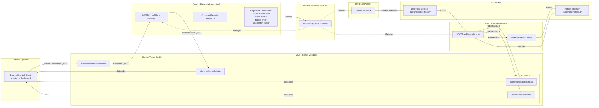
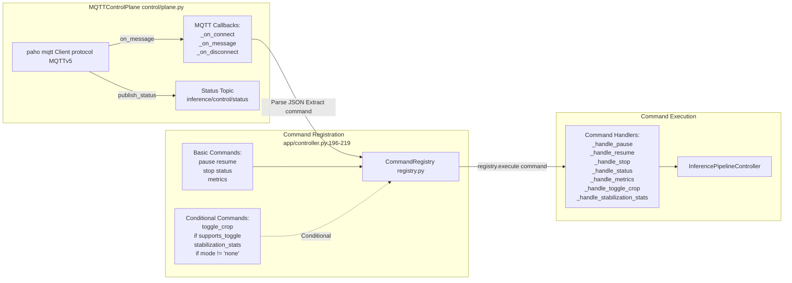
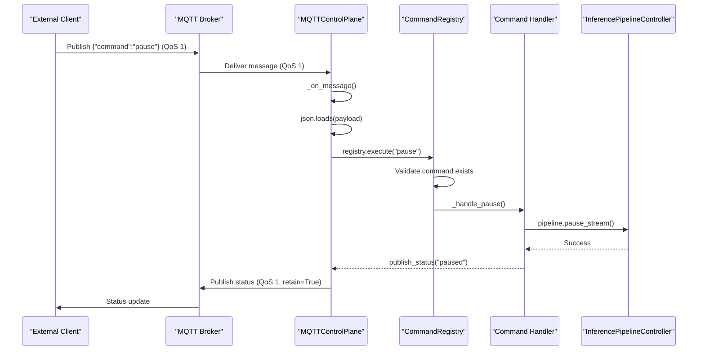
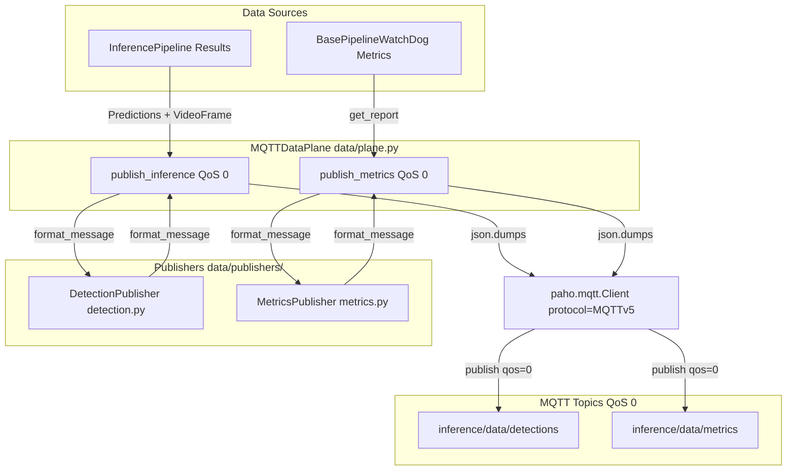
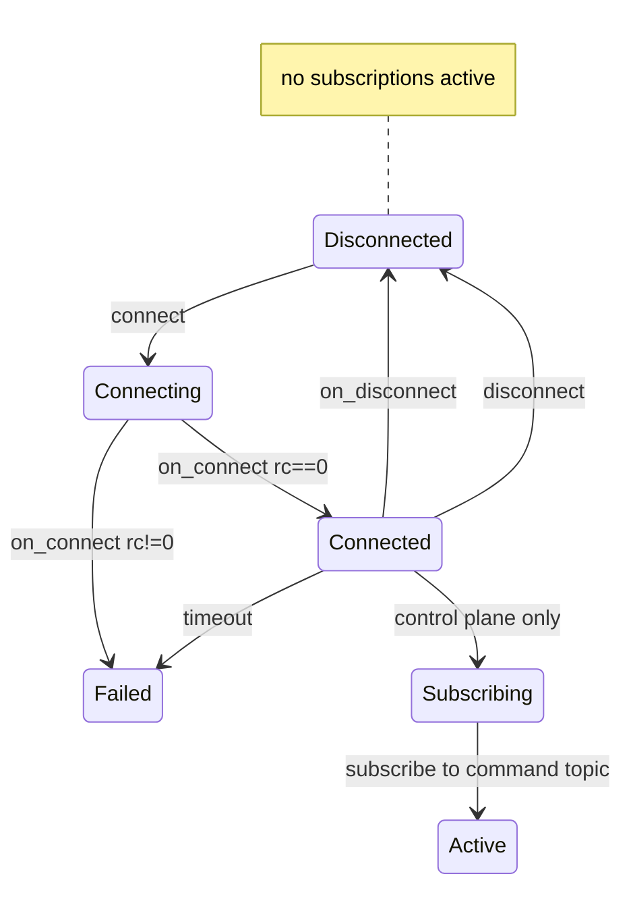
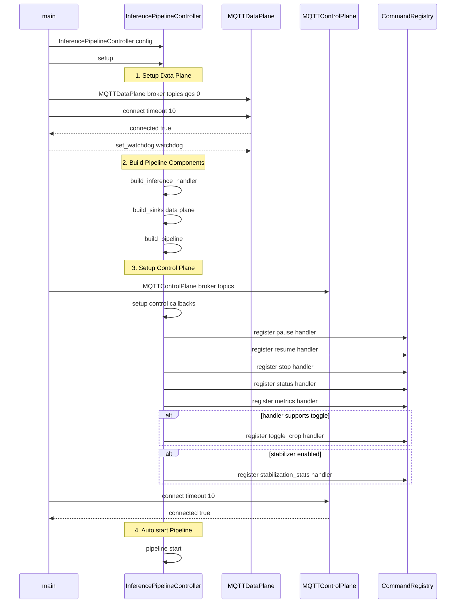

# MQTT Communication

Relevant source files

- [adeline/CLAUDE.md](https://github.com/acare7/kata-inference-251021-clean4/blob/a0662727/adeline/CLAUDE.md)
- [adeline/app/controller.py](https://github.com/acare7/kata-inference-251021-clean4/blob/a0662727/adeline/app/controller.py)
- [adeline/control/plane.py](https://github.com/acare7/kata-inference-251021-clean4/blob/a0662727/adeline/control/plane.py)
- [adeline/control/registry.py](https://github.com/acare7/kata-inference-251021-clean4/blob/a0662727/adeline/control/registry.py)
- [adeline/data/plane.py](https://github.com/acare7/kata-inference-251021-clean4/blob/a0662727/adeline/data/plane.py)
- [adeline/data/publishers/__init__.py](https://github.com/acare7/kata-inference-251021-clean4/blob/a0662727/adeline/data/publishers/__init__.py)
- [adeline/data/publishers/detection.py](https://github.com/acare7/kata-inference-251021-clean4/blob/a0662727/adeline/data/publishers/detection.py)
- [adeline/data/publishers/metrics.py](https://github.com/acare7/kata-inference-251021-clean4/blob/a0662727/adeline/data/publishers/metrics.py)

## Purpose and Scope

This document covers the dual-plane MQTT architecture used for remote control and data publishing in the Adeline inference pipeline. The system separates reliable command delivery (Control Plane) from high-throughput data streaming (Data Plane) to optimize for both reliability and performance.

For information about specific MQTT commands and their usage, see [Command Reference](https://deepwiki.com/acare7/kata-inference-251021-clean4/4.3-command-reference). For details on pipeline orchestration that uses these MQTT planes, see [InferencePipelineController](https://deepwiki.com/acare7/kata-inference-251021-clean4/3.1-inferencepipelinecontroller).

## Overview

The Adeline system implements a **dual-plane MQTT architecture** that separates concerns between control and data:

- **Control Plane**: Receives commands to control the pipeline (pause, resume, stop, etc.) using QoS 1 for guaranteed delivery
- **Data Plane**: Publishes inference results and metrics using QoS 0 for maximum throughput with best-effort delivery

This separation ensures that critical control commands are never lost while allowing high-frequency data publishing without overwhelming the broker.

**Sources**: [adeline/CLAUDE.md90-102](https://github.com/acare7/kata-inference-251021-clean4/blob/a0662727/adeline/CLAUDE.md#L90-L102) [adeline/app/controller.py1-7](https://github.com/acare7/kata-inference-251021-clean4/blob/a0662727/adeline/app/controller.py#L1-L7)

## Dual-Plane Architecture

The following diagram shows the complete MQTT communication architecture and how it integrates with the pipeline:





**Architecture Notes**:

- **Separation of Concerns**: Control plane handles lifecycle, data plane handles output
- **QoS Differentiation**: QoS 1 for control (reliable), QoS 0 for data (performance)
- **Registry Pattern**: Commands are explicitly registered based on system capabilities
- **Publisher Pattern**: Detection and metrics formatting is delegated to specialized publishers

**Sources**: [adeline/app/controller.py58-195](https://github.com/acare7/kata-inference-251021-clean4/blob/a0662727/adeline/app/controller.py#L58-L195) [adeline/control/plane.py26-172](https://github.com/acare7/kata-inference-251021-clean4/blob/a0662727/adeline/control/plane.py#L26-L172) [adeline/data/plane.py27-205](https://github.com/acare7/kata-inference-251021-clean4/blob/a0662727/adeline/data/plane.py#L27-L205)

## Control Plane Architecture

The Control Plane (`MQTTControlPlane`) is responsible for receiving and processing commands. It uses the `CommandRegistry` pattern to ensure only explicitly registered commands are available.

### Control Plane Components



**Sources**: [adeline/control/plane.py26-172](https://github.com/acare7/kata-inference-251021-clean4/blob/a0662727/adeline/control/plane.py#L26-L172) [adeline/app/controller.py196-343](https://github.com/acare7/kata-inference-251021-clean4/blob/a0662727/adeline/app/controller.py#L196-L343)

### CommandRegistry Pattern

The `CommandRegistry` provides explicit command registration with validation:

|Feature|Implementation|Purpose|
|---|---|---|
|**Explicit Registration**|`registry.register(command, handler, description)`|Only registered commands are available|
|**Validation**|`CommandNotAvailableError` raised if command not found|Fail-fast with clear error message|
|**Introspection**|`available_commands` property|List all available commands|
|**Conditional Commands**|Registration only if capability exists|`toggle_crop` only if `supports_toggle=True`|

**Example Command Registration** [adeline/app/controller.py196-219](https://github.com/acare7/kata-inference-251021-clean4/blob/a0662727/adeline/app/controller.py#L196-L219):

```
# Basic commands (always available)
registry.register('pause', self._handle_pause, "Pausa el procesamiento")
registry.register('resume', self._handle_resume, "Reanuda el procesamiento")
registry.register('stop', self._handle_stop, "Detiene y finaliza el pipeline")

# Conditional command: toggle_crop
if self.inference_handler and self.inference_handler.supports_toggle:
    registry.register('toggle_crop', self._handle_toggle_crop, "Toggle adaptive ROI crop")

# Conditional command: stabilization_stats
if self.stabilizer is not None:
    registry.register('stabilization_stats', self._handle_stabilization_stats, "Estadísticas de estabilización")
```

**Sources**: [adeline/control/registry.py28-142](https://github.com/acare7/kata-inference-251021-clean4/blob/a0662727/adeline/control/registry.py#L28-L142) [adeline/app/controller.py196-219](https://github.com/acare7/kata-inference-251021-clean4/blob/a0662727/adeline/app/controller.py#L196-L219)

### Command Reception Flow



**Key Features**:

- **QoS 1**: Messages are acknowledged by broker (guaranteed delivery)
- **JSON Parsing**: [adeline/control/plane.py103-134](https://github.com/acare7/kata-inference-251021-clean4/blob/a0662727/adeline/control/plane.py#L103-L134)
- **Registry Validation**: [adeline/control/registry.py79-101](https://github.com/acare7/kata-inference-251021-clean4/blob/a0662727/adeline/control/registry.py#L79-L101)
- **Status Publishing**: [adeline/control/plane.py135-153](https://github.com/acare7/kata-inference-251021-clean4/blob/a0662727/adeline/control/plane.py#L135-L153)

**Sources**: [adeline/control/plane.py103-134](https://github.com/acare7/kata-inference-251021-clean4/blob/a0662727/adeline/control/plane.py#L103-L134) [adeline/control/registry.py79-101](https://github.com/acare7/kata-inference-251021-clean4/blob/a0662727/adeline/control/registry.py#L79-L101)

## Data Plane Architecture

The Data Plane (`MQTTDataPlane`) publishes inference results and metrics with high throughput using QoS 0 (fire-and-forget).

### Data Plane Components





**Sources**: [adeline/data/plane.py27-205](https://github.com/acare7/kata-inference-251021-clean4/blob/a0662727/adeline/data/plane.py#L27-L205) [adeline/data/publishers/detection.py22-143](https://github.com/acare7/kata-inference-251021-clean4/blob/a0662727/adeline/data/publishers/detection.py#L22-L143) [adeline/data/publishers/metrics.py25-88](https://github.com/acare7/kata-inference-251021-clean4/blob/a0662727/adeline/data/publishers/metrics.py#L25-L88)

### Publisher Separation

The Data Plane delegates message formatting to specialized publishers:

|Component|Responsibility|Key Methods|
|---|---|---|
|`MQTTDataPlane`|MQTT infrastructure (connect, publish, disconnect)|`connect()`, `publish_inference()`, `publish_metrics()`|
|`DetectionPublisher`|Format detection messages|`format_message(predictions, video_frame)`|
|`MetricsPublisher`|Format metrics messages|`format_message()`|

**Design Rationale** [adeline/data/plane.py8-11](https://github.com/acare7/kata-inference-251021-clean4/blob/a0662727/adeline/data/plane.py#L8-L11):

- **SRP**: Data Plane handles infrastructure, Publishers handle business logic
- **Testability**: Publishers can be tested independently of MQTT
- **Extensibility**: New message types require only new publishers

**Sources**: [adeline/data/plane.py27-205](https://github.com/acare7/kata-inference-251021-clean4/blob/a0662727/adeline/data/plane.py#L27-L205) [adeline/data/publishers/__init__.py1-21](https://github.com/acare7/kata-inference-251021-clean4/blob/a0662727/adeline/data/publishers/__init__.py#L1-L21)

### Detection Message Format

The `DetectionPublisher` formats predictions into standardized MQTT messages:

**Message Structure** [adeline/data/publishers/detection.py104-115](https://github.com/acare7/kata-inference-251021-clean4/blob/a0662727/adeline/data/publishers/detection.py#L104-L115):

```
{
  "timestamp": "2024-01-15T10:30:45.123456",
  "message_id": 12345,
  "detection_count": 2,
  "detections": [
    {
      "class": "person",
      "confidence": 0.89,
      "bbox": {"x": 150, "y": 200, "width": 80, "height": 120},
      "class_id": 0
    }
  ],
  "frame": {
    "frame_id": 42,
    "source_id": 0,
    "timestamp": "2024-01-15T10:30:45.120000"
  },
  "roi_metrics": {
    "cropped": true,
    "roi_box": {"x": 100, "y": 150, "width": 300, "height": 400}
  }
}
```

**Key Fields**:

- `detections`: Array of detected objects with class, confidence, and bounding box
- `frame`: Frame metadata (frame_id, source_id, timestamp)
- `roi_metrics`: Optional ROI crop metadata (if adaptive mode enabled)

**Sources**: [adeline/data/publishers/detection.py61-143](https://github.com/acare7/kata-inference-251021-clean4/blob/a0662727/adeline/data/publishers/detection.py#L61-L143)

### Metrics Message Format

The `MetricsPublisher` formats pipeline performance metrics:

**Message Structure** [adeline/data/publishers/metrics.py62-78](https://github.com/acare7/kata-inference-251021-clean4/blob/a0662727/adeline/data/publishers/metrics.py#L62-L78):

```
{
  "timestamp": "2024-01-15T10:30:45.123456",
  "throughput_fps": 28.5,
  "latency_reports": [
    {
      "source_id": 0,
      "frame_decoding_latency_ms": 12.3,
      "inference_latency_ms": 45.6,
      "e2e_latency_ms": 60.1
    }
  ],
  "sources_count": 1
}
```

**Sources**: [adeline/data/publishers/metrics.py46-83](https://github.com/acare7/kata-inference-251021-clean4/blob/a0662727/adeline/data/publishers/metrics.py#L46-L83)

## MQTT Topics and QoS Configuration

The system uses distinct topics for each communication channel:

|Topic|Direction|QoS|Purpose|Retain Flag|
|---|---|---|---|---|
|`inference/control/commands`|Subscribe|1|Receive control commands|No|
|`inference/control/status`|Publish|1|Publish pipeline status|Yes|
|`inference/data/detections`|Publish|0|Publish detection results|No|
|`inference/data/metrics`|Publish|0|Publish performance metrics|No|

**QoS Level Rationale**:

|QoS|Use Case|Reason|
|---|---|---|
|**QoS 1** (Control)|Commands and status|Critical operations (stop, pause) cannot be lost. Acknowledgment ensures delivery.|
|**QoS 0** (Data)|Detections and metrics|High-frequency publishing (up to 30 FPS). Best-effort delivery for performance. Missing one frame is acceptable.|

**Retain Flag Usage** [adeline/control/plane.py135-153](https://github.com/acare7/kata-inference-251021-clean4/blob/a0662727/adeline/control/plane.py#L135-L153):

- **Status Topic**: `retain=True` ensures last status is available to new subscribers
- **Detection/Metrics Topics**: No retain (streaming data)

**Sources**: [adeline/app/controller.py106-118](https://github.com/acare7/kata-inference-251021-clean4/blob/a0662727/adeline/app/controller.py#L106-L118) [adeline/control/plane.py56-70](https://github.com/acare7/kata-inference-251021-clean4/blob/a0662727/adeline/control/plane.py#L56-L70) [adeline/data/plane.py40-59](https://github.com/acare7/kata-inference-251021-clean4/blob/a0662727/adeline/data/plane.py#L40-L59)

## Connection Management

### Connection Lifecycle





**Connection Implementation**:

**Control Plane** [adeline/control/plane.py155-164](https://github.com/acare7/kata-inference-251021-clean4/blob/a0662727/adeline/control/plane.py#L155-L164):

```
def connect(self, timeout: float = 5.0) -> bool:
    self.client.connect(self.broker_host, self.broker_port, keepalive=60)
    self.client.loop_start()  # Background thread for MQTT
    return self._connected.wait(timeout=timeout)  # Wait for on_connect
```

**Data Plane** [adeline/data/plane.py89-98](https://github.com/acare7/kata-inference-251021-clean4/blob/a0662727/adeline/data/plane.py#L89-L98):

```
def connect(self, timeout: float = 5.0) -> bool:
    self.client.connect(self.broker_host, self.broker_port, keepalive=60)
    self.client.loop_start()  # Background thread for MQTT
    return self._connected.wait(timeout=timeout)
```

**Key Features**:

- **Background Thread**: `loop_start()` runs MQTT event loop in separate thread
- **Timeout**: Connection waits up to 5 seconds for acknowledgment
- **Keepalive**: 60-second keepalive prevents connection drops
- **Authentication**: Username/password set via `username_pw_set()` if provided

**Sources**: [adeline/control/plane.py155-164](https://github.com/acare7/kata-inference-251021-clean4/blob/a0662727/adeline/control/plane.py#L155-L164) [adeline/data/plane.py89-98](https://github.com/acare7/kata-inference-251021-clean4/blob/a0662727/adeline/data/plane.py#L89-L98)

### Disconnection and Cleanup

**Disconnect Sequence** [adeline/app/controller.py398-443](https://github.com/acare7/kata-inference-251021-clean4/blob/a0662727/adeline/app/controller.py#L398-L443):

1. Publish "disconnected" status (Control Plane only)
2. Stop MQTT event loop (`loop_stop()`)
3. Disconnect from broker (`disconnect()`)

```
def cleanup(self):
    # Control Plane
    if self.control_plane:
        self.control_plane.disconnect()  # Publishes "disconnected" status
    
    # Data Plane
    if self.data_plane:
        stats = self.data_plane.get_stats()
        logger.info(f"Data Plane stats: {stats}")
        self.data_plane.disconnect()
```

**Sources**: [adeline/app/controller.py398-443](https://github.com/acare7/kata-inference-251021-clean4/blob/a0662727/adeline/app/controller.py#L398-L443) [adeline/control/plane.py166-171](https://github.com/acare7/kata-inference-251021-clean4/blob/a0662727/adeline/control/plane.py#L166-L171) [adeline/data/plane.py100-104](https://github.com/acare7/kata-inference-251021-clean4/blob/a0662727/adeline/data/plane.py#L100-L104)

## Error Handling

### Connection Failures

Both planes implement timeout-based connection with boolean return:

```
if not self.control_plane.connect(timeout=10):
    logger.error("❌ No se pudo conectar Control Plane")
    return False

if not self.data_plane.connect(timeout=10):
    logger.error("❌ No se pudo conectar Data Plane")
    return False
```

**Sources**: [adeline/app/controller.py120-122](https://github.com/acare7/kata-inference-251021-clean4/blob/a0662727/adeline/app/controller.py#L120-L122) [adeline/app/controller.py175-178](https://github.com/acare7/kata-inference-251021-clean4/blob/a0662727/adeline/app/controller.py#L175-L178)

### Message Publishing Failures

**Data Plane** [adeline/data/plane.py131-141](https://github.com/acare7/kata-inference-251021-clean4/blob/a0662727/adeline/data/plane.py#L131-L141):

- Checks connection state before publishing
- Logs warning if disconnected (message discarded)
- Fire-and-forget: no retry logic (QoS 0)

```
if not self._connected.is_set():
    logger.warning("⚠️ Data Plane no conectado, mensaje descartado")
    return

result = self.client.publish(topic, payload, qos=self.qos)
if result.rc != mqtt.MQTT_ERR_SUCCESS:
    logger.warning(f"⚠️ Error publicando mensaje: {result.rc}")
```

### Command Validation Failures

**CommandRegistry** [adeline/control/registry.py79-101](https://github.com/acare7/kata-inference-251021-clean4/blob/a0662727/adeline/control/registry.py#L79-L101):

- Raises `CommandNotAvailableError` if command not registered
- Lists available commands in error message
- Caught by Control Plane and logged as warning

```
try:
    self.command_registry.execute(command)
except CommandNotAvailableError as e:
    logger.warning(f"⚠️ {e}")
    available = ', '.join(sorted(self.command_registry.available_commands))
    logger.info(f"💡 Comandos disponibles: {available}")
```

**Sources**: [adeline/control/registry.py79-101](https://github.com/acare7/kata-inference-251021-clean4/blob/a0662727/adeline/control/registry.py#L79-L101) [adeline/control/plane.py119-128](https://github.com/acare7/kata-inference-251021-clean4/blob/a0662727/adeline/control/plane.py#L119-L128)

## Integration with Pipeline Controller

The `InferencePipelineController` orchestrates both planes during setup:





**Setup Phases** [adeline/app/controller.py92-194](https://github.com/acare7/kata-inference-251021-clean4/blob/a0662727/adeline/app/controller.py#L92-L194):

1. **Data Plane Setup**: Connect and configure watchdog
2. **Component Construction**: Build handlers, sinks, pipeline
3. **Control Plane Setup**: Register commands based on capabilities
4. **Pipeline Start**: Auto-start inference processing

**Sources**: [adeline/app/controller.py92-194](https://github.com/acare7/kata-inference-251021-clean4/blob/a0662727/adeline/app/controller.py#L92-L194)

## Configuration

MQTT connection parameters are configured via `config.yaml`:

```
mqtt:
  broker: "localhost"
  port: 1883
  username: null  # Optional, from .env MQTT_USERNAME
  password: null  # Optional, from .env MQTT_PASSWORD
  
  topics:
    control:
      commands: "inference/control/commands"
      status: "inference/control/status"
    data:
      detections: "inference/data/detections"
      metrics: "inference/data/metrics"
  
  qos:
    control: 1  # Reliable delivery for commands
    data: 0     # Best-effort for high-throughput data
```

**Environment Variables** [adeline/app/controller.py18-19](https://github.com/acare7/kata-inference-251021-clean4/blob/a0662727/adeline/app/controller.py#L18-L19):

- `MQTT_USERNAME`: MQTT broker username (sensitive)
- `MQTT_PASSWORD`: MQTT broker password (sensitive)

**Sources**: [adeline/app/controller.py18-19](https://github.com/acare7/kata-inference-251021-clean4/blob/a0662727/adeline/app/controller.py#L18-L19) [adeline/app/controller.py449-477](https://github.com/acare7/kata-inference-251021-clean4/blob/a0662727/adeline/app/controller.py#L449-L477)