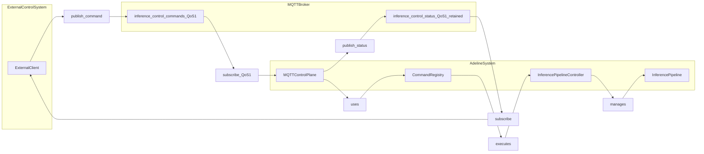
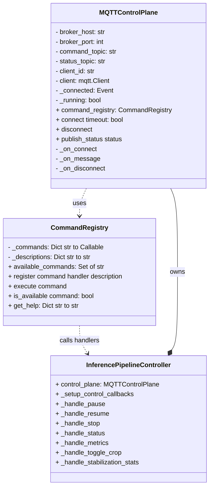
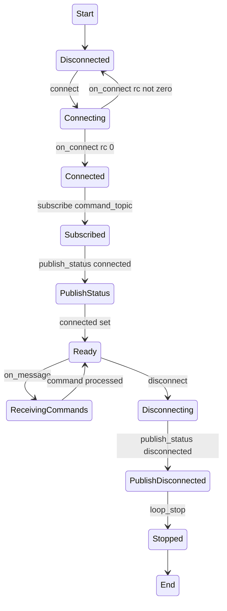
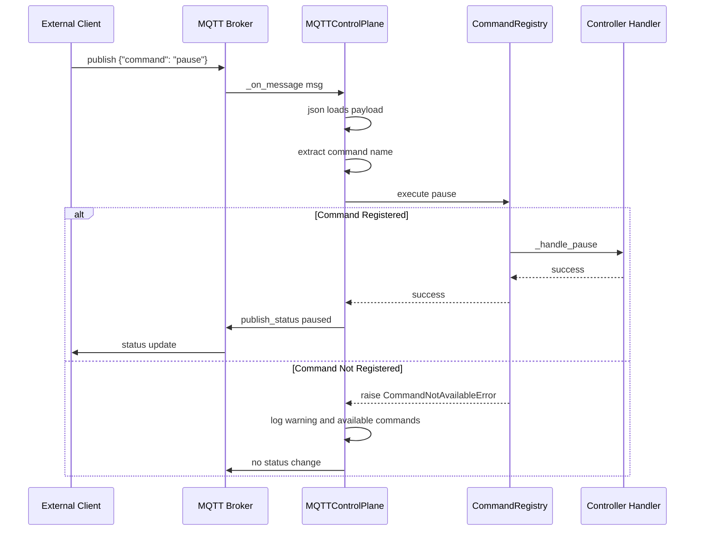
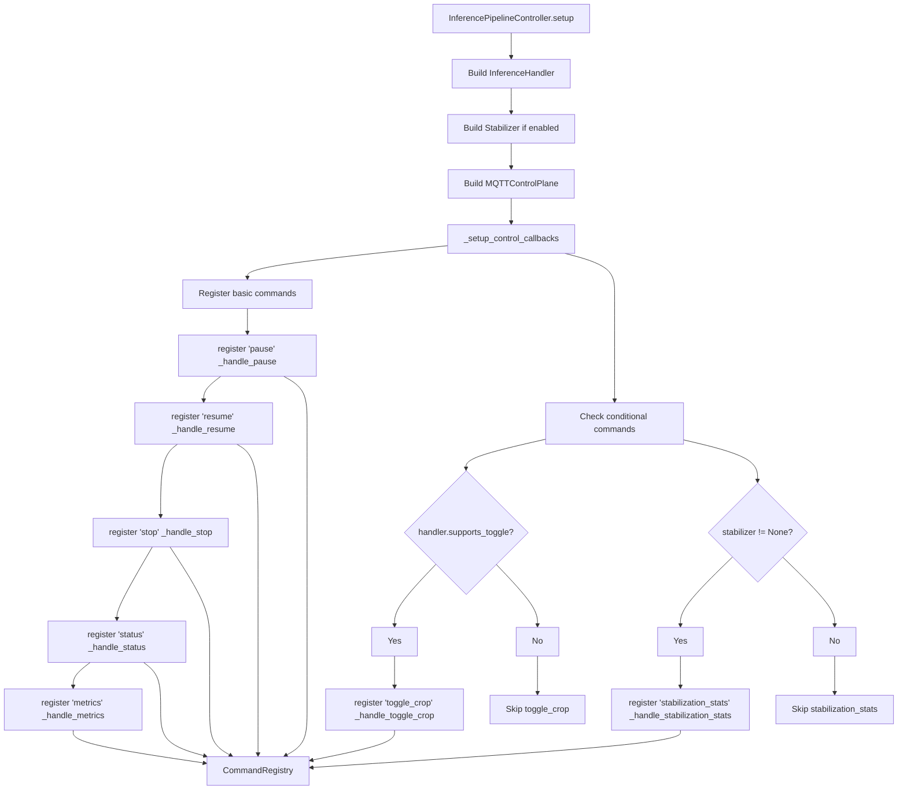
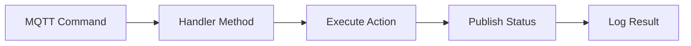
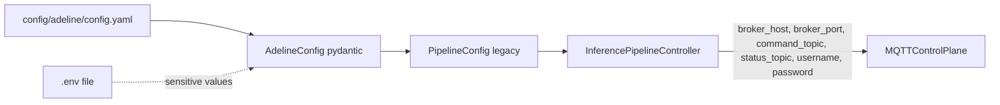
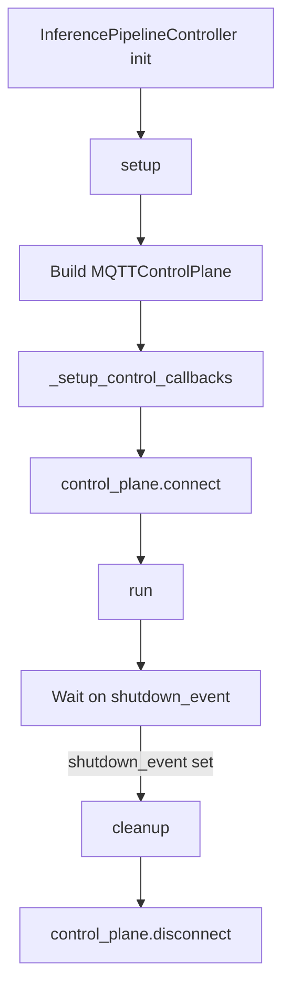

# Control Plane

Relevant source files

- [adeline/CLAUDE.md](https://github.com/acare7/kata-inference-251021-clean4/blob/a0662727/adeline/CLAUDE.md)
- [adeline/app/controller.py](https://github.com/acare7/kata-inference-251021-clean4/blob/a0662727/adeline/app/controller.py)
- [adeline/control/plane.py](https://github.com/acare7/kata-inference-251021-clean4/blob/a0662727/adeline/control/plane.py)
- [adeline/control/registry.py](https://github.com/acare7/kata-inference-251021-clean4/blob/a0662727/adeline/control/registry.py)

## Purpose and Scope

The Control Plane provides reliable command-and-control capabilities for the Adeline inference pipeline via MQTT. It uses QoS 1 (at-least-once delivery) to ensure critical control commands like pause, stop, and resume are not lost in transit. The Control Plane uses the `CommandRegistry` pattern to explicitly register only available commands, preventing runtime errors from unsupported operations.

For information about publishing detection results and metrics, see [Data Plane](https://deepwiki.com/acare7/kata-inference-251021-clean4/4.2-data-plane). For a complete reference of all available commands and their payloads, see [Command Reference](https://deepwiki.com/acare7/kata-inference-251021-clean4/4.3-command-reference).

---

## Architecture Overview

The Control Plane is implemented by the `MQTTControlPlane` class, which receives commands via MQTT and delegates execution to registered command handlers. The system uses a registry pattern to separate command availability from command implementation.

### Control Plane in System Context



**Sources:** [control/plane.py26-172](https://github.com/acare7/kata-inference-251021-clean4/blob/a0662727/control/plane.py#L26-L172) [app/controller.py164-179](https://github.com/acare7/kata-inference-251021-clean4/blob/a0662727/app/controller.py#L164-L179)

### Component Responsibilities

|Component|Responsibility|File Location|
|---|---|---|
|`MQTTControlPlane`|MQTT connection management, message reception, status publishing|[control/plane.py26-172](https://github.com/acare7/kata-inference-251021-clean4/blob/a0662727/control/plane.py#L26-L172)|
|`CommandRegistry`|Command registration, validation, execution delegation|[control/registry.py28-142](https://github.com/acare7/kata-inference-251021-clean4/blob/a0662727/control/registry.py#L28-L142)|
|`InferencePipelineController`|Command handler implementation, conditional registration|[app/controller.py196-343](https://github.com/acare7/kata-inference-251021-clean4/blob/a0662727/app/controller.py#L196-L343)|

**Sources:** [control/plane.py1-172](https://github.com/acare7/kata-inference-251021-clean4/blob/a0662727/control/plane.py#L1-L172) [control/registry.py1-142](https://github.com/acare7/kata-inference-251021-clean4/blob/a0662727/control/registry.py#L1-L142) [app/controller.py58-444](https://github.com/acare7/kata-inference-251021-clean4/blob/a0662727/app/controller.py#L58-L444)

---

## MQTTControlPlane Implementation

### Class Structure

The `MQTTControlPlane` class manages the MQTT connection and command processing lifecycle.



**Sources:** [control/plane.py26-172](https://github.com/acare7/kata-inference-251021-clean4/blob/a0662727/control/plane.py#L26-L172) [control/registry.py28-142](https://github.com/acare7/kata-inference-251021-clean4/blob/a0662727/control/registry.py#L28-L142) [app/controller.py58-343](https://github.com/acare7/kata-inference-251021-clean4/blob/a0662727/app/controller.py#L58-L343)

### Connection Lifecycle

The Control Plane follows a standard MQTT connection pattern with event-based synchronization:




**Sources:** [control/plane.py87-172](https://github.com/acare7/kata-inference-251021-clean4/blob/a0662727/control/plane.py#L87-L172)

### QoS 1 for Reliability

The Control Plane uses **QoS 1** (at-least-once delivery) for both subscribing to commands and publishing status updates. This ensures critical control operations are reliably delivered:

```
# Subscription with QoS 1
self.client.subscribe(self.command_topic, qos=1)  # control/plane.py:91

# Status publishing with QoS 1 and retain flag
self.client.publish(
    self.status_topic,
    json.dumps(message),
    qos=1,
    retain=True  # Last status is retained for new subscribers
)  # control/plane.py:147-152
```

**Rationale for QoS 1:**

- Commands like `stop` and `pause` are critical and cannot be lost
- Status updates should be delivered to monitoring systems
- Higher QoS ensures reliability at minimal latency cost (control commands are infrequent)

**Sources:** [control/plane.py91](https://github.com/acare7/kata-inference-251021-clean4/blob/a0662727/control/plane.py#L91-L91) [control/plane.py147-152](https://github.com/acare7/kata-inference-251021-clean4/blob/a0662727/control/plane.py#L147-L152)

---

## CommandRegistry Pattern

The `CommandRegistry` implements an explicit registration pattern that solves several design problems:

### Design Motivation

|Problem|Solution|
|---|---|
|Optional callbacks (`on_pause`, `on_stop`) make it unclear which commands are available|Explicit registration: only register commands that are available|
|No validation if command exists before execution|Registry validates command existence and raises `CommandNotAvailableError`|
|No introspection of available commands|`available_commands` property provides set of registered commands|
|Command handlers tightly coupled to Control Plane|Registry decouples command names from handler implementations|

**Sources:** [control/registry.py1-26](https://github.com/acare7/kata-inference-251021-clean4/blob/a0662727/control/registry.py#L1-L26) [CLAUDE.md90-97](https://github.com/acare7/kata-inference-251021-clean4/blob/a0662727/CLAUDE.md#L90-L97)

### Command Flow




**Sources:** [control/plane.py103-133](https://github.com/acare7/kata-inference-251021-clean4/blob/a0662727/control/plane.py#L103-L133) [control/registry.py79-101](https://github.com/acare7/kata-inference-251021-clean4/blob/a0662727/control/registry.py#L79-L101)

### Registration API

The `CommandRegistry` provides a simple registration API:

```
# Basic registration
registry.register('pause', handler.pause, "Pauses the processing")
# control/registry.py:60-77

# Conditional registration (only if capability supported)
if handler.supports_toggle:
    registry.register('toggle_crop', handler.toggle, "Toggle ROI crop")
# app/controller.py:212-214
```

Key methods:

|Method|Purpose|Returns|
|---|---|---|
|`register(command, handler, description)`|Register a command with handler function|None|
|`execute(command)`|Execute registered command|Result from handler|
|`is_available(command)`|Check if command is registered|bool|
|`available_commands`|Property with set of registered commands|Set[str]|
|`get_help()`|Get command descriptions|Dict[str, str]|

**Sources:** [control/registry.py60-136](https://github.com/acare7/kata-inference-251021-clean4/blob/a0662727/control/registry.py#L60-L136)

---

## Command Registration Process

Commands are registered during the controller's setup phase in the `_setup_control_callbacks()` method.

### Registration Sequence




**Sources:** [app/controller.py196-219](https://github.com/acare7/kata-inference-251021-clean4/blob/a0662727/app/controller.py#L196-L219)

### Conditional Command Registration

The system registers commands conditionally based on system capabilities:

```
# Always registered (basic commands)
registry.register('pause', self._handle_pause, "Pauses the processing")
registry.register('resume', self._handle_resume, "Resumes the processing")
registry.register('stop', self._handle_stop, "Stops and terminates the pipeline")
registry.register('status', self._handle_status, "Queries current status")
registry.register('metrics', self._handle_metrics, "Publishes pipeline metrics")
# app/controller.py:205-209

# Conditional: only if handler supports toggle
if self.inference_handler and self.inference_handler.supports_toggle:
    registry.register('toggle_crop', self._handle_toggle_crop, "Toggle adaptive ROI crop")
    logger.info("✅ toggle_crop command registered (handler supports toggle)")
# app/controller.py:212-214

# Conditional: only if stabilization enabled
if self.stabilizer is not None:
    registry.register('stabilization_stats', self._handle_stabilization_stats, "Stabilization statistics")
    logger.info("✅ stabilization_stats command registered")
# app/controller.py:217-219
```

This design ensures that:

1. Only available commands are registered
2. Users cannot invoke unsupported commands
3. Command availability is determined at setup time, not runtime
4. Clear logging indicates which conditional commands are available

**Sources:** [app/controller.py196-219](https://github.com/acare7/kata-inference-251021-clean4/blob/a0662727/app/controller.py#L196-L219) [CLAUDE.md92-97](https://github.com/acare7/kata-inference-251021-clean4/blob/a0662727/CLAUDE.md#L92-L97)

---

## Command Handler Implementation

Each registered command maps to a handler method in `InferencePipelineController`. Handlers follow a consistent pattern:

### Handler Pattern





### Example Handlers

**Pause Command:**

```
def _handle_pause(self):
    """Callback for PAUSE command - temporarily pauses processing"""
    logger.info("⏸️ Command PAUSE received")
    if self.is_running:
        try:
            self.pipeline.pause_stream()
            self.control_plane.publish_status("paused")
            logger.info("✅ Pipeline paused (use RESUME to continue)")
        except Exception as e:
            logger.error(f"❌ Error pausing pipeline: {e}", exc_info=True)
    else:
        logger.warning("⚠️ Pipeline not running, cannot pause")
# app/controller.py:246-257
```

**Stop Command:**

```
def _handle_stop(self):
    """Callback for STOP command - stops and terminates the program"""
    logger.info("⏹️ Command STOP received")
    if self.is_running:
        try:
            self.pipeline.terminate()
            self.is_running = False
            logger.info("✅ Pipeline stopped")
        except Exception as e:
            logger.error(f"❌ Error stopping pipeline: {e}")
    
    # Publish status
    self.control_plane.publish_status("stopped")
    
    # Trigger shutdown event
    logger.info("🛑 Finalizing service...")
    self.shutdown_event.set()
# app/controller.py:228-244
```

**Sources:** [app/controller.py228-285](https://github.com/acare7/kata-inference-251021-clean4/blob/a0662727/app/controller.py#L228-L285)

---

## Status Publishing

The Control Plane publishes status updates to inform external systems about pipeline state changes.

### Status Message Format

```
{
  "status": "running",
  "timestamp": "2024-01-15T10:30:45.123456",
  "client_id": "inference_control"
}
```

Status values:

- `"connected"` - Control Plane connected to broker
- `"running"` - Pipeline is processing
- `"paused"` - Pipeline is paused
- `"stopped"` - Pipeline has stopped
- `"disconnected"` - Control Plane disconnected

**Sources:** [control/plane.py136-153](https://github.com/acare7/kata-inference-251021-clean4/blob/a0662727/control/plane.py#L136-L153)

### Status Publishing Points

|Event|Status Published|Trigger|
|---|---|---|
|Connection established|`"connected"`|`_on_connect()` callback|
|Pause command received|`"paused"`|`_handle_pause()`|
|Resume command received|`"running"`|`_handle_resume()`|
|Stop command received|`"stopped"`|`_handle_stop()`|
|Disconnection|`"disconnected"`|`disconnect()`|

**Retained Messages:** Status messages are published with the `retain=True` flag, ensuring that new subscribers immediately receive the last known status without waiting for the next state change.

**Sources:** [control/plane.py136-153](https://github.com/acare7/kata-inference-251021-clean4/blob/a0662727/control/plane.py#L136-L153) [control/plane.py94](https://github.com/acare7/kata-inference-251021-clean4/blob/a0662727/control/plane.py#L94-L94) [control/plane.py169](https://github.com/acare7/kata-inference-251021-clean4/blob/a0662727/control/plane.py#L169-L169)

---

## MQTT Configuration

### Connection Parameters

The Control Plane accepts the following configuration parameters:

|Parameter|Type|Default|Description|
|---|---|---|---|
|`broker_host`|str|(required)|MQTT broker hostname|
|`broker_port`|int|1883|MQTT broker port|
|`command_topic`|str|`"inference/control/commands"`|Topic for receiving commands|
|`status_topic`|str|`"inference/control/status"`|Topic for publishing status|
|`client_id`|str|`"inference_control"`|MQTT client identifier|
|`username`|str|None|MQTT authentication username|
|`password`|str|None|MQTT authentication password|

**Sources:** [control/plane.py56-65](https://github.com/acare7/kata-inference-251021-clean4/blob/a0662727/control/plane.py#L56-L65)

### Configuration in System Context

Configuration flows from YAML to Control Plane:





Configuration values:

```
# In controller setup
self.control_plane = MQTTControlPlane(
    broker_host=self.config.MQTT_BROKER,
    broker_port=self.config.MQTT_PORT,
    command_topic=self.config.CONTROL_COMMAND_TOPIC,
    status_topic=self.config.CONTROL_STATUS_TOPIC,
    username=self.config.MQTT_USERNAME,
    password=self.config.MQTT_PASSWORD,
)
# app/controller.py:164-171
```

**Sources:** [app/controller.py164-171](https://github.com/acare7/kata-inference-251021-clean4/blob/a0662727/app/controller.py#L164-L171) [control/plane.py56-78](https://github.com/acare7/kata-inference-251021-clean4/blob/a0662727/control/plane.py#L56-L78)

---

## Error Handling

The Control Plane implements comprehensive error handling at multiple levels:

### Connection Errors

```
def connect(self, timeout: float = 5.0) -> bool:
    """Connects to MQTT broker"""
    try:
        logger.info(f"🔌 Connecting to MQTT broker: {self.broker_host}:{self.broker_port}")
        self.client.connect(self.broker_host, self.broker_port, keepalive=60)
        self.client.loop_start()
        return self._connected.wait(timeout=timeout)
    except Exception as e:
        logger.error(f"❌ Error connecting to MQTT: {e}")
        return False
# control/plane.py:155-164
```

### Command Execution Errors

```
try:
    self.command_registry.execute(command)
    logger.debug(f"✅ Command '{command}' executed correctly")

except CommandNotAvailableError as e:
    logger.warning(f"⚠️ {e}")
    # List available commands to help user
    available = ', '.join(sorted(self.command_registry.available_commands))
    logger.info(f"💡 Available commands: {available}")
# control/plane.py:120-128
```

### Message Parsing Errors

```
try:
    payload = msg.payload.decode('utf-8')
    logger.debug(f"📦 Payload: {payload}")
    command_data = json.loads(payload)
    command = command_data.get('command', '').lower()
    # ...
except json.JSONDecodeError:
    logger.error(f"❌ Error decoding JSON: {msg.payload}")
except Exception as e:
    logger.error(f"❌ Error processing message: {e}", exc_info=True)
# control/plane.py:111-133
```

**Sources:** [control/plane.py103-164](https://github.com/acare7/kata-inference-251021-clean4/blob/a0662727/control/plane.py#L103-L164)

---

## Integration with InferencePipelineController

The Control Plane is tightly integrated with the controller's lifecycle:




**Key integration points:**

1. **Setup Phase:** Control Plane created and connected [app/controller.py163-178](https://github.com/acare7/kata-inference-251021-clean4/blob/a0662727/app/controller.py#L163-L178)
2. **Command Registration:** Handlers registered via `_setup_control_callbacks()` [app/controller.py196-219](https://github.com/acare7/kata-inference-251021-clean4/blob/a0662727/app/controller.py#L196-L219)
3. **Runtime:** Commands execute controller methods [app/controller.py228-343](https://github.com/acare7/kata-inference-251021-clean4/blob/a0662727/app/controller.py#L228-L343)
4. **Cleanup:** Control Plane disconnected in `cleanup()` [app/controller.py426-430](https://github.com/acare7/kata-inference-251021-clean4/blob/a0662727/app/controller.py#L426-L430)

**Sources:** [app/controller.py92-443](https://github.com/acare7/kata-inference-251021-clean4/blob/a0662727/app/controller.py#L92-L443)

---

## Summary

The Control Plane provides:

1. **Reliable Command Delivery:** QoS 1 ensures critical commands are not lost
2. **Explicit Command Registry:** Only available commands can be executed
3. **Conditional Registration:** Commands registered based on system capabilities
4. **Clear Error Messages:** Users informed when commands are unavailable
5. **Status Publishing:** External systems stay informed of pipeline state
6. **Clean Integration:** Decoupled from pipeline implementation via registry pattern

The design follows the principle of "Complexity by design, not by accident" - architectural boundaries (CommandRegistry, conditional registration) manage complexity rather than tangled conditional logic.

**Sources:** [control/plane.py1-172](https://github.com/acare7/kata-inference-251021-clean4/blob/a0662727/control/plane.py#L1-L172) [control/registry.py1-142](https://github.com/acare7/kata-inference-251021-clean4/blob/a0662727/control/registry.py#L1-L142) [app/controller.py58-444](https://github.com/acare7/kata-inference-251021-clean4/blob/a0662727/app/controller.py#L58-L444) [CLAUDE.md59-63](https://github.com/acare7/kata-inference-251021-clean4/blob/a0662727/CLAUDE.md#L59-L63)