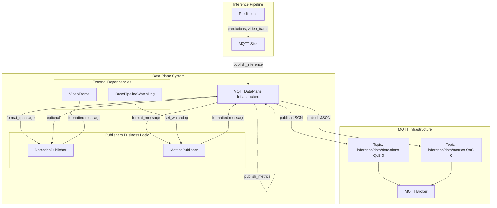
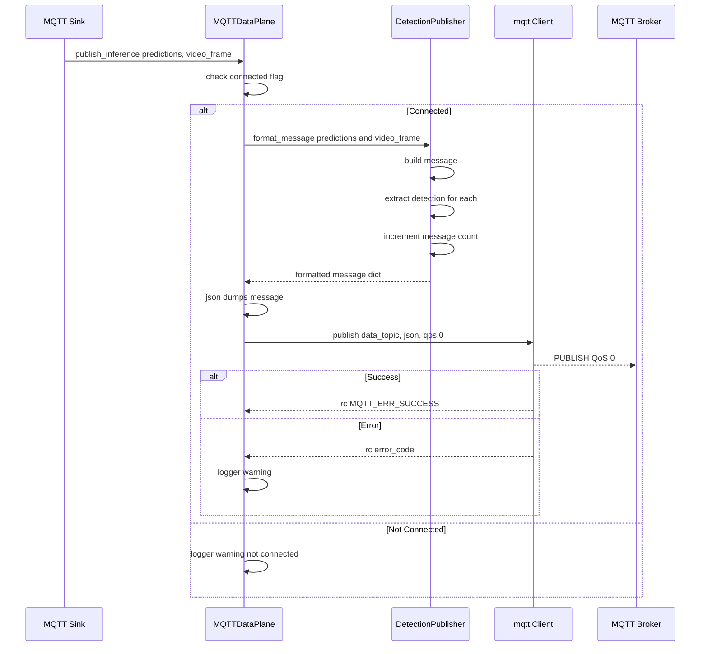
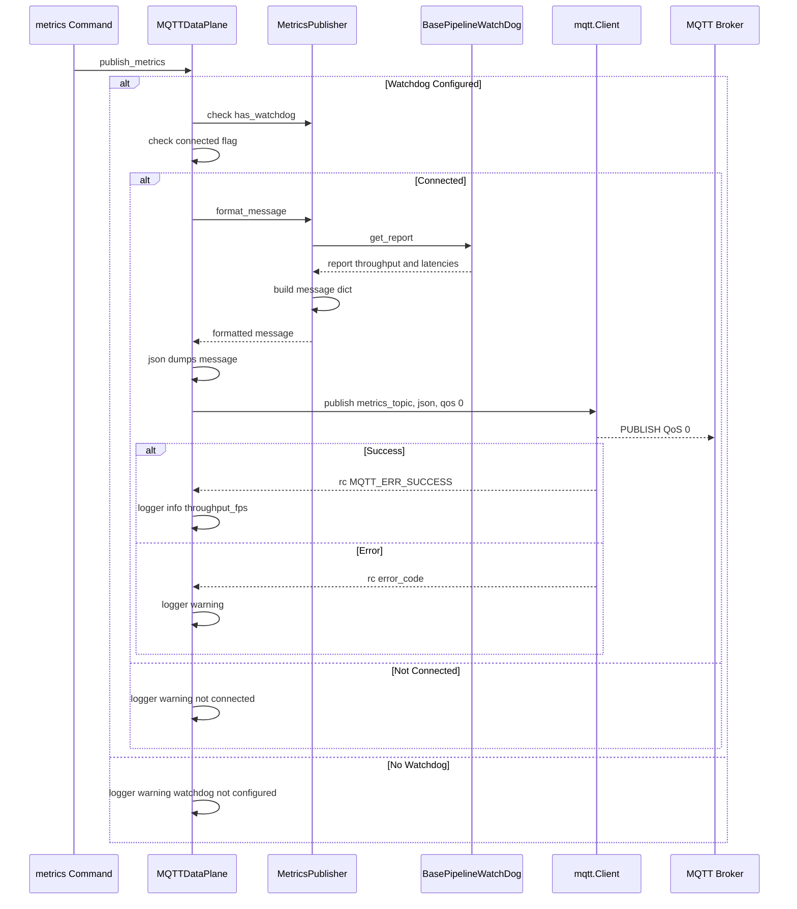
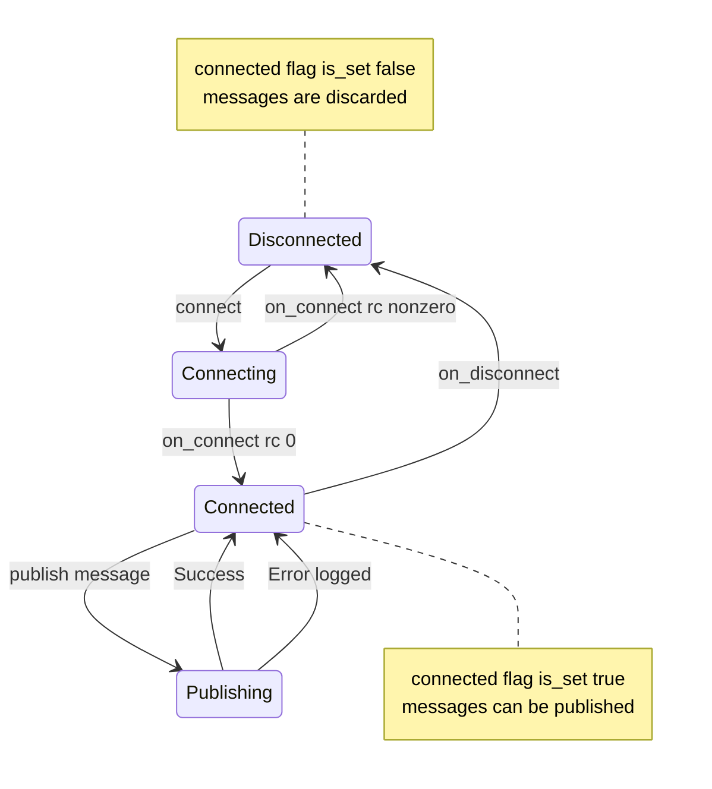

# Data Plane

Relevant source files

- [adeline/CLAUDE.md](https://github.com/acare7/kata-inference-251021-clean4/blob/a0662727/adeline/CLAUDE.md)
- [adeline/data/plane.py](https://github.com/acare7/kata-inference-251021-clean4/blob/a0662727/adeline/data/plane.py)
- [adeline/data/publishers/__init__.py](https://github.com/acare7/kata-inference-251021-clean4/blob/a0662727/adeline/data/publishers/__init__.py)
- [adeline/data/publishers/detection.py](https://github.com/acare7/kata-inference-251021-clean4/blob/a0662727/adeline/data/publishers/detection.py)
- [adeline/data/publishers/metrics.py](https://github.com/acare7/kata-inference-251021-clean4/blob/a0662727/adeline/data/publishers/metrics.py)

## Purpose and Scope

The Data Plane is responsible for publishing inference results and pipeline metrics via MQTT using QoS 0 (fire-and-forget) for high-throughput, best-effort delivery. This document covers the `MQTTDataPlane` class, its associated publishers (`DetectionPublisher` and `MetricsPublisher`), message formats, and the design rationale for separating infrastructure from business logic.

For information about receiving commands and controlling the pipeline, see the Control Plane [4.1](https://deepwiki.com/acare7/kata-inference-251021-clean4/4.1-control-plane). For details on available MQTT commands, see Command Reference [4.3](https://deepwiki.com/acare7/kata-inference-251021-clean4/4.3-command-reference).

---

## Architecture Overview

The Data Plane follows a separation of concerns design pattern where **infrastructure** (MQTT connectivity) is decoupled from **business logic** (message formatting). This architecture implements the Single Responsibility Principle: the plane manages connectivity, while publishers format messages.

### Component Relationship Diagram




**Sources:** [adeline/data/plane.py1-205](https://github.com/acare7/kata-inference-251021-clean4/blob/a0662727/adeline/data/plane.py#L1-L205) [adeline/data/publishers/__init__.py1-21](https://github.com/acare7/kata-inference-251021-clean4/blob/a0662727/adeline/data/publishers/__init__.py#L1-L21) [adeline/CLAUDE.md99-102](https://github.com/acare7/kata-inference-251021-clean4/blob/a0662727/adeline/CLAUDE.md#L99-L102)

---

## Core Components

### MQTTDataPlane

The `MQTTDataPlane` class is the orchestrator responsible for MQTT connectivity and message publishing. It does not understand message structure or business logic.

**Location:** [adeline/data/plane.py27-205](https://github.com/acare7/kata-inference-251021-clean4/blob/a0662727/adeline/data/plane.py#L27-L205)

**Key Responsibilities:**

- Connect/disconnect from MQTT broker
- Publish formatted messages to topics
- Delegate message formatting to publishers
- Manage connection state

**Initialization Parameters:**

|Parameter|Type|Default|Description|
|---|---|---|---|
|`broker_host`|`str`|Required|MQTT broker hostname|
|`broker_port`|`int`|`1883`|MQTT broker port|
|`data_topic`|`str`|`"inference/data/detections"`|Topic for detection messages|
|`metrics_topic`|`str`|`"inference/data/metrics"`|Topic for metrics messages|
|`client_id`|`str`|`"inference_data"`|MQTT client identifier|
|`username`|`Optional[str]`|`None`|MQTT authentication username|
|`password`|`Optional[str]`|`None`|MQTT authentication password|
|`publish_full_frame`|`bool`|`False`|Whether to include full frame data|
|`qos`|`int`|`0`|Quality of Service level (0 = fire-and-forget)|

**Sources:** [adeline/data/plane.py41-75](https://github.com/acare7/kata-inference-251021-clean4/blob/a0662727/adeline/data/plane.py#L41-L75)

---

### DetectionPublisher

The `DetectionPublisher` formats detection messages for MQTT publication. It understands the structure of predictions and extracts relevant information.

**Location:** [adeline/data/publishers/detection.py22-143](https://github.com/acare7/kata-inference-251021-clean4/blob/a0662727/adeline/data/publishers/detection.py#L22-L143)

**Key Responsibilities:**

- Format predictions into standardized message structure
- Extract detection metadata (class, confidence, bbox)
- Extract ROI metadata when available (adaptive crop feature)
- Maintain message count

**Message Structure:**

The `format_message()` method ([adeline/data/publishers/detection.py33-59](https://github.com/acare7/kata-inference-251021-clean4/blob/a0662727/adeline/data/publishers/detection.py#L33-L59)) produces messages with the following schema:

```
{
  "timestamp": "2024-01-01T12:00:00.000000",
  "message_id": 123,
  "detection_count": 2,
  "detections": [
    {
      "class": "person",
      "confidence": 0.95,
      "bbox": {
        "x": 100,
        "y": 200,
        "width": 50,
        "height": 100
      },
      "class_id": 0
    }
  ],
  "frame": {
    "frame_id": 456,
    "source_id": 0,
    "timestamp": "2024-01-01T12:00:00.000000"
  },
  "roi_metrics": {
    "roi_enabled": true,
    "roi_box": {...}
  }
}
```

**Sources:** [adeline/data/publishers/detection.py61-115](https://github.com/acare7/kata-inference-251021-clean4/blob/a0662727/adeline/data/publishers/detection.py#L61-L115)

---

### MetricsPublisher

The `MetricsPublisher` formats pipeline performance metrics from the watchdog for MQTT publication.

**Location:** [adeline/data/publishers/metrics.py25-88](https://github.com/acare7/kata-inference-251021-clean4/blob/a0662727/adeline/data/publishers/metrics.py#L25-L88)

**Key Responsibilities:**

- Connect to pipeline watchdog
- Extract throughput and latency metrics
- Format watchdog report for MQTT

**Watchdog Integration:**

The publisher must be connected to a `BasePipelineWatchDog` instance via `set_watchdog()` ([adeline/data/publishers/metrics.py36-44](https://github.com/acare7/kata-inference-251021-clean4/blob/a0662727/adeline/data/publishers/metrics.py#L36-L44)). The Data Plane delegates this:

```
# From MQTTDataPlane.set_watchdog()
self.metrics_publisher.set_watchdog(watchdog)
```

**Message Structure:**

The `format_message()` method ([adeline/data/publishers/metrics.py46-82](https://github.com/acare7/kata-inference-251021-clean4/blob/a0662727/adeline/data/publishers/metrics.py#L46-L82)) produces:

```
{
  "timestamp": "2024-01-01T12:00:00.000000",
  "throughput_fps": 25.3,
  "latency_reports": [
    {
      "source_id": 0,
      "frame_decoding_latency_ms": 10.5,
      "inference_latency_ms": 45.2,
      "e2e_latency_ms": 60.8
    }
  ],
  "sources_count": 1
}
```

**Sources:** [adeline/data/publishers/metrics.py46-82](https://github.com/acare7/kata-inference-251021-clean4/blob/a0662727/adeline/data/publishers/metrics.py#L46-L82)

---

## Publishing Flow

### Detection Publishing Flow





**Key Methods:**

1. **Entry Point:** `MQTTDataPlane.publish_inference()` [adeline/data/plane.py106-142](https://github.com/acare7/kata-inference-251021-clean4/blob/a0662727/adeline/data/plane.py#L106-L142)
2. **Formatting:** `DetectionPublisher.format_message()` [adeline/data/publishers/detection.py33-59](https://github.com/acare7/kata-inference-251021-clean4/blob/a0662727/adeline/data/publishers/detection.py#L33-L59)
3. **Building:** `DetectionPublisher._build_message()` [adeline/data/publishers/detection.py61-115](https://github.com/acare7/kata-inference-251021-clean4/blob/a0662727/adeline/data/publishers/detection.py#L61-L115)
4. **Extraction:** `DetectionPublisher._extract_detection()` [adeline/data/publishers/detection.py117-137](https://github.com/acare7/kata-inference-251021-clean4/blob/a0662727/adeline/data/publishers/detection.py#L117-L137)

**Sources:** [adeline/data/plane.py106-142](https://github.com/acare7/kata-inference-251021-clean4/blob/a0662727/adeline/data/plane.py#L106-L142) [adeline/data/publishers/detection.py33-137](https://github.com/acare7/kata-inference-251021-clean4/blob/a0662727/adeline/data/publishers/detection.py#L33-L137)

---

### Metrics Publishing Flow




**Key Methods:**

1. **Entry Point:** `MQTTDataPlane.publish_metrics()` [adeline/data/plane.py155-195](https://github.com/acare7/kata-inference-251021-clean4/blob/a0662727/adeline/data/plane.py#L155-L195)
2. **Formatting:** `MetricsPublisher.format_message()` [adeline/data/publishers/metrics.py46-82](https://github.com/acare7/kata-inference-251021-clean4/blob/a0662727/adeline/data/publishers/metrics.py#L46-L82)
3. **Watchdog Check:** `MetricsPublisher.has_watchdog` property [adeline/data/publishers/metrics.py84-87](https://github.com/acare7/kata-inference-251021-clean4/blob/a0662727/adeline/data/publishers/metrics.py#L84-L87)

**Sources:** [adeline/data/plane.py155-195](https://github.com/acare7/kata-inference-251021-clean4/blob/a0662727/adeline/data/plane.py#L155-L195) [adeline/data/publishers/metrics.py46-87](https://github.com/acare7/kata-inference-251021-clean4/blob/a0662727/adeline/data/publishers/metrics.py#L46-L87)

---

## Connection Management

The `MQTTDataPlane` manages connection lifecycle through the paho-mqtt client library:

### Connection State Machine




**Connection Methods:**

|Method|Location|Description|
|---|---|---|
|`connect()`|[adeline/data/plane.py89-98](https://github.com/acare7/kata-inference-251021-clean4/blob/a0662727/adeline/data/plane.py#L89-L98)|Initiates connection with timeout|
|`disconnect()`|[adeline/data/plane.py100-104](https://github.com/acare7/kata-inference-251021-clean4/blob/a0662727/adeline/data/plane.py#L100-L104)|Gracefully disconnects|
|`_on_connect()`|[adeline/data/plane.py76-82](https://github.com/acare7/kata-inference-251021-clean4/blob/a0662727/adeline/data/plane.py#L76-L82)|Callback on connection success/failure|
|`_on_disconnect()`|[adeline/data/plane.py84-87](https://github.com/acare7/kata-inference-251021-clean4/blob/a0662727/adeline/data/plane.py#L84-L87)|Callback on disconnection|

**Thread Safety:**

The Data Plane uses `threading.Event` for connection state ([adeline/data/plane.py73](https://github.com/acare7/kata-inference-251021-clean4/blob/a0662727/adeline/data/plane.py#L73-L73)) and `threading.Lock` for statistics ([adeline/data/plane.py74](https://github.com/acare7/kata-inference-251021-clean4/blob/a0662727/adeline/data/plane.py#L74-L74)). The paho-mqtt client runs its own network loop via `client.loop_start()` ([adeline/data/plane.py94](https://github.com/acare7/kata-inference-251021-clean4/blob/a0662727/adeline/data/plane.py#L94-L94)).

**Sources:** [adeline/data/plane.py73-104](https://github.com/acare7/kata-inference-251021-clean4/blob/a0662727/adeline/data/plane.py#L73-L104)

---

## Configuration

The Data Plane is configured through the `MQTTSettings` section of the main configuration file:

**Relevant Configuration Fields:**

```
mqtt:
  broker_host: "localhost"
  broker_port: 1883
  username: "adeline"
  password: "${MQTT_PASSWORD}"  # From environment
  
  data_topic: "inference/data/detections"
  metrics_topic: "inference/data/metrics"
  
  data_qos: 0  # Fire-and-forget
  publish_full_frame: false
```

**QoS Level Rationale:**

The Data Plane uses **QoS 0** (at most once delivery) because:

1. **High Throughput:** Detection messages published at ~25 FPS cannot tolerate QoS 1 acknowledgment overhead
2. **Temporal Redundancy:** Missing a single frame is acceptable when the next frame arrives 40ms later
3. **Best-Effort Metrics:** Metrics are sampled periodically; occasional loss is tolerable

This contrasts with the Control Plane's QoS 1, where command reliability is critical. See Control Plane [4.1](https://deepwiki.com/acare7/kata-inference-251021-clean4/4.1-control-plane) for comparison.

**Sources:** [adeline/CLAUDE.md99-102](https://github.com/acare7/kata-inference-251021-clean4/blob/a0662727/adeline/CLAUDE.md#L99-L102) [adeline/data/plane.py59](https://github.com/acare7/kata-inference-251021-clean4/blob/a0662727/adeline/data/plane.py#L59-L59)

---

## Design Rationale

### Separation of Concerns

The architecture separates **infrastructure** from **business logic**:

|Concern|Component|Responsibility|
|---|---|---|
|**Infrastructure**|`MQTTDataPlane`|MQTT connectivity, publish/subscribe, connection management|
|**Business Logic**|`DetectionPublisher`|Detection message formatting, metadata extraction|
|**Business Logic**|`MetricsPublisher`|Metrics message formatting, watchdog integration|

**Why This Design?**

1. **Single Responsibility Principle:** Each class has one reason to change
2. **Testability:** Publishers can be tested without MQTT broker
3. **Reusability:** Publishers could be used with different transports (HTTP, gRPC)
4. **Maintainability:** MQTT protocol changes don't affect message formatting

**Code Evidence:**

The `MQTTDataPlane` explicitly delegates formatting:

```
# publish_inference() delegates to DetectionPublisher
message = self.detection_publisher.format_message(predictions, video_frame)

# publish_metrics() delegates to MetricsPublisher  
message = self.metrics_publisher.format_message()
```

**Sources:** [adeline/data/plane.py1-11](https://github.com/acare7/kata-inference-251021-clean4/blob/a0662727/adeline/data/plane.py#L1-L11) [adeline/data/publishers/__init__.py1-16](https://github.com/acare7/kata-inference-251021-clean4/blob/a0662727/adeline/data/publishers/__init__.py#L1-L16)

---

### Message Formatting Details

#### Detection Extraction Logic

The `DetectionPublisher._extract_detection()` method ([adeline/data/publishers/detection.py117-137](https://github.com/acare7/kata-inference-251021-clean4/blob/a0662727/adeline/data/publishers/detection.py#L117-L137)) handles various prediction formats:

```
{
    "class": detection.get('class', detection.get('class_name', 'unknown')),
    "confidence": detection.get('confidence', 0.0),
    "bbox": {
        "x": detection.get('x', 0),
        "y": detection.get('y', 0),
        "width": detection.get('width', 0),
        "height": detection.get('height', 0)
    } if 'x' in detection else None,
    "class_id": detection.get('class_id'),
}
```

This handles both YOLO-style predictions and stabilized predictions with track IDs.

**Sources:** [adeline/data/publishers/detection.py117-137](https://github.com/acare7/kata-inference-251021-clean4/blob/a0662727/adeline/data/publishers/detection.py#L117-L137)

---

#### ROI Metadata Extraction

When adaptive ROI is enabled, detection messages include `roi_metrics` with crop information:

```
# From DetectionPublisher._build_message()
if crop_metadata is None and '__crop_metadata__' in pred:
    crop_metadata = pred['__crop_metadata__']

if crop_metadata:
    message["roi_metrics"] = crop_metadata
```

This metadata is added by the `AdaptiveInferenceHandler` (see ROI Strategies [5.1](https://deepwiki.com/acare7/kata-inference-251021-clean4/5.1-roi-strategies)) and includes:

- `roi_enabled`: Whether ROI is active
- `roi_box`: Current ROI coordinates
- `crop_offset_x`, `crop_offset_y`: Coordinate transformation offsets

**Sources:** [adeline/data/publishers/detection.py80-113](https://github.com/acare7/kata-inference-251021-clean4/blob/a0662727/adeline/data/publishers/detection.py#L80-L113)

---

## Statistics and Monitoring

The Data Plane exposes statistics via the `get_stats()` method ([adeline/data/plane.py197-204](https://github.com/acare7/kata-inference-251021-clean4/blob/a0662727/adeline/data/plane.py#L197-L204)):

```
{
    "messages_published": self.detection_publisher.message_count,
    "connected": self._connected.is_set(),
    "topic": self.data_topic,
}
```

This allows the Control Plane to respond to the `status` command with Data Plane health information.

**Sources:** [adeline/data/plane.py197-204](https://github.com/acare7/kata-inference-251021-clean4/blob/a0662727/adeline/data/plane.py#L197-L204) [adeline/data/publishers/detection.py139-142](https://github.com/acare7/kata-inference-251021-clean4/blob/a0662727/adeline/data/publishers/detection.py#L139-L142)

---

## Integration Points

### With Inference Pipeline

The Data Plane integrates with the inference pipeline through the `MQTTSink`:

1. Pipeline builder creates `MQTTSink` via `SinkFactory` (see Factory Pattern System [3.3](https://deepwiki.com/acare7/kata-inference-251021-clean4/3.3-factory-pattern-system))
2. Sink wraps `MQTTDataPlane.publish_inference()` method
3. Pipeline calls sink for each inference result

**Sources:** [adeline/CLAUDE.md99-102](https://github.com/acare7/kata-inference-251021-clean4/blob/a0662727/adeline/CLAUDE.md#L99-L102)

---

### With Watchdog

The watchdog integration happens during pipeline setup:

1. Controller creates watchdog for pipeline monitoring
2. Controller calls `data_plane.set_watchdog(watchdog)` ([adeline/data/plane.py143-153](https://github.com/acare7/kata-inference-251021-clean4/blob/a0662727/adeline/data/plane.py#L143-L153))
3. `MetricsPublisher` stores watchdog reference
4. `publish_metrics()` calls work via `metrics` command (see Command Reference [4.3](https://deepwiki.com/acare7/kata-inference-251021-clean4/4.3-command-reference))

**Sources:** [adeline/data/plane.py143-153](https://github.com/acare7/kata-inference-251021-clean4/blob/a0662727/adeline/data/plane.py#L143-L153) [adeline/data/publishers/metrics.py36-44](https://github.com/acare7/kata-inference-251021-clean4/blob/a0662727/adeline/data/publishers/metrics.py#L36-L44)

---

## Error Handling

The Data Plane implements defensive error handling:

### Connection Errors

- **Not Connected:** Messages are discarded with warning log ([adeline/data/plane.py122-124](https://github.com/acare7/kata-inference-251021-clean4/blob/a0662727/adeline/data/plane.py#L122-L124) [adeline/data/plane.py169-171](https://github.com/acare7/kata-inference-251021-clean4/blob/a0662727/adeline/data/plane.py#L169-L171))
- **Connect Timeout:** Returns `False` if broker unreachable within timeout ([adeline/data/plane.py89-98](https://github.com/acare7/kata-inference-251021-clean4/blob/a0662727/adeline/data/plane.py#L89-L98))
- **Disconnect:** Clears connection event, logged as warning ([adeline/data/plane.py84-87](https://github.com/acare7/kata-inference-251021-clean4/blob/a0662727/adeline/data/plane.py#L84-L87))

### Publishing Errors

- **Publish Failure:** Logged with MQTT error code, does not crash ([adeline/data/plane.py137-138](https://github.com/acare7/kata-inference-251021-clean4/blob/a0662727/adeline/data/plane.py#L137-L138))
- **Formatting Errors:** Caught and logged with stack trace ([adeline/data/plane.py140-141](https://github.com/acare7/kata-inference-251021-clean4/blob/a0662727/adeline/data/plane.py#L140-L141) [adeline/data/publishers/metrics.py80-82](https://github.com/acare7/kata-inference-251021-clean4/blob/a0662727/adeline/data/publishers/metrics.py#L80-L82))
- **No Watchdog:** Warning logged, metrics request ignored ([adeline/data/plane.py165-167](https://github.com/acare7/kata-inference-251021-clean4/blob/a0662727/adeline/data/plane.py#L165-L167))

**Fire-and-Forget Philosophy:**

QoS 0 means the Data Plane never blocks waiting for acknowledgments. This ensures:

- Inference pipeline never stalls on MQTT issues
- Broker outages don't crash the system
- Performance remains consistent

**Sources:** [adeline/data/plane.py122-142](https://github.com/acare7/kata-inference-251021-clean4/blob/a0662727/adeline/data/plane.py#L122-L142) [adeline/data/plane.py165-195](https://github.com/acare7/kata-inference-251021-clean4/blob/a0662727/adeline/data/plane.py#L165-L195)