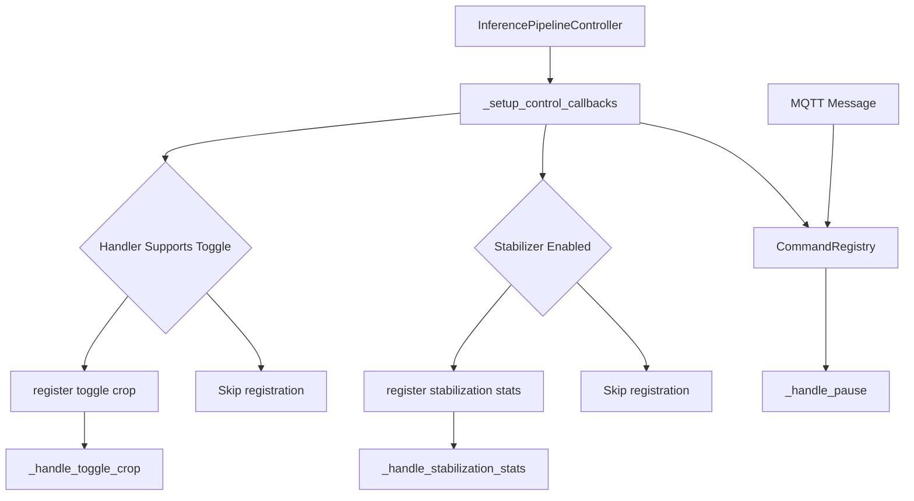
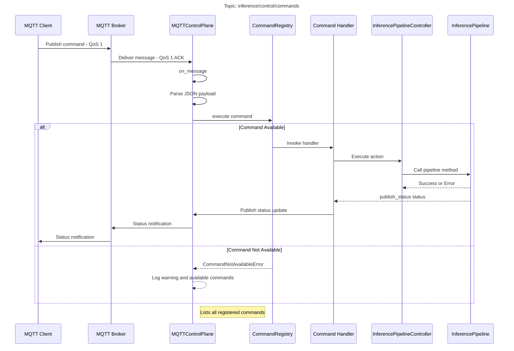
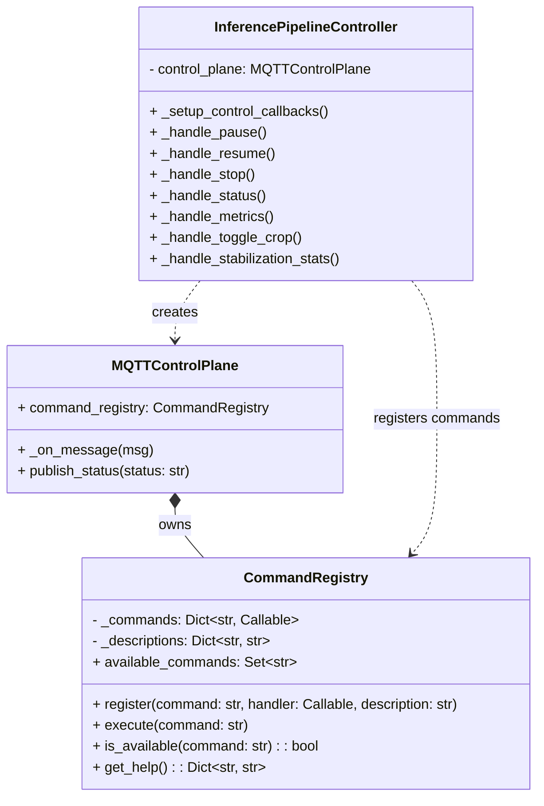

# Command Reference

Relevant source files

- [adeline/CLAUDE.md](https://github.com/acare7/kata-inference-251021-clean4/blob/a0662727/adeline/CLAUDE.md)
- [adeline/app/controller.py](https://github.com/acare7/kata-inference-251021-clean4/blob/a0662727/adeline/app/controller.py)
- [adeline/control/plane.py](https://github.com/acare7/kata-inference-251021-clean4/blob/a0662727/adeline/control/plane.py)
- [adeline/control/registry.py](https://github.com/acare7/kata-inference-251021-clean4/blob/a0662727/adeline/control/registry.py)
- [docs/backlog/DESIGN_RUNTIME_TOGGLES.md](https://github.com/acare7/kata-inference-251021-clean4/blob/a0662727/docs/backlog/DESIGN_RUNTIME_TOGGLES.md)

This page provides a complete reference of all MQTT commands available for controlling the Adeline inference pipeline at runtime. Commands are sent to the control plane via MQTT and allow lifecycle management, status queries, and runtime behavior modifications without restarting the system.

For information about the control plane architecture and how commands are received and processed, see [Control Plane](https://deepwiki.com/acare7/kata-inference-251021-clean4/4.1-control-plane). For information about data publishing (detections and metrics), see [Data Plane](https://deepwiki.com/acare7/kata-inference-251021-clean4/4.2-data-plane).

---

## Purpose and Scope

This reference documents:

- All available MQTT commands and their parameters
- Command message format and protocol
- Conditional command registration based on system capabilities
- Expected responses and status updates
- Command execution flow and error handling

**Out of scope:** Configuration file settings (see [Configuration System](https://deepwiki.com/acare7/kata-inference-251021-clean4/6-configuration-system)), data publishing formats (see [Data Plane](https://deepwiki.com/acare7/kata-inference-251021-clean4/4.2-data-plane)), and internal architecture details (see [Control Plane](https://deepwiki.com/acare7/kata-inference-251021-clean4/4.1-control-plane)).

---

## Command Message Format

All commands are sent as JSON payloads to the control command topic (default: `inference/control/commands`) with QoS 1 for reliable delivery.

### Basic Command Structure

```
{
  "command": "command_name"
}
```

### Commands with Parameters

Some commands accept additional parameters:

```
{
  "command": "command_name",
  "parameter_name": value
}
```

### Topic Configuration

|Topic Type|Default Topic|QoS|Purpose|
|---|---|---|---|
|Command Input|`inference/control/commands`|1|Receive commands (reliable)|
|Status Output|`inference/control/status`|1|Publish status updates (reliable)|

Sources: [adeline/control/plane.py56-69](https://github.com/acare7/kata-inference-251021-clean4/blob/a0662727/adeline/control/plane.py#L56-L69) [adeline/app/controller.py163-171](https://github.com/acare7/kata-inference-251021-clean4/blob/a0662727/adeline/app/controller.py#L163-L171)

---

## Command Registry Architecture

Commands are registered using the `CommandRegistry` pattern, which provides explicit registration and validation of available commands. Only registered commands can be executed, preventing runtime errors from unsupported operations.

### Command Registration Flow





**Key Features:**

- **Explicit Registration**: Commands must be explicitly registered before use
- **Conditional Registration**: Some commands only register if system capabilities support them
- **Validation**: Attempting to execute an unregistered command returns a clear error with available commands
- **Introspection**: Registry provides `available_commands` property for discovery

Sources: [adeline/control/registry.py28-142](https://github.com/acare7/kata-inference-251021-clean4/blob/a0662727/adeline/control/registry.py#L28-L142) [adeline/app/controller.py196-219](https://github.com/acare7/kata-inference-251021-clean4/blob/a0662727/adeline/app/controller.py#L196-L219)

---

## Available Commands

### Basic Lifecycle Commands

These commands are always available and control pipeline execution state.

|Command|Parameters|Description|Handler|
|---|---|---|---|
|`pause`|None|Pauses video processing temporarily|`_handle_pause()`|
|`resume`|None|Resumes processing after pause|`_handle_resume()`|
|`stop`|None|Stops pipeline and terminates the service|`_handle_stop()`|

#### Command: `pause`

Temporarily pauses video frame processing. The pipeline remains running but stops consuming frames from the video stream.

**Message:**

```
{"command": "pause"}
```

**Behavior:**

- Calls `pipeline.pause_stream()`
- Publishes status update: `"paused"`
- Pipeline can be resumed with `resume` command
- No frames are processed while paused

**Use Cases:**

- Temporarily stop processing during known inactive periods
- Debug without stopping the entire service
- Reduce resource usage temporarily

**Status Response:** `"paused"` published to `inference/control/status`

Sources: [adeline/app/controller.py246-257](https://github.com/acare7/kata-inference-251021-clean4/blob/a0662727/adeline/app/controller.py#L246-L257)

#### Command: `resume`

Resumes video processing after a `pause` command.

**Message:**

```
{"command": "resume"}
```

**Behavior:**

- Calls `pipeline.resume_stream()`
- Publishes status update: `"running"`
- Processing continues from current frame position

**Status Response:** `"running"` published to `inference/control/status`

Sources: [adeline/app/controller.py259-270](https://github.com/acare7/kata-inference-251021-clean4/blob/a0662727/adeline/app/controller.py#L259-L270)

#### Command: `stop`

Stops the pipeline completely and terminates the service. This is a graceful shutdown command.

**Message:**

```
{"command": "stop"}
```

**Behavior:**

1. Calls `pipeline.terminate()`
2. Sets internal shutdown event
3. Publishes status update: `"stopped"`
4. Triggers cleanup and exits the program

**Warning:** This command terminates the entire service. Use `pause` for temporary stops.

**Status Response:** `"stopped"` published to `inference/control/status`

Sources: [adeline/app/controller.py228-244](https://github.com/acare7/kata-inference-251021-clean4/blob/a0662727/adeline/app/controller.py#L228-L244)

---

### Status and Monitoring Commands

These commands query system state and metrics without modifying behavior.

|Command|Parameters|Description|Handler|
|---|---|---|---|
|`status`|None|Publishes current pipeline status|`_handle_status()`|
|`metrics`|None|Publishes pipeline metrics via data plane|`_handle_metrics()`|
|`health`|None|Returns multi-level health status for monitoring|`_handle_health_check()`|

#### Command: `status`

Requests current pipeline status. Useful for health checks and monitoring.

**Message:**

```
{"command": "status"}
```

**Behavior:**

- Determines current state (`running` or `stopped`)
- Publishes status to status topic

**Status Response:** `"running"` or `"stopped"` published to `inference/control/status`

Sources: [adeline/app/controller.py272-276](https://github.com/acare7/kata-inference-251021-clean4/blob/a0662727/adeline/app/controller.py#L272-L276)

#### Command: `metrics`

Triggers publication of pipeline metrics to the data plane metrics topic.

**Message:**

```
{"command": "metrics"}
```

**Behavior:**

- Calls `data_plane.publish_metrics()`
- Metrics include frame rate, latency, detection counts
- Published to data plane metrics topic (QoS 0)

**Metrics Published To:** `inference/data/metrics` (via data plane)

**Metrics Format:** See [Data Plane](https://deepwiki.com/acare7/kata-inference-251021-clean4/4.2-data-plane) for metric message structure.

Sources: [adeline/app/controller.py278-284](https://github.com/acare7/kata-inference-251021-clean4/blob/a0662727/adeline/app/controller.py#L278-L284)


#### Command: `health`

Returns multi-level health status for external monitoring.

**Message:**

```
{"command": "health"}
```

**Behavior:**

- Determines overall system health status
- Checks critical components: pipeline, control plane, data plane
- Checks health indicators: recent frame activity, average FPS
- Publishes detailed health report to status topic

**Status Levels:**

- `healthy`: All critical checks pass, pipeline processing frames
- `degraded`: Some non-critical checks fail but pipeline operational
- `unhealthy`: Critical checks fail (pipeline stopped, MQTT disconnected)

**Response Format** (via `inference/control/status` topic):

```
{
  "status": "healthy",
  "timestamp": 1698062400.0,
  "version": "3.0.0",
  "checks": {
    "pipeline_running": true,
    "control_plane_connected": true,
    "data_plane_connected": true,
    "recent_frames": true,
    "avg_fps": 2.1
  }
}
```

**Use Cases:**

- Kubernetes liveness/readiness probes
- Grafana alerting rules
- External monitoring dashboards
- CI/CD health verification

**Availability:** Always

Sources: [adeline/app/controller.py](https://github.com/acare7/kata-inference-251021-clean4/blob/a0662727/adeline/app/controller.py)

---

### Conditional Commands

These commands are only registered if the system configuration and capabilities support them. Attempting to use a conditional command when not available will return an error with a list of available commands.

#### Command: `toggle_crop` (Conditional)

Toggles adaptive ROI cropping on/off at runtime. Only available when `ROI_MODE='adaptive'` and handler implements toggleable behavior.

**Registration Condition:**

```
if self.inference_handler and self.inference_handler.supports_toggle:
    registry.register('toggle_crop', ...)
```

**Message:**

```
{"command": "toggle_crop"}
```

**Behavior:**

- If ROI crop enabled: disables crop (processes full frame)
- If ROI crop disabled: enables crop (processes ROI only)
- Calls `inference_handler.enable()` or `inference_handler.disable()`
- ROI state is preserved when disabled (smooth re-enable)

**Configuration Requirement:** `ROI_MODE: 'adaptive'` in config

**Use Cases:**

- Debug performance issues by comparing full frame vs ROI processing
- Temporarily disable ROI during setup/calibration
- Compare detection quality between full frame and adaptive ROI

**Availability Check:** Command appears in available commands list only if handler supports toggle.

Sources: [adeline/app/controller.py286-306](https://github.com/acare7/kata-inference-251021-clean4/blob/a0662727/adeline/app/controller.py#L286-L306) [adeline/app/controller.py211-214](https://github.com/acare7/kata-inference-251021-clean4/blob/a0662727/adeline/app/controller.py#L211-L214)

---

#### Command: `stabilization_stats` (Conditional)

Publishes detailed statistics about detection stabilization and tracking. Only available when `STABILIZATION_MODE != 'none'`.

**Registration Condition:**

```
if self.stabilizer is not None:
    registry.register('stabilization_stats', ...)
```

**Message:**

```
{"command": "stabilization_stats"}
```

**Behavior:**

- Calls `stabilizer.get_stats(source_id=0)`
- Logs detailed statistics to console
- Statistics include:
    - Total detections processed
    - Total confirmed (stable) detections
    - Total ignored (filtered) detections
    - Total removed (expired) tracks
    - Active tracks count
    - Confirmation ratio
    - Breakdown by class

**Configuration Requirement:** `STABILIZATION_MODE: 'temporal'` (or any non-none mode) in config

**Example Output:**

```
📈 Detection Stabilization Stats:
   Mode: temporal
   Total detected: 150
   Total confirmed: 120
   Total ignored: 20
   Total removed: 10
   Active tracks: 3
   Confirm ratio: 80.00%
   Tracks by class:
     - person: 3
```

**Availability Check:** Command appears in available commands list only if stabilizer is configured.

Sources: [adeline/app/controller.py308-343](https://github.com/acare7/kata-inference-251021-clean4/blob/a0662727/adeline/app/controller.py#L308-L343) [adeline/app/controller.py216-219](https://github.com/acare7/kata-inference-251021-clean4/blob/a0662727/adeline/app/controller.py#L216-L219)

---

## Command Execution Flow

### End-to-End Command Processing





**Key Points:**

1. **QoS 1 Reliability**: Control commands use QoS 1 to ensure delivery
2. **JSON Parsing**: Payload must be valid JSON with `"command"` field
3. **Registry Validation**: Commands are validated against registered set
4. **Error Handling**: Clear error messages include available command list
5. **Status Updates**: Most commands publish status confirmation

Sources: [adeline/control/plane.py103-133](https://github.com/acare7/kata-inference-251021-clean4/blob/a0662727/adeline/control/plane.py#L103-L133) [adeline/control/registry.py79-101](https://github.com/acare7/kata-inference-251021-clean4/blob/a0662727/adeline/control/registry.py#L79-L101)

---

## Command Registry Pattern

### Registry Implementation Details

The `CommandRegistry` class provides the command registration and execution infrastructure.




### Registration Example

```
# From controller.py:196-219
def _setup_control_callbacks(self):
    registry = self.control_plane.command_registry
    
    # Always available
    registry.register('pause', self._handle_pause, "Pausa el procesamiento")
    registry.register('resume', self._handle_resume, "Reanuda el procesamiento")
    registry.register('stop', self._handle_stop, "Detiene y finaliza el pipeline")
    
    # Conditional registration
    if self.inference_handler and self.inference_handler.supports_toggle:
        registry.register('toggle_crop', self._handle_toggle_crop, "Toggle adaptive ROI crop")
```

**Design Benefits:**

- **Fail Fast**: Invalid commands rejected immediately with clear error
- **Introspection**: Can query available commands at runtime
- **Type Safety**: Handlers are strongly typed `Callable` objects
- **Self-Documenting**: Each command has description for help text

Sources: [adeline/control/registry.py28-142](https://github.com/acare7/kata-inference-251021-clean4/blob/a0662727/adeline/control/registry.py#L28-L142)

---

## Error Handling

### Invalid Command Response

When an unregistered command is sent, the system responds with:

1. **Warning Log**: `"⚠️ Command 'unknown' not available"`
2. **Available Commands List**: Logs all registered commands
3. **No Status Update**: Invalid commands do not publish status

**Example Log Output:**

```
⚠️ Command 'toggle_stabilization' not available. Available commands: pause, resume, stop, status, metrics, toggle_crop, stabilization_stats
💡 Comandos disponibles: metrics, pause, resume, stabilization_stats, status, stop, toggle_crop
```

### JSON Parse Errors

Invalid JSON payloads are logged and ignored:

```
❌ Error decodificando JSON: {"command": "pause
```

### Exception Handling

Command execution exceptions are caught and logged without crashing the control plane:

```
try:
    self.command_registry.execute(command)
except CommandNotAvailableError as e:
    logger.warning(f"⚠️ {e}")
except Exception as e:
    logger.error(f"❌ Error procesando mensaje: {e}", exc_info=True)
```

Sources: [adeline/control/plane.py103-133](https://github.com/acare7/kata-inference-251021-clean4/blob/a0662727/adeline/control/plane.py#L103-L133) [adeline/control/registry.py92-97](https://github.com/acare7/kata-inference-251021-clean4/blob/a0662727/adeline/control/registry.py#L92-L97)

---

## Command Availability Matrix

The following table shows which commands are available under different configurations:

|Command|Always Available|Requires `ROI_MODE='adaptive'`|Requires Stabilization Enabled|
|---|---|---|---|
|`pause`|✅|-|-|
|`resume`|✅|-|-|
|`stop`|✅|-|-|
|`status`|✅|-|-|
|`metrics`|✅|-|-|
|`health`|✅|-|-|
|`toggle_crop`|❌|✅|-|
|`stabilization_stats`|❌|-|✅|

### Checking Available Commands

To discover which commands are currently available, send the `status` command and observe the startup logs, which list all registered commands:

```
✅ toggle_crop command registered (handler supports toggle)
✅ stabilization_stats command registered
```

Or inspect the `available_commands` property of the registry (programmatically):

```
# From registry.py:116-123
@property
def available_commands(self) -> Set[str]:
    return set(self._commands.keys())
```

Sources: [adeline/app/controller.py196-219](https://github.com/acare7/kata-inference-251021-clean4/blob/a0662727/adeline/app/controller.py#L196-L219)

---

## Usage Examples

### Example 1: Basic Pipeline Control

```
# Pause processing
mosquitto_pub -h localhost -t "inference/control/commands" \
  -m '{"command": "pause"}' -q 1

# Check status
mosquitto_pub -h localhost -t "inference/control/commands" \
  -m '{"command": "status"}' -q 1

# Resume processing
mosquitto_pub -h localhost -t "inference/control/commands" \
  -m '{"command": "resume"}' -q 1

# Stop service
mosquitto_pub -h localhost -t "inference/control/commands" \
  -m '{"command": "stop"}' -q 1
```

### Example 2: Monitoring and Metrics

```
# Request metrics publication
mosquitto_pub -h localhost -t "inference/control/commands" \
  -m '{"command": "metrics"}' -q 1

# Subscribe to metrics (separate terminal)
mosquitto_sub -h localhost -t "inference/data/metrics" -q 0

# Request stabilization statistics (if enabled)
mosquitto_pub -h localhost -t "inference/control/commands" \
  -m '{"command": "stabilization_stats"}' -q 1
```

### Example 3: Runtime Toggles (Conditional)

```
# Toggle adaptive ROI crop (only if ROI_MODE='adaptive')
mosquitto_pub -h localhost -t "inference/control/commands" \
  -m '{"command": "toggle_crop"}' -q 1

# Toggle again to re-enable
mosquitto_pub -h localhost -t "inference/control/commands" \
  -m '{"command": "toggle_crop"}' -q 1
```

### Example 4: Status Monitoring

```
# Subscribe to status updates
mosquitto_sub -h localhost -t "inference/control/status" -q 1

# In another terminal, send commands
mosquitto_pub -h localhost -t "inference/control/commands" \
  -m '{"command": "pause"}' -q 1

# Observe status change: {"status": "paused", "timestamp": "...", "client_id": "inference_control"}
```

Sources: [adeline/app/controller.py351-368](https://github.com/acare7/kata-inference-251021-clean4/blob/a0662727/adeline/app/controller.py#L351-L368)

---

## Command Help and Introspection

### Querying Available Commands

The `CommandRegistry` provides introspection methods for discovering available commands:

```
# From registry.py:125-136
def get_help(self) -> Dict[str, str]:
    """Returns dict of commands with descriptions"""
    return dict(self._descriptions)
```

**Example Help Output:**

```
{
    'pause': 'Pausa el procesamiento',
    'resume': 'Reanuda el procesamiento',
    'stop': 'Detiene y finaliza el pipeline',
    'status': 'Consulta estado actual',
    'metrics': 'Publica métricas del pipeline',
    'toggle_crop': 'Toggle adaptive ROI crop',
    'stabilization_stats': 'Estadísticas de estabilización'
}
```

### Startup Command Summary

On pipeline startup, available commands are logged:

```
💡 Comandos MQTT disponibles:
   PAUSE:   {"command": "pause"}   - Pausa el procesamiento
   RESUME:  {"command": "resume"}  - Reanuda el procesamiento
   STOP:    {"command": "stop"}    - Detiene y finaliza
   STATUS:  {"command": "status"}  - Consulta estado actual
   METRICS: {"command": "metrics"} - Publica métricas del pipeline
   TOGGLE_CROP: {"command": "toggle_crop"} - Toggle adaptive ROI crop (solo modo adaptive)
   STABILIZATION_STATS: {"command": "stabilization_stats"} - Estadísticas de detección estabilizada
```

Sources: [adeline/app/controller.py351-368](https://github.com/acare7/kata-inference-251021-clean4/blob/a0662727/adeline/app/controller.py#L351-L368)

---

## Status Update Format

Commands that modify state publish status updates to the status topic with the following format:

```
{
  "status": "running",
  "timestamp": "2025-01-10T14:30:00.123456",
  "client_id": "inference_control"
}
```

### Status Values

|Status|Meaning|Triggered By|
|---|---|---|
|`connected`|Control plane connected to broker|Initial connection|
|`running`|Pipeline processing frames|`resume` command|
|`paused`|Pipeline paused|`pause` command|
|`stopped`|Pipeline terminated|`stop` command|
|`disconnected`|Control plane disconnected|Service shutdown|

### Status Update Properties

- **Retained Message**: Status updates use `retain=True` so new subscribers receive last known status
- **QoS 1**: Status updates use QoS 1 for reliability
- **Timestamp**: ISO 8601 format timestamp included in every update
- **Client ID**: Identifies which control plane instance sent the update

Sources: [adeline/control/plane.py135-153](https://github.com/acare7/kata-inference-251021-clean4/blob/a0662727/adeline/control/plane.py#L135-L153)

---

## Related Pages

- [Control Plane](https://deepwiki.com/acare7/kata-inference-251021-clean4/4.1-control-plane) - Architecture and implementation of MQTT control plane
- [Data Plane](https://deepwiki.com/acare7/kata-inference-251021-clean4/4.2-data-plane) - Data publishing and metrics format
- [Configuration System](https://deepwiki.com/acare7/kata-inference-251021-clean4/6-configuration-system) - How to configure MQTT topics and credentials
- [InferencePipelineController](https://deepwiki.com/acare7/kata-inference-251021-clean4/3.1-inferencepipelinecontroller) - Controller lifecycle management and command handling