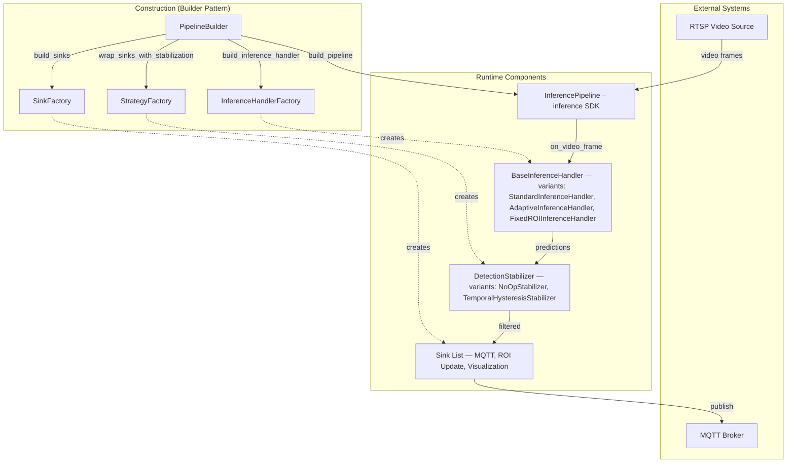
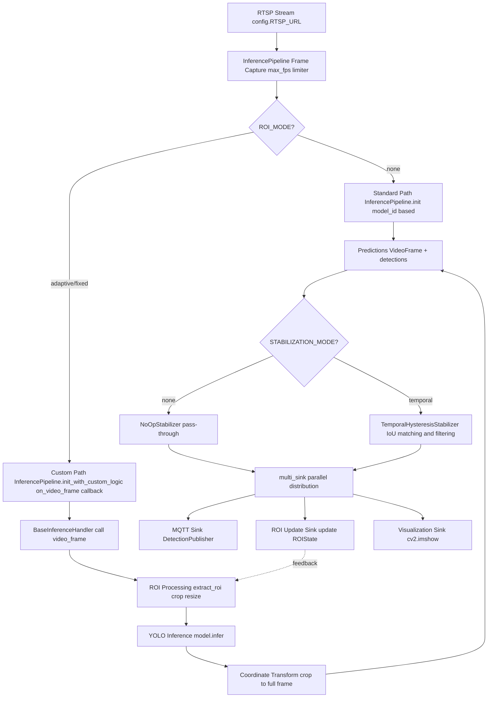
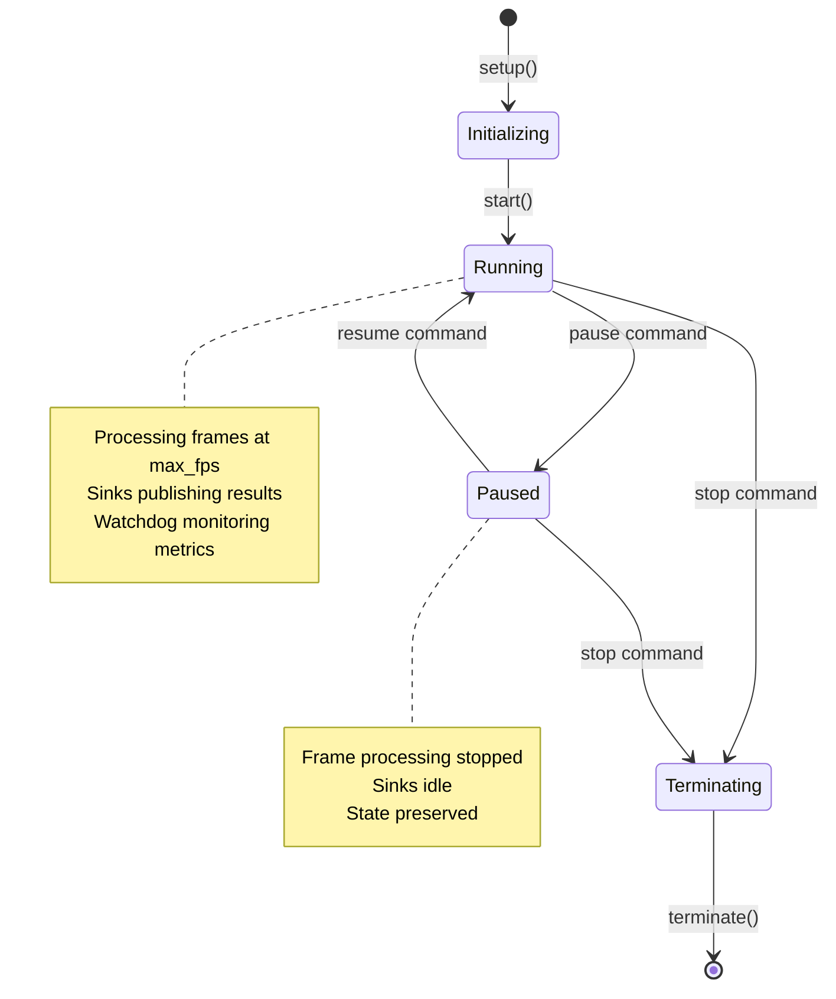
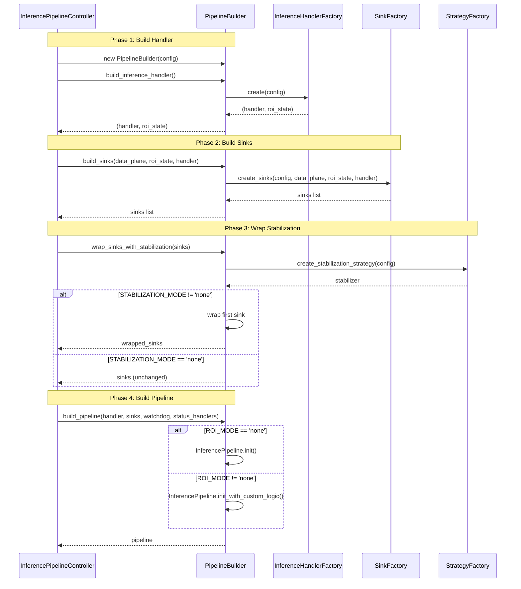
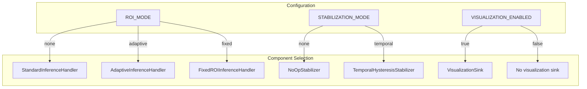

# Inference Pipeline

Relevant source files

- [adeline/CLAUDE.md](https://github.com/acare7/kata-inference-251021-clean4/blob/a0662727/adeline/CLAUDE.md)
- [adeline/app/builder.py](https://github.com/acare7/kata-inference-251021-clean4/blob/a0662727/adeline/app/builder.py)

The `InferencePipeline` is the core video processing system that orchestrates the flow of RTSP video frames through inference, stabilization, and output distribution. This page describes the end-to-end video processing flow, component interactions, and lifecycle management.

For detailed information about specific subsystems, see:

- ROI processing modes and strategies: [ROI Strategies](https://deepwiki.com/acare7/kata-inference-251021-clean4/5.1-roi-strategies)
- Temporal filtering and track management: [Detection Stabilization](https://deepwiki.com/acare7/kata-inference-251021-clean4/5.2-detection-stabilization)
- Multi-person tracking implementation: [Multi-Object Tracking](https://deepwiki.com/acare7/kata-inference-251021-clean4/5.3-multi-object-tracking)
- Output distribution mechanisms: [Output Sinks](https://deepwiki.com/acare7/kata-inference-251021-clean4/5.4-output-sinks)

## Purpose and Scope

The inference pipeline processes RTSP video streams through the following stages:

1. **Video Frame Capture** - Connects to RTSP source and retrieves frames at configured FPS
2. **ROI Processing** - Optional region-of-interest cropping (none/adaptive/fixed modes)
3. **YOLO Inference** - Object detection on processed frames
4. **Coordinate Transformation** - Maps cropped detections back to full frame coordinates
5. **Detection Stabilization** - Optional temporal filtering to reduce flickering
6. **Multi-Sink Distribution** - Publishes results to MQTT, visualization, and ROI feedback

This document focuses on the pipeline architecture and component integration. Implementation details of individual stages are covered in child pages.

## Pipeline Architecture

The inference pipeline is built using the Builder pattern, with component construction delegated to specialized factories. The `PipelineBuilder` orchestrates assembly while `InferencePipelineController` manages lifecycle.

### Component Hierarchy



**Sources:** [adeline/app/builder.py1-209](https://github.com/acare7/kata-inference-251021-clean4/blob/a0662727/adeline/app/builder.py#L1-L209) [adeline/CLAUDE.md56-88](https://github.com/acare7/kata-inference-251021-clean4/blob/a0662727/adeline/CLAUDE.md#L56-L88)

### Pipeline Modes

The pipeline operates in two distinct modes based on `ROI_MODE` configuration:

|Mode|Pipeline Type|Entry Point|Handler Type|
|---|---|---|---|
|`none`|Standard|`InferencePipeline.init()`|`StandardInferenceHandler`|
|`adaptive`|Custom Logic|`InferencePipeline.init_with_custom_logic()`|`AdaptiveInferenceHandler`|
|`fixed`|Custom Logic|`InferencePipeline.init_with_custom_logic()`|`FixedROIInferenceHandler`|

**Standard Pipeline** ([builder.py178-191](https://github.com/acare7/kata-inference-251021-clean4/blob/a0662727/builder.py#L178-L191)):

- Uses `model_id` parameter to load YOLO model automatically
- Inference handled internally by SDK
- No custom preprocessing
- Direct predictions to sinks

**Custom Logic Pipeline** ([builder.py193-205](https://github.com/acare7/kata-inference-251021-clean4/blob/a0662727/builder.py#L193-L205)):

- Uses `on_video_frame` callback for custom preprocessing
- Handler performs ROI extraction, inference, and coordinate transformation
- Predictions passed to sinks after transformation
- Enables ROI optimization strategies

**Sources:** [adeline/app/builder.py153-208](https://github.com/acare7/kata-inference-251021-clean4/blob/a0662727/adeline/app/builder.py#L153-L208)

## Video Processing Flow

### Frame-by-Frame Processing




**Sources:** [adeline/app/builder.py153-208](https://github.com/acare7/kata-inference-251021-clean4/blob/a0662727/adeline/app/builder.py#L153-L208) [adeline/CLAUDE.md103-127](https://github.com/acare7/kata-inference-251021-clean4/blob/a0662727/adeline/CLAUDE.md#L103-L127)

### Pipeline State Transitions

The pipeline supports dynamic state changes via MQTT commands:




**Sources:** [adeline/CLAUDE.md90-102](https://github.com/acare7/kata-inference-251021-clean4/blob/a0662727/adeline/CLAUDE.md#L90-L102)

## Core Components

### InferencePipeline

The `InferencePipeline` class from the inference SDK provides the video capture and frame processing loop. It manages RTSP connection, frame rate limiting, and callback orchestration.

**Key Methods:**

- `InferencePipeline.init()` - Standard pipeline with model_id
- `InferencePipeline.init_with_custom_logic()` - Custom preprocessing pipeline
- `start()` - Begin video processing
- `pause()` - Pause frame processing
- `resume()` - Resume frame processing
- `terminate()` - Stop and cleanup

**Sources:** [adeline/app/builder.py27-28](https://github.com/acare7/kata-inference-251021-clean4/blob/a0662727/adeline/app/builder.py#L27-L28) [adeline/app/builder.py153-208](https://github.com/acare7/kata-inference-251021-clean4/blob/a0662727/adeline/app/builder.py#L153-L208)

### BaseInferenceHandler

Abstract base class for inference handlers that process video frames. Implementations handle ROI extraction, YOLO inference, and coordinate transformation.

**Subclasses:**

- `StandardInferenceHandler` - No ROI processing (full frame)
- `AdaptiveInferenceHandler` - Dynamic ROI based on previous detections
- `FixedROIInferenceHandler` - Static predefined ROI

**Capabilities:**

- `supports_toggle` - Whether handler can be dynamically enabled/disabled

See [ROI Strategies](https://deepwiki.com/acare7/kata-inference-251021-clean4/5.1-roi-strategies) for detailed implementation information.

**Sources:** [adeline/CLAUDE.md104-118](https://github.com/acare7/kata-inference-251021-clean4/blob/a0662727/adeline/CLAUDE.md#L104-L118)

### Stabilization Wrapper

The stabilization system wraps the first sink (MQTT) to filter detections before publication. It uses a decorator pattern to inject temporal filtering without modifying sink implementations.

**Implementation:**

```
stabilized_sink = create_stabilization_sink(
    stabilizer=stabilizer,
    downstream_sink=mqtt_sink
)
```

The wrapper only processes the first sink to avoid redundant filtering overhead. Other sinks (visualization, ROI update) receive unstabilized predictions.

See [Detection Stabilization](https://deepwiki.com/acare7/kata-inference-251021-clean4/5.2-detection-stabilization) for filtering algorithms and [Multi-Object Tracking](https://deepwiki.com/acare7/kata-inference-251021-clean4/5.3-multi-object-tracking) for track management.

**Sources:** [adeline/app/builder.py112-151](https://github.com/acare7/kata-inference-251021-clean4/blob/a0662727/adeline/app/builder.py#L112-L151)

### Multi-Sink Distribution

Sinks receive predictions and perform output actions. The `multi_sink()` function from the inference SDK distributes predictions to all sinks in parallel.

**Sink Types:**

1. **MQTT Sink** (Priority 1) - Publishes detections to MQTT broker
2. **ROI Update Sink** (Priority 50) - Updates ROI state for next frame (adaptive mode only)
3. **Visualization Sink** (Priority 100) - Displays annotated video (if enabled)

See [Output Sinks](https://deepwiki.com/acare7/kata-inference-251021-clean4/5.4-output-sinks) for detailed sink implementations.

**Sources:** [adeline/app/builder.py85-110](https://github.com/acare7/kata-inference-251021-clean4/blob/a0662727/adeline/app/builder.py#L85-L110) [adeline/app/builder.py175](https://github.com/acare7/kata-inference-251021-clean4/blob/a0662727/adeline/app/builder.py#L175-L175)

## Pipeline Construction

The `PipelineBuilder` orchestrates component construction in a specific order to ensure dependencies are satisfied.

### Construction Sequence



**Sources:** [adeline/app/builder.py41-208](https://github.com/acare7/kata-inference-251021-clean4/blob/a0662727/adeline/app/builder.py#L41-L208)

### Builder Methods

|Method|Responsibility|Factory Used|
|---|---|---|
|`build_inference_handler()`|Create handler + ROI state|`InferenceHandlerFactory`|
|`build_sinks()`|Create sink list with priorities|`SinkFactory`|
|`wrap_sinks_with_stabilization()`|Wrap first sink if enabled|`StrategyFactory`|
|`build_pipeline()`|Assemble final pipeline|N/A (direct construction)|

**Sources:** [adeline/app/builder.py71-208](https://github.com/acare7/kata-inference-251021-clean4/blob/a0662727/adeline/app/builder.py#L71-L208)

### Configuration-Driven Construction

The builder reads configuration to determine which components to instantiate:



**Sources:** [adeline/app/builder.py71-83](https://github.com/acare7/kata-inference-251021-clean4/blob/a0662727/adeline/app/builder.py#L71-L83) [adeline/app/builder.py112-151](https://github.com/acare7/kata-inference-251021-clean4/blob/a0662727/adeline/app/builder.py#L112-L151) [adeline/app/builder.py178-205](https://github.com/acare7/kata-inference-251021-clean4/blob/a0662727/adeline/app/builder.py#L178-L205)

## Execution Lifecycle

### Pipeline Startup

The `InferencePipelineController` manages the pipeline lifecycle:

1. **Load Configuration** - Validate config.yaml using Pydantic schemas
2. **Setup Components** - Build handler, sinks, stabilization via `PipelineBuilder`
3. **Initialize MQTT** - Connect control plane (QoS 1) and data plane (QoS 0)
4. **Start Pipeline** - Begin frame processing loop
5. **Register Commands** - Enable MQTT control commands based on capabilities

**Sources:** [adeline/CLAUDE.md65-88](https://github.com/acare7/kata-inference-251021-clean4/blob/a0662727/adeline/CLAUDE.md#L65-L88)

### Frame Processing Loop

Each frame iteration follows this sequence:

1. **Capture** - `InferencePipeline` reads frame from RTSP
2. **Rate Limit** - Enforce `max_fps` constraint
3. **Process** - Call handler (standard inference or custom logic)
4. **Stabilize** - Filter detections if stabilization enabled
5. **Distribute** - Send to all sinks in parallel
6. **Watchdog** - Update metrics counters

**Sources:** [adeline/app/builder.py153-208](https://github.com/acare7/kata-inference-251021-clean4/blob/a0662727/adeline/app/builder.py#L153-L208)

### Pipeline Shutdown

Graceful shutdown sequence:

1. **Receive Signal** - SIGINT, SIGTERM, or stop command
2. **Pause Pipeline** - Stop frame processing
3. **Cleanup** - Release RTSP connection, close MQTT clients
4. **Terminate** - Exit process

**Sources:** [adeline/CLAUDE.md65-77](https://github.com/acare7/kata-inference-251021-clean4/blob/a0662727/adeline/CLAUDE.md#L65-L77)

## Performance Characteristics

### Frame Processing Budget

With `max_fps=5`:

- **Frame Budget:** 200ms per frame
- **Typical Breakdown:**
    - RTSP capture: 10-20ms
    - ROI processing: 5-15ms (if enabled)
    - YOLO inference: 50-150ms (device dependent)
    - Stabilization: 5-10ms (if enabled)
    - Sink distribution: 10-20ms

### Optimization Strategies

1. **Zero-Copy ROI** - NumPy array views avoid memory allocation
2. **Vectorized Transforms** - Batch coordinate transformations
3. **QoS Tuning** - MQTT data plane uses QoS 0 for lower latency
4. **Square ROI Constraint** - Maintains aspect ratio for YOLO input
5. **Lazy Model Loading** - Prevents unnecessary model downloads

See [Advanced Topics: Performance Optimizations](https://deepwiki.com/acare7/kata-inference-251021-clean4/8.3-performance-optimizations) for implementation details.

**Sources:** [adeline/CLAUDE.md59-64](https://github.com/acare7/kata-inference-251021-clean4/blob/a0662727/adeline/CLAUDE.md#L59-L64)

## Integration Points

### Upstream Dependencies

- **RTSP Source** - Video stream provider (camera or go2rtc)
- **YOLO Model** - Object detection model from Roboflow
- **Configuration** - config.yaml validated by Pydantic

### Downstream Consumers

- **MQTT Broker** - Receives detections and metrics
- **External Systems** - Monitor dashboard, control systems
- **Visualization** - OpenCV display (optional)

### Internal Components

- **Control Plane** - Receives commands to control pipeline state
- **Data Plane** - Publishes detection results
- **Watchdog** - Monitors performance metrics

**Sources:** [adeline/CLAUDE.md90-102](https://github.com/acare7/kata-inference-251021-clean4/blob/a0662727/adeline/CLAUDE.md#L90-L102)

---

**Related Pages:**

- [InferencePipelineController](https://deepwiki.com/acare7/kata-inference-251021-clean4/3.1-inferencepipelinecontroller) - Lifecycle orchestration
- [PipelineBuilder](https://deepwiki.com/acare7/kata-inference-251021-clean4/3.2-pipelinebuilder) - Component construction
- [ROI Strategies](https://deepwiki.com/acare7/kata-inference-251021-clean4/5.1-roi-strategies) - Region processing modes
- [Detection Stabilization](https://deepwiki.com/acare7/kata-inference-251021-clean4/5.2-detection-stabilization) - Temporal filtering
- [Multi-Object Tracking](https://deepwiki.com/acare7/kata-inference-251021-clean4/5.3-multi-object-tracking) - Track management
- [Output Sinks](https://deepwiki.com/acare7/kata-inference-251021-clean4/5.4-output-sinks) - Result distribution