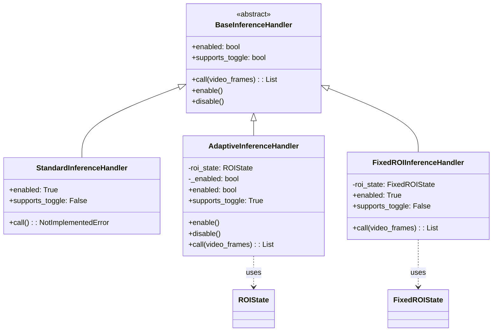
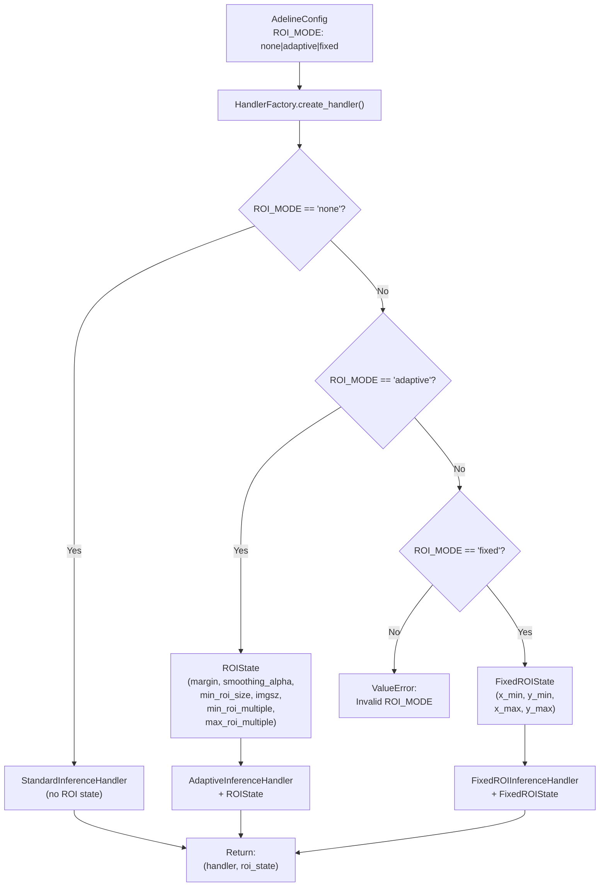
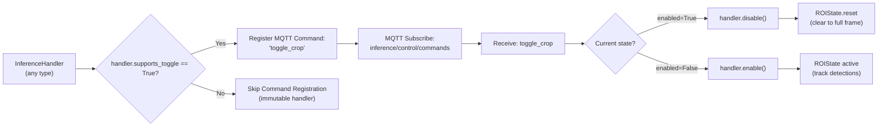
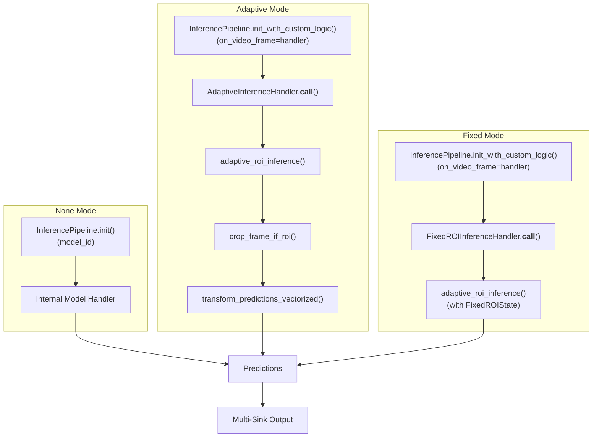
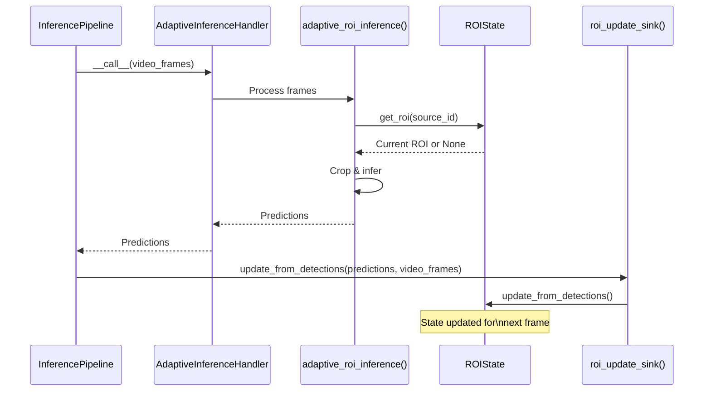

# ROI Strategies

Relevant source files

- [adeline/CLAUDE.md](https://github.com/acare7/kata-inference-251021-clean4/blob/a0662727/adeline/CLAUDE.md)
- [adeline/inference/handlers/__init__.py](https://github.com/acare7/kata-inference-251021-clean4/blob/a0662727/adeline/inference/handlers/__init__.py)
- [adeline/inference/handlers/base.py](https://github.com/acare7/kata-inference-251021-clean4/blob/a0662727/adeline/inference/handlers/base.py)
- [adeline/inference/handlers/standard.py](https://github.com/acare7/kata-inference-251021-clean4/blob/a0662727/adeline/inference/handlers/standard.py)
- [adeline/inference/roi/adaptive/__init__.py](https://github.com/acare7/kata-inference-251021-clean4/blob/a0662727/adeline/inference/roi/adaptive/__init__.py)
- [adeline/inference/roi/adaptive/geometry.py](https://github.com/acare7/kata-inference-251021-clean4/blob/a0662727/adeline/inference/roi/adaptive/geometry.py)
- [adeline/inference/roi/adaptive/pipeline.py](https://github.com/acare7/kata-inference-251021-clean4/blob/a0662727/adeline/inference/roi/adaptive/pipeline.py)
- [adeline/inference/roi/adaptive/state.py](https://github.com/acare7/kata-inference-251021-clean4/blob/a0662727/adeline/inference/roi/adaptive/state.py)
- [adeline/inference/roi/fixed.py](https://github.com/acare7/kata-inference-251021-clean4/blob/a0662727/adeline/inference/roi/fixed.py)

## Purpose and Scope

This page describes the Region of Interest (ROI) processing strategies available in the Adeline inference pipeline. ROI strategies optimize inference performance by focusing computational resources on relevant portions of video frames, reducing processing time while maintaining detection accuracy.

Three ROI modes are supported: `none` (full-frame processing), `adaptive` (dynamic ROI based on detections), and `fixed` (static pre-configured ROI). Each mode is implemented as a concrete handler conforming to a common interface.

For detailed implementation of adaptive ROI with temporal smoothing and dynamic tracking, see [Adaptive ROI](https://deepwiki.com/acare7/kata-inference-251021-clean4/5.1.1-adaptive-roi). For static ROI configuration and use cases, see [Fixed ROI](https://deepwiki.com/acare7/kata-inference-251021-clean4/5.1.2-fixed-roi). For the factory that creates handlers based on configuration, see [InferenceHandlerFactory](https://deepwiki.com/acare7/kata-inference-251021-clean4/3.3.1-inferencehandlerfactory).

**Sources:** [adeline/CLAUDE.md106-113](https://github.com/acare7/kata-inference-251021-clean4/blob/a0662727/adeline/CLAUDE.md#L106-L113) [adeline/inference/roi/adaptive/__init__.py1-37](https://github.com/acare7/kata-inference-251021-clean4/blob/a0662727/adeline/inference/roi/adaptive/__init__.py#L1-L37)

---

## ROI Mode Overview

The system implements three distinct ROI strategies, each optimized for different use cases:

|Mode|Description|Handler Class|Toggle Support|Use Case|
|---|---|---|---|---|
|`none`|Full-frame processing without crop|`StandardInferenceHandler`|No|Maximum coverage, simple scenes|
|`adaptive`|Dynamic ROI tracking detections|`AdaptiveInferenceHandler`|Yes (via MQTT)|Performance optimization, moving subjects|
|`fixed`|Static pre-configured crop region|`FixedROIInferenceHandler`|No|Known camera angles, fixed scene layout|

### None Mode

Standard full-frame inference without ROI processing. The `StandardInferenceHandler` is a minimal wrapper that delegates inference entirely to the `InferencePipeline`'s internal model handler. This mode processes every pixel of every frame.

**Sources:** [adeline/inference/handlers/standard.py1-67](https://github.com/acare7/kata-inference-251021-clean4/blob/a0662727/adeline/inference/handlers/standard.py#L1-L67)

### Adaptive Mode

Dynamic ROI that tracks detection locations frame-to-frame. The ROI adjusts its position and size based on where objects (persons) are detected, reducing the inference region to focus on active areas. Includes temporal smoothing to prevent jittery ROI updates.

Key features:

- Zero-copy cropping using NumPy views
- Temporal smoothing to stabilize ROI position
- Margin expansion around detections
- Minimum size constraints
- Square ROI in multiples of `imgsz` for efficient resize
- Runtime toggle via MQTT commands

**Sources:** [adeline/inference/roi/adaptive/__init__.py20-31](https://github.com/acare7/kata-inference-251021-clean4/blob/a0662727/adeline/inference/roi/adaptive/__init__.py#L20-L31) [adeline/inference/roi/adaptive/state.py36-47](https://github.com/acare7/kata-inference-251021-clean4/blob/a0662727/adeline/inference/roi/adaptive/state.py#L36-L47)

### Fixed Mode

Static ROI with immutable coordinates configured in YAML. The ROI never changes during execution, making it suitable for scenarios where the camera angle and scene layout are known and constant.

Key features:

- Normalized coordinates [0.0-1.0] defined in configuration
- No temporal smoothing or updates
- Immutable (no runtime toggle)
- Reuses `adaptive_roi_inference()` pipeline with `FixedROIState`
- Coordinate caching for repeated frame sizes

**Sources:** [adeline/inference/roi/fixed.py1-135](https://github.com/acare7/kata-inference-251021-clean4/blob/a0662727/adeline/inference/roi/fixed.py#L1-L135)

---

## Handler Architecture

The ROI strategies are implemented using the Strategy pattern with a common handler interface. All handlers inherit from `BaseInferenceHandler`, ensuring consistent behavior across different ROI modes.

### Handler Class Hierarchy



**Diagram: Handler Inheritance and State Dependencies**

This diagram shows the handler class hierarchy and how each handler type relates to its ROI state management class. `AdaptiveInferenceHandler` is the only handler with mutable state (`_enabled` flag) and toggle support.

**Sources:** [adeline/inference/handlers/base.py18-107](https://github.com/acare7/kata-inference-251021-clean4/blob/a0662727/adeline/inference/handlers/base.py#L18-L107) [adeline/inference/handlers/standard.py22-67](https://github.com/acare7/kata-inference-251021-clean4/blob/a0662727/adeline/inference/handlers/standard.py#L22-L67) [adeline/inference/roi/adaptive/pipeline.py382-459](https://github.com/acare7/kata-inference-251021-clean4/blob/a0662727/adeline/inference/roi/adaptive/pipeline.py#L382-L459) [adeline/inference/roi/fixed.py137-198](https://github.com/acare7/kata-inference-251021-clean4/blob/a0662727/adeline/inference/roi/fixed.py#L137-L198)

---

### BaseInferenceHandler Contract

The abstract base class defines the contract that all handlers must implement:

|Method/Property|Type|Required|Description|
|---|---|---|---|
|`__call__(video_frames)`|Method|Yes|Process frames and return predictions|
|`enabled`|Property|Yes|Whether handler is currently active|
|`supports_toggle`|Property|No (default: False)|Whether handler supports runtime enable/disable|
|`enable()`|Method|No (raises if unsupported)|Enable handler dynamically|
|`disable()`|Method|No (raises if unsupported)|Disable handler dynamically|

The `supports_toggle` property is critical for conditional MQTT command registration. Only handlers with `supports_toggle=True` expose `toggle_crop` commands.

**Sources:** [adeline/inference/handlers/base.py18-107](https://github.com/acare7/kata-inference-251021-clean4/blob/a0662727/adeline/inference/handlers/base.py#L18-L107) [adeline/CLAUDE.md115-118](https://github.com/acare7/kata-inference-251021-clean4/blob/a0662727/adeline/CLAUDE.md#L115-L118)

---

## Configuration-Driven Handler Selection

The ROI mode is determined at pipeline initialization from the `ROI_MODE` configuration value. The `InferenceHandlerFactory` implements the strategy selection logic:




**Diagram: ROI Mode Selection and Handler Instantiation Flow**

This diagram maps the configuration-driven selection process to actual code paths. The factory creates the appropriate handler and state objects based on `ROI_MODE`, returning a tuple of `(handler, roi_state)` to the pipeline builder.

**Sources:** [adeline/CLAUDE.md106-113](https://github.com/acare7/kata-inference-251021-clean4/blob/a0662727/adeline/CLAUDE.md#L106-L113) [adeline/inference/factories/handler_factory.py](https://github.com/acare7/kata-inference-251021-clean4/blob/a0662727/adeline/inference/factories/handler_factory.py) (inferred from architecture)

---

### Configuration Parameters by Mode

**None Mode:**

```
ROI_MODE: none
# No additional parameters needed
```

**Adaptive Mode:**

```
ROI_MODE: adaptive
ROI_ADAPTIVE_MARGIN: 0.2              # Expand 20% around detections
ROI_ADAPTIVE_SMOOTHING_ALPHA: 0.3    # Temporal smoothing factor
ROI_ADAPTIVE_MIN_SIZE: 0.3           # Min ROI as % of frame
ROI_ADAPTIVE_MIN_MULTIPLE: 1         # Min ROI = 1 × imgsz
ROI_ADAPTIVE_MAX_MULTIPLE: 4         # Max ROI = 4 × imgsz
ROI_ADAPTIVE_RESIZE_TO_MODEL: false  # Padding vs zoom strategy
```

**Fixed Mode:**

```
ROI_MODE: fixed
ROI_FIXED_X_MIN: 0.2   # Normalized coordinates [0.0-1.0]
ROI_FIXED_Y_MIN: 0.2
ROI_FIXED_X_MAX: 0.8
ROI_FIXED_Y_MAX: 0.8
ROI_FIXED_SHOW_OVERLAY: true
ROI_FIXED_RESIZE_TO_MODEL: false
```

For complete configuration schema validation rules, see [Configuration Schema Reference](https://deepwiki.com/acare7/kata-inference-251021-clean4/6.1-configuration-schema-reference).

**Sources:** [adeline/inference/roi/adaptive/state.py49-77](https://github.com/acare7/kata-inference-251021-clean4/blob/a0662727/adeline/inference/roi/adaptive/state.py#L49-L77) [adeline/inference/roi/fixed.py42-71](https://github.com/acare7/kata-inference-251021-clean4/blob/a0662727/adeline/inference/roi/fixed.py#L42-L71)

---

## Handler Capabilities and Runtime Behavior

The handler architecture supports conditional MQTT command registration based on capabilities:




**Diagram: Runtime Toggle Flow for Adaptive ROI**

This diagram shows how the `supports_toggle` property controls MQTT command registration and the toggle execution flow. Only `AdaptiveInferenceHandler` exposes runtime toggle behavior.

**Sources:** [adeline/CLAUDE.md94-98](https://github.com/acare7/kata-inference-251021-clean4/blob/a0662727/adeline/CLAUDE.md#L94-L98) [adeline/inference/roi/adaptive/pipeline.py437-446](https://github.com/acare7/kata-inference-251021-clean4/blob/a0662727/adeline/inference/roi/adaptive/pipeline.py#L437-L446)

### Handler Capability Matrix

|Handler|`enabled`|`supports_toggle`|`enable()`|`disable()`|
|---|---|---|---|---|
|`StandardInferenceHandler`|Always `True`|`False`|Raises `NotImplementedError`|Raises `NotImplementedError`|
|`AdaptiveInferenceHandler`|Mutable (via `_enabled`)|`True`|Sets `_enabled=True`|Sets `_enabled=False`, calls `roi_state.reset()`|
|`FixedROIInferenceHandler`|Always `True`|`False`|Raises `NotImplementedError`|Raises `NotImplementedError`|

**Sources:** [adeline/inference/handlers/base.py64-107](https://github.com/acare7/kata-inference-251021-clean4/blob/a0662727/adeline/inference/handlers/base.py#L64-L107) [adeline/inference/handlers/standard.py44-50](https://github.com/acare7/kata-inference-251021-clean4/blob/a0662727/adeline/inference/handlers/standard.py#L44-L50) [adeline/inference/roi/adaptive/pipeline.py427-446](https://github.com/acare7/kata-inference-251021-clean4/blob/a0662727/adeline/inference/roi/adaptive/pipeline.py#L427-L446) [adeline/inference/roi/fixed.py176-183](https://github.com/acare7/kata-inference-251021-clean4/blob/a0662727/adeline/inference/roi/fixed.py#L176-L183)

---

## Common Performance Optimizations

All ROI strategies share performance optimizations implemented in the inference pipeline:

### Zero-Copy Cropping

ROI cropping uses NumPy array views instead of copying pixel data:

```
# From adaptive/pipeline.py:77
cropped_image = video_frame.image[roi.y1:roi.y2, roi.x1:roi.x2]
```

NumPy slicing creates a view (reference) to the original array, not a copy. This eliminates memory allocation and copy overhead.

**Sources:** [adeline/inference/roi/adaptive/pipeline.py48-116](https://github.com/acare7/kata-inference-251021-clean4/blob/a0662727/adeline/inference/roi/adaptive/pipeline.py#L48-L116)

### Square ROI Constraint

ROIs are constrained to square shapes to prevent image distortion during resize:

```
# From adaptive/geometry.py:159-217
def make_square_multiple(self, imgsz: int, min_multiple: int, max_multiple: int, frame_shape: Tuple[int, int]) -> 'ROIBox':
    # 1. Take max side of bbox
    max_side = max(self.width, self.height)
    
    # 2. Round to nearest multiple of imgsz
    multiple = max_side / imgsz
    rounded_multiple = max(min_multiple, min(max_multiple, round(multiple)))
    
    # 3. Final square size
    square_size = rounded_multiple * imgsz
```

Square ROIs ensure that resize operations maintain aspect ratio, preventing object distortion that degrades detection accuracy.

**Sources:** [adeline/inference/roi/adaptive/geometry.py159-217](https://github.com/acare7/kata-inference-251021-clean4/blob/a0662727/adeline/inference/roi/adaptive/geometry.py#L159-L217) [adeline/inference/roi/adaptive/state.py43-47](https://github.com/acare7/kata-inference-251021-clean4/blob/a0662727/adeline/inference/roi/adaptive/state.py#L43-L47)

### Multiple of `imgsz` Sizing

ROI dimensions are constrained to multiples of the model's input size (`imgsz`, typically 320 or 640):

|Multiple|ROI Size (imgsz=320)|ROI Size (imgsz=640)|Use Case|
|---|---|---|---|
|1|320×320|640×640|Tight crop, single person|
|2|640×640|1280×1280|Medium crop, 2-3 people|
|3|960×960|1920×1920|Wide crop, 3-4 people|
|4|1280×1280|2560×2560|Large crop, 4+ people or full scene|

This ensures clean resize operations (e.g., 640→320 is exactly 2×) without interpolation artifacts.

**Sources:** [adeline/inference/roi/adaptive/state.py43-47](https://github.com/acare7/kata-inference-251021-clean4/blob/a0662727/adeline/inference/roi/adaptive/state.py#L43-L47) [adeline/inference/roi/adaptive/geometry.py159-217](https://github.com/acare7/kata-inference-251021-clean4/blob/a0662727/adeline/inference/roi/adaptive/geometry.py#L159-L217)

### Vectorized Coordinate Transforms

Coordinate transformations after cropping use NumPy vectorized operations instead of Python loops:

```
# From adaptive/pipeline.py:143-156
xs = np.array([d['x'] for d in detections_list])
ys = np.array([d['y'] for d in detections_list])

# Vectorized broadcast operation (~20x faster than loop)
xs += x_offset
ys += y_offset
```

Vectorized operations leverage NumPy's C-optimized routines, providing approximately 20× speedup compared to Python loops.

**Sources:** [adeline/inference/roi/adaptive/pipeline.py118-157](https://github.com/acare7/kata-inference-251021-clean4/blob/a0662727/adeline/inference/roi/adaptive/pipeline.py#L118-L157)

---

## Inference Pipeline Integration

Each handler integrates into the `InferencePipeline` differently based on its mode:




**Diagram: Pipeline Construction by ROI Mode**

This diagram shows the initialization differences between ROI modes. Standard mode uses `InferencePipeline.init()` with a `model_id`, while adaptive and fixed modes use `InferencePipeline.init_with_custom_logic()` with a handler callable. Notably, fixed mode reuses the adaptive inference pipeline (`adaptive_roi_inference()`) with a different state object.

**Sources:** [adeline/CLAUDE.md106-113](https://github.com/acare7/kata-inference-251021-clean4/blob/a0662727/adeline/CLAUDE.md#L106-L113) [adeline/inference/roi/adaptive/pipeline.py206-336](https://github.com/acare7/kata-inference-251021-clean4/blob/a0662727/adeline/inference/roi/adaptive/pipeline.py#L206-L336) [adeline/inference/roi/fixed.py185-198](https://github.com/acare7/kata-inference-251021-clean4/blob/a0662727/adeline/inference/roi/fixed.py#L185-L198)

---

## ROI State Management

ROI strategies maintain state differently:

|Mode|State Class|Mutability|Per-Source State|Update Trigger|
|---|---|---|---|---|
|None|None|N/A|N/A|N/A|
|Adaptive|`ROIState`|Mutable|Yes (dict by `source_id`)|After each inference via `roi_update_sink()`|
|Fixed|`FixedROIState`|Immutable|No (same for all sources)|Never (configured once)|

### State Update Flow (Adaptive Mode)

The adaptive ROI state is updated in a feedback loop:



**Diagram: Adaptive ROI Feedback Loop**

This sequence diagram shows the temporal feedback loop in adaptive mode. The ROI state from the previous frame determines the crop region for the current frame. After inference, detections update the state for the next frame.

**Sources:** [adeline/inference/roi/adaptive/pipeline.py342-376](https://github.com/acare7/kata-inference-251021-clean4/blob/a0662727/adeline/inference/roi/adaptive/pipeline.py#L342-L376) [adeline/inference/roi/adaptive/state.py90-165](https://github.com/acare7/kata-inference-251021-clean4/blob/a0662727/adeline/inference/roi/adaptive/state.py#L90-L165)

---

## Summary

The ROI strategy system provides three modes optimized for different scenarios:

1. **None Mode** (`StandardInferenceHandler`): Full-frame processing for maximum coverage
2. **Adaptive Mode** (`AdaptiveInferenceHandler` + `ROIState`): Dynamic ROI tracking with runtime toggle support
3. **Fixed Mode** (`FixedROIInferenceHandler` + `FixedROIState`): Static immutable ROI for known layouts

All strategies share common performance optimizations:

- Zero-copy NumPy cropping
- Square ROI constraint (no distortion)
- Multiple of `imgsz` sizing (clean resize)
- Vectorized coordinate transforms

The handler architecture uses the Strategy pattern with a common `BaseInferenceHandler` interface, enabling configuration-driven selection at pipeline initialization and conditional MQTT command registration based on handler capabilities.

For detailed adaptive ROI implementation including temporal smoothing and geometry operations, see [Adaptive ROI](https://deepwiki.com/acare7/kata-inference-251021-clean4/5.1.1-adaptive-roi). For fixed ROI configuration and use cases, see [Fixed ROI](https://deepwiki.com/acare7/kata-inference-251021-clean4/5.1.2-fixed-roi).

**Sources:** [adeline/CLAUDE.md56-88](https://github.com/acare7/kata-inference-251021-clean4/blob/a0662727/adeline/CLAUDE.md#L56-L88) [adeline/inference/roi/adaptive/__init__.py1-65](https://github.com/acare7/kata-inference-251021-clean4/blob/a0662727/adeline/inference/roi/adaptive/__init__.py#L1-L65) [adeline/inference/roi/fixed.py1-135](https://github.com/acare7/kata-inference-251021-clean4/blob/a0662727/adeline/inference/roi/fixed.py#L1-L135) [adeline/inference/handlers/base.py1-107](https://github.com/acare7/kata-inference-251021-clean4/blob/a0662727/adeline/inference/handlers/base.py#L1-L107)