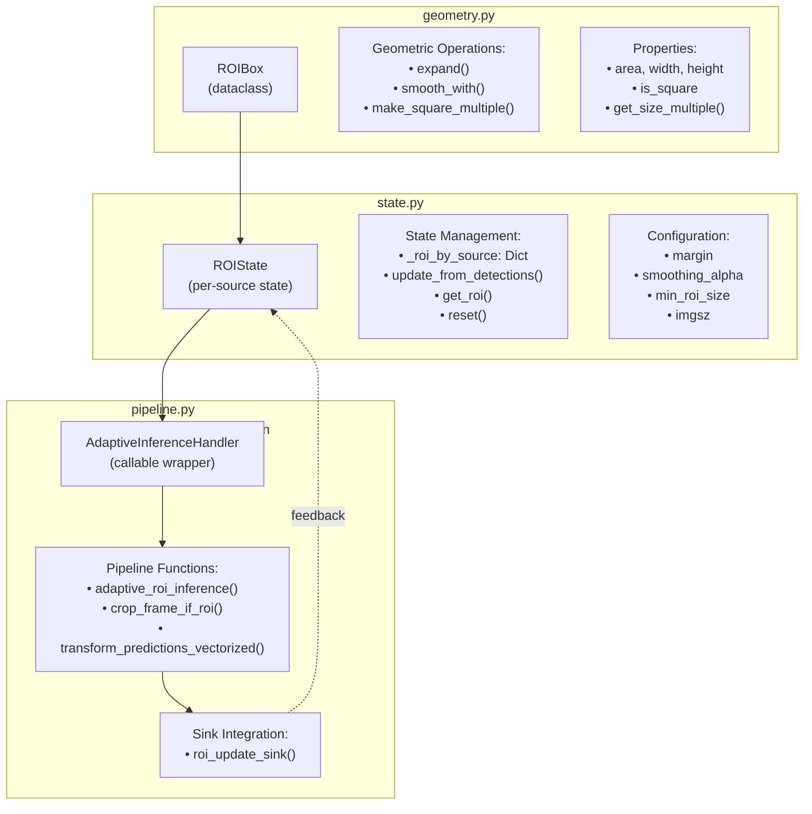
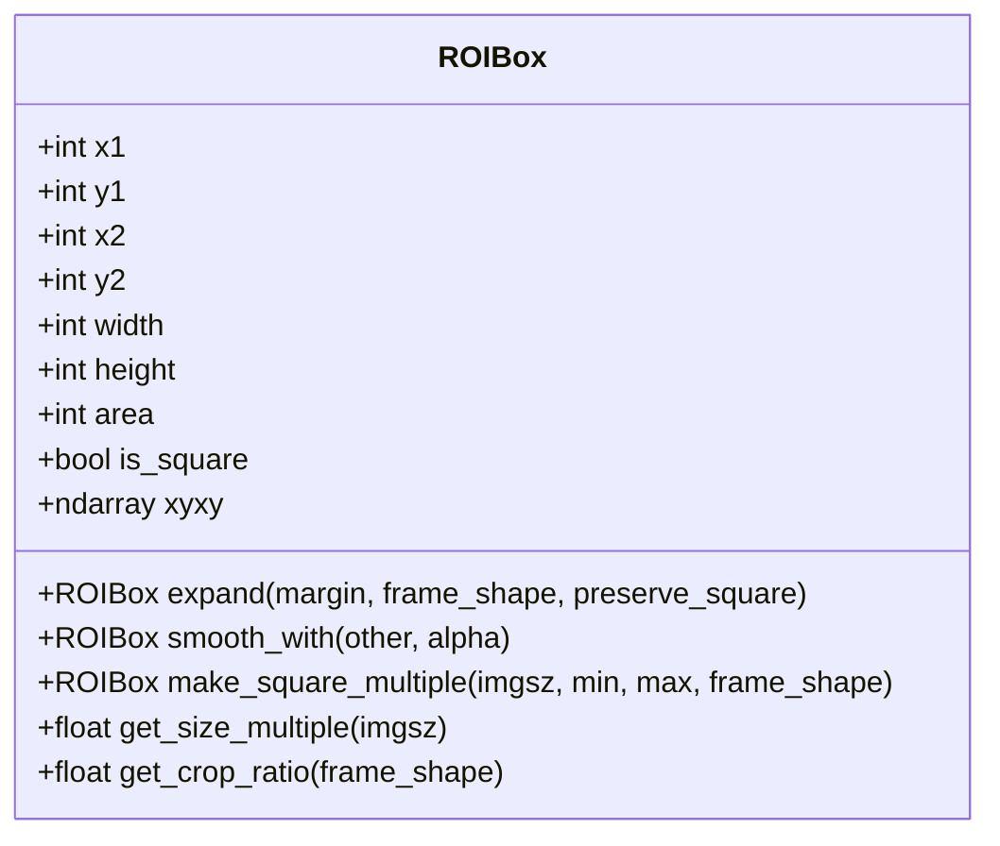
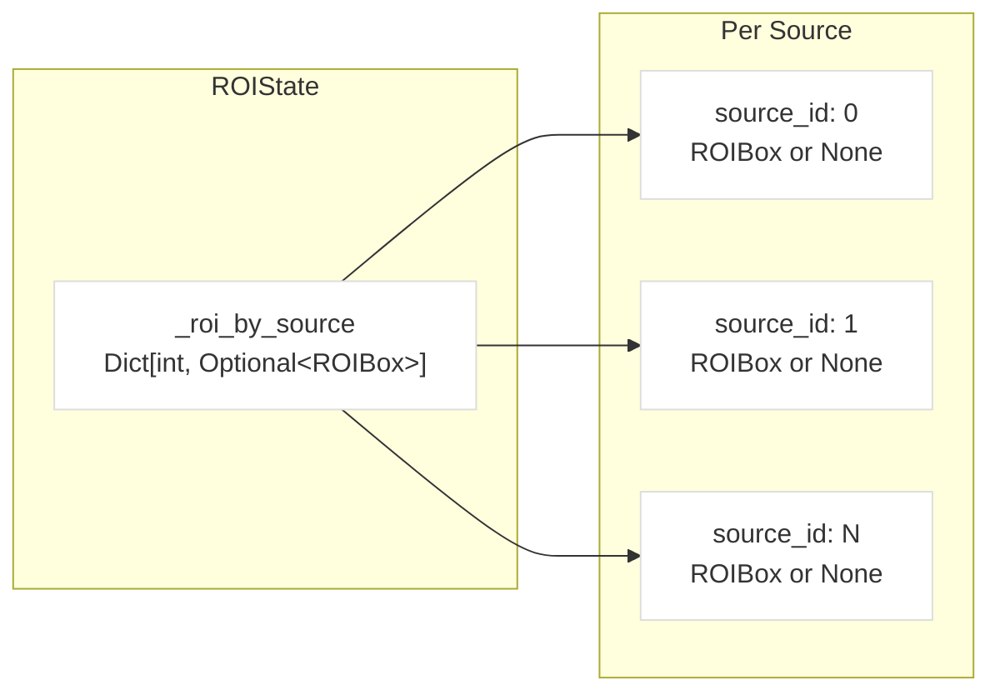
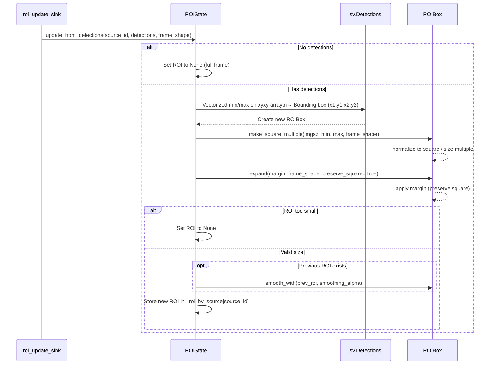
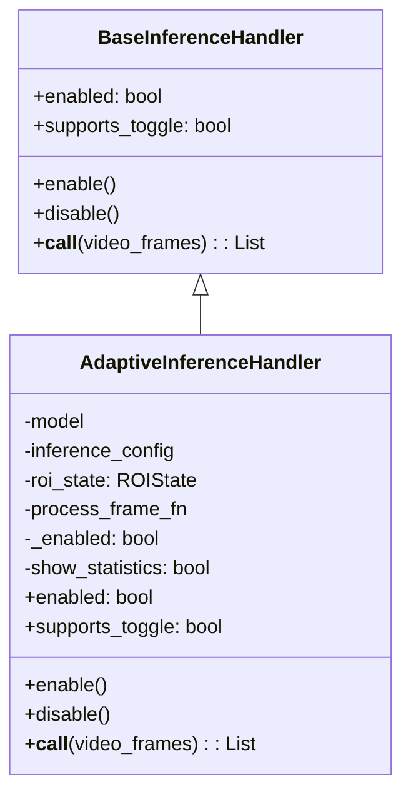
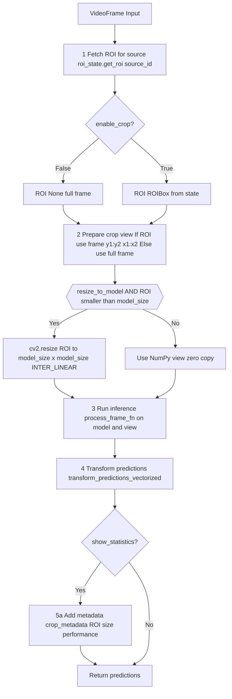
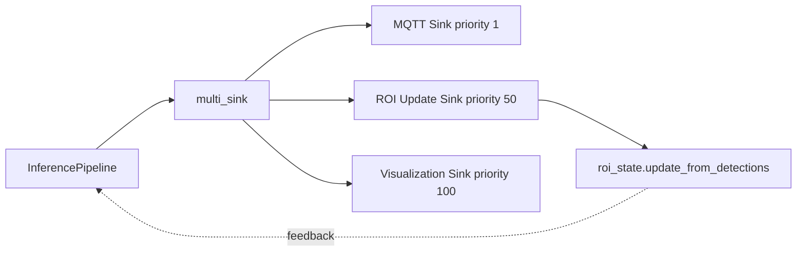

# Adaptive ROI

Relevant source files

- [adeline/CLAUDE.md](https://github.com/acare7/kata-inference-251021-clean4/blob/a0662727/adeline/CLAUDE.md)
- [adeline/inference/roi/adaptive/__init__.py](https://github.com/acare7/kata-inference-251021-clean4/blob/a0662727/adeline/inference/roi/adaptive/__init__.py)
- [adeline/inference/roi/adaptive/geometry.py](https://github.com/acare7/kata-inference-251021-clean4/blob/a0662727/adeline/inference/roi/adaptive/geometry.py)
- [adeline/inference/roi/adaptive/pipeline.py](https://github.com/acare7/kata-inference-251021-clean4/blob/a0662727/adeline/inference/roi/adaptive/pipeline.py)
- [adeline/inference/roi/adaptive/state.py](https://github.com/acare7/kata-inference-251021-clean4/blob/a0662727/adeline/inference/roi/adaptive/state.py)

## Purpose and Scope

Adaptive ROI (Region of Interest) is a dynamic frame cropping system that reduces inference computation by processing only the region containing detected objects. The system automatically adjusts the crop region based on previous detections, using temporal smoothing to prevent jittery updates.

This page covers the adaptive ROI implementation, which automatically tracks and adjusts the region. For static pre-configured ROI regions, see [Fixed ROI](https://deepwiki.com/acare7/kata-inference-251021-clean4/5.1.2-fixed-roi). For the overall ROI strategy selection, see [ROI Strategies](https://deepwiki.com/acare7/kata-inference-251021-clean4/5.1-roi-strategies).

**Key Features:**

- Dynamic crop region based on detection history
- Temporal smoothing to prevent jitter
- Zero-copy NumPy operations for performance
- Square ROI constraint (no image distortion)
- Size quantization to model imgsz multiples (efficient resize)
- Runtime toggle support via MQTT commands

## Architecture Overview

The adaptive ROI system is organized into three bounded contexts following Domain-Driven Design principles:



**Sources:** [adeline/inference/roi/adaptive/__init__.py1-66](https://github.com/acare7/kata-inference-251021-clean4/blob/a0662727/adeline/inference/roi/adaptive/__init__.py#L1-L66) [adeline/CLAUDE.md56-88](https://github.com/acare7/kata-inference-251021-clean4/blob/a0662727/adeline/CLAUDE.md#L56-L88)

### Module Responsibilities

|Module|Bounded Context|Responsibilities|Dependencies|
|---|---|---|---|
|`geometry.py`|Shape Algebra|Pure geometric operations on 2D shapes|NumPy only|
|`state.py`|Temporal ROI Tracking|Per-source state management, temporal smoothing|`geometry.py`, NumPy, Supervision|
|`pipeline.py`|Inference Orchestration|Frame processing, inference flow, coordinate transforms|`geometry.py`, `state.py`, OpenCV|

**Sources:** [adeline/inference/roi/adaptive/geometry.py1-23](https://github.com/acare7/kata-inference-251021-clean4/blob/a0662727/adeline/inference/roi/adaptive/geometry.py#L1-L23) [adeline/inference/roi/adaptive/state.py1-22](https://github.com/acare7/kata-inference-251021-clean4/blob/a0662727/adeline/inference/roi/adaptive/state.py#L1-L22) [adeline/inference/roi/adaptive/pipeline.py1-23](https://github.com/acare7/kata-inference-251021-clean4/blob/a0662727/adeline/inference/roi/adaptive/pipeline.py#L1-L23)

## ROIBox: Immutable Geometric Operations

`ROIBox` is an immutable dataclass representing a bounding box with pure geometric operations. All transformations return new `ROIBox` instances rather than mutating state.

### Core Properties



**Sources:** [adeline/inference/roi/adaptive/geometry.py31-67](https://github.com/acare7/kata-inference-251021-clean4/blob/a0662727/adeline/inference/roi/adaptive/geometry.py#L31-L67)

### Key Operations

|Operation|Purpose|Performance Note|
|---|---|---|
|`expand()`|Add margin around ROI, with optional square preservation|Clipped to frame bounds|
|`smooth_with()`|Temporal smoothing between two ROIs using exponential moving average|Preserves square shape if both inputs square|
|`make_square_multiple()`|Convert to square ROI with size as multiple of imgsz|Critical for efficient resize|
|`get_size_multiple()`|Calculate ROI size as multiple of model imgsz|Used for performance metrics|
|`get_crop_ratio()`|Calculate ROI area as fraction of frame|Measures pixel reduction|

**Sources:** [adeline/inference/roi/adaptive/geometry.py94-217](https://github.com/acare7/kata-inference-251021-clean4/blob/a0662727/adeline/inference/roi/adaptive/geometry.py#L94-L217)

### Square Multiple Strategy

The `make_square_multiple()` operation is critical for performance optimization. It ensures the ROI is:

1. **Square** (width == height) to prevent image distortion
2. **Multiple of imgsz** (e.g., 320, 640, 960) for efficient resize operations

**Algorithm:**

1. Take maximum dimension of current bbox
2. Round to nearest multiple of imgsz
3. Clamp between `[min_multiple × imgsz, max_multiple × imgsz]`
4. Center the square over original bbox
5. Clip to frame bounds

Example: For bbox 450×300 with imgsz=320, min=1, max=4:

- max_side = 450
- multiple = 450/320 = 1.41 → rounds to 1 (if threshold <480) or 2 (if ≥480)
- Result: 320×320 or 640×640 square ROI

**Sources:** [adeline/inference/roi/adaptive/geometry.py159-217](https://github.com/acare7/kata-inference-251021-clean4/blob/a0662727/adeline/inference/roi/adaptive/geometry.py#L159-L217)

## ROIState: Temporal Tracking

`ROIState` manages per-source ROI state across frames, implementing temporal smoothing to prevent jittery updates.

### Configuration Parameters

```
# Default initialization
roi_state = ROIState(
    margin=0.2,              # 20% expansion around detections
    smoothing_alpha=0.3,     # Temporal smoothing factor (0=no smooth, 1=max smooth)
    min_roi_size=0.3,        # Minimum 30% of frame area
    imgsz=320,               # Model inference size
    min_roi_multiple=1,      # Min size = 1×320 = 320px
    max_roi_multiple=4,      # Max size = 4×320 = 1280px
    resize_to_model=False    # Use padding vs resize
)
```

**Sources:** [adeline/inference/roi/adaptive/state.py49-76](https://github.com/acare7/kata-inference-251021-clean4/blob/a0662727/adeline/inference/roi/adaptive/state.py#L49-L76)

### State Management



The state dictionary `_roi_by_source` maps video source IDs to their current ROI. A `None` value indicates full-frame processing (no crop).

**Sources:** [adeline/inference/roi/adaptive/state.py69](https://github.com/acare7/kata-inference-251021-clean4/blob/a0662727/adeline/inference/roi/adaptive/state.py#L69-L69)

### Update Flow





**Sources:** [adeline/inference/roi/adaptive/state.py90-165](https://github.com/acare7/kata-inference-251021-clean4/blob/a0662727/adeline/inference/roi/adaptive/state.py#L90-L165)

### Vectorized Detection Processing

The `update_from_detections()` method uses NumPy vectorized operations for performance:

```
# Vectorized operation over all detections at once
xyxy = detections.xyxy  # shape: (N, 4) numpy array
x1 = int(np.min(xyxy[:, 0]))
y1 = int(np.min(xyxy[:, 1]))
x2 = int(np.max(xyxy[:, 2]))
y2 = int(np.max(xyxy[:, 3]))
```

This is ~20x faster than Python loops over individual detections.

**Sources:** [adeline/inference/roi/adaptive/state.py116-122](https://github.com/acare7/kata-inference-251021-clean4/blob/a0662727/adeline/inference/roi/adaptive/state.py#L116-L122)

## AdaptiveInferenceHandler: Callable Wrapper

`AdaptiveInferenceHandler` is a callable wrapper that implements the `BaseInferenceHandler` interface, enabling integration with `InferencePipeline` and runtime toggle support.

### Class Structure



**Sources:** [adeline/inference/roi/adaptive/pipeline.py382-410](https://github.com/acare7/kata-inference-251021-clean4/blob/a0662727/adeline/inference/roi/adaptive/pipeline.py#L382-L410)

### Properties and Methods

|Member|Type|Description|
|---|---|---|
|`enabled`|property|Returns current state of adaptive ROI (read-only from outside)|
|`supports_toggle`|property|Always returns `True` (enables MQTT toggle command)|
|`enable()`|method|Activates adaptive ROI processing|
|`disable()`|method|Deactivates adaptive ROI and resets state to full frame|
|`__call__()`|method|Callable interface invoked by `InferencePipeline`|

**Sources:** [adeline/inference/roi/adaptive/pipeline.py427-459](https://github.com/acare7/kata-inference-251021-clean4/blob/a0662727/adeline/inference/roi/adaptive/pipeline.py#L427-L459)

### Toggle Behavior

When `disable()` is called:

1. Sets internal `_enabled` flag to `False`
2. Calls `roi_state.reset()` to clear all source ROIs
3. Next frame will process full frame (no crop)

When `enable()` is called:

1. Sets internal `_enabled` flag to `True`
2. ROI will rebuild from next detection batch

**Sources:** [adeline/inference/roi/adaptive/pipeline.py437-446](https://github.com/acare7/kata-inference-251021-clean4/blob/a0662727/adeline/inference/roi/adaptive/pipeline.py#L437-L446)

## Inference Pipeline Flow

The adaptive ROI inference pipeline processes frames through five stages:




**Sources:** [adeline/inference/roi/adaptive/pipeline.py206-335](https://github.com/acare7/kata-inference-251021-clean4/blob/a0662727/adeline/inference/roi/adaptive/pipeline.py#L206-L335)

### Stage Details

#### Stage 1: Get ROI from State

```
roi = None
if enable_crop:
    frame_shape = video_frame.image.shape[:2]
    roi = roi_state.get_roi(source_id=video_frame.source_id)
```

**Sources:** [adeline/inference/roi/adaptive/pipeline.py253-266](https://github.com/acare7/kata-inference-251021-clean4/blob/a0662727/adeline/inference/roi/adaptive/pipeline.py#L253-L266)

#### Stage 2: Zero-Copy Crop

```
# NumPy slicing creates VIEW (no copy) - very efficient
cropped_image = video_frame.image[roi.y1:roi.y2, roi.x1:roi.x2]
```

The crop operation uses NumPy array slicing, which creates a view into the original array without copying data. This is critical for performance.

**Sources:** [adeline/inference/roi/adaptive/pipeline.py77](https://github.com/acare7/kata-inference-251021-clean4/blob/a0662727/adeline/inference/roi/adaptive/pipeline.py#L77-L77)

#### Stage 3: Optional Resize (Zoom)

If `resize_to_model=True` and the ROI is smaller than model size:

```
if roi_size < model_size:
    cropped_image = cv2.resize(
        cropped_image,
        (model_size, model_size),
        interpolation=cv2.INTER_LINEAR
    )
```

**Trade-off:** Better detection of small objects vs. loss of original scale context.

**Sources:** [adeline/inference/roi/adaptive/pipeline.py85-105](https://github.com/acare7/kata-inference-251021-clean4/blob/a0662727/adeline/inference/roi/adaptive/pipeline.py#L85-L105)

#### Stage 4: Vectorized Coordinate Transform

Transform predictions back to full frame coordinates:

```
xs = np.array([d['x'] for d in detections_list])
ys = np.array([d['y'] for d in detections_list])

# Vectorized broadcast addition
xs += x_offset
ys += y_offset
```

This vectorized approach is ~20x faster than Python loops.

**Sources:** [adeline/inference/roi/adaptive/pipeline.py143-154](https://github.com/acare7/kata-inference-251021-clean4/blob/a0662727/adeline/inference/roi/adaptive/pipeline.py#L143-L154)

#### Stage 5: Metadata Injection

When `show_statistics=True`, metadata is added to predictions for monitoring:

```
prediction['__crop_metadata__'] = {
    'enabled': enable_crop,
    'crop_applied': crop_offset is not None,
    'roi': {'x1': ..., 'width': ..., 'area': ...},
    'performance': {
        'imgsz': 320,
        'size_multiple': 2.0,
        'crop_ratio': 0.25,
        'pixel_reduction': 0.75
    }
}
```

**Sources:** [adeline/inference/roi/adaptive/pipeline.py288-331](https://github.com/acare7/kata-inference-251021-clean4/blob/a0662727/adeline/inference/roi/adaptive/pipeline.py#L288-L331)

## Performance Optimizations

The adaptive ROI system implements several critical optimizations:

### 1. Zero-Copy NumPy Operations

|Operation|Implementation|Performance Impact|
|---|---|---|
|Crop|`image[y1:y2, x1:x2]` (NumPy slice)|Creates view, no data copy|
|Min/Max bbox|`np.min(xyxy[:, 0])` (vectorized)|~20x faster than loops|
|Coordinate transform|`xs += offset` (broadcast)|Single operation on entire array|

**Sources:** [adeline/inference/roi/adaptive/pipeline.py77](https://github.com/acare7/kata-inference-251021-clean4/blob/a0662727/adeline/inference/roi/adaptive/pipeline.py#L77-L77) [adeline/inference/roi/adaptive/state.py116-122](https://github.com/acare7/kata-inference-251021-clean4/blob/a0662727/adeline/inference/roi/adaptive/state.py#L116-L122) [adeline/inference/roi/adaptive/pipeline.py148-149](https://github.com/acare7/kata-inference-251021-clean4/blob/a0662727/adeline/inference/roi/adaptive/pipeline.py#L148-L149)

### 2. Square ROI Constraint

All ROIs are forced to be square (width == height):

**Benefits:**

- No image distortion (maintains aspect ratio)
- Simplified resize operations
- Predictable memory layout

**Sources:** [adeline/inference/roi/adaptive/state.py43-46](https://github.com/acare7/kata-inference-251021-clean4/blob/a0662727/adeline/inference/roi/adaptive/state.py#L43-L46) [adeline/inference/roi/adaptive/geometry.py64-66](https://github.com/acare7/kata-inference-251021-clean4/blob/a0662727/adeline/inference/roi/adaptive/geometry.py#L64-L66)

### 3. imgsz Multiple Quantization

ROI sizes are quantized to multiples of the model's `imgsz` parameter (e.g., 320, 640, 960, 1280):

**Benefits:**

- Efficient resize: 640→320 is clean 2x downscale
- Better model performance with expected input dimensions
- Reduces resize artifacts

**Example Configuration:**

```
imgsz=320
min_roi_multiple=1  # Minimum: 320×320
max_roi_multiple=4  # Maximum: 1280×1280
# Valid sizes: 320, 640, 960, 1280
```

**Sources:** [adeline/inference/roi/adaptive/state.py64-66](https://github.com/acare7/kata-inference-251021-clean4/blob/a0662727/adeline/inference/roi/adaptive/state.py#L64-L66) [adeline/inference/roi/adaptive/geometry.py159-217](https://github.com/acare7/kata-inference-251021-clean4/blob/a0662727/adeline/inference/roi/adaptive/geometry.py#L159-L217)

### 4. Conditional Metrics Computation

The `show_statistics` flag controls metadata injection:

```
handler = AdaptiveInferenceHandler(
    model, config, roi_state,
    show_statistics=False  # Disable in production for better perf
)
```

When `False`, the system skips computing crop ratios, size multiples, and other metrics, reducing overhead.

**Sources:** [adeline/inference/roi/adaptive/pipeline.py418](https://github.com/acare7/kata-inference-251021-clean4/blob/a0662727/adeline/inference/roi/adaptive/pipeline.py#L418-L418) [adeline/inference/roi/adaptive/pipeline.py288-331](https://github.com/acare7/kata-inference-251021-clean4/blob/a0662727/adeline/inference/roi/adaptive/pipeline.py#L288-L331)

## Integration with Other Systems

### ROI Update Sink

The `roi_update_sink()` function integrates adaptive ROI with the multi-sink pipeline architecture:




**Sources:** [adeline/inference/roi/adaptive/pipeline.py342-376](https://github.com/acare7/kata-inference-251021-clean4/blob/a0662727/adeline/inference/roi/adaptive/pipeline.py#L342-L376) [adeline/CLAUDE.md146-149](https://github.com/acare7/kata-inference-251021-clean4/blob/a0662727/adeline/CLAUDE.md#L146-L149)

### Sink Implementation

```
def roi_update_sink(predictions, video_frames, roi_state):
    # Convert predictions to sv.Detections (vectorized)
    detections = convert_predictions_to_sv_detections(prediction)
    
    # Update ROI (NumPy optimized)
    roi_state.update_from_detections(
        source_id=video_frame.source_id,
        detections=detections,
        frame_shape=video_frame.image.shape[:2]
    )
```

This sink performs no I/O operations—it only updates shared state. It must be composed with other sinks using `multi_sink()`.

**Sources:** [adeline/inference/roi/adaptive/pipeline.py342-376](https://github.com/acare7/kata-inference-251021-clean4/blob/a0662727/adeline/inference/roi/adaptive/pipeline.py#L342-L376)

### Handler Factory Integration

The `InferenceHandlerFactory` creates `AdaptiveInferenceHandler` when `ROI_MODE='adaptive'`:

```
# In PipelineBuilder
handler, roi_state = builder.build_inference_handler()

# Returns AdaptiveInferenceHandler when config.ROI_MODE == 'adaptive'
```

**Sources:** [adeline/CLAUDE.md105-113](https://github.com/acare7/kata-inference-251021-clean4/blob/a0662727/adeline/CLAUDE.md#L105-L113)

### MQTT Toggle Command

When `supports_toggle=True`, the control plane registers the `toggle_crop` command:

```
# In MQTTControlPlane setup
if handler.supports_toggle:
    registry.register('toggle_crop', 
                     lambda: handler.enable() if not handler.enabled else handler.disable())
```

**Sources:** [adeline/CLAUDE.md92-97](https://github.com/acare7/kata-inference-251021-clean4/blob/a0662727/adeline/CLAUDE.md#L92-L97)

## Configuration Example

Complete configuration in `config.yaml`:

```
roi_strategy:
  mode: adaptive
  adaptive:
    margin: 0.2                  # 20% expansion
    smoothing_alpha: 0.3         # Temporal smoothing
    min_roi_size: 0.3            # Min 30% of frame
    min_roi_multiple: 1          # Min 320×320 (if imgsz=320)
    max_roi_multiple: 4          # Max 1280×1280
    resize_to_model: false       # Use padding vs resize
    show_statistics: true        # Inject performance metrics

models:
  model_id: "yolov8n-640"
  imgsz: 320                     # Critical for size quantization
```

**Sources:** [adeline/inference/roi/adaptive/state.py49-76](https://github.com/acare7/kata-inference-251021-clean4/blob/a0662727/adeline/inference/roi/adaptive/state.py#L49-L76) [adeline/inference/roi/adaptive/pipeline.py418](https://github.com/acare7/kata-inference-251021-clean4/blob/a0662727/adeline/inference/roi/adaptive/pipeline.py#L418-L418)

## Public API

The module exports a clean public API through `__init__.py`:

|Export|Type|Purpose|
|---|---|---|
|`ROIBox`|class|Immutable bounding box with geometric operations|
|`ROIState`|class|Per-source temporal state management|
|`AdaptiveInferenceHandler`|class|Callable wrapper for pipeline integration|
|`adaptive_roi_inference`|function|Core inference pipeline function|
|`roi_update_sink`|function|Sink for ROI state updates|
|`crop_frame_if_roi`|function|Zero-copy crop utility|
|`transform_predictions_vectorized`|function|Vectorized coordinate transform|
|`convert_predictions_to_sv_detections`|function|Format conversion utility|

**Sources:** [adeline/inference/roi/adaptive/__init__.py39-65](https://github.com/acare7/kata-inference-251021-clean4/blob/a0662727/adeline/inference/roi/adaptive/__init__.py#L39-L65)