# Fixed ROI

Relevant source files

- [adeline/inference/factories/handler_factory.py](https://github.com/acare7/kata-inference-251021-clean4/blob/a0662727/adeline/inference/factories/handler_factory.py)
- [adeline/inference/handlers/__init__.py](https://github.com/acare7/kata-inference-251021-clean4/blob/a0662727/adeline/inference/handlers/__init__.py)
- [adeline/inference/handlers/base.py](https://github.com/acare7/kata-inference-251021-clean4/blob/a0662727/adeline/inference/handlers/base.py)
- [adeline/inference/handlers/standard.py](https://github.com/acare7/kata-inference-251021-clean4/blob/a0662727/adeline/inference/handlers/standard.py)
- [adeline/inference/roi/fixed.py](https://github.com/acare7/kata-inference-251021-clean4/blob/a0662727/adeline/inference/roi/fixed.py)

## Purpose and Scope

This document describes the Fixed ROI strategy, which applies a static, pre-configured Region of Interest to all video frames. Fixed ROI uses normalized coordinates defined in the configuration file to crop frames to a specific area before inference, providing consistent processing boundaries across all frames.

For dynamic ROI adjustment based on detections, see [Adaptive ROI](https://deepwiki.com/acare7/kata-inference-251021-clean4/5.1.1-adaptive-roi). For the general ROI strategy system, see [ROI Strategies](https://deepwiki.com/acare7/kata-inference-251021-clean4/5.1-roi-strategies).

---

## Overview

Fixed ROI provides a static cropping strategy where the region of interest remains constant throughout the video stream. The ROI is defined using normalized coordinates (0.0-1.0 range) in the configuration file, making it resolution-independent.

**Key Characteristics:**

- **Immutable**: Coordinates never change during runtime
- **Pre-configured**: Defined in YAML before pipeline starts
- **Resolution-independent**: Uses normalized coordinates
- **No toggle support**: Cannot be dynamically enabled/disabled (unlike adaptive ROI)
- **Cached**: Frame-to-pixel coordinate conversion is cached for performance

**Use Cases:**

- Fixed camera positions with known areas of interest
- Excluding unwanted regions (doorways, windows, static background)
- Focusing on specific zones (hallway center, bed area, entrance)
- Reducing computational load by processing only relevant areas

Sources: [adeline/inference/roi/fixed.py1-26](https://github.com/acare7/kata-inference-251021-clean4/blob/a0662727/adeline/inference/roi/fixed.py#L1-L26)

---

## Core Components

### Component Architecture


**Component Responsibilities:**

|Component|Responsibility|Mutability|
|---|---|---|
|`FixedROIState`|Stores normalized coordinates, converts to pixels|Immutable after construction|
|`FixedROIInferenceHandler`|Wraps inference with fixed ROI, implements handler interface|Immutable|
|`ROIBox`|Represents absolute pixel coordinates (x1, y1, x2, y2)|Per-frame instance|
|`InferenceHandlerFactory`|Creates handler based on configuration|Factory method|

Sources: [adeline/inference/roi/fixed.py18-135](https://github.com/acare7/kata-inference-251021-clean4/blob/a0662727/adeline/inference/roi/fixed.py#L18-L135) [adeline/inference/factories/handler_factory.py136-152](https://github.com/acare7/kata-inference-251021-clean4/blob/a0662727/adeline/inference/factories/handler_factory.py#L136-L152)

---

## Configuration

### YAML Configuration

Fixed ROI is configured via normalized coordinates in `config.yaml`:

```
roi_strategy:
  mode: fixed  # Enable fixed ROI mode
  
  fixed:
    x_min: 0.2    # Left boundary (20% from left edge)
    y_min: 0.2    # Top boundary (20% from top edge)
    x_max: 0.8    # Right boundary (80% from left edge)
    y_max: 0.8    # Bottom boundary (80% from top edge)
    
    show_overlay: true       # Draw ROI rectangle on visualization
    resize_to_model: false   # false = pad with black, true = resize to model size
```

### Coordinate System

Fixed ROI uses **normalized coordinates** (0.0 to 1.0 range):


**Conversion Formula:**

```
# Normalized to absolute pixels
x1 = int(x_min * frame_width)
y1 = int(y_min * frame_height)
x2 = int(x_max * frame_width)
y2 = int(y_max * frame_height)
```

### Validation Rules

Configuration validation occurs at load time via Pydantic:

|Rule|Validation|Example|
|---|---|---|
|Range|`0.0 ≤ coord ≤ 1.0`|`x_min: 1.5` → ValidationError|
|Ordering|`x_min < x_max`|`x_min: 0.8, x_max: 0.2` → ValidationError|
|Ordering|`y_min < y_max`|`y_min: 0.9, y_max: 0.1` → ValidationError|
|Non-zero area|`(x_max - x_min) > 0`|`x_min: 0.5, x_max: 0.5` → ValidationError|

Sources: [adeline/inference/roi/fixed.py42-70](https://github.com/acare7/kata-inference-251021-clean4/blob/a0662727/adeline/inference/roi/fixed.py#L42-L70) [adeline/inference/factories/handler_factory.py92-100](https://github.com/acare7/kata-inference-251021-clean4/blob/a0662727/adeline/inference/factories/handler_factory.py#L92-L100)

---

## FixedROIState Class

### Class Structure

```mermaid
classDiagram
  class FixedROIState {
    -float _x_min
    -float _y_min
    -float _x_max
    -float _y_max
    +bool show_overlay
    +bool resize_to_model
    -Dict _roi_cache

    +init(x_min, y_min, x_max, y_max, show_overlay, resize_to_model)
    +get_roi(source_id, frame_shape) : ROIBox
    +reset(source_id) : void
    +normalized_coords() : Dict
  }

  class ROIBox {
    +int x1
    +int y1
    +int x2
    +int y2
    +width() : int
    +height() : int
  }

  FixedROIState ..> ROIBox : returns
```




### Key Methods

#### Constructor

[adeline/inference/roi/fixed.py42-74](https://github.com/acare7/kata-inference-251021-clean4/blob/a0662727/adeline/inference/roi/fixed.py#L42-L74)

```
def __init__(
    self,
    x_min: float,      # Normalized left boundary
    y_min: float,      # Normalized top boundary
    x_max: float,      # Normalized right boundary
    y_max: float,      # Normalized bottom boundary
    show_overlay: bool = True,
    resize_to_model: bool = False,
):
```

**Validation:**

- Checks `0.0 ≤ x_min < x_max ≤ 1.0`
- Checks `0.0 ≤ y_min < y_max ≤ 1.0`
- Raises `ValueError` if invalid

#### get_roi()

[adeline/inference/roi/fixed.py76-116](https://github.com/acare7/kata-inference-251021-clean4/blob/a0662727/adeline/inference/roi/fixed.py#L76-L116)

```
def get_roi(
    self,
    source_id: int,           # Ignored (all sources use same ROI)
    frame_shape: Tuple[int, int] = None,  # (height, width)
) -> Optional[ROIBox]:
```

**Behavior:**

1. Returns `None` if `frame_shape` not provided
2. Checks cache for `frame_shape` key
3. If cache miss: converts normalized → absolute coordinates
4. Caches result for future frames with same dimensions
5. Returns `ROIBox` with pixel coordinates

**Cache Strategy:**


**Performance:** Cache avoids redundant coordinate conversion for frames with identical dimensions (typical case: single resolution stream).

#### reset()

[adeline/inference/roi/fixed.py118-124](https://github.com/acare7/kata-inference-251021-clean4/blob/a0662727/adeline/inference/roi/fixed.py#L118-L124)

No-op method for interface compatibility with `ROIState`. Fixed coordinates are immutable, so reset has no effect.

Sources: [adeline/inference/roi/fixed.py18-135](https://github.com/acare7/kata-inference-251021-clean4/blob/a0662727/adeline/inference/roi/fixed.py#L18-L135)

---

## FixedROIInferenceHandler Class

### Handler Interface

`FixedROIInferenceHandler` implements `BaseInferenceHandler` interface:


### Properties

[adeline/inference/roi/fixed.py175-183](https://github.com/acare7/kata-inference-251021-clean4/blob/a0662727/adeline/inference/roi/fixed.py#L175-L183)

|Property|Value|Rationale|
|---|---|---|
|`enabled`|Always `True`|Fixed ROI cannot be disabled (immutable)|
|`supports_toggle`|`False`|No runtime enable/disable support|

Attempting to call `enable()` or `disable()` raises `NotImplementedError`.

### Callable Implementation

[adeline/inference/roi/fixed.py185-198](https://github.com/acare7/kata-inference-251021-clean4/blob/a0662727/adeline/inference/roi/fixed.py#L185-L198)

```
def __call__(self, video_frames):
    results = adaptive_roi_inference(
        video_frames=video_frames,
        model=self.model,
        inference_config=self.inference_config,
        roi_state=self.roi_state,       # FixedROIState passed here
        enable_crop=True,                # Always enabled
        process_frame_fn=self.process_frame_fn,
        show_statistics=self.show_statistics,
    )
    return results
```

**Design Note:** Fixed ROI reuses `adaptive_roi_inference()` function because both `FixedROIState` and `ROIState` implement the same interface (`get_roi()` method). This code reuse eliminates duplication of crop/inference/transform logic.

Sources: [adeline/inference/roi/fixed.py137-198](https://github.com/acare7/kata-inference-251021-clean4/blob/a0662727/adeline/inference/roi/fixed.py#L137-L198) [adeline/inference/handlers/base.py1-108](https://github.com/acare7/kata-inference-251021-clean4/blob/a0662727/adeline/inference/handlers/base.py#L1-L108)

---

## Factory Creation

### Handler Factory Flow


### Factory Implementation

[adeline/inference/factories/handler_factory.py136-152](https://github.com/acare7/kata-inference-251021-clean4/blob/a0662727/adeline/inference/factories/handler_factory.py#L136-L152)

```
elif roi_mode == 'fixed':
    logger.info("📍 Creating FixedROIInferenceHandler (static ROI)")
    handler = FixedROIInferenceHandler(
        model=model,
        inference_config=inference_config,
        roi_state=roi_state,            # FixedROIState instance
        process_frame_fn=process_frame_fn,
        show_statistics=config.CROP_SHOW_STATISTICS,
    )
```

### Configuration Mapping

[adeline/inference/factories/handler_factory.py82-100](https://github.com/acare7/kata-inference-251021-clean4/blob/a0662727/adeline/inference/factories/handler_factory.py#L82-L100)

|Config Parameter|ROIStrategyConfig Field|FixedROIState Parameter|
|---|---|---|
|`config.FIXED_X_MIN`|`fixed_x_min`|`x_min`|
|`config.FIXED_Y_MIN`|`fixed_y_min`|`y_min`|
|`config.FIXED_X_MAX`|`fixed_x_max`|`x_max`|
|`config.FIXED_Y_MAX`|`fixed_y_max`|`y_max`|
|`config.FIXED_SHOW_OVERLAY`|`fixed_show_overlay`|`show_overlay`|
|`config.FIXED_RESIZE_TO_MODEL`|`fixed_resize_to_model`|`resize_to_model`|
|`config.MODEL_IMGSZ`|`imgsz`|(used for resizing if enabled)|

Sources: [adeline/inference/factories/handler_factory.py66-152](https://github.com/acare7/kata-inference-251021-clean4/blob/a0662727/adeline/inference/factories/handler_factory.py#L66-L152)

---

## Processing Pipeline

### Frame Processing Flow

```mermaid
flowchart TD
  F[Video Frame H×W×3]
  C[FixedROIInferenceHandler.call]
  R[roi_state.get_roi source_id, frame_shape]
  B[ROIBox x1 y1 x2 y2]
  Z[Zero-copy crop frame y1:y2, x1:x2]
  D{resize_to_model?}
  RS[Resize to model size imgsz × imgsz]
  P[Pad with black maintain aspect ratio]
  Y[YOLO model inference on cropped or resized region]
  T[Transform coordinates cropped → full frame]
  O[Predictions with full-frame coordinates]

  F --> C --> R --> B --> Z --> D
  D -- true --> RS --> Y
  D -- false --> P --> Y
  Y --> T --> O
```




### Coordinate Transformation

After inference on the cropped region, bounding box coordinates must be transformed back to the full frame:

```
# Prediction in cropped coordinates
bbox_cropped = [x1_crop, y1_crop, x2_crop, y2_crop]

# Transform to full frame
x1_full = x1_crop + roi_box.x1
y1_full = y1_crop + roi_box.y1
x2_full = x2_crop + roi_box.x1
y2_full = y2_crop + roi_box.y1
```

This transformation is handled internally by `adaptive_roi_inference()`.

Sources: [adeline/inference/roi/fixed.py185-198](https://github.com/acare7/kata-inference-251021-clean4/blob/a0662727/adeline/inference/roi/fixed.py#L185-L198)

---

## Performance Optimizations

### Caching Strategy

[adeline/inference/roi/fixed.py73-116](https://github.com/acare7/kata-inference-251021-clean4/blob/a0662727/adeline/inference/roi/fixed.py#L73-L116)

**Cache Structure:**

```
_roi_cache: Dict[Tuple[int, int], ROIBox] = {}
# Key: (height, width) of frame
# Value: Computed ROIBox instance
```

**Cache Benefits:**

- Avoids redundant coordinate conversion for every frame
- Typical scenario: single video stream with constant resolution
- Memory overhead: minimal (one entry per unique resolution)

### Zero-Copy Cropping

Fixed ROI uses NumPy array slicing for zero-copy cropping:

```
# Zero-copy crop (creates view, not copy)
cropped_frame = frame[y1:y2, x1:x2]
```

This is identical to the optimization used in Adaptive ROI (see [Adaptive ROI](https://deepwiki.com/acare7/kata-inference-251021-clean4/5.1.1-adaptive-roi)).

### Immutability Benefits

Because coordinates are immutable:

- No locking required (thread-safe by design)
- No state synchronization overhead
- Predictable memory usage
- No runtime toggle logic

Sources: [adeline/inference/roi/fixed.py73-116](https://github.com/acare7/kata-inference-251021-clean4/blob/a0662727/adeline/inference/roi/fixed.py#L73-L116)

---

## Comparison: Fixed vs Adaptive ROI

### Feature Matrix

|Feature|Fixed ROI|Adaptive ROI|
|---|---|---|
|**Configuration**|Static YAML coordinates|Dynamic based on detections|
|**Runtime Behavior**|Immutable|Updates every frame|
|**Toggle Support**|No (`supports_toggle=False`)|Yes (`supports_toggle=True`)|
|**Cache Strategy**|By frame dimensions|By source ID|
|**Use Case**|Known fixed zones|Following moving subjects|
|**Computational Cost**|Minimal (cached)|Higher (dynamic updates)|
|**ROI State Class**|`FixedROIState`|`ROIState`|
|**Handler Class**|`FixedROIInferenceHandler`|`AdaptiveInferenceHandler`|
|**Feedback Loop**|None|ROI update sink required|

### Code Comparison

**Fixed ROI State:**

```
class FixedROIState:
    def get_roi(self, source_id, frame_shape):
        # Returns same ROI every time (from cache)
        return self._roi_cache[frame_shape]
```

**Adaptive ROI State:**

```
class ROIState:
    def get_roi(self, source_id, frame_shape):
        # Computes dynamic ROI based on previous detections
        return self._compute_dynamic_roi(...)
```

### When to Use Each

**Use Fixed ROI when:**

- Camera position is fixed
- Area of interest is known in advance
- Subjects remain in predictable zones
- Minimum computational overhead is desired
- No need for runtime adjustments

**Use Adaptive ROI when:**

- Subjects move throughout the frame
- Need to follow detected objects
- Unknown movement patterns
- Want to maximize detection accuracy in active areas
- Runtime toggle control is required

Sources: [adeline/inference/roi/fixed.py18-135](https://github.com/acare7/kata-inference-251021-clean4/blob/a0662727/adeline/inference/roi/fixed.py#L18-L135) [adeline/inference/handlers/base.py1-108](https://github.com/acare7/kata-inference-251021-clean4/blob/a0662727/adeline/inference/handlers/base.py#L1-L108)

---

## Integration with Pipeline

### Pipeline Construction

[adeline/inference/factories/handler_factory.py136-152](https://github.com/acare7/kata-inference-251021-clean4/blob/a0662727/adeline/inference/factories/handler_factory.py#L136-L152)

When `ROI_MODE='fixed'` in configuration:

1. `InferenceHandlerFactory.create()` builds `FixedROIInferenceHandler`
2. Pipeline uses `init_with_custom_logic()` (not `init()`)
3. Handler passed as `on_video_frame` callback
4. `roi_state` returned for potential use by sinks

### No ROI Update Sink

Unlike adaptive ROI, fixed ROI **does not require** an ROI update sink:


Adaptive ROI requires feedback:


Sources: [adeline/inference/roi/fixed.py137-198](https://github.com/acare7/kata-inference-251021-clean4/blob/a0662727/adeline/inference/roi/fixed.py#L137-L198) [adeline/inference/factories/handler_factory.py136-152](https://github.com/acare7/kata-inference-251021-clean4/blob/a0662727/adeline/inference/factories/handler_factory.py#L136-L152)

---

## Example Configuration

### Centered ROI (60% of frame)

```
roi_strategy:
  mode: fixed
  fixed:
    x_min: 0.2    # 20% from left
    y_min: 0.2    # 20% from top
    x_max: 0.8    # 80% from left
    y_max: 0.8    # 80% from top
    show_overlay: true
    resize_to_model: false
```

**Resulting ROI (1920×1080 frame):**

- Top-left: (384, 216)
- Bottom-right: (1536, 864)
- Width: 1152 pixels
- Height: 648 pixels
- Coverage: 60% of frame area

### Hallway Center

```
roi_strategy:
  mode: fixed
  fixed:
    x_min: 0.25   # Exclude left wall
    y_min: 0.1    # Include upper area
    x_max: 0.75   # Exclude right wall
    y_max: 0.9    # Include lower area
    show_overlay: true
    resize_to_model: false
```

### Excluding Doorway

```
roi_strategy:
  mode: fixed
  fixed:
    x_min: 0.0    # Full width
    y_min: 0.0    # Full height
    x_max: 0.6    # Exclude right 40% (doorway)
    y_max: 1.0
    show_overlay: true
    resize_to_model: false
```

Sources: [adeline/inference/roi/fixed.py32-40](https://github.com/acare7/kata-inference-251021-clean4/blob/a0662727/adeline/inference/roi/fixed.py#L32-L40) [adeline/inference/factories/handler_factory.py92-100](https://github.com/acare7/kata-inference-251021-clean4/blob/a0662727/adeline/inference/factories/handler_factory.py#L92-L100)