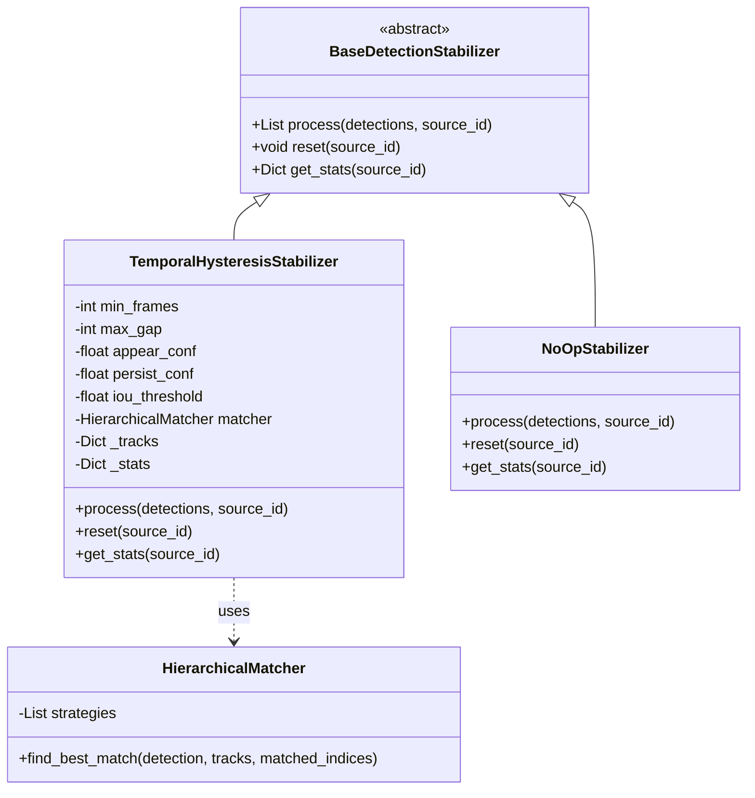
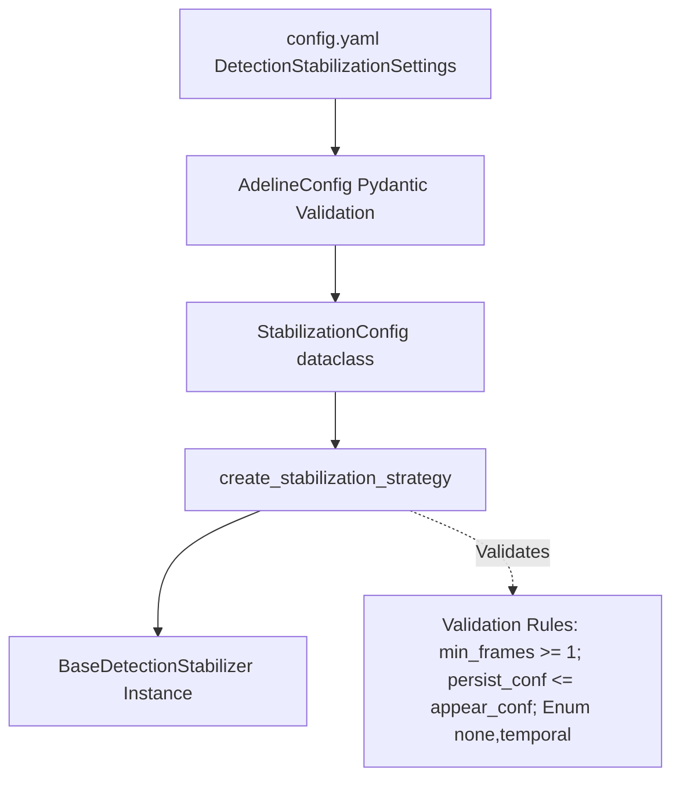
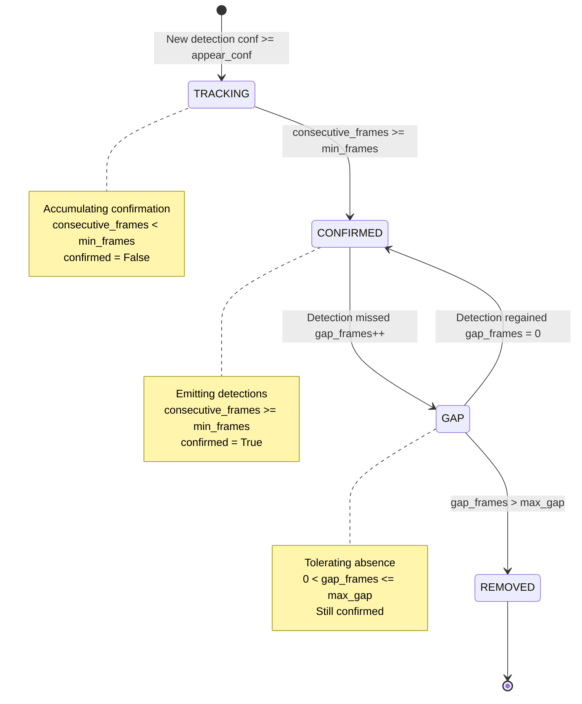
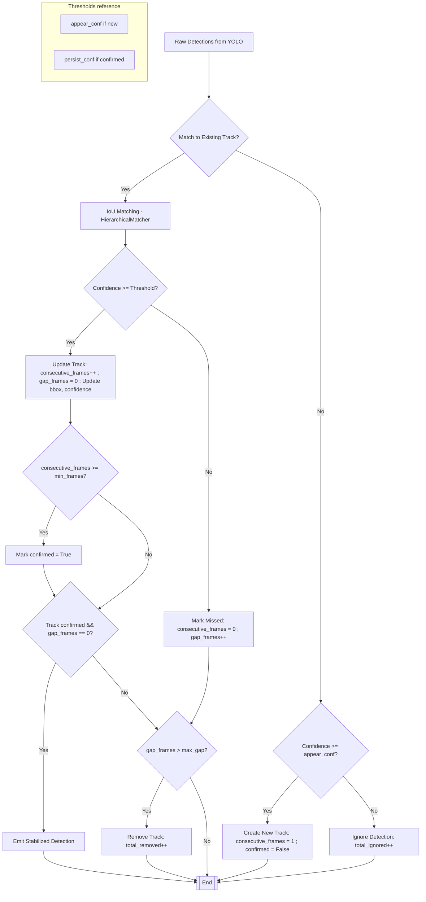
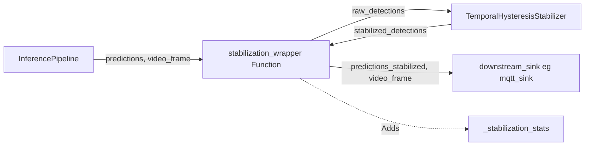

# Detection Stabilization

Relevant source files

- [adeline/CLAUDE.md](https://github.com/acare7/kata-inference-251021-clean4/blob/a0662727/adeline/CLAUDE.md)
- [adeline/inference/stabilization/__init__.py](https://github.com/acare7/kata-inference-251021-clean4/blob/a0662727/adeline/inference/stabilization/__init__.py)
- [adeline/inference/stabilization/core.py](https://github.com/acare7/kata-inference-251021-clean4/blob/a0662727/adeline/inference/stabilization/core.py)
- [adeline/inference/stabilization/matching.py](https://github.com/acare7/kata-inference-251021-clean4/blob/a0662727/adeline/inference/stabilization/matching.py)

## Purpose and Scope

This page documents the detection stabilization system, which provides temporal filtering to reduce flickering and false negatives in object detection outputs. The system maintains track continuity across frames, applies hysteresis-based confidence thresholds, and prevents ID swaps in multi-person scenarios.

**Related Pages:**

- For implementation details of `TemporalHysteresisStabilizer`, see [TemporalHysteresisStabilizer](https://deepwiki.com/acare7/kata-inference-251021-clean4/5.2.1-temporalhysteresisstabilizer)
- For spatial matching algorithms (IoU, matching strategies), see [IoU Matching System](https://deepwiki.com/acare7/kata-inference-251021-clean4/5.2.2-iou-matching-system)
- For broader multi-object tracking concepts, see [Multi-Object Tracking](https://deepwiki.com/acare7/kata-inference-251021-clean4/5.3-multi-object-tracking)
- For ROI strategies that integrate with stabilization, see [ROI Strategies](https://deepwiki.com/acare7/kata-inference-251021-clean4/5.1-roi-strategies)

---

## Problem Statement

Small, fast YOLO models produce unstable detections characterized by:

- **Flickering**: Objects appear and disappear across consecutive frames despite continuous presence
- **Intermittent False Negatives**: Detection confidence drops below threshold momentarily
- **ID Instability**: Same object receives different IDs across frames in multi-object scenarios
- **Noise Sensitivity**: Environmental factors (lighting, occlusion, posture changes) cause confidence fluctuations

**Sources:** [adeline/inference/stabilization/core.py1-23](https://github.com/acare7/kata-inference-251021-clean4/blob/a0662727/adeline/inference/stabilization/core.py#L1-L23)

---

## Architecture Overview

The stabilization system uses the **Strategy Pattern** to provide pluggable stabilization algorithms. A **Factory Pattern** creates stabilizers based on configuration, and a **Decorator Pattern** wraps output sinks to intercept and stabilize predictions.

### Strategy Pattern Hierarchy




**Sources:** [adeline/inference/stabilization/core.py123-170](https://github.com/acare7/kata-inference-251021-clean4/blob/a0662727/adeline/inference/stabilization/core.py#L123-L170) [adeline/inference/stabilization/core.py176-440](https://github.com/acare7/kata-inference-251021-clean4/blob/a0662727/adeline/inference/stabilization/core.py#L176-L440) [adeline/inference/stabilization/core.py446-466](https://github.com/acare7/kata-inference-251021-clean4/blob/a0662727/adeline/inference/stabilization/core.py#L446-L466) [adeline/inference/stabilization/matching.py280-381](https://github.com/acare7/kata-inference-251021-clean4/blob/a0662727/adeline/inference/stabilization/matching.py#L280-L381)

---

## Configuration System

### StabilizationConfig

The `StabilizationConfig` dataclass centralizes all stabilization parameters with validation enforced by the factory.

|Parameter|Type|Default|Description|
|---|---|---|---|
|`mode`|`str`|-|`'none'` or `'temporal'`|
|`temporal_min_frames`|`int`|3|Consecutive frames required to confirm detection|
|`temporal_max_gap`|`int`|2|Frames without detection before removing track|
|`hysteresis_appear_conf`|`float`|0.5|Confidence threshold for new detections (strict)|
|`hysteresis_persist_conf`|`float`|0.3|Confidence threshold for confirmed tracks (relaxed)|
|`iou_threshold`|`float`|0.3|Minimum IoU for spatial matching|

**Validation Rules:**

- `temporal_min_frames >= 1`
- `temporal_max_gap >= 0`
- `0.0 <= hysteresis_appear_conf <= 1.0`
- `0.0 <= hysteresis_persist_conf <= 1.0`
- `hysteresis_persist_conf <= hysteresis_appear_conf` (hysteresis constraint)

**Sources:** [adeline/inference/stabilization/core.py42-62](https://github.com/acare7/kata-inference-251021-clean4/blob/a0662727/adeline/inference/stabilization/core.py#L42-L62) [adeline/inference/stabilization/core.py501-515](https://github.com/acare7/kata-inference-251021-clean4/blob/a0662727/adeline/inference/stabilization/core.py#L501-L515)

### Configuration Flow


**Sources:** [adeline/inference/stabilization/core.py472-532](https://github.com/acare7/kata-inference-251021-clean4/blob/a0662727/adeline/inference/stabilization/core.py#L472-L532) [adeline/config/schemas.py](https://github.com/acare7/kata-inference-251021-clean4/blob/a0662727/adeline/config/schemas.py)

---

## Core Components

### BaseDetectionStabilizer

Abstract base class defining the stabilizer interface contract.

**Methods:**

- `process(detections, source_id) -> List[Dict]`: Processes raw detections, returns stabilized version
- `reset(source_id)`: Clears internal tracking state
- `get_stats(source_id) -> Dict`: Returns stabilization metrics

**Sources:** [adeline/inference/stabilization/core.py123-170](https://github.com/acare7/kata-inference-251021-clean4/blob/a0662727/adeline/inference/stabilization/core.py#L123-L170)

---

### DetectionTrack

State container for tracking individual object detections across frames.




**Track Properties:**

|Property|Type|Purpose|
|---|---|---|
|`class_name`|`str`|Object class (e.g., 'person')|
|`confidence`|`float`|Latest confidence score|
|`x, y, width, height`|`float`|Normalized bounding box|
|`consecutive_frames`|`int`|Frames detected consecutively|
|`gap_frames`|`int`|Frames missed since last detection|
|`confirmed`|`bool`|Whether track reached `min_frames`|
|`confidences`|`deque`|History of confidence scores (maxlen=10)|
|`last_seen_time`|`float`|Timestamp of last detection|

**Sources:** [adeline/inference/stabilization/core.py68-117](https://github.com/acare7/kata-inference-251021-clean4/blob/a0662727/adeline/inference/stabilization/core.py#L68-L117)

---

## Temporal Hysteresis Strategy

The `TemporalHysteresisStabilizer` implements multi-stage filtering combining:

1. **Temporal Filtering**: Require `min_frames` consecutive detections
2. **Hysteresis Thresholds**: Dual confidence thresholds (strict for new, relaxed for confirmed)
3. **Gap Tolerance**: Allow `max_gap` missed frames before removal
4. **IoU Matching**: Spatial association for multi-object tracking

### Processing Algorithm





**Sources:** [adeline/inference/stabilization/core.py250-405](https://github.com/acare7/kata-inference-251021-clean4/blob/a0662727/adeline/inference/stabilization/core.py#L250-L405)

### Example Timeline

Configuration: `min_frames=2`, `max_gap=2`, `appear_conf=0.5`, `persist_conf=0.3`

|Frame|Detection|Confidence|Track State|Action|Emitted?|
|---|---|---|---|---|---|
|1|person|0.45|-|Ignored (< 0.5)|❌|
|2|person|0.52|TRACKING (1/2)|Created track|❌|
|3|person|0.48|TRACKING (2/2)|Updated (≥ 0.3)|❌|
|4|person|0.51|CONFIRMED|Confirmed!|✅|
|5|person|0.35|CONFIRMED|Kept (≥ 0.3)|✅|
|6|-|-|GAP (1/2)|Missed frame|❌|
|7|-|-|GAP (2/2)|Missed frame|❌|
|8|-|-|REMOVED|Expired (gap > 2)|❌|

**Sources:** [adeline/inference/stabilization/core.py186-197](https://github.com/acare7/kata-inference-251021-clean4/blob/a0662727/adeline/inference/stabilization/core.py#L186-L197)

---

## Integration with Pipeline

### Decorator Pattern Implementation

The stabilizer wraps output sinks using the `create_stabilization_sink()` factory, creating a decorator that intercepts predictions.




**Code Flow:**

1. **Pipeline invokes wrapper**: [adeline/inference/stabilization/core.py565-572](https://github.com/acare7/kata-inference-251021-clean4/blob/a0662727/adeline/inference/stabilization/core.py#L565-L572)
2. **Extract raw detections**: [adeline/inference/stabilization/core.py578-580](https://github.com/acare7/kata-inference-251021-clean4/blob/a0662727/adeline/inference/stabilization/core.py#L578-L580)
3. **Process through stabilizer**: [adeline/inference/stabilization/core.py583](https://github.com/acare7/kata-inference-251021-clean4/blob/a0662727/adeline/inference/stabilization/core.py#L583-L583)
4. **Replace with stabilized**: [adeline/inference/stabilization/core.py586-587](https://github.com/acare7/kata-inference-251021-clean4/blob/a0662727/adeline/inference/stabilization/core.py#L586-L587)
5. **Add stats metadata**: [adeline/inference/stabilization/core.py590](https://github.com/acare7/kata-inference-251021-clean4/blob/a0662727/adeline/inference/stabilization/core.py#L590-L590)
6. **Forward to downstream sink**: [adeline/inference/stabilization/core.py599](https://github.com/acare7/kata-inference-251021-clean4/blob/a0662727/adeline/inference/stabilization/core.py#L599-L599)

**Sources:** [adeline/inference/stabilization/core.py539-609](https://github.com/acare7/kata-inference-251021-clean4/blob/a0662727/adeline/inference/stabilization/core.py#L539-L609)

### Builder Integration

The `PipelineBuilder` conditionally wraps sinks with stabilization:

```
# From app/builder.py (conceptual flow)
sinks = build_sinks()  # Build all sinks
first_sink = sinks[0]  # Typically MQTT sink

if config.STABILIZATION_MODE == 'temporal':
    stabilizer = create_stabilization_strategy(config)
    stabilized_sink = create_stabilization_sink(stabilizer, first_sink)
    sinks[0] = stabilized_sink  # Replace first sink with wrapped version
```

**Only the first sink** (typically MQTT) receives stabilized detections. Other sinks (visualization, ROI update) receive raw detections to preserve responsiveness.

**Sources:** [adeline/app/builder.py](https://github.com/acare7/kata-inference-251021-clean4/blob/a0662727/adeline/app/builder.py) [adeline/CLAUDE.md75-78](https://github.com/acare7/kata-inference-251021-clean4/blob/a0662727/adeline/CLAUDE.md#L75-L78)

---

## Factory Pattern

### create_stabilization_strategy()

Factory function that validates configuration and instantiates the appropriate stabilizer.

**Validation:**

- Mode must be `'none'` or `'temporal'`
- Numeric parameters within valid ranges
- Hysteresis constraint: `persist_conf <= appear_conf`

**Returns:**

- `NoOpStabilizer` if `mode == 'none'`
- `TemporalHysteresisStabilizer` if `mode == 'temporal'`

**Sources:** [adeline/inference/stabilization/core.py472-532](https://github.com/acare7/kata-inference-251021-clean4/blob/a0662727/adeline/inference/stabilization/core.py#L472-L532)

### create_stabilization_sink()

Factory function that creates a wrapper function implementing the decorator pattern.

**Signature:**

```
def create_stabilization_sink(
    stabilizer: BaseDetectionStabilizer,
    downstream_sink: Callable,
) -> Callable
```

**Returns:** A callable compatible with `InferencePipeline.on_prediction` that stabilizes detections before forwarding.

**Sources:** [adeline/inference/stabilization/core.py539-609](https://github.com/acare7/kata-inference-251021-clean4/blob/a0662727/adeline/inference/stabilization/core.py#L539-L609)

---

## Statistics and Monitoring

### Available Metrics

The `get_stats()` method returns tracking metrics:

|Metric|Description|
|---|---|
|`total_detected`|Total raw detections received|
|`total_confirmed`|Detections that reached confirmed state|
|`total_ignored`|Detections below `appear_conf` threshold|
|`total_removed`|Tracks removed due to exceeding `max_gap`|
|`active_tracks`|Currently tracked objects|
|`tracks_by_class`|Breakdown of active tracks per class|
|`confirm_ratio`|`total_confirmed / total_detected`|

**Sources:** [adeline/inference/stabilization/core.py422-439](https://github.com/acare7/kata-inference-251021-clean4/blob/a0662727/adeline/inference/stabilization/core.py#L422-L439)

### MQTT Command

If `STABILIZATION_MODE != 'none'`, the control plane registers a `stabilization_stats` command:

```
mosquitto_pub -t inference/control/commands \
  -m '{"command": "stabilization_stats"}'
```

**Returns:** JSON with stabilization statistics for all active sources.

**Sources:** [adeline/CLAUDE.md96-97](https://github.com/acare7/kata-inference-251021-clean4/blob/a0662727/adeline/CLAUDE.md#L96-L97) [adeline/control/registry.py](https://github.com/acare7/kata-inference-251021-clean4/blob/a0662727/adeline/control/registry.py)

---

## NoOpStabilizer

The `NoOpStabilizer` provides a pass-through implementation for the baseline case where no stabilization is desired.

**Characteristics:**

- `process()`: Returns detections unchanged
- `reset()`: No-op
- `get_stats()`: Returns `{'mode': 'none'}`
- Zero overhead (no allocations, no processing)

**Use Cases:**

- Performance baseline measurement
- Debugging raw model output
- Scenarios where temporal filtering is undesirable

**Sources:** [adeline/inference/stabilization/core.py446-466](https://github.com/acare7/kata-inference-251021-clean4/blob/a0662727/adeline/inference/stabilization/core.py#L446-L466)

---

## Multi-Source Support

The stabilizer maintains separate tracking state per `source_id`, enabling multi-stream processing:

```
# Internal state structure
_tracks: Dict[int, Dict[str, List[DetectionTrack]]]
#         ↑        ↑         ↑
#      source_id  class_name tracks

# Example:
# {
#   0: {'person': [track1, track2]},      # Camera 0
#   1: {'person': [track3], 'car': [track4]}  # Camera 1
# }
```

**Reset granularity:**

- `reset(source_id=None)`: Resets all sources
- `reset(source_id=0)`: Resets only source 0

**Sources:** [adeline/inference/stabilization/core.py227-229](https://github.com/acare7/kata-inference-251021-clean4/blob/a0662727/adeline/inference/stabilization/core.py#L227-L229) [adeline/inference/stabilization/core.py407-420](https://github.com/acare7/kata-inference-251021-clean4/blob/a0662727/adeline/inference/stabilization/core.py#L407-L420)

---

## Public API

The package exports a clean public API through `__init__.py`:

**Classes:**

- `BaseDetectionStabilizer`
- `StabilizationConfig`
- `TemporalHysteresisStabilizer`
- `NoOpStabilizer`

**Factory Functions:**

- `create_stabilization_strategy()`
- `create_stabilization_sink()`

**Utilities:**

- `calculate_iou()` (for custom matching logic)

**Sources:** [adeline/inference/stabilization/__init__.py1-41](https://github.com/acare7/kata-inference-251021-clean4/blob/a0662727/adeline/inference/stabilization/__init__.py#L1-L41)

---

## Performance Characteristics

### Computational Complexity

**Per-frame processing:** O(N × M)

- N = current frame detections (typically 5-20)
- M = active tracks (typically 10-50)
- Operations: ~100-1000 comparisons @ 2fps → negligible overhead

**Memory:** O(S × C × T)

- S = number of sources
- C = number of classes
- T = tracks per class
- Typical: 1 source × 1 class × 10 tracks × ~200 bytes = ~2KB

**Sources:** [adeline/inference/stabilization/core.py197-198](https://github.com/acare7/kata-inference-251021-clean4/blob/a0662727/adeline/inference/stabilization/core.py#L197-L198)

### Optimization Strategies

1. **Hierarchical Matching**: Chain of Responsibility stops at first match
2. **Matched Indices Set**: O(1) lookup prevents duplicate matching
3. **Class-based Bucketing**: Only compare tracks of same class
4. **Confidence Deque**: Fixed maxlen=10 prevents unbounded memory growth

**Sources:** [adeline/inference/stabilization/matching.py280-381](https://github.com/acare7/kata-inference-251021-clean4/blob/a0662727/adeline/inference/stabilization/matching.py#L280-L381) [adeline/inference/stabilization/core.py275-307](https://github.com/acare7/kata-inference-251021-clean4/blob/a0662727/adeline/inference/stabilization/core.py#L275-L307)