# TemporalHysteresisStabilizer

Relevant source files

- [adeline/inference/stabilization/core.py](https://github.com/acare7/kata-inference-251021-clean4/blob/a0662727/adeline/inference/stabilization/core.py)
- [adeline/inference/stabilization/matching.py](https://github.com/acare7/kata-inference-251021-clean4/blob/a0662727/adeline/inference/stabilization/matching.py)
- [adeline/tests/test_stabilization.py](https://github.com/acare7/kata-inference-251021-clean4/blob/a0662727/adeline/tests/test_stabilization.py)

The `TemporalHysteresisStabilizer` is the core implementation of detection stabilization that reduces flickering detections through temporal filtering and dual-threshold hysteresis. It maintains track state for detected objects across frames, requiring temporal consistency before confirming detections as stable, and uses spatial matching (IoU) to distinguish multiple objects of the same class.

This page covers the implementation details, track lifecycle, matching system, and configuration. For the abstract stabilizer interface and factory pattern, see [Detection Stabilization](https://deepwiki.com/acare7/kata-inference-251021-clean4/5.2-detection-stabilization). For the IoU matching system details, see [IoU Matching System](https://deepwiki.com/acare7/kata-inference-251021-clean4/5.2.2-iou-matching-system). For multi-object tracking behavior, see [Multi-Object Tracking](https://deepwiki.com/acare7/kata-inference-251021-clean4/5.3-multi-object-tracking).

## Purpose and Problem Statement

The stabilizer solves the problem of unstable detections (flickering) that occur with small/fast YOLO models where confidence scores vary frame-to-frame, causing:

- False negatives in individual frames (detection appears, disappears, reappears)
- Unstable confidence scores near threshold boundaries
- Difficulty distinguishing between transient noise and genuine detections

The solution applies temporal filtering: detections must persist for multiple consecutive frames (`min_frames`) before being confirmed, and once confirmed, they use a lower confidence threshold (`persist_conf`) to maintain stability.

**Sources:** [inference/stabilization/core.py1-24](https://github.com/acare7/kata-inference-251021-clean4/blob/a0662727/inference/stabilization/core.py#L1-L24)

## Core Concepts

### Temporal Filtering

Requires `min_frames` consecutive detections before confirming an object is stable. This filters out transient false positives that appear in 1-2 frames but lack temporal consistency.

**Example:** With `min_frames=3`:

- Frame 1: person detected → TRACKING (1/3)
- Frame 2: person detected → TRACKING (2/3)
- Frame 3: person detected → CONFIRMED (3/3, now emitted)

### Hysteresis

Uses dual confidence thresholds to prevent oscillation at threshold boundaries:

- `appear_conf` (high, e.g., 0.5): Strict threshold for new detections
- `persist_conf` (low, e.g., 0.3): Relaxed threshold for already-confirmed tracks

Once a detection is confirmed, it uses the lower threshold, making it harder to lose but harder to initially appear.

**Sources:** [inference/stabilization/core.py176-198](https://github.com/acare7/kata-inference-251021-clean4/blob/a0662727/inference/stabilization/core.py#L176-L198) [adeline/tests/test_stabilization.py147-232](https://github.com/acare7/kata-inference-251021-clean4/blob/a0662727/adeline/tests/test_stabilization.py#L147-L232)

### Gap Tolerance

Tolerates `max_gap` frames without detection before removing a track. This handles temporary occlusions or momentary false negatives from the model.

**Example:** With `max_gap=2`:

- Frames 1-3: person detected, confirmed
- Frame 4: no detection → GAP 1/2 (tolerated)
- Frame 5: no detection → GAP 2/2 (tolerated)
- Frame 6: no detection → REMOVED (gap exceeded)

**Sources:** [inference/stabilization/core.py48-49](https://github.com/acare7/kata-inference-251021-clean4/blob/a0662727/inference/stabilization/core.py#L48-L49) [adeline/tests/test_stabilization.py267-301](https://github.com/acare7/kata-inference-251021-clean4/blob/a0662727/adeline/tests/test_stabilization.py#L267-L301)

## Track Lifecycle


```
  note left of TRACKING: consecutive_frames < min_frames; confirmed = False; uses appear_conf threshold
  note left of CONFIRMED: consecutive_frames >= min_frames; confirmed = True; uses persist_conf; emits detections
  note right of GAP: temporary absence; gap_frames <= max_gap; still confirmed
```

**Sources:** [inference/stabilization/core.py68-117](https://github.com/acare7/kata-inference-251021-clean4/blob/a0662727/inference/stabilization/core.py#L68-L117) [adeline/tests/test_stabilization.py236-301](https://github.com/acare7/kata-inference-251021-clean4/blob/a0662727/adeline/tests/test_stabilization.py#L236-L301)

## Architecture and Class Structure

### Class Hierarchy


**Sources:** [inference/stabilization/core.py123-170](https://github.com/acare7/kata-inference-251021-clean4/blob/a0662727/inference/stabilization/core.py#L123-L170) [inference/stabilization/core.py176-440](https://github.com/acare7/kata-inference-251021-clean4/blob/a0662727/inference/stabilization/core.py#L176-L440) [inference/stabilization/core.py68-117](https://github.com/acare7/kata-inference-251021-clean4/blob/a0662727/inference/stabilization/core.py#L68-L117)

### Data Structures

The stabilizer maintains state using nested dictionaries:

```
_tracks: Dict[source_id, Dict[class_name, List[DetectionTrack]]]
```

This structure allows:

- Multi-stream support (different `source_id` values)
- Per-class tracking (separate track lists for "person", "car", etc.)
- Multiple objects of the same class (list of tracks per class)

**Example state:**

```
_tracks = {
    0: {  # source_id 0
        'person': [
            DetectionTrack(consecutive_frames=5, confirmed=True, ...),
            DetectionTrack(consecutive_frames=2, confirmed=False, ...)
        ],
        'car': [
            DetectionTrack(consecutive_frames=3, confirmed=True, ...)
        ]
    }
}
```

**Sources:** [inference/stabilization/core.py226-240](https://github.com/acare7/kata-inference-251021-clean4/blob/a0662727/inference/stabilization/core.py#L226-L240)

## Detection Processing Algorithm

### High-Level Flow


**Sources:** [inference/stabilization/core.py250-405](https://github.com/acare7/kata-inference-251021-clean4/blob/a0662727/inference/stabilization/core.py#L250-L405)

### Detailed Algorithm Steps

#### Step 1: Match Detections to Tracks

For each incoming detection:

1. Extract `class_name`, `confidence`, and bounding box coordinates
2. Look up existing tracks for that class: `tracks[source_id][class_name]`
3. Get already-matched track indices to avoid re-matching
4. Use `HierarchicalMatcher.find_best_match()` to find best track
5. If match found, mark track as matched

**Sources:** [inference/stabilization/core.py280-327](https://github.com/acare7/kata-inference-251021-clean4/blob/a0662727/inference/stabilization/core.py#L280-L327)

#### Step 2: Update or Create Tracks

**If matched:**

- Determine threshold: `persist_conf` if track is confirmed, else `appear_conf`
- If `confidence >= threshold`: call `track.update()` which increments `consecutive_frames`, resets `gap_frames`, updates bbox
- If `consecutive_frames >= min_frames` and not yet confirmed: set `track.confirmed = True`
- If `confidence < threshold`: call `track.mark_missed()` which increments `gap_frames`

**If not matched:**

- If `confidence >= appear_conf`: create new `DetectionTrack` with `consecutive_frames=1`
- Else: ignore detection (increment `stats['total_ignored']`)

**Sources:** [inference/stabilization/core.py307-347](https://github.com/acare7/kata-inference-251021-clean4/blob/a0662727/inference/stabilization/core.py#L307-L347)

#### Step 3: Handle Unmatched Tracks

For any track that was not matched in this frame, call `track.mark_missed()` to increment its `gap_frames` counter.

**Sources:** [inference/stabilization/core.py349-353](https://github.com/acare7/kata-inference-251021-clean4/blob/a0662727/inference/stabilization/core.py#L349-L353)

#### Step 4: Emit Confirmed Detections

Iterate through all tracks and emit those that are:

- `confirmed == True`
- `gap_frames == 0` (currently detected, not in gap state)

Emitted detections include stabilization metadata:

```
{
    'class': track.class_name,
    'confidence': track.confidence,
    'x': track.x,
    'y': track.y,
    'width': track.width,
    'height': track.height,
    '_stabilization': {
        'avg_confidence': track.avg_confidence,
        'frames_tracked': track.consecutive_frames,
    }
}
```

**Sources:** [inference/stabilization/core.py355-372](https://github.com/acare7/kata-inference-251021-clean4/blob/a0662727/inference/stabilization/core.py#L355-L372)

#### Step 5: Remove Expired Tracks

For each class, filter out tracks where `gap_frames > max_gap`. Update statistics with `stats['total_removed']`.

**Sources:** [inference/stabilization/core.py375-395](https://github.com/acare7/kata-inference-251021-clean4/blob/a0662727/inference/stabilization/core.py#L375-L395)

## Matching System Integration

The stabilizer delegates detection-to-track association to `HierarchicalMatcher`, which implements a chain-of-responsibility pattern with multiple matching strategies.


**Key behaviors:**

|Scenario|Primary (IoU)|Fallback (ClassOnly)|Result|
|---|---|---|---|
|Same class, high overlap|Score > 0.8|Not reached|IoU wins, spatially aware|
|Same class, low overlap|Score < 0.3|Score = 1.0|ClassOnly fallback|
|Different class|Score = 0.0|Score = 0.0|No match|
|Multiple same class|Highest IoU|First found|Prevents track swapping|

**Sources:** [inference/stabilization/core.py222-223](https://github.com/acare7/kata-inference-251021-clean4/blob/a0662727/inference/stabilization/core.py#L222-L223) [inference/stabilization/matching.py280-380](https://github.com/acare7/kata-inference-251021-clean4/blob/a0662727/inference/stabilization/matching.py#L280-L380) [adeline/tests/test_stabilization.py707-815](https://github.com/acare7/kata-inference-251021-clean4/blob/a0662727/adeline/tests/test_stabilization.py#L707-L815)

## Configuration Parameters

The `TemporalHysteresisStabilizer` is constructed with five parameters:

```
TemporalHysteresisStabilizer(
    min_frames: int = 3,
    max_gap: int = 2,
    appear_conf: float = 0.5,
    persist_conf: float = 0.3,
    iou_threshold: float = 0.3,
)
```

### Parameter Effects

|Parameter|Default|Effect|Validation|
|---|---|---|---|
|`min_frames`|3|Frames required to confirm track|Must be >= 1|
|`max_gap`|2|Frames without detection before removal|Must be >= 0|
|`appear_conf`|0.5|Confidence threshold for new detections|Must be in [0.0, 1.0]|
|`persist_conf`|0.3|Confidence threshold for confirmed tracks|Must be in [0.0, 1.0], <= appear_conf|
|`iou_threshold`|0.3|IoU minimum for spatial matching|Passed to HierarchicalMatcher|

**Tuning guidelines:**

- **Increase `min_frames`** (e.g., 4-5): More aggressive filtering, reduces false positives but increases latency
- **Decrease `min_frames`** (e.g., 2): Faster response, but more susceptible to flickering
- **Increase `max_gap`** (e.g., 3-4): Better handling of occlusions, but tracks persist longer after objects leave
- **Increase `appear_conf`** (e.g., 0.6-0.7): Stricter appearance threshold, fewer false tracks
- **Decrease `persist_conf`** (e.g., 0.2): More tolerant of confidence drops, but may persist false tracks longer
- **Increase `iou_threshold`** (e.g., 0.5): Stricter spatial matching, better for densely packed objects
- **Decrease `iou_threshold`** (e.g., 0.2): More tolerant of movement, better for fast-moving objects

**Sources:** [inference/stabilization/core.py200-248](https://github.com/acare7/kata-inference-251021-clean4/blob/a0662727/inference/stabilization/core.py#L200-L248) [inference/stabilization/core.py501-514](https://github.com/acare7/kata-inference-251021-clean4/blob/a0662727/inference/stabilization/core.py#L501-L514)

## Multi-Frame Example

### Scenario: Two-Person Tracking

```mermaid
sequenceDiagram
  title Temporal Hysteresis Stabilization (5 frames)

  participant F1 as "Frame 1"
  participant F2 as "Frame 2"
  participant F3 as "Frame 3"
  participant F4 as "Frame 4"
  participant F5 as "Frame 5"
  participant Output as "Stabilized Output"

  Note over F1: 2 detections:<br/>person A (x=0.3, conf=0.55)<br/>person B (x=0.7, conf=0.60)
  F1->>F1: Create track A (TRACKING, frames=1/3)
  F1->>F1: Create track B (TRACKING, frames=1/3)
  F1-->>Output: [] (nothing confirmed yet)

  Note over F2: 2 detections:<br/>person A (x=0.31, conf=0.52)<br/>person B (x=0.71, conf=0.58)
  F2->>F2: Match A via IoU (high overlap)
  F2->>F2: Match B via IoU (high overlap)
  F2->>F2: Update track A (TRACKING, frames=2/3)
  F2->>F2: Update track B (TRACKING, frames=2/3)
  F2-->>Output: [] (still not confirmed)

  Note over F3: 2 detections:<br/>person A (x=0.32, conf=0.54)<br/>person B (x=0.72, conf=0.62)
  F3->>F3: Match A via IoU
  F3->>F3: Match B via IoU
  F3->>F3: Update track A (frames=3/3 → CONFIRMED ✓)
  F3->>F3: Update track B (frames=3/3 → CONFIRMED ✓)
  F3-->>Output: [person A, person B]

  Note over F4: 1 detection:<br/>person A (x=0.33, conf=0.35)<br/>(person B not detected)
  F4->>F4: Match A via IoU (conf ≥ persist_conf)
  F4->>F4: Update track A (CONFIRMED, frames=4)
  F4->>F4: Track B: mark_missed (GAP 1/2)
  F4-->>Output: [person A] (B in gap, not emitted)

  Note over F5: 2 detections:<br/>person A (x=0.34, conf=0.51)<br/>person B (x=0.73, conf=0.59)
  F5->>F5: Match A via IoU
  F5->>F5: Match B via IoU (gap_frames reset to 0)
  F5->>F5: Update track A (CONFIRMED, frames=5)
  F5->>F5: Update track B (CONFIRMED, frames=4)
  F5-->>Output: [person A, person B]
```



**Key observations:**

- Frames 1-2: Detections are high confidence but not yet confirmed (min_frames=3)
- Frame 3: Both tracks confirmed after 3 consecutive frames
- Frame 4: Track B missing but tolerated (gap=1/2); Track A continues despite lower confidence (0.35 >= persist_conf=0.3)
- Frame 5: Track B returns, gap resets, both emitted

**Sources:** [adeline/tests/test_stabilization.py309-385](https://github.com/acare7/kata-inference-251021-clean4/blob/a0662727/adeline/tests/test_stabilization.py#L309-L385)

## Statistics and Monitoring

### Available Metrics

The `get_stats(source_id)` method returns:

```
{
    'total_detected': 127,        # Total detections processed
    'total_confirmed': 45,         # Tracks that became confirmed
    'total_ignored': 12,           # Detections below appear_conf
    'total_removed': 8,            # Tracks removed due to gap
    'active_tracks': 3,            # Currently active tracks
    'tracks_by_class': {           # Breakdown by class
        'person': 2,
        'car': 1
    },
    'confirm_ratio': 0.354         # Confirmed / total_detected
}
```

### Logging

The stabilizer logs at different levels:

**INFO:** Initialization parameters

```
TemporalHysteresisStabilizer initialized: min_frames=3, max_gap=2, 
appear_conf=0.50, persist_conf=0.30, iou_threshold=0.30, 
matcher_strategies=['IoUMatchingStrategy', 'ClassOnlyStrategy']
```

**DEBUG:** Track lifecycle events

```
🆕 New track: person conf=0.52 (needs 3 frames)
✅ Track confirmed: person after 3 frames (avg_conf=0.53, match_score=0.87, strategy=IoUMatchingStrategy)
⏭️ Ignored detection: person conf=0.45 < 0.50
🗑️ Removed 1 expired tracks: person (gap > 2)
🔄 Stabilization tracks reset for source 0
```

**Sources:** [inference/stabilization/core.py242-248](https://github.com/acare7/kata-inference-251021-clean4/blob/a0662727/inference/stabilization/core.py#L242-L248) [inference/stabilization/core.py319-323](https://github.com/acare7/kata-inference-251021-clean4/blob/a0662727/inference/stabilization/core.py#L319-L323) [inference/stabilization/core.py340-347](https://github.com/acare7/kata-inference-251021-clean4/blob/a0662727/inference/stabilization/core.py#L340-L347) [inference/stabilization/core.py387-391](https://github.com/acare7/kata-inference-251021-clean4/blob/a0662727/inference/stabilization/core.py#L387-L391) [inference/stabilization/core.py422-439](https://github.com/acare7/kata-inference-251021-clean4/blob/a0662727/inference/stabilization/core.py#L422-L439)

## Testing and Validation

### Property-Based Tests

The test suite validates key invariants:

|Test Category|Invariant|Test Count|
|---|---|---|
|Hysteresis|Low confidence ignored, high starts tracking, confirmed uses lower threshold|3 tests|
|Temporal|Requires min_frames, gap tolerance works|2 tests|
|IoU Matching|Distinguishes multiple same-class objects, no track swapping|2 tests|
|Strategy Pattern|IoU wins on high overlap, ClassOnly fallback, respects enabled flag|10 tests|

**Critical multi-object test:**

```
def test_distinguishes_multiple_objects_same_class():
    """
    2 persons in different positions must maintain separate tracks.
    IoU matching prevents confusion.
    """
    # Frame 1: 2 persons at x=0.3 and x=0.7
    # Frame 2: Same positions → should confirm as 2 separate tracks
```

**Sources:** [adeline/tests/test_stabilization.py147-488](https://github.com/acare7/kata-inference-251021-clean4/blob/a0662727/adeline/tests/test_stabilization.py#L147-L488) [adeline/tests/test_stabilization.py309-385](https://github.com/acare7/kata-inference-251021-clean4/blob/a0662727/adeline/tests/test_stabilization.py#L309-L385)

### Edge Cases Handled

|Edge Case|Behavior|
|---|---|
|Zero-size bbox|IoU returns 0.0, no match|
|All tracks already matched|Returns None from matcher|
|Empty track list|Returns None from matcher|
|Confidence exactly at threshold|Accepted (>= comparison)|
|Gap exactly at max_gap|Track kept (> comparison for removal)|
|Different classes|IoU returns 0.0, ClassOnly also fails|

**Sources:** [adeline/tests/test_stabilization.py133-143](https://github.com/acare7/kata-inference-251021-clean4/blob/a0662727/adeline/tests/test_stabilization.py#L133-L143) [adeline/tests/test_stabilization.py856-924](https://github.com/acare7/kata-inference-251021-clean4/blob/a0662727/adeline/tests/test_stabilization.py#L856-L924)

## Integration with Pipeline

The stabilizer is wrapped around sinks using `create_stabilization_sink()`:

```
stabilizer = TemporalHysteresisStabilizer(
    min_frames=3,
    max_gap=2,
    appear_conf=0.5,
    persist_conf=0.3,
    iou_threshold=0.3
)

stabilized_mqtt_sink = create_stabilization_sink(
    stabilizer=stabilizer,
    downstream_sink=mqtt_sink
)
```

The wrapper intercepts predictions before they reach the downstream sink:


**Stabilization wrapper in the inference pipeline**


**Sources:** [inference/stabilization/core.py539-608](https://github.com/acare7/kata-inference-251021-clean4/blob/a0662727/inference/stabilization/core.py#L539-L608)

## Related Components

- **[BaseDetectionStabilizer](https://deepwiki.com/acare7/kata-inference-251021-clean4/5.2-detection-stabilization)**: Abstract interface implemented by this class
- **[HierarchicalMatcher](https://deepwiki.com/acare7/kata-inference-251021-clean4/5.2.2-iou-matching-system)**: Matching system used for detection-to-track association
- **[DetectionTrack](https://deepwiki.com/acare7/kata-inference-251021-clean4/5.2.1-temporalhysteresisstabilizer)**: Track state dataclass managed by the stabilizer
- **[StabilizationConfig](https://deepwiki.com/acare7/kata-inference-251021-clean4/6.1-configuration-schema-reference)**: Pydantic configuration schema
- **[create_stabilization_strategy()](https://deepwiki.com/acare7/kata-inference-251021-clean4/5.2-detection-stabilization)**: Factory function that creates the stabilizer

**Sources:** [inference/stabilization/core.py1-609](https://github.com/acare7/kata-inference-251021-clean4/blob/a0662727/inference/stabilization/core.py#L1-L609)