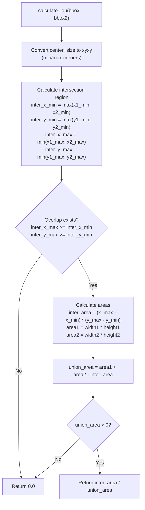
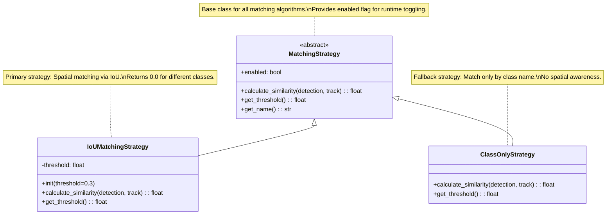
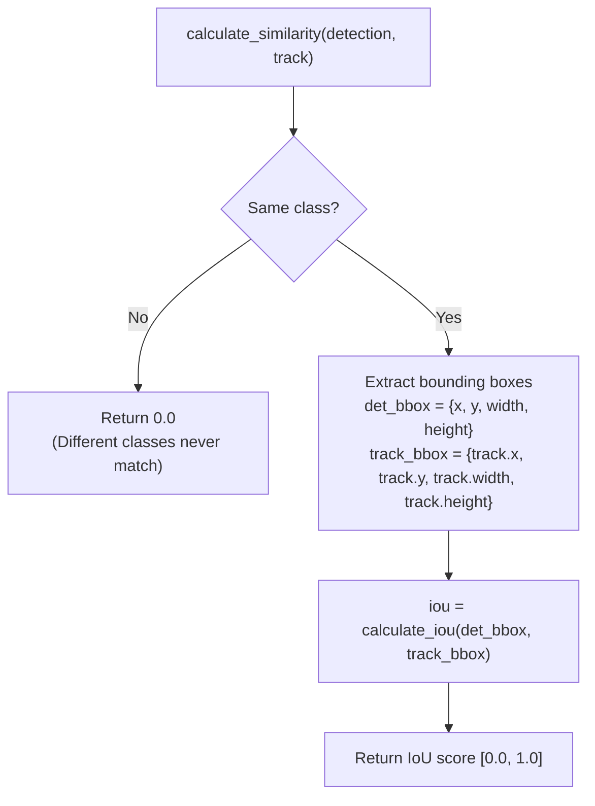
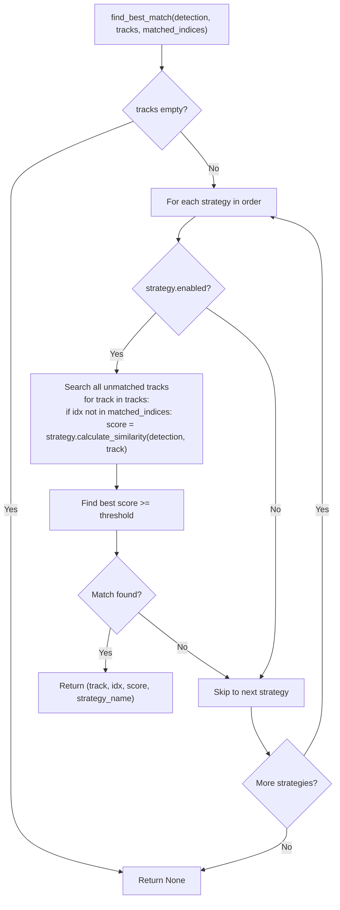
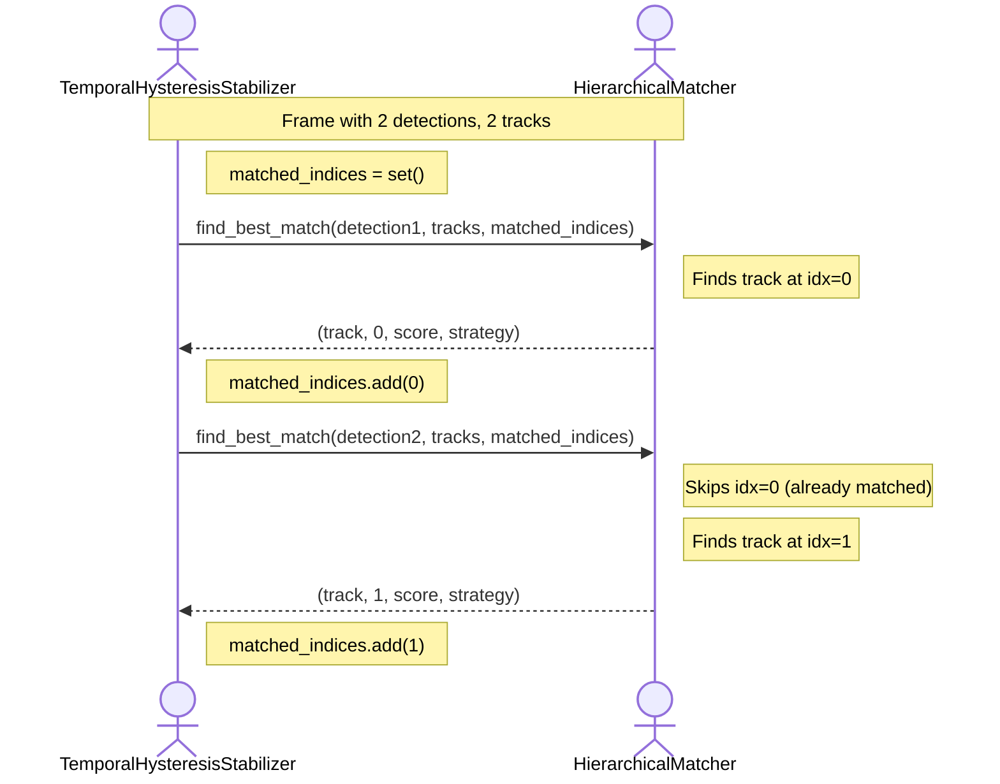
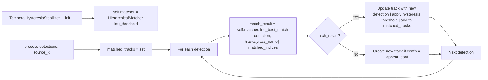
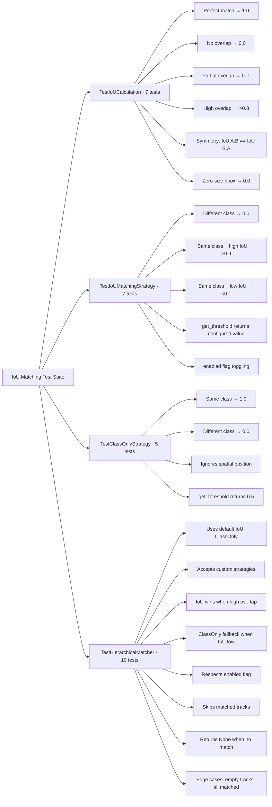
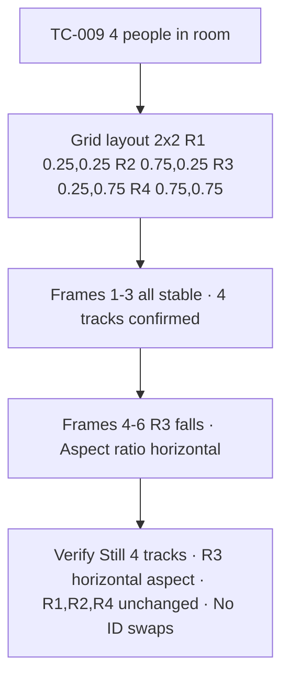

# IoU Matching System

Relevant source files

- [adeline/inference/stabilization/core.py](https://github.com/acare7/kata-inference-251021-clean4/blob/a0662727/adeline/inference/stabilization/core.py)
- [adeline/inference/stabilization/matching.py](https://github.com/acare7/kata-inference-251021-clean4/blob/a0662727/adeline/inference/stabilization/matching.py)
- [adeline/tests/test_multi_object_tracking.py](https://github.com/acare7/kata-inference-251021-clean4/blob/a0662727/adeline/tests/test_multi_object_tracking.py)
- [adeline/tests/test_pipeline_lifecycle.py](https://github.com/acare7/kata-inference-251021-clean4/blob/a0662727/adeline/tests/test_pipeline_lifecycle.py)
- [adeline/tests/test_stabilization.py](https://github.com/acare7/kata-inference-251021-clean4/blob/a0662727/adeline/tests/test_stabilization.py)

## Purpose and Scope

The IoU Matching System provides spatial matching capabilities for multi-object tracking within the detection stabilization pipeline. It implements a Strategy pattern with a Chain of Responsibility for matching detected objects across frames based on spatial overlap (Intersection over Union).

This page covers:

- IoU calculation algorithm and properties
- Strategy pattern architecture for matching algorithms
- Hierarchical matching with fallback strategies
- Integration with the temporal stabilization system

For information about the overall stabilization system and temporal filtering, see [TemporalHysteresisStabilizer](https://deepwiki.com/acare7/kata-inference-251021-clean4/5.2.1-temporalhysteresisstabilizer). For higher-level multi-object tracking behavior and test scenarios, see [Multi-Object Tracking](https://deepwiki.com/acare7/kata-inference-251021-clean4/5.3-multi-object-tracking).

**Sources:** [inference/stabilization/matching.py1-381](https://github.com/acare7/kata-inference-251021-clean4/blob/a0662727/inference/stabilization/matching.py#L1-L381) [tests/test_stabilization.py1-925](https://github.com/acare7/kata-inference-251021-clean4/blob/a0662727/tests/test_stabilization.py#L1-L925)

---

## System Overview

The IoU Matching System solves a critical problem in multi-object tracking: distinguishing between multiple objects of the same class in a single frame. Without spatial matching, a system that tracks two people would not know which detection in frame N corresponds to which detection in frame N+1.

### Problem Statement

When the YOLO model detects multiple people in a frame, the stabilization system must:

1. Match each new detection to an existing track
2. Prevent ID swaps (person A becoming person B)
3. Handle edge cases (occlusions, people entering/exiting)
4. Provide graceful fallback when spatial matching fails

### Solution Architecture

The system uses:

- **IoU (Intersection over Union)** as the primary spatial similarity metric
- **Strategy pattern** to encapsulate different matching algorithms
- **Chain of Responsibility** to provide fallback behavior
- **Hierarchical matching** to try strategies in priority order

**Sources:** [inference/stabilization/matching.py1-28](https://github.com/acare7/kata-inference-251021-clean4/blob/a0662727/inference/stabilization/matching.py#L1-L28) [tests/test_multi_object_tracking.py1-62](https://github.com/acare7/kata-inference-251021-clean4/blob/a0662727/tests/test_multi_object_tracking.py#L1-L62)

---

## IoU Calculation

### Mathematical Definition

Intersection over Union (IoU) measures spatial overlap between two bounding boxes:

```
IoU = Area of Intersection / Area of Union
```

The `calculate_iou()` function computes this for center+size format bounding boxes used by YOLO models.

### Algorithm Implementation





**Sources:** [inference/stabilization/matching.py39-117](https://github.com/acare7/kata-inference-251021-clean4/blob/a0662727/inference/stabilization/matching.py#L39-L117)

### Properties and Characteristics

The `calculate_iou()` function guarantees mathematical properties tested in the test suite:

|Property|Description|Test Coverage|
|---|---|---|
|**Symmetry**|`IoU(A, B) == IoU(B, A)`|[test_stabilization.py121-131](https://github.com/acare7/kata-inference-251021-clean4/blob/a0662727/test_stabilization.py#L121-L131)|
|**Bounded**|`0.0 <= IoU <= 1.0`|All tests|
|**Identity**|`IoU(A, A) == 1.0`|[test_stabilization.py77-86](https://github.com/acare7/kata-inference-251021-clean4/blob/a0662727/test_stabilization.py#L77-L86)|
|**Disjoint**|`IoU(A, B) == 0.0` if no overlap|[test_stabilization.py88-97](https://github.com/acare7/kata-inference-251021-clean4/blob/a0662727/test_stabilization.py#L88-L97)|

### Threshold Interpretation

|IoU Score|Interpretation|Use Case|
|---|---|---|
|0.0|No overlap|Different objects|
|0.1-0.2|Minimal overlap|Likely different objects|
|**0.3**|**Threshold**|**Typical match threshold**|
|0.5|Medium overlap|Same object, moderate movement|
|0.7+|High overlap|Same object, stable position|
|1.0|Perfect match|Identical bboxes|

The default threshold of 0.3 is configured in `StabilizationConfig.iou_threshold` and used throughout the system.

**Sources:** [inference/stabilization/matching.py39-117](https://github.com/acare7/kata-inference-251021-clean4/blob/a0662727/inference/stabilization/matching.py#L39-L117) [tests/test_stabilization.py74-143](https://github.com/acare7/kata-inference-251021-clean4/blob/a0662727/tests/test_stabilization.py#L74-L143)

---

## Strategy Pattern Architecture

### Class Hierarchy





**Sources:** [inference/stabilization/matching.py123-274](https://github.com/acare7/kata-inference-251021-clean4/blob/a0662727/inference/stabilization/matching.py#L123-L274)

### MatchingStrategy Base Class

The abstract base class defines the contract for all matching strategies:

```
# Abstract interface defined at inference/stabilization/matching.py:123-175
class MatchingStrategy(ABC):
    def __init__(self):
        self.enabled = True  # Runtime toggle
    
    @abstractmethod
    def calculate_similarity(detection, track) -> float:
        """Returns similarity score [0.0, 1.0]"""
        pass
    
    @abstractmethod
    def get_threshold(self) -> float:
        """Returns minimum threshold for valid match"""
        pass
    
    def get_name(self) -> str:
        """Returns strategy name for logging"""
        return self.__class__.__name__
```

The `enabled` flag allows runtime toggling of strategies for A/B testing or adaptive behavior.

**Sources:** [inference/stabilization/matching.py123-175](https://github.com/acare7/kata-inference-251021-clean4/blob/a0662727/inference/stabilization/matching.py#L123-L175)

### IoUMatchingStrategy

The primary matching strategy uses spatial overlap via IoU calculation:





**Key characteristics:**

- **Class-aware**: Returns 0.0 for different classes, preventing person-to-car matches
- **Spatial-aware**: Uses geometric overlap to distinguish multiple objects of same class
- **Configurable threshold**: Default 0.3 balances precision and recall

**Sources:** [inference/stabilization/matching.py177-239](https://github.com/acare7/kata-inference-251021-clean4/blob/a0662727/inference/stabilization/matching.py#L177-L239) [tests/test_stabilization.py496-605](https://github.com/acare7/kata-inference-251021-clean4/blob/a0662727/tests/test_stabilization.py#L496-L605)

### ClassOnlyStrategy

The fallback strategy matches purely by class name, ignoring spatial position:

|Aspect|Behavior|
|---|---|
|Same class|Returns `1.0`|
|Different class|Returns `0.0`|
|Spatial position|**Ignored**|
|Threshold|`0.5` (binary)|
|Use case|Fallback when IoU fails or single object of class|

**Limitations:** Cannot distinguish between multiple objects of the same class. Used only when IoU matching fails and there's no spatial ambiguity.

**Sources:** [inference/stabilization/matching.py241-274](https://github.com/acare7/kata-inference-251021-clean4/blob/a0662727/inference/stabilization/matching.py#L241-L274) [tests/test_stabilization.py609-705](https://github.com/acare7/kata-inference-251021-clean4/blob/a0662727/tests/test_stabilization.py#L609-L705)

---

## HierarchicalMatcher

### Chain of Responsibility Pattern

The `HierarchicalMatcher` implements Chain of Responsibility to try strategies in priority order:





**Sources:** [inference/stabilization/matching.py280-381](https://github.com/acare7/kata-inference-251021-clean4/blob/a0662727/inference/stabilization/matching.py#L280-L381)

### Default Hierarchy

The default configuration creates a two-tier hierarchy:

```
# Default hierarchy at inference/stabilization/matching.py:314-318
self.strategies = [
    IoUMatchingStrategy(threshold=iou_threshold),  # Priority 1: Spatial matching
    ClassOnlyStrategy(),                            # Priority 2: Fallback
]
```

### Matching Behavior

1. **First attempt**: `IoUMatchingStrategy` tries to find spatial match with IoU >= 0.3
    
    - Success: Returns match immediately
    - Failure: Falls through to next strategy
2. **Second attempt**: `ClassOnlyStrategy` matches by class name only
    
    - Success: Returns match (guaranteed for same class)
    - Failure: Only if different class
3. **No match**: Returns `None` if all strategies fail
    

### Preventing Re-matches

The `matched_indices` set prevents the same track from being matched multiple times in a single frame:





**Sources:** [inference/stabilization/matching.py327-381](https://github.com/acare7/kata-inference-251021-clean4/blob/a0662727/inference/stabilization/matching.py#L327-L381) [tests/test_stabilization.py816-855](https://github.com/acare7/kata-inference-251021-clean4/blob/a0662727/tests/test_stabilization.py#L816-L855)

---

## Integration with Stabilization

### Usage in TemporalHysteresisStabilizer

The `HierarchicalMatcher` is instantiated by `TemporalHysteresisStabilizer` and used in the matching phase:



**Sources:** [inference/stabilization/core.py200-249](https://github.com/acare7/kata-inference-251021-clean4/blob/a0662727/inference/stabilization/core.py#L200-L249) [inference/stabilization/core.py274-348](https://github.com/acare7/kata-inference-251021-clean4/blob/a0662727/inference/stabilization/core.py#L274-L348)

### Match Result Format

When a match is found, the matcher returns a 4-tuple:

```
# Return type from inference/stabilization/matching.py:332
(track, index, score, strategy_name)
```

|Field|Type|Description|
|---|---|---|
|`track`|`DetectionTrack`|The matched track object|
|`index`|`int`|Index in the tracks list|
|`score`|`float`|Similarity score [0.0, 1.0]|
|`strategy_name`|`str`|Name of strategy that found match (for logging)|

This information is logged for debugging and can be used for monitoring matching performance:

```
# Logging from inference/stabilization/core.py:319-323
logger.debug(
    f"✅ Track confirmed: {class_name} after {track.consecutive_frames} frames "
    f"(avg_conf={track.avg_confidence:.2f}, match_score={match_score:.2f}, "
    f"strategy={strategy_name})"
)
```

**Sources:** [inference/stabilization/core.py274-348](https://github.com/acare7/kata-inference-251021-clean4/blob/a0662727/inference/stabilization/core.py#L274-L348) [inference/stabilization/matching.py332-377](https://github.com/acare7/kata-inference-251021-clean4/blob/a0662727/inference/stabilization/matching.py#L332-L377)

### Multi-Source Support

The matching system is source-aware, allowing independent tracking for multiple video streams:

```
# State structure from inference/stabilization/core.py:226-229
self._tracks: Dict[int, Dict[str, List[DetectionTrack]]] = defaultdict(
    lambda: defaultdict(list)
)
# Structure: source_id -> class_name -> list of DetectionTrack
```

Each source maintains separate track lists, preventing cross-contamination between streams.

**Sources:** [inference/stabilization/core.py226-229](https://github.com/acare7/kata-inference-251021-clean4/blob/a0662727/inference/stabilization/core.py#L226-L229)

---

## Testing and Validation

### Test Coverage Overview

The IoU matching system has comprehensive test coverage across three test classes:




**Sources:** [tests/test_stabilization.py72-925](https://github.com/acare7/kata-inference-251021-clean4/blob/a0662727/tests/test_stabilization.py#L72-L925)

### Multi-Object Tracking Tests

The integration tests validate IoU matching in realistic multi-object scenarios:

| Test Scenario         | Description         | Validates                              |
| --------------------- | ------------------- | -------------------------------------- |
| **TC-006 Simulation** | 2 people, 1 falls   | Track separation, aspect ratio changes |
| **TC-009 Simulation** | 4 people, 1 falls   | No track fusion, correct ID assignment |
| **Track Stability**   | Movement simulation | IoU matching handles natural variation |
| **Person Exits**      | 1 person leaves     | Remaining tracks unaffected            |
|                       |                     |                                        |





**Test validates:** IoU matching correctly distinguishes which of 4 people changed posture, preventing track confusion.

**Sources:** [tests/test_multi_object_tracking.py1-524](https://github.com/acare7/kata-inference-251021-clean4/blob/a0662727/tests/test_multi_object_tracking.py#L1-L524)

### Property-Based Testing

The tests validate invariant properties that must always hold:

|Property|Test|File|
|---|---|---|
|IoU Symmetry|`test_iou_symmetry`|[test_stabilization.py121-131](https://github.com/acare7/kata-inference-251021-clean4/blob/a0662727/test_stabilization.py#L121-L131)|
|IoU Bounded|All IoU tests|[test_stabilization.py74-143](https://github.com/acare7/kata-inference-251021-clean4/blob/a0662727/test_stabilization.py#L74-L143)|
|Strategy Threshold|`test_get_threshold_returns_configured_threshold`|[test_stabilization.py572-580](https://github.com/acare7/kata-inference-251021-clean4/blob/a0662727/test_stabilization.py#L572-L580)|
|Match Exclusivity|`test_skips_already_matched_tracks`|[test_stabilization.py816-855](https://github.com/acare7/kata-inference-251021-clean4/blob/a0662727/test_stabilization.py#L816-L855)|
|Fallback Guarantee|`test_classonly_fallback_when_iou_low`|[test_stabilization.py759-785](https://github.com/acare7/kata-inference-251021-clean4/blob/a0662727/test_stabilization.py#L759-L785)|

**Sources:** [tests/test_stabilization.py1-925](https://github.com/acare7/kata-inference-251021-clean4/blob/a0662727/tests/test_stabilization.py#L1-L925)

---

## Design Rationale

### Why Strategy Pattern?

The Strategy pattern encapsulates matching algorithms for several benefits:

1. **Testability**: Each strategy can be tested independently without full stabilizer
2. **Composability**: New strategies can be added without modifying existing code
3. **Runtime Control**: `enabled` flag allows A/B testing and adaptive behavior
4. **Clear Responsibilities**: Each strategy has single, well-defined matching algorithm

### Why Hierarchical Fallback?

The hierarchical approach provides graceful degradation:

1. **Primary (IoU)**: Handles normal case with spatial awareness (prevents ID swaps)
2. **Fallback (ClassOnly)**: Handles edge cases (large movements, temporary occlusions)
3. **Guaranteed Match**: Ensures progress even in ambiguous situations
4. **Logging**: Strategy name in return value enables monitoring of which path was taken

### Performance Considerations

|Aspect|Complexity|Optimization|
|---|---|---|
|IoU Calculation|O(1)|Pure Python, no NumPy dependency|
|Single Match|O(T) where T = tracks|Typically T < 50|
|Frame Processing|O(D × T) where D = detections|Early exit on match, skip matched tracks|
|Memory|O(T)|Bounded by max_gap cleanup|

For typical scenarios (2-10 people, 5-20 active tracks), performance is negligible compared to inference time.

**Sources:** [inference/stabilization/matching.py1-381](https://github.com/acare7/kata-inference-251021-clean4/blob/a0662727/inference/stabilization/matching.py#L1-L381) [inference/stabilization/core.py195-405](https://github.com/acare7/kata-inference-251021-clean4/blob/a0662727/inference/stabilization/core.py#L195-L405)

---

## Future Extensions

The Strategy pattern is designed for extensibility. Potential future strategies:

### Centroid Distance Strategy

```
class CentroidDistanceStrategy(MatchingStrategy):
    """Match by center-point distance (alternative to IoU)"""
    def calculate_similarity(self, detection, track):
        dist = sqrt((detection['x'] - track.x)**2 + (detection['y'] - track.y)**2)
        return max(0.0, 1.0 - dist)  # Inverse distance
```

### Consensus Strategy

```
class ConsensusStrategy(MatchingStrategy):
    """Weighted consensus of multiple strategies"""
    def __init__(self, strategies, weights):
        self.strategies = strategies
        self.weights = weights
    
    def calculate_similarity(self, detection, track):
        scores = [s.calculate_similarity(detection, track) for s in self.strategies]
        return sum(s * w for s, w in zip(scores, self.weights))
```

### Feature Vector Strategy

```
class FeatureVectorStrategy(MatchingStrategy):
    """Match by appearance features (requires feature extractor)"""
    # Would use embeddings from a re-identification model
```

The current architecture supports these additions without modifying existing code.

**Sources:** [inference/stabilization/matching.py119-175](https://github.com/acare7/kata-inference-251021-clean4/blob/a0662727/inference/stabilization/matching.py#L119-L175)