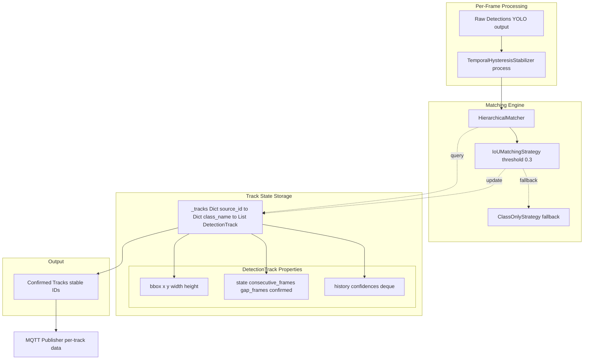
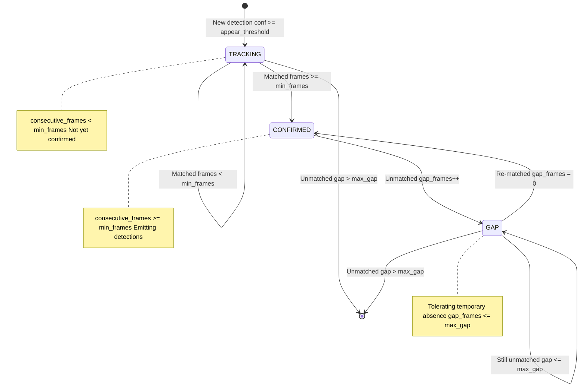
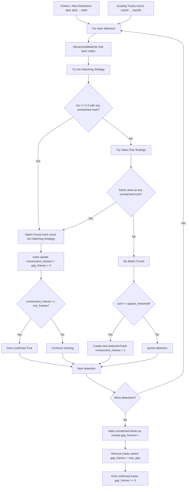

# Multi-Object Tracking

Relevant source files

- [adeline/.gitignore](https://github.com/acare7/kata-inference-251021-clean4/blob/a0662727/adeline/.gitignore)
- [adeline/TEST_CASES_FUNCIONALES.md](https://github.com/acare7/kata-inference-251021-clean4/blob/a0662727/adeline/TEST_CASES_FUNCIONALES.md)
- [adeline/config/__init__.py](https://github.com/acare7/kata-inference-251021-clean4/blob/a0662727/adeline/config/__init__.py)
- [adeline/config/schemas.py](https://github.com/acare7/kata-inference-251021-clean4/blob/a0662727/adeline/config/schemas.py)
- [adeline/inference/stabilization/core.py](https://github.com/acare7/kata-inference-251021-clean4/blob/a0662727/adeline/inference/stabilization/core.py)
- [adeline/inference/stabilization/matching.py](https://github.com/acare7/kata-inference-251021-clean4/blob/a0662727/adeline/inference/stabilization/matching.py)
- [adeline/tests/test_multi_object_tracking.py](https://github.com/acare7/kata-inference-251021-clean4/blob/a0662727/adeline/tests/test_multi_object_tracking.py)
- [adeline/tests/test_pipeline_lifecycle.py](https://github.com/acare7/kata-inference-251021-clean4/blob/a0662727/adeline/tests/test_pipeline_lifecycle.py)

## Purpose and Scope

This document describes the multi-object tracking capabilities in the Adeline inference pipeline. Multi-object tracking enables the system to simultaneously track multiple individuals in a scene while maintaining stable, unique identities for each person across frames. This is critical for geriatric monitoring scenarios where rooms may contain 2-4 residents, staff members, and visitors.

**Scope:** This page covers the track management system that maintains multiple `DetectionTrack` objects simultaneously and associates detections across frames using spatial matching. For details on the temporal filtering and stabilization wrapper, see [Detection Stabilization](https://deepwiki.com/acare7/kata-inference-251021-clean4/5.2-detection-stabilization). For in-depth coverage of the matching algorithms, see [IoU Matching System](https://deepwiki.com/acare7/kata-inference-251021-clean4/5.2.2-iou-matching-system).

**Key Use Case:** In a room with 4 residents where one person changes posture (falls), the system must be able to identify _which specific track_ changed, not just that "a person fell somewhere."

## Overview

Multi-object tracking in Adeline maintains a separate `DetectionTrack` for each detected individual, using Intersection over Union (IoU) matching to associate detections from the current frame with existing tracks from previous frames. This prevents track ID swaps, confusion between individuals, and enables per-person state tracking.

### The Problem: Identity Preservation

Without multi-object tracking, a simple detection system cannot answer:

- "Which of the 4 residents in the room moved?"
- "Did resident R1 or R2 change posture?"
- "When a nurse enters, which track is the nurse vs which are residents?"

The system must maintain stable track IDs even when:

- Multiple people are present (2-4 individuals)
- People move close to each other (temporarily high IoU)
- People are temporarily occluded
- People have similar appearances
- A new person enters or someone exits

**Sources:** [adeline/tests/test_multi_object_tracking.py1-62](https://github.com/acare7/kata-inference-251021-clean4/blob/a0662727/adeline/tests/test_multi_object_tracking.py#L1-L62) [adeline/TEST_CASES_FUNCIONALES.md210-228](https://github.com/acare7/kata-inference-251021-clean4/blob/a0662727/adeline/TEST_CASES_FUNCIONALES.md#L210-L228)

## Architecture: Track Management System



**Diagram: Multi-Object Tracking Architecture**

The `TemporalHysteresisStabilizer` maintains a nested dictionary structure `_tracks` that organizes tracks by source ID and class name. For each incoming frame, the `HierarchicalMatcher` attempts to associate new detections with existing tracks using IoU spatial matching. Successfully matched detections update their corresponding `DetectionTrack` objects, while unmatched detections create new tracks.

**Sources:** [adeline/inference/stabilization/core.py176-249](https://github.com/acare7/kata-inference-251021-clean4/blob/a0662727/adeline/inference/stabilization/core.py#L176-L249) [adeline/inference/stabilization/matching.py280-326](https://github.com/acare7/kata-inference-251021-clean4/blob/a0662727/adeline/inference/stabilization/matching.py#L280-L326)

## DetectionTrack Lifecycle

Each tracked individual is represented by a `DetectionTrack` object that progresses through states based on consecutive detection and absence.

### Track States


**Diagram: DetectionTrack State Machine**

**State Transitions:**

1. **TRACKING** (Initial): A new detection above `appear_conf` threshold creates a track. The track accumulates consecutive frames but does not emit detections yet.
    
2. **CONFIRMED**: After `min_frames` consecutive detections, the track is confirmed and begins emitting stabilized detections. The track persists as long as it continues to be matched (even at lower `persist_conf` threshold via hysteresis).
    
3. **GAP**: When a confirmed track is not matched in a frame, it enters a gap state and increments `gap_frames`. The system tolerates up to `max_gap` frames of absence before removing the track.
    
4. **REMOVED**: When `gap_frames > max_gap`, the track is removed from `_tracks`.
    

**Sources:** [adeline/inference/stabilization/core.py68-117](https://github.com/acare7/kata-inference-251021-clean4/blob/a0662727/adeline/inference/stabilization/core.py#L68-L117) [adeline/inference/stabilization/core.py355-396](https://github.com/acare7/kata-inference-251021-clean4/blob/a0662727/adeline/inference/stabilization/core.py#L355-L396)

### DetectionTrack Data Structure

The `DetectionTrack` class stores the state and history for a single tracked individual:

```
@dataclass
class DetectionTrack:
    # Identity
    class_name: str
    
    # Current position (normalized coordinates)
    x: float
    y: float
    width: float
    height: float
    confidence: float
    
    # Tracking state
    consecutive_frames: int = 0  # Frames detected consecutively
    gap_frames: int = 0          # Frames since last detection
    confirmed: bool = False      # Whether track is confirmed
    
    # History
    confidences: deque           # Recent confidence values
    last_seen_time: float
```

**Key Methods:**

- `update(confidence, x, y, width, height)`: Updates track with new detection, increments `consecutive_frames`, resets `gap_frames`
- `mark_missed()`: Called when track is not matched, resets `consecutive_frames`, increments `gap_frames`
- `avg_confidence`: Property that computes average confidence from history

**Sources:** [adeline/inference/stabilization/core.py68-117](https://github.com/acare7/kata-inference-251021-clean4/blob/a0662727/adeline/inference/stabilization/core.py#L68-L117)

## Frame-to-Frame Association

The multi-object tracking system must solve the **data association problem**: given N detections in the current frame and M existing tracks, which detection corresponds to which track?

### Association Algorithm


**Diagram: Frame-to-Frame Association Flow**

The association process uses a greedy matching strategy:

1. **Best Match Selection**: For each detection, find the best matching track using the hierarchical matcher
2. **One-to-One Constraint**: Each detection matches at most one track; each track matches at most one detection
3. **Matched Indices Tracking**: The set `matched_indices` ensures no track is matched multiple times
4. **Unmatched Handling**: Detections without matches may create new tracks; tracks without matches increment their gap counter

**Sources:** [adeline/inference/stabilization/core.py250-405](https://github.com/acare7/kata-inference-251021-clean4/blob/a0662727/adeline/inference/stabilization/core.py#L250-L405)

### Hierarchical Matching Strategy

The `HierarchicalMatcher` implements a Chain of Responsibility pattern, trying matching strategies in priority order:

**1. Primary: IoUMatchingStrategy**

- Calculates spatial overlap (Intersection over Union)
- Threshold: 0.3 (configurable)
- Returns score [0.0, 1.0] where 1.0 = perfect overlap
- Only matches within same class (person-to-person)

**2. Fallback: ClassOnlyStrategy**

- Binary match by class name only
- Returns 1.0 if same class, 0.0 otherwise
- Used when IoU matching finds no candidates (e.g., person moved significantly)
- Can cause confusion in multi-person scenarios

**Key Code Entities:**

- `HierarchicalMatcher.find_best_match()` [adeline/inference/stabilization/matching.py327-380](https://github.com/acare7/kata-inference-251021-clean4/blob/a0662727/adeline/inference/stabilization/matching.py#L327-L380)
- `IoUMatchingStrategy.calculate_similarity()` [adeline/inference/stabilization/matching.py202-234](https://github.com/acare7/kata-inference-251021-clean4/blob/a0662727/adeline/inference/stabilization/matching.py#L202-L234)
- `calculate_iou()` [adeline/inference/stabilization/matching.py39-116](https://github.com/acare7/kata-inference-251021-clean4/blob/a0662727/adeline/inference/stabilization/matching.py#L39-L116)

**Sources:** [adeline/inference/stabilization/matching.py280-380](https://github.com/acare7/kata-inference-251021-clean4/blob/a0662727/adeline/inference/stabilization/matching.py#L280-L380)

## Multi-Person Test Scenarios

The system's multi-object tracking is validated through automated tests that simulate the critical test cases from field testing.

### TC-006: Two-Person Scenario

**Scenario:** Room with 2 residents, one changes posture (simulated fall)

```
# Test: test_two_people_one_falls_aspect_ratio_changes()
# Location: tests/test_multi_object_tracking.py:139-193

# Frame 1-3: Establish baseline
# R1 at x=0.25 (left), vertical bbox (height=0.20, width=0.15)
# R2 at x=0.75 (right), vertical bbox (height=0.20, width=0.15)
# Expected: 2 confirmed tracks

# Frame 4-5: R1 falls
# R1 changes to horizontal bbox (height=0.15, width=0.25, y=0.6)
# R2 remains stable (height=0.20, width=0.15, y=0.5)
# Expected: 2 tracks persist, only R1 changes aspect ratio
```

**Validation:**

- ✅ System maintains 2 separate tracks
- ✅ Only the left track (R1) changes bbox dimensions
- ✅ Right track (R2) remains stable
- ✅ Track IDs do not swap or reset

**Sources:** [adeline/tests/test_multi_object_tracking.py139-193](https://github.com/acare7/kata-inference-251021-clean4/blob/a0662727/adeline/tests/test_multi_object_tracking.py#L139-L193)

### TC-009: Four-Person Scenario (Maximum Complexity)

**Scenario:** Room with 4 residents (2x2 grid layout), one changes posture

```
# Test: test_four_people_one_falls_only_that_track_changes()
# Location: tests/test_multi_object_tracking.py:304-361

# Grid Layout:
# R1 (top-left):     x=0.25, y=0.25
# R2 (top-right):    x=0.75, y=0.25
# R3 (bottom-left):  x=0.25, y=0.75
# R4 (bottom-right): x=0.75, y=0.75

# Frame 1-3: All acostados (baseline)
# Expected: 4 confirmed tracks, all with vertical aspect ratio

# Frame 4-6: R3 falls (bottom-left)
# R3 changes to horizontal bbox (width=0.20, height=0.10, y=0.80)
# R1, R2, R4 remain stable
# Expected: 4 tracks persist, only R3 changes aspect ratio
```

**Critical Validation (Most Important Test):**

```
Question: "With 4 active tracks, can the system identify which specific 
          track changed bbox dimensions?"

Expected Answer: YES
- Track IDs remain stable
- Only track in region (x < 0.5, y > 0.7) shows aspect ratio change
- Other 3 tracks maintain stable dimensions
```

**Why This Matters:** This test validates the core requirement for event detection in v3.0+. If the system can distinguish which of 4 tracks changed, it can later add logic like "IF track_3.aspect_ratio changed → Patient Fall event for resident_3."

**Sources:** [adeline/tests/test_multi_object_tracking.py304-361](https://github.com/acare7/kata-inference-251021-clean4/blob/a0662727/adeline/tests/test_multi_object_tracking.py#L304-L361) [adeline/TEST_CASES_FUNCIONALES.md597-653](https://github.com/acare7/kata-inference-251021-clean4/blob/a0662727/adeline/TEST_CASES_FUNCIONALES.md#L597-L653)

### Test Metrics

The multi-object tracking tests verify:

|Invariant|Description|Test Coverage|
|---|---|---|
|**Track Separation**|N people → N separate tracks (no fusion)|TC-006, TC-009|
|**ID Stability**|Track IDs persist across posture changes|TC-006, TC-009|
|**Spatial Isolation**|IoU threshold (0.3) prevents incorrect matches|TC-009 (stress test)|
|**Selective Change**|Only the changing track shows bbox change|TC-006, TC-009|
|**Re-entrance**|Track removed on exit, new track on re-entrance|TC-005 simulation|

**Sources:** [adeline/tests/test_multi_object_tracking.py1-62](https://github.com/acare7/kata-inference-251021-clean4/blob/a0662727/adeline/tests/test_multi_object_tracking.py#L1-L62)

## Configuration

Multi-object tracking is configured through the stabilization settings:

### Pydantic Schema

```
# config/adeline/config.yaml
detection_stabilization:
  mode: temporal  # Enables tracking
  
  iou:
    threshold: 0.3  # Minimum IoU for same-object match
  
  temporal:
    min_frames: 3   # Frames to confirm track
    max_gap: 2      # Tolerance for temporary absence
  
  hysteresis:
    appear_confidence: 0.5   # Threshold for new tracks
    persist_confidence: 0.3  # Threshold for confirmed tracks
```

**Key Parameters:**

- `iou.threshold` (default: 0.3): Minimum Intersection over Union to consider a detection as matching an existing track. Lower values are more permissive (may incorrectly match distant objects); higher values are more strict (may lose tracks with significant movement).
    
- `temporal.min_frames` (default: 3): Consecutive frames required to confirm a track. Prevents false positives from transient detections.
    
- `temporal.max_gap` (default: 2): Maximum frames a track can be unmatched before removal. Provides tolerance for temporary occlusions.
    

**Schema Validation:** [adeline/config/schemas.py201-225](https://github.com/acare7/kata-inference-251021-clean4/blob/a0662727/adeline/config/schemas.py#L201-L225)

### Runtime Access

```
# Access via TemporalHysteresisStabilizer
stabilizer = TemporalHysteresisStabilizer(
    min_frames=config.detection_stabilization.temporal.min_frames,
    max_gap=config.detection_stabilization.temporal.max_gap,
    appear_conf=config.detection_stabilization.hysteresis.appear_confidence,
    persist_conf=config.detection_stabilization.hysteresis.persist_confidence,
    iou_threshold=config.detection_stabilization.iou.threshold,
)

# Query active tracks per source
stats = stabilizer.get_stats(source_id=0)
# Returns: {'active_tracks': 4, 'confirmed_count': 4, ...}
```

**Sources:** [adeline/inference/stabilization/core.py200-249](https://github.com/acare7/kata-inference-251021-clean4/blob/a0662727/adeline/inference/stabilization/core.py#L200-L249) [adeline/config/schemas.py160-226](https://github.com/acare7/kata-inference-251021-clean4/blob/a0662727/adeline/config/schemas.py#L160-L226)

## Track Statistics and Observability

The `TemporalHysteresisStabilizer` exposes track statistics via the `get_stats()` method:

```
stats = stabilizer.get_stats(source_id=0)

# Returns:
{
    'total_detected': 150,      # Total detections processed
    'total_confirmed': 4,        # Tracks that reached confirmed state
    'total_ignored': 20,         # Detections below appear_threshold
    'total_removed': 1,          # Tracks removed (gap exceeded)
    'active_tracks': 3,          # Currently active tracks
    'confirmed_count': 3,        # Currently confirmed tracks
    'tracks_by_class': {
        'person': 3              # Breakdown by class
    },
    'confirm_ratio': 0.027       # Ratio of confirmed to total detected
}
```

**MQTT Publishing:** These statistics are included in the MQTT payload under the `_stabilization_stats` key, enabling external monitoring systems to observe tracking health.

**Sources:** [adeline/inference/stabilization/core.py422-439](https://github.com/acare7/kata-inference-251021-clean4/blob/a0662727/adeline/inference/stabilization/core.py#L422-L439) [adeline/inference/stabilization/core.py565-608](https://github.com/acare7/kata-inference-251021-clean4/blob/a0662727/adeline/inference/stabilization/core.py#L565-L608)

## Implementation Details: Code Walkthrough

### Track Storage Structure

```
# inference/stabilization/core.py:226-229
self._tracks: Dict[int, Dict[str, List[DetectionTrack]]] = defaultdict(
    lambda: defaultdict(list)
)

# Example state with 4 people:
# {
#   0: {  # source_id = 0
#     'person': [
#       DetectionTrack(x=0.25, y=0.25, confirmed=True),  # R1
#       DetectionTrack(x=0.75, y=0.25, confirmed=True),  # R2
#       DetectionTrack(x=0.25, y=0.75, confirmed=True),  # R3
#       DetectionTrack(x=0.75, y=0.75, confirmed=True),  # R4
#     ]
#   }
# }
```

The nested dictionary structure enables:

- Multi-source support (e.g., multiple cameras)
- Per-class separation (person vs car vs other classes)
- Efficient lookup by source and class

**Sources:** [adeline/inference/stabilization/core.py226-229](https://github.com/acare7/kata-inference-251021-clean4/blob/a0662727/adeline/inference/stabilization/core.py#L226-L229)

### Matching Loop

```
# inference/stabilization/core.py:280-308
matched_tracks: Set[Tuple[str, int]] = set()  # (class_name, track_idx)

for det in detections:
    class_name = det.get('class', 'unknown')
    
    if class_name in tracks:
        matched_indices = {idx for (cls, idx) in matched_tracks if cls == class_name}
        
        match_result = self.matcher.find_best_match(
            detection=det,
            tracks=tracks[class_name],
            matched_indices=matched_indices
        )
        
        if match_result is not None:
            track, track_idx, match_score, strategy_name = match_result
            matched_tracks.add((class_name, track_idx))
            matched = True
            
            # Apply hysteresis: persist_conf if confirmed, appear_conf if tracking
            threshold = self.persist_conf if track.confirmed else self.appear_conf
            
            if confidence >= threshold:
                track.update(confidence, x, y, width, height)
```

**Key Design Decisions:**

1. **Greedy Matching**: Each detection is matched independently in sequence (not optimal assignment, but simpler and sufficient for typical scenarios)
2. **Matched Indices Set**: Ensures one-to-one constraint (each track matched at most once)
3. **Strategy Result Tuple**: Returns `(track, index, score, strategy_name)` for observability

**Sources:** [adeline/inference/stabilization/core.py275-348](https://github.com/acare7/kata-inference-251021-clean4/blob/a0662727/adeline/inference/stabilization/core.py#L275-L348)

### Unmatched Track Handling

```
# inference/stabilization/core.py:349-396
for class_name, track_list in tracks.items():
    for idx, track in enumerate(track_list):
        if (class_name, idx) not in matched_tracks:
            track.mark_missed()  # Increment gap_frames

# Remove expired tracks
for class_name in list(tracks.keys()):
    track_list = tracks[class_name]
    
    tracks[class_name] = [
        t for t in track_list
        if t.gap_frames <= self.max_gap
    ]
    
    removed_count = len(track_list) - len(tracks[class_name])
    if removed_count > 0:
        stats['total_removed'] += removed_count
```

Tracks that were not matched in the current frame have their gap counter incremented. Once `gap_frames > max_gap`, the track is removed from the `_tracks` dictionary. This cleanup prevents unbounded memory growth and removes tracks for individuals who have left the scene.

**Sources:** [adeline/inference/stabilization/core.py349-396](https://github.com/acare7/kata-inference-251021-clean4/blob/a0662727/adeline/inference/stabilization/core.py#L349-L396)

## Limitations and Future Work

**Current Limitations:**

1. **Greedy Matching**: Uses first-fit matching rather than optimal assignment (Hungarian algorithm). This can cause suboptimal matches in crowded scenes.
    
2. **No Predictive Tracking**: Does not use Kalman filtering or motion prediction. Tracks rely solely on spatial overlap between frames.
    
3. **Class-Only Fallback Issues**: When IoU matching fails, the `ClassOnlyStrategy` fallback can cause incorrect matches in multi-person scenarios (e.g., matching to wrong person of same class).
    
4. **No Re-identification**: Once a track is removed (after `max_gap` is exceeded), a returning individual is assigned a new track ID. The system does not support re-identification.
    

**Planned Improvements (v3.0+):**

- **Event Detection Layer**: Add handlers that consume track changes (e.g., `PatientFallHandler` detects when a track's aspect ratio changes from vertical to horizontal)
- **Zone Tracking**: Associate tracks with spatial zones (bed, bathroom, door) to enable location-based events
- **Motion Prediction**: Add Kalman filtering for smoother tracking and better occlusion handling
- **Optimal Assignment**: Implement Hungarian algorithm for globally optimal track-detection matching

**Sources:** [adeline/TEST_CASES_FUNCIONALES.md901-968](https://github.com/acare7/kata-inference-251021-clean4/blob/a0662727/adeline/TEST_CASES_FUNCIONALES.md#L901-L968)