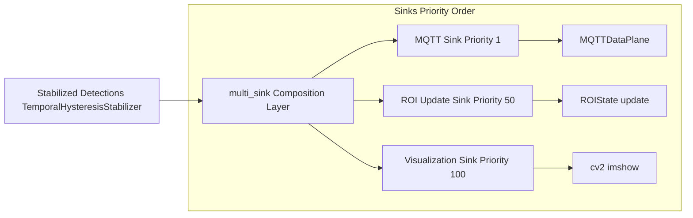
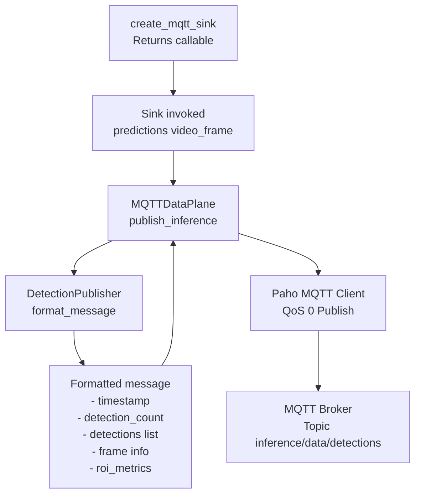
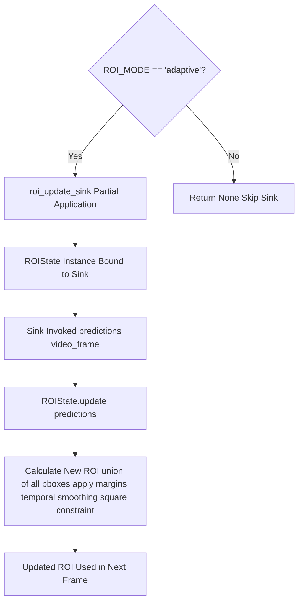
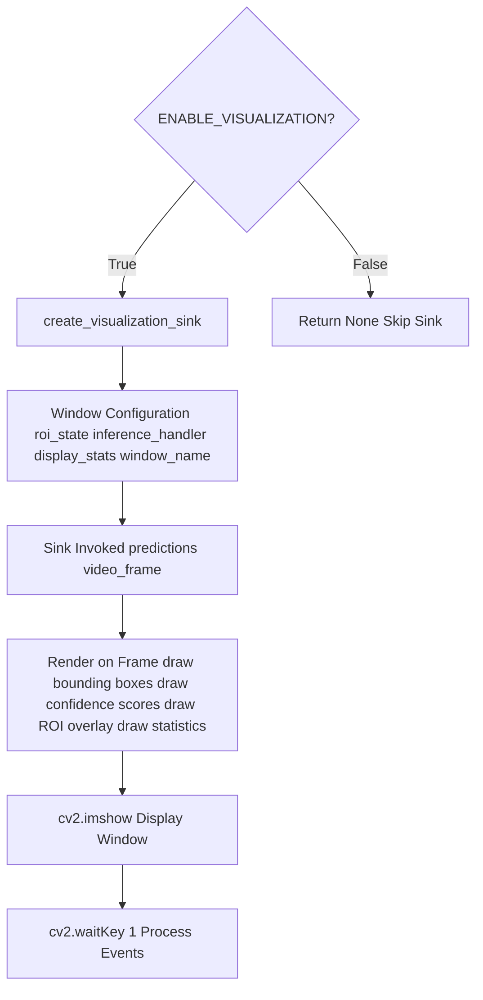
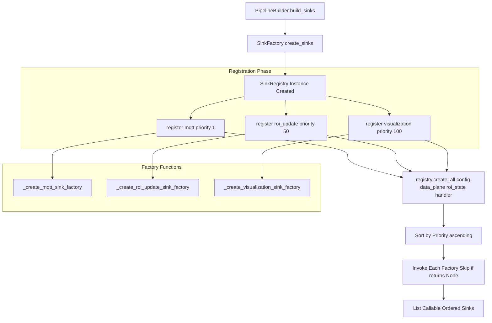
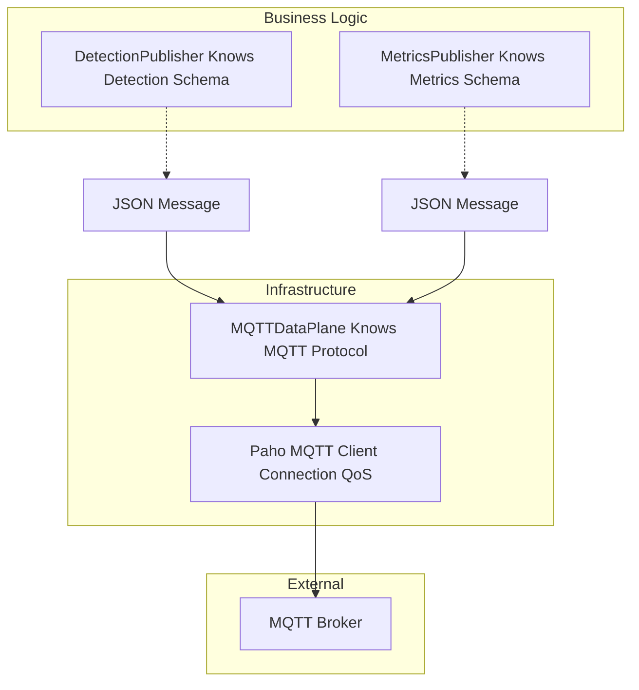
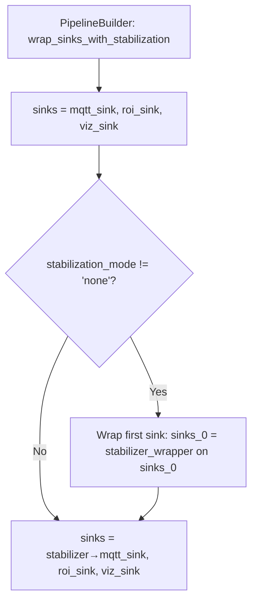

# Output Sinks

Relevant source files

- [adeline/app/factories/sink_factory.py](https://github.com/acare7/kata-inference-251021-clean4/blob/a0662727/adeline/app/factories/sink_factory.py)
- [adeline/app/sinks/registry.py](https://github.com/acare7/kata-inference-251021-clean4/blob/a0662727/adeline/app/sinks/registry.py)
- [adeline/data/plane.py](https://github.com/acare7/kata-inference-251021-clean4/blob/a0662727/adeline/data/plane.py)
- [adeline/data/publishers/__init__.py](https://github.com/acare7/kata-inference-251021-clean4/blob/a0662727/adeline/data/publishers/__init__.py)
- [adeline/data/publishers/detection.py](https://github.com/acare7/kata-inference-251021-clean4/blob/a0662727/adeline/data/publishers/detection.py)
- [adeline/data/publishers/metrics.py](https://github.com/acare7/kata-inference-251021-clean4/blob/a0662727/adeline/data/publishers/metrics.py)

## Purpose and Scope

Output sinks are the final stage of the detection processing pipeline. They consume stabilized detection results and dispatch them to various destinations: MQTT brokers, ROI state updates, and visualization displays. This page covers the multi-sink architecture, sink types, factory/registry patterns, and integration with the data plane.

For information about how detections reach sinks (after stabilization), see [Detection Stabilization](https://deepwiki.com/acare7/kata-inference-251021-clean4/5.2-detection-stabilization). For ROI state management, see [ROI Strategies](https://deepwiki.com/acare7/kata-inference-251021-clean4/5.1-roi-strategies). For MQTT infrastructure, see [Data Plane](https://deepwiki.com/acare7/kata-inference-251021-clean4/4.2-data-plane).

---

## Multi-Sink Architecture

The system implements a **multi-sink composition pattern** where detection results flow through multiple independent sinks simultaneously. Each sink operates independently and handles a specific responsibility.

### Sink Execution Flow



**Sources:** [adeline/app/factories/sink_factory.py71-136](https://github.com/acare7/kata-inference-251021-clean4/blob/a0662727/adeline/app/factories/sink_factory.py#L71-L136)

The `multi_sink()` function executes sinks sequentially based on priority:

- **Priority 1** (MQTT): Published first for minimal latency
- **Priority 50** (ROI Update): Updates state for next frame
- **Priority 100** (Visualization): Rendered last (most expensive operation)

### Conditional Sink Creation

Sinks are created conditionally based on configuration and system state:

|Sink Type|Creation Condition|Factory Function|
|---|---|---|
|MQTT|Always|`_create_mqtt_sink_factory`|
|ROI Update|`ROI_MODE == 'adaptive'`|`_create_roi_update_sink_factory`|
|Visualization|`ENABLE_VISUALIZATION == True`|`_create_visualization_sink_factory`|

**Sources:** [adeline/app/factories/sink_factory.py29-68](https://github.com/acare7/kata-inference-251021-clean4/blob/a0662727/adeline/app/factories/sink_factory.py#L29-L68)


### Sink Priority System

Sinks are registered with explicit priority values to control execution order:

| Priority | Sink Type | Purpose | Critical for Stabilization? |
|----------|-----------|---------|----------------------------|
| **1** | MQTT Sink | Publish detections to MQTT broker | ✅ Yes - wrapped by stabilizer |
| **50** | ROI Update Sink | Update adaptive ROI state | ❌ No |
| **100** | Visualization Sink | OpenCV display window | ❌ No |

**Important**: The stabilization wrapper assumes the MQTT sink is first (priority 1). Changing sink priorities requires updating `PipelineBuilder.wrap_sinks_with_stabilization()`.

See: [adeline/app/factories/sink_factory.py131-148](https://github.com/acare7/kata-inference-251021-clean4/blob/a0662727/adeline/app/factories/sink_factory.py#L131-L148)

---

## Sink Types

### MQTT Sink

The MQTT sink publishes detection results to the data plane for external consumption.



**Implementation:**

- **Factory:** [adeline/app/factories/sink_factory.py29-34](https://github.com/acare7/kata-inference-251021-clean4/blob/a0662727/adeline/app/factories/sink_factory.py#L29-L34)
- **Data Plane:** [adeline/data/plane.py106-141](https://github.com/acare7/kata-inference-251021-clean4/blob/a0662727/adeline/data/plane.py#L106-L141)
- **Publisher:** [adeline/data/publishers/detection.py33-59](https://github.com/acare7/kata-inference-251021-clean4/blob/a0662727/adeline/data/publishers/detection.py#L33-L59)

The MQTT sink is always created (priority 1) and delegates to `MQTTDataPlane.publish_inference()`, which formats messages via `DetectionPublisher` before publishing with QoS 0 (fire-and-forget).

**Sources:** [adeline/app/factories/sink_factory.py29-34](https://github.com/acare7/kata-inference-251021-clean4/blob/a0662727/adeline/app/factories/sink_factory.py#L29-L34) [adeline/data/plane.py27-141](https://github.com/acare7/kata-inference-251021-clean4/blob/a0662727/adeline/data/plane.py#L27-L141)

---

### ROI Update Sink

The ROI update sink provides feedback to the adaptive ROI system, updating region boundaries based on current detections.




**Implementation:**

- **Factory:** [adeline/app/factories/sink_factory.py37-45](https://github.com/acare7/kata-inference-251021-clean4/blob/a0662727/adeline/app/factories/sink_factory.py#L37-L45)
- **Sink Function:** Referenced as `roi_update_sink` from `adeline/inference/roi`

The factory uses `functools.partial` to bind the `roi_state` instance to the sink function, creating a closure that updates state on each invocation.

**Key Characteristics:**

- Only created when `ROI_MODE == 'adaptive'`
- Priority 50 (executes after MQTT, before visualization)
- Creates feedback loop: detections → ROI update → next frame uses updated ROI
- Factory returns `None` if conditions not met (sink skipped)

**Sources:** [adeline/app/factories/sink_factory.py37-45](https://github.com/acare7/kata-inference-251021-clean4/blob/a0662727/adeline/app/factories/sink_factory.py#L37-L45)

---

### Visualization Sink

The visualization sink renders detection bounding boxes and statistics on video frames using OpenCV.





**Implementation:**

- **Factory:** [adeline/app/factories/sink_factory.py48-68](https://github.com/acare7/kata-inference-251021-clean4/blob/a0662727/adeline/app/factories/sink_factory.py#L48-L68)
- **Sink Creator:** Referenced as `create_visualization_sink` from `adeline/visualization`

**Window Naming:**

- Standard mode: "Inference Pipeline (Standard)"
- Adaptive mode: "Inference Pipeline (Adaptive ROI)"
- Fixed mode: "Inference Pipeline (Fixed ROI)"

**Key Characteristics:**

- Only created when `ENABLE_VISUALIZATION == True`
- Priority 100 (executed last, most expensive operation)
- Requires ROI state and inference handler for overlay rendering
- Optional statistics display via `DISPLAY_STATISTICS` config

**Sources:** [adeline/app/factories/sink_factory.py48-68](https://github.com/acare7/kata-inference-251021-clean4/blob/a0662727/adeline/app/factories/sink_factory.py#L48-L68)

---

## Sink Factory and Registry Pattern

The system uses a **registry-based factory pattern** to decouple sink creation from pipeline construction.

### Architecture Overview



**Sources:** [adeline/app/factories/sink_factory.py71-136](https://github.com/acare7/kata-inference-251021-clean4/blob/a0662727/adeline/app/factories/sink_factory.py#L71-L136) [adeline/app/sinks/registry.py22-109](https://github.com/acare7/kata-inference-251021-clean4/blob/a0662727/adeline/app/sinks/registry.py#L22-L109)

### SinkFactory Implementation

The `SinkFactory` class provides a static method `create_sinks()` that orchestrates sink creation:

**Process:**

1. Creates a `SinkRegistry` instance
2. Registers all sink factories with explicit priorities
3. Calls `registry.create_all()` to build sinks
4. Returns ordered list of sink callables

**Sources:** [adeline/app/factories/sink_factory.py84-136](https://github.com/acare7/kata-inference-251021-clean4/blob/a0662727/adeline/app/factories/sink_factory.py#L84-L136)

### SinkRegistry Implementation

The `SinkRegistry` manages sink registration and creation:

```
class SinkRegistry:
    def __init__(self):
        self._factories: List[tuple[str, Callable, int]] = []
    
    def register(self, name: str, factory: Callable, priority: int = 100):
        # Registers (name, factory, priority) tuple
    
    def create_all(self, config, **kwargs) -> List[Callable]:
        # Sorts by priority, invokes factories, returns sinks
```

**Key Methods:**

|Method|Responsibility|Line Reference|
|---|---|---|
|`register()`|Store factory function with priority|[44-66](https://github.com/acare7/kata-inference-251021-clean4/blob/a0662727/44-66)|
|`create_all()`|Sort by priority, invoke factories, return sinks|[68-109](https://github.com/acare7/kata-inference-251021-clean4/blob/a0662727/68-109)|

**Factory Function Signature:**

```
def factory(config, **kwargs) -> Callable | None:
    # Returns sink callable or None to skip
```

Returning `None` from a factory allows conditional sink creation without exceptions.

**Sources:** [adeline/app/sinks/registry.py22-109](https://github.com/acare7/kata-inference-251021-clean4/blob/a0662727/adeline/app/sinks/registry.py#L22-L109)

---

## Detection and Metrics Publishing

The data plane uses specialized **publisher classes** to format messages before MQTT publication.

### Publisher Architecture

```mermaid
flowchart TD
  subgraph Metrics Flow
    MET_IN[publish_metrics]
    MET_WD[MetricsPublisher format_message]
    MET_RPT[Watchdog get_report]
    MET_MSG[Formatted Message timestamp throughput_fps latency_reports list sources_count]
    MET_PUB[MQTT Publish Topic inference data metrics QoS 0]
    MET_IN --> MET_WD --> MET_RPT --> MET_MSG --> MET_PUB
  end

  subgraph Detection Flow
    DET_IN[publish_inference predictions video_frame]
    DET_FMT[DetectionPublisher format_message]
    DET_MSG[Formatted Message timestamp detection_count detections list frame roi_metrics]
    DET_PUB[MQTT Publish Topic inference data detections QoS 0]
    DET_IN --> DET_FMT --> DET_MSG --> DET_PUB
  end

  subgraph MQTTDataPlane
    PLANE[MQTTDataPlane Instance]
    DPUB[DetectionPublisher Instance]
    MPUB[MetricsPublisher Instance]
    PLANE --> DPUB
    PLANE --> MPUB
  end
```



**Sources:** [adeline/data/plane.py27-205](https://github.com/acare7/kata-inference-251021-clean4/blob/a0662727/adeline/data/plane.py#L27-L205) [adeline/data/publishers/detection.py22-143](https://github.com/acare7/kata-inference-251021-clean4/blob/a0662727/adeline/data/publishers/detection.py#L22-L143) [adeline/data/publishers/metrics.py25-88](https://github.com/acare7/kata-inference-251021-clean4/blob/a0662727/adeline/data/publishers/metrics.py#L25-L88)

### DetectionPublisher

**Responsibility:** Format detection predictions into MQTT message structure.

**Key Features:**

- Extracts detections from predictions dictionary
- Handles ROI crop metadata (if present)
- Formats bounding boxes: `{x, y, width, height}`
- Extracts frame metadata: `frame_id`, `source_id`, `timestamp`
- Maintains message counter for tracking

**Message Structure:**

```
{
  "timestamp": "2024-01-15T10:30:45.123456",
  "message_id": 12345,
  "detection_count": 2,
  "detections": [
    {
      "class": "person",
      "confidence": 0.85,
      "bbox": {"x": 100, "y": 200, "width": 50, "height": 100},
      "class_id": 0
    }
  ],
  "frame": {
    "frame_id": 1234,
    "source_id": 0,
    "timestamp": "2024-01-15T10:30:45.000000"
  },
  "roi_metrics": {
    "roi_box": [100, 200, 300, 400],
    "crop_factor": 0.75
  }
}
```

**Sources:** [adeline/data/publishers/detection.py22-143](https://github.com/acare7/kata-inference-251021-clean4/blob/a0662727/adeline/data/publishers/detection.py#L22-L143)

### MetricsPublisher

**Responsibility:** Format pipeline watchdog metrics into MQTT messages.

**Key Features:**

- Requires `BasePipelineWatchDog` instance (set via `set_watchdog()`)
- Extracts throughput FPS
- Formats per-source latency reports
- Handles exceptions gracefully (returns `None` on error)

**Message Structure:**

```
{
  "timestamp": "2024-01-15T10:30:45.123456",
  "throughput_fps": 28.5,
  "latency_reports": [
    {
      "source_id": 0,
      "frame_decoding_latency_ms": 15.2,
      "inference_latency_ms": 45.8,
      "e2e_latency_ms": 61.0
    }
  ],
  "sources_count": 1
}
```

**Sources:** [adeline/data/publishers/metrics.py25-88](https://github.com/acare7/kata-inference-251021-clean4/blob/a0662727/adeline/data/publishers/metrics.py#L25-L88)

---

## Integration with Data Plane

The `MQTTDataPlane` serves as the **infrastructure layer** for MQTT communication, delegating message formatting to publishers.

### Separation of Concerns



**Sources:** [adeline/data/plane.py27-205](https://github.com/acare7/kata-inference-251021-clean4/blob/a0662727/adeline/data/plane.py#L27-L205)

### MQTTDataPlane Responsibilities

**Infrastructure Only:**

- MQTT broker connection management
- Connection callbacks (`_on_connect`, `_on_disconnect`)
- Loop management (`loop_start`, `loop_stop`)
- Message publication via Paho client
- QoS enforcement (0 for data plane)

**NOT Responsible For:**

- Message structure/format (delegated to publishers)
- Detection extraction (delegated to `DetectionPublisher`)
- Metrics extraction (delegated to `MetricsPublisher`)

### Key Methods

|Method|Purpose|QoS|Line Reference|
|---|---|---|---|
|`connect()`|Connect to broker, start loop|-|[89-98](https://github.com/acare7/kata-inference-251021-clean4/blob/a0662727/89-98)|
|`disconnect()`|Stop loop, disconnect|-|[100-104](https://github.com/acare7/kata-inference-251021-clean4/blob/a0662727/100-104)|
|`publish_inference()`|Publish detection results|0|[106-141](https://github.com/acare7/kata-inference-251021-clean4/blob/a0662727/106-141)|
|`publish_metrics()`|Publish pipeline metrics|0|[155-195](https://github.com/acare7/kata-inference-251021-clean4/blob/a0662727/155-195)|
|`set_watchdog()`|Connect watchdog to metrics publisher|-|[143-153](https://github.com/acare7/kata-inference-251021-clean4/blob/a0662727/143-153)|

**Sources:** [adeline/data/plane.py27-205](https://github.com/acare7/kata-inference-251021-clean4/blob/a0662727/adeline/data/plane.py#L27-L205)

### QoS 0 Rationale

The data plane uses **QoS 0 (fire-and-forget)** for performance:

- Detection messages are high-frequency (30+ FPS)
- Occasional message loss acceptable (next frame arrives immediately)
- Avoids broker acknowledgment overhead
- Contrasts with control plane (QoS 1 for reliability)

**Sources:** [adeline/data/plane.py52-59](https://github.com/acare7/kata-inference-251021-clean4/blob/a0662727/adeline/data/plane.py#L52-L59)

---

## Sink Composition Patterns

### Stabilization Wrapper

The `PipelineBuilder` wraps the **first sink** (MQTT) with stabilization, creating a decorator pattern:





**Key Points:**

- Only first sink (MQTT) is wrapped
- ROI and visualization sinks receive stabilized detections directly
- Ensures primary output (MQTT) has temporal filtering
- Other sinks benefit from stabilization without additional wrapping

**Sources:** Referenced from Diagram 3 in high-level architecture

### Multi-Sink Invocation

When the pipeline processes a frame, it invokes `multi_sink()` which executes all sinks sequentially:

```
# Conceptual invocation
for sink in sinks:
    sink(predictions, video_frame, **metadata)
```

Each sink receives:

- `predictions`: Detection results (potentially stabilized)
- `video_frame`: Raw video frame data
- `**metadata`: Additional context (frame_id, timestamp, etc.)

Sinks execute independently; failure in one does not affect others (should be handled gracefully).

**Sources:** Inferred from sink factory implementation [adeline/app/factories/sink_factory.py71-136](https://github.com/acare7/kata-inference-251021-clean4/blob/a0662727/adeline/app/factories/sink_factory.py#L71-L136)

---

## Summary

The output sink system implements a **flexible, priority-ordered multi-sink architecture**:

- **MQTT Sink (Priority 1):** Publishes detections to data plane with QoS 0
- **ROI Update Sink (Priority 50):** Provides feedback to adaptive ROI system
- **Visualization Sink (Priority 100):** Renders detections and statistics

**Design Principles:**

- **Registry-based factory:** Decouples sink creation from pipeline construction
- **Conditional creation:** Sinks created only when applicable (ROI mode, visualization enabled)
- **Publisher pattern:** Separates message formatting (business logic) from MQTT infrastructure
- **Priority ordering:** Explicit control over execution sequence
- **Fail-safe:** Factory functions return `None` to skip inapplicable sinks

The architecture enables easy extension: new sinks can be added by registering factory functions with appropriate priorities, without modifying existing code.

**Sources:** [adeline/app/factories/sink_factory.py1-137](https://github.com/acare7/kata-inference-251021-clean4/blob/a0662727/adeline/app/factories/sink_factory.py#L1-L137) [adeline/app/sinks/registry.py1-110](https://github.com/acare7/kata-inference-251021-clean4/blob/a0662727/adeline/app/sinks/registry.py#L1-L110) [adeline/data/plane.py1-205](https://github.com/acare7/kata-inference-251021-clean4/blob/a0662727/adeline/data/plane.py#L1-L205)