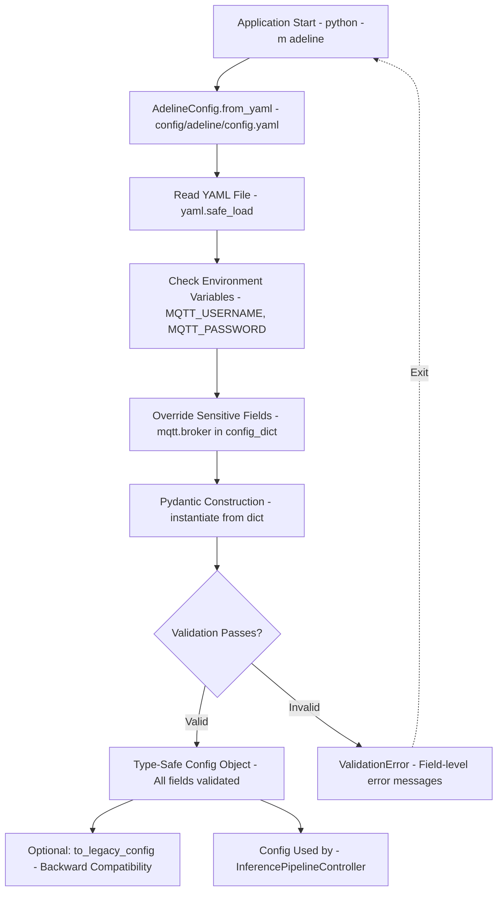
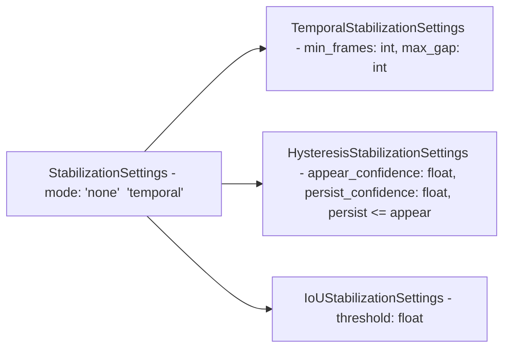
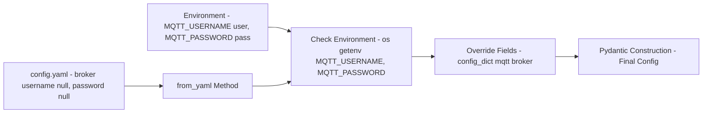
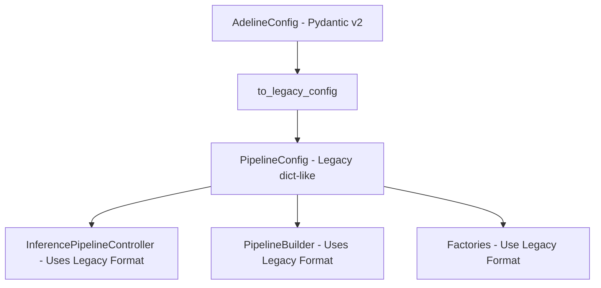

# Configuration System

Relevant source files

- [adeline/.gitignore](https://github.com/acare7/kata-inference-251021-clean4/blob/a0662727/adeline/.gitignore)
- [adeline/CLAUDE.md](https://github.com/acare7/kata-inference-251021-clean4/blob/a0662727/adeline/CLAUDE.md)
- [adeline/TEST_CASES_FUNCIONALES.md](https://github.com/acare7/kata-inference-251021-clean4/blob/a0662727/adeline/TEST_CASES_FUNCIONALES.md)
- [adeline/config/__init__.py](https://github.com/acare7/kata-inference-251021-clean4/blob/a0662727/adeline/config/__init__.py)
- [adeline/config/schemas.py](https://github.com/acare7/kata-inference-251021-clean4/blob/a0662727/adeline/config/schemas.py)
- [adeline/test_pydantic_validation.py](https://github.com/acare7/kata-inference-251021-clean4/blob/a0662727/adeline/test_pydantic_validation.py)

## Purpose and Scope

The Configuration System provides type-safe, validated configuration management for the Adeline inference pipeline. It uses Pydantic v2 schemas to enforce configuration correctness at load time, implementing a "fail fast" philosophy where invalid configurations are rejected before the system starts. This prevents runtime errors caused by misconfiguration and provides clear validation messages.

This document covers:

- Pydantic schema definitions and hierarchy
- Configuration loading from YAML files
- Validation rules and constraints
- Environment variable integration for sensitive data
- Legacy compatibility layer

For information about how configuration drives component construction, see [PipelineBuilder](https://deepwiki.com/acare7/kata-inference-251021-clean4/3.2-pipelinebuilder). For runtime configuration changes via MQTT commands, see [Command Reference](https://deepwiki.com/acare7/kata-inference-251021-clean4/4.3-command-reference).

**Sources:** [config/schemas.py1-527](https://github.com/acare7/kata-inference-251021-clean4/blob/a0662727/config/schemas.py#L1-L527) [CLAUDE.md128-142](https://github.com/acare7/kata-inference-251021-clean4/blob/a0662727/CLAUDE.md#L128-L142)

---

## Architecture Overview

The configuration system implements a hierarchical schema structure where `AdelineConfig` serves as the root, composing multiple component-specific schemas. All schemas use Pydantic v2 for runtime validation and type safety.

### Configuration Schema Hierarchy

```mermaid
flowchart TB
  %% --- Entradas ---
  YAML[config/adeline/config.yaml - YAML File]
  ENV[.env - Environment Variables]
  ROOT[AdelineConfig - Root Schema]

  YAML --> ROOT
  ENV -. "Override Sensitive Data" .-> ROOT

  %% --- Nivel 1 desde ROOT ---
  PIPELINE[PipelineSettings - rtsp_url, max_fps, model_id]
  MODELS[ModelsSettings - imgsz, confidence, use_local]
  MQTT_ROOT[MQTTSettings - Composite]
  STAB_ROOT[StabilizationSettings - Composite]
  ROI_ROOT[ROIStrategySettings - Composite]
  LOGGING[LoggingSettings - level, format]
  DISABLED[ModelsDisabledSettings - disabled models list]
  VALIDATE[Pydantic Validation - field_validator, model_validator]
  LEGACY[to_legacy_config - PipelineConfig]

  ROOT --> PIPELINE
  ROOT --> MODELS
  ROOT --> MQTT_ROOT
  ROOT --> STAB_ROOT
  ROOT --> ROI_ROOT
  ROOT --> LOGGING
  ROOT --> DISABLED
  ROOT --> VALIDATE
  ROOT -. "Conversion" .-> LEGACY

  %% --- MQTT ---
  MQTT_BROKER[MQTTBrokerSettings - host, port, username, password]
  MQTT_TOPICS[MQTTTopicsSettings - control_commands, data, metrics]
  MQTT_QOS[MQTTQoSSettings - control, data]
  MQTT_ROOT --> MQTT_BROKER
  MQTT_ROOT --> MQTT_TOPICS
  MQTT_ROOT --> MQTT_QOS

  %% --- Stabilization ---
  STAB_TEMPORAL[TemporalStabilizationSettings - min_frames, max_gap]
  STAB_HYST[HysteresisStabilizationSettings - appear_confidence, persist_confidence]
  STAB_IOU[IoUStabilizationSettings - threshold]
  STAB_ROOT --> STAB_TEMPORAL
  STAB_ROOT --> STAB_HYST
  STAB_ROOT --> STAB_IOU

  %% --- ROI ---
  ROI_ADAPTIVE[AdaptiveROISettings - margin, smoothing, min/max_roi_multiple]
  ROI_FIXED[FixedROISettings - x_min, y_min, x_max, y_max]
  ROI_ROOT --> ROI_ADAPTIVE
  ROI_ROOT --> ROI_FIXED
```



**Sources:** [config/schemas.py390-527](https://github.com/acare7/kata-inference-251021-clean4/blob/a0662727/config/schemas.py#L390-L527) [config/__init__.py1-41](https://github.com/acare7/kata-inference-251021-clean4/blob/a0662727/config/__init__.py#L1-L41)

---

## Configuration Loading

Configuration is loaded using the `AdelineConfig.from_yaml()` class method, which reads a YAML file, applies environment variable overrides, and validates all settings.

### Loading Process




**Code Example:**

```
# Load configuration with validation
config = AdelineConfig.from_yaml("config/adeline/config.yaml")

# Type-safe access with IDE autocomplete
max_fps = config.pipeline.max_fps  # int, guaranteed valid
broker = config.mqtt.broker.host   # str
iou_threshold = config.detection_stabilization.iou.threshold  # float

# Access nested settings
min_frames = config.detection_stabilization.temporal.min_frames
roi_mode = config.roi_strategy.mode  # Literal['none', 'adaptive', 'fixed']
```

**Sources:** [config/schemas.py409-448](https://github.com/acare7/kata-inference-251021-clean4/blob/a0662727/config/schemas.py#L409-L448) [test_pydantic_validation.py11-40](https://github.com/acare7/kata-inference-251021-clean4/blob/a0662727/test_pydantic_validation.py#L11-L40)

---

## Configuration Schema Reference

### PipelineSettings

Core pipeline execution settings.

|Field|Type|Default|Validation|Description|
|---|---|---|---|---|
|`rtsp_url`|`str`|`"rtsp://127.0.0.1:8554/live"`|-|RTSP stream URL|
|`model_id`|`str`|`"yolov11n-640"`|-|Roboflow model ID|
|`max_fps`|`int`|`2`|`1 <= x <= 30`|Maximum frames per second|
|`enable_visualization`|`bool`|`True`|-|Enable OpenCV visualization window|
|`display_statistics`|`bool`|`True`|-|Display FPS and detection stats|

**Sources:** [config/schemas.py28-52](https://github.com/acare7/kata-inference-251021-clean4/blob/a0662727/config/schemas.py#L28-L52)

---

### ModelsSettings

Model configuration for inference.

|Field|Type|Default|Validation|Description|
|---|---|---|---|---|
|`use_local`|`bool`|`False`|-|Use local ONNX model instead of Roboflow|
|`local_path`|`str`|`"models/yolov11n-320.onnx"`|-|Path to local ONNX model|
|`imgsz`|`int`|`320`|`64 <= x <= 1280`, `x % 32 == 0`|Model input size (YOLO requirement)|
|`confidence`|`float`|`0.25`|`0.0 <= x <= 1.0`|Confidence threshold|
|`iou_threshold`|`float`|`0.45`|`0.0 <= x <= 1.0`|IoU threshold for NMS|

**Key Validation:**

The `imgsz` field has a custom validator enforcing YOLO's architectural requirement:

```
@field_validator('imgsz')
@classmethod
def validate_imgsz_multiple_of_32(cls, v: int) -> int:
    if v % 32 != 0:
        raise ValueError(f"imgsz must be multiple of 32, got {v}")
    return v
```

**Sources:** [config/schemas.py54-90](https://github.com/acare7/kata-inference-251021-clean4/blob/a0662727/config/schemas.py#L54-L90)

---

### MQTTSettings

MQTT communication configuration with nested schemas.

#### MQTTBrokerSettings

|Field|Type|Default|Description|
|---|---|---|---|
|`host`|`str`|`"localhost"`|MQTT broker hostname|
|`port`|`int`|`1883`|MQTT broker port (`1 <= x <= 65535`)|
|`username`|`Optional[str]`|`None`|Username (from environment)|
|`password`|`Optional[str]`|`None`|Password (from environment)|

#### MQTTTopicsSettings

|Field|Type|Default|Description|
|---|---|---|---|
|`control_commands`|`str`|`"inference/control/commands"`|Control commands topic (QoS 1)|
|`control_status`|`str`|`"inference/control/status"`|Control status topic|
|`data`|`str`|`"inference/data/detections"`|Data detections topic (QoS 0)|
|`metrics`|`str`|`"inference/data/metrics"`|Metrics topic|

#### MQTTQoSSettings

|Field|Type|Default|Description|
|---|---|---|---|
|`control`|`Literal[0, 1, 2]`|`1`|Control plane QoS (reliability)|
|`data`|`Literal[0, 1, 2]`|`0`|Data plane QoS (performance)|

**Sources:** [config/schemas.py96-155](https://github.com/acare7/kata-inference-251021-clean4/blob/a0662727/config/schemas.py#L96-L155)

---

### StabilizationSettings

Detection stabilization configuration with temporal filtering and hysteresis.


joya. acá va el mermaid equivalente, sin `<br/>`, sin `\n` y sin paréntesis dentro de `[]`:



#### TemporalStabilizationSettings

|Field|Type|Default|Validation|Description|
|---|---|---|---|---|
|`min_frames`|`int`|`3`|`>= 1`|Minimum consecutive frames to confirm detection|
|`max_gap`|`int`|`2`|`>= 0`|Maximum gap frames before removing track|

#### HysteresisStabilizationSettings

|Field|Type|Default|Validation|Description|
|---|---|---|---|---|
|`appear_confidence`|`float`|`0.5`|`0.0 <= x <= 1.0`|High threshold for new detections|
|`persist_confidence`|`float`|`0.3`|`0.0 <= x <= 1.0`|Low threshold for confirmed detections|

**Cross-Field Validation:**

```
@model_validator(mode='after')
def validate_hysteresis_order(self):
    if self.persist_confidence > self.appear_confidence:
        raise ValueError(
            f"persist_confidence ({self.persist_confidence}) must be <= "
            f"appear_confidence ({self.appear_confidence})"
        )
    return self
```

#### IoUStabilizationSettings

|Field|Type|Default|Validation|Description|
|---|---|---|---|---|
|`threshold`|`float`|`0.3`|`0.0 <= x <= 1.0`|Minimum IoU to consider same object|

**Sources:** [config/schemas.py161-226](https://github.com/acare7/kata-inference-251021-clean4/blob/a0662727/config/schemas.py#L161-L226) [test_pydantic_validation.py41-62](https://github.com/acare7/kata-inference-251021-clean4/blob/a0662727/test_pydantic_validation.py#L41-L62)

---

### ROIStrategySettings

Region of Interest configuration with mode selection.

#### AdaptiveROISettings

|Field|Type|Default|Validation|Description|
|---|---|---|---|---|
|`margin`|`float`|`0.2`|`0.0 <= x <= 1.0`|Expansion margin around detections|
|`smoothing`|`float`|`0.3`|`0.0 <= x <= 1.0`|Temporal smoothing factor|
|`min_roi_multiple`|`int`|`1`|`>= 1`, `<= max_roi_multiple`|Minimum ROI size as multiple of imgsz|
|`max_roi_multiple`|`int`|`4`|`>= 1`, `>= min_roi_multiple`|Maximum ROI size as multiple of imgsz|
|`show_statistics`|`bool`|`True`|-|Show ROI statistics in visualization|
|`resize_to_model`|`bool`|`False`|-|Resize ROI to model size (zoom) vs padding|

**Cross-Field Validation:**

```
@model_validator(mode='after')
def validate_roi_multiples(self):
    if self.min_roi_multiple > self.max_roi_multiple:
        raise ValueError(
            f"min_roi_multiple ({self.min_roi_multiple}) must be <= "
            f"max_roi_multiple ({self.max_roi_multiple})"
        )
    return self
```

#### FixedROISettings

|Field|Type|Default|Validation|Description|
|---|---|---|---|---|
|`x_min`|`float`|`0.2`|`0.0 <= x <= 1.0`, `< x_max`|Left boundary (normalized)|
|`y_min`|`float`|`0.2`|`0.0 <= x <= 1.0`, `< y_max`|Top boundary (normalized)|
|`x_max`|`float`|`0.8`|`0.0 <= x <= 1.0`, `> x_min`|Right boundary (normalized)|
|`y_max`|`float`|`0.8`|`0.0 <= x <= 1.0`, `> y_min`|Bottom boundary (normalized)|
|`show_overlay`|`bool`|`True`|-|Show fixed ROI overlay|
|`resize_to_model`|`bool`|`False`|-|Resize ROI to model size vs padding|

**Cross-Field Validation:**

```
@model_validator(mode='after')
def validate_bounds(self):
    if self.x_min >= self.x_max:
        raise ValueError(f"x_min ({self.x_min}) must be < x_max ({self.x_max})")
    if self.y_min >= self.y_max:
        raise ValueError(f"y_min ({self.y_min}) must be < y_max ({self.y_max})")
    return self
```

**Sources:** [config/schemas.py232-337](https://github.com/acare7/kata-inference-251021-clean4/blob/a0662727/config/schemas.py#L232-L337) [test_pydantic_validation.py82-102](https://github.com/acare7/kata-inference-251021-clean4/blob/a0662727/test_pydantic_validation.py#L82-L102)

---

### LoggingSettings

Logging configuration for the pipeline and MQTT library.

|Field|Type|Default|Description|
|---|---|---|---|
|`level`|`Literal['DEBUG', 'INFO', 'WARNING', 'ERROR', 'CRITICAL']`|`'INFO'`|Application log level|
|`format`|`str`|`'%(asctime)s - %(name)s - %(levelname)s - %(message)s'`|Log format string|
|`paho_level`|`Literal['DEBUG', 'INFO', 'WARNING', 'ERROR', 'CRITICAL']`|`'WARNING'`|Paho MQTT library log level|

**Sources:** [config/schemas.py343-357](https://github.com/acare7/kata-inference-251021-clean4/blob/a0662727/config/schemas.py#L343-L357)

---

### ModelsDisabledSettings

Configuration for disabling Roboflow model types to prevent `ModelDependencyMissing` warnings.

|Field|Type|Default|Description|
|---|---|---|---|
|`disabled`|`List[str]`|See below|List of models to disable|

**Default Disabled Models:**

- `PALIGEMMA`, `FLORENCE2`, `QWEN_2_5`
- `CORE_MODEL_SAM`, `CORE_MODEL_SAM2`, `CORE_MODEL_CLIP`, `CORE_MODEL_GAZE`
- `SMOLVLM2`, `DEPTH_ESTIMATION`, `MOONDREAM2`
- `CORE_MODEL_TROCR`, `CORE_MODEL_GROUNDINGDINO`, `CORE_MODEL_YOLO_WORLD`, `CORE_MODEL_PE`

**Sources:** [config/schemas.py363-384](https://github.com/acare7/kata-inference-251021-clean4/blob/a0662727/config/schemas.py#L363-L384)

---

## Validation Rules Summary

The configuration system enforces multiple types of validation:

### Field-Level Validation

|Rule Type|Fields|Constraint|
|---|---|---|
|**Numeric Range**|`max_fps`|`1 <= x <= 30`|
||`port`|`1 <= x <= 65535`|
||`confidence`, `iou_threshold`, `appear_confidence`, `persist_confidence`|`0.0 <= x <= 1.0`|
||`margin`, `smoothing`|`0.0 <= x <= 1.0`|
||`x_min`, `y_min`, `x_max`, `y_max`|`0.0 <= x <= 1.0`|
|**Multiple Constraint**|`imgsz`|`x % 32 == 0` (YOLO requirement)|
|**Enum Constraint**|`mode` (stabilization)|`'none'|
||`mode` (ROI)|`'none'|
||`level`, `paho_level`|`'DEBUG'|
||`control`, `data` (QoS)|`0|

### Cross-Field Validation

|Schema|Constraint|Validator|
|---|---|---|
|`HysteresisStabilizationSettings`|`persist_confidence <= appear_confidence`|`validate_hysteresis_order`|
|`AdaptiveROISettings`|`min_roi_multiple <= max_roi_multiple`|`validate_roi_multiples`|
|`FixedROISettings`|`x_min < x_max` and `y_min < y_max`|`validate_bounds`|

**Sources:** [config/schemas.py83-90](https://github.com/acare7/kata-inference-251021-clean4/blob/a0662727/config/schemas.py#L83-L90) [config/schemas.py190-198](https://github.com/acare7/kata-inference-251021-clean4/blob/a0662727/config/schemas.py#L190-L198) [config/schemas.py265-273](https://github.com/acare7/kata-inference-251021-clean4/blob/a0662727/config/schemas.py#L265-L273) [config/schemas.py311-322](https://github.com/acare7/kata-inference-251021-clean4/blob/a0662727/config/schemas.py#L311-L322)

---

## Environment Variable Integration

Sensitive configuration data (MQTT credentials) can be overridden using environment variables, preventing credentials from being committed to version control.

### Environment Variable Override Process




**Implementation:**

```
# Override sensitive data from environment variables
if 'mqtt' in config_dict and 'broker' in config_dict['mqtt']:
    if os.getenv('MQTT_USERNAME'):
        config_dict['mqtt']['broker']['username'] = os.getenv('MQTT_USERNAME')
    if os.getenv('MQTT_PASSWORD'):
        config_dict['mqtt']['broker']['password'] = os.getenv('MQTT_PASSWORD')
```

**Environment File (`.env`):**

```
# MQTT Credentials
MQTT_USERNAME=adeline_user
MQTT_PASSWORD=secure_password_here

# Optional: Roboflow API Key (if not using local models)
ROBOFLOW_API_KEY=your_api_key_here
```

**Sources:** [config/schemas.py440-445](https://github.com/acare7/kata-inference-251021-clean4/blob/a0662727/config/schemas.py#L440-L445) [.gitignore43](https://github.com/acare7/kata-inference-251021-clean4/blob/a0662727/.gitignore#L43-L43)

---

## Legacy Compatibility Layer

The configuration system provides backward compatibility with the legacy `PipelineConfig` class through the `to_legacy_config()` method. This allows gradual migration without breaking existing code.

### Conversion Architecture





**Conversion Process:**

The `to_legacy_config()` method manually constructs a `PipelineConfig` object, bypassing its `__init__` method to avoid validation. It maps nested Pydantic fields to flat legacy attributes:

|Pydantic Path|Legacy Attribute|
|---|---|
|`config.pipeline.max_fps`|`MAX_FPS`|
|`config.pipeline.rtsp_url`|`RTSP_URL`|
|`config.models.imgsz`|`MODEL_IMGSZ`|
|`config.mqtt.broker.host`|`MQTT_BROKER`|
|`config.mqtt.topics.control_commands`|`CONTROL_COMMAND_TOPIC`|
|`config.detection_stabilization.mode`|`STABILIZATION_MODE`|
|`config.detection_stabilization.iou.threshold`|`STABILIZATION_IOU_THRESHOLD`|
|`config.roi_strategy.mode`|`ROI_MODE`|
|`config.roi_strategy.adaptive.margin`|`CROP_MARGIN`|

**Usage Example:**

```
# Load with Pydantic validation
pydantic_config = AdelineConfig.from_yaml("config/adeline/config.yaml")

# Convert to legacy format for existing code
legacy_config = pydantic_config.to_legacy_config()

# Legacy code continues to work
controller = InferencePipelineController(legacy_config)
```

**Sources:** [config/schemas.py450-526](https://github.com/acare7/kata-inference-251021-clean4/blob/a0662727/config/schemas.py#L450-L526) [test_pydantic_validation.py27-31](https://github.com/acare7/kata-inference-251021-clean4/blob/a0662727/test_pydantic_validation.py#L27-L31) [config/__init__.py26](https://github.com/acare7/kata-inference-251021-clean4/blob/a0662727/config/__init__.py#L26-L26)

---

## Configuration Usage Patterns

### Accessing Configuration in Code

Type-safe configuration access with IDE autocomplete:

```
from config.schemas import AdelineConfig

# Load configuration
config = AdelineConfig.from_yaml("config/adeline/config.yaml")

# Access pipeline settings
rtsp_url = config.pipeline.rtsp_url
max_fps = config.pipeline.max_fps

# Access nested MQTT settings
broker_host = config.mqtt.broker.host
control_topic = config.mqtt.topics.control_commands
control_qos = config.mqtt.qos.control

# Access stabilization settings
stab_mode = config.detection_stabilization.mode
min_frames = config.detection_stabilization.temporal.min_frames
iou_threshold = config.detection_stabilization.iou.threshold

# Access ROI settings
roi_mode = config.roi_strategy.mode
margin = config.roi_strategy.adaptive.margin
fixed_bounds = (
    config.roi_strategy.fixed.x_min,
    config.roi_strategy.fixed.y_min,
    config.roi_strategy.fixed.x_max,
    config.roi_strategy.fixed.y_max
)
```

### Configuration-Driven Factory Selection

Factories use configuration to determine which components to create:

```
# ROI mode determines handler type
if config.roi_strategy.mode == 'none':
    handler = StandardInferenceHandler(...)
elif config.roi_strategy.mode == 'adaptive':
    handler = AdaptiveInferenceHandler(...)
elif config.roi_strategy.mode == 'fixed':
    handler = FixedROIInferenceHandler(...)

# Stabilization mode determines strategy
if config.detection_stabilization.mode == 'none':
    stabilizer = NoOpStabilizer()
elif config.detection_stabilization.mode == 'temporal':
    stabilizer = TemporalHysteresisStabilizer(
        min_frames=config.detection_stabilization.temporal.min_frames,
        max_gap=config.detection_stabilization.temporal.max_gap,
        appear_confidence=config.detection_stabilization.hysteresis.appear_confidence,
        persist_confidence=config.detection_stabilization.hysteresis.persist_confidence,
        iou_threshold=config.detection_stabilization.iou.threshold
    )
```

**Sources:** [CLAUDE.md105-113](https://github.com/acare7/kata-inference-251021-clean4/blob/a0662727/CLAUDE.md#L105-L113) [CLAUDE.md119-127](https://github.com/acare7/kata-inference-251021-clean4/blob/a0662727/CLAUDE.md#L119-L127)

---

## Validation Error Handling

When configuration validation fails, Pydantic provides detailed, field-level error messages:

### Example Validation Failures

**Invalid Hysteresis Configuration:**

```
detection_stabilization:
  mode: temporal
  hysteresis:
    appear_confidence: 0.3
    persist_confidence: 0.5  # ERROR: greater than appear_confidence
```

**Error Message:**

```
ValidationError: 1 validation error for AdelineConfig
detection_stabilization -> hysteresis
  persist_confidence (0.5) must be <= appear_confidence (0.3)
```

**Invalid Image Size:**

```
models:
  imgsz: 333  # ERROR: not multiple of 32
```

**Error Message:**

```
ValidationError: 1 validation error for AdelineConfig
models -> imgsz
  imgsz must be multiple of 32, got 333
```

**Invalid ROI Bounds:**

```
roi_strategy:
  mode: fixed
  fixed:
    x_min: 0.8
    x_max: 0.2  # ERROR: x_min >= x_max
```

**Error Message:**

```
ValidationError: 1 validation error for AdelineConfig
roi_strategy -> fixed
  x_min (0.8) must be < x_max (0.2)
```

**Sources:** [test_pydantic_validation.py41-102](https://github.com/acare7/kata-inference-251021-clean4/blob/a0662727/test_pydantic_validation.py#L41-L102)

---

## Configuration File Structure

The YAML configuration file follows this hierarchical structure:

```
# Pipeline Settings
pipeline:
  rtsp_url: "rtsp://127.0.0.1:8554/live"
  model_id: "yolov11n-640"
  max_fps: 2
  enable_visualization: true
  display_statistics: true

# Model Configuration
models:
  use_local: false
  local_path: "models/yolov11n-320.onnx"
  imgsz: 320
  confidence: 0.25
  iou_threshold: 0.45

# MQTT Configuration
mqtt:
  broker:
    host: "localhost"
    port: 1883
    username: null  # Override with MQTT_USERNAME env var
    password: null  # Override with MQTT_PASSWORD env var
  topics:
    control_commands: "inference/control/commands"
    control_status: "inference/control/status"
    data: "inference/data/detections"
    metrics: "inference/data/metrics"
  qos:
    control: 1
    data: 0

# Detection Stabilization
detection_stabilization:
  mode: "temporal"  # or "none"
  temporal:
    min_frames: 3
    max_gap: 2
  hysteresis:
    appear_confidence: 0.5
    persist_confidence: 0.3
  iou:
    threshold: 0.3

# ROI Strategy
roi_strategy:
  mode: "none"  # or "adaptive" or "fixed"
  adaptive:
    margin: 0.2
    smoothing: 0.3
    min_roi_multiple: 1
    max_roi_multiple: 4
    show_statistics: true
    resize_to_model: false
  fixed:
    x_min: 0.2
    y_min: 0.2
    x_max: 0.8
    y_max: 0.8
    show_overlay: true
    resize_to_model: false

# Logging
logging:
  level: "INFO"
  format: "%(asctime)s - %(name)s - %(levelname)s - %(message)s"
  paho_level: "WARNING"

# Models to Disable
models_disabled:
  disabled:
    - "PALIGEMMA"
    - "FLORENCE2"
    - "QWEN_2_5"
    # ... (full list in schema)
```

**Sources:** [config/schemas.py390-407](https://github.com/acare7/kata-inference-251021-clean4/blob/a0662727/config/schemas.py#L390-L407) [TEST_CASES_FUNCIONALES.md259-265](https://github.com/acare7/kata-inference-251021-clean4/blob/a0662727/TEST_CASES_FUNCIONALES.md#L259-L265)

---

## Design Benefits

The Pydantic-based configuration system provides several key benefits:

### 1. Fail Fast Philosophy

Invalid configurations are rejected at load time, not during pipeline execution:

```
# System exits immediately with clear error message
config = AdelineConfig.from_yaml("config/adeline/config.yaml")
# ValidationError: imgsz must be multiple of 32, got 333
```

### 2. Type Safety

IDE autocomplete and static type checkers (mypy) understand configuration structure:

```
# IDE knows max_fps is int, provides autocomplete
max_fps: int = config.pipeline.max_fps

# mypy catches type errors at development time
if config.pipeline.max_fps == "2":  # Type error: comparing int to str
    pass
```

### 3. Self-Documenting

Pydantic schemas serve as both validation and documentation:

```
imgsz: int = Field(
    default=320,
    ge=64,
    le=1280,
    description="Model input size (must be multiple of 32)"
)
```

### 4. Clear Error Messages

Field-level validation provides specific, actionable error messages instead of generic exceptions.

### 5. Enforcement Over Discipline

Validation rules are enforced by the type system, not comments or documentation:

```
# This constraint is ENFORCED, not just documented
@field_validator('imgsz')
@classmethod
def validate_imgsz_multiple_of_32(cls, v: int) -> int:
    if v % 32 != 0:
        raise ValueError(f"imgsz must be multiple of 32, got {v}")
    return v
```

**Sources:** [CLAUDE.md59-63](https://github.com/acare7/kata-inference-251021-clean4/blob/a0662727/CLAUDE.md#L59-L63) [test_pydantic_validation.py131-137](https://github.com/acare7/kata-inference-251021-clean4/blob/a0662727/test_pydantic_validation.py#L131-L137)

---

## Summary

The Configuration System implements a robust, type-safe configuration management layer:

- **Hierarchical Schema Design:** `AdelineConfig` composes 7 major component schemas
- **Load-Time Validation:** Pydantic v2 enforces constraints before system starts
- **Environment Integration:** Sensitive data overridden from `.env` file
- **Legacy Compatibility:** `to_legacy_config()` enables gradual migration
- **Self-Documenting:** Field descriptions and constraints embedded in schema
- **Type Safety:** IDE autocomplete and mypy integration
- **Clear Errors:** Field-level validation messages guide configuration fixes

The system enforces the principle of "Complexity by design, not by accident" - configuration correctness is guaranteed by the type system, not by runtime checks or developer discipline.

**Sources:** [config/schemas.py1-527](https://github.com/acare7/kata-inference-251021-clean4/blob/a0662727/config/schemas.py#L1-L527) [CLAUDE.md128-142](https://github.com/acare7/kata-inference-251021-clean4/blob/a0662727/CLAUDE.md#L128-L142) [test_pydantic_validation.py1-138](https://github.com/acare7/kata-inference-251021-clean4/blob/a0662727/test_pydantic_validation.py#L1-L138)