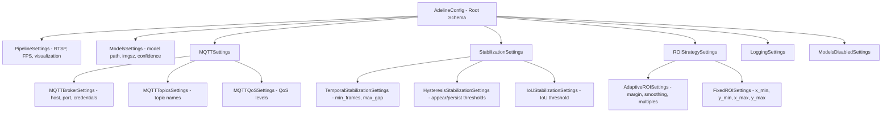
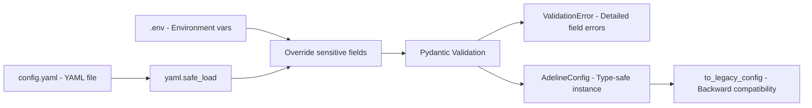
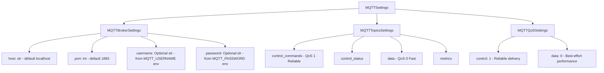
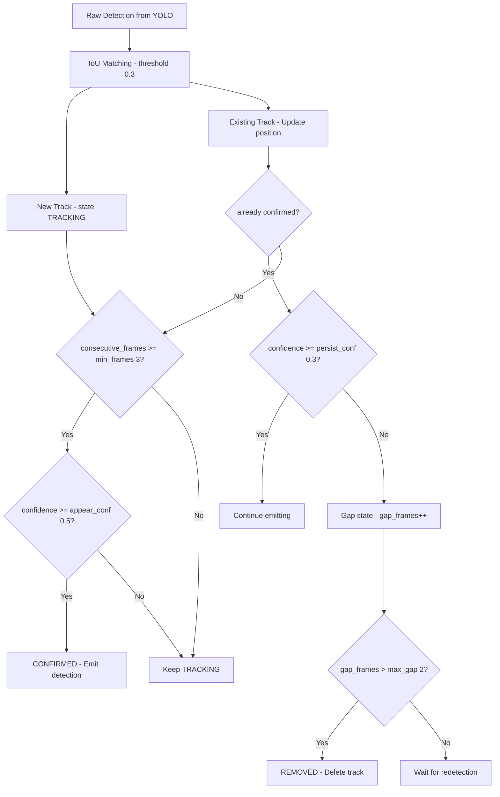
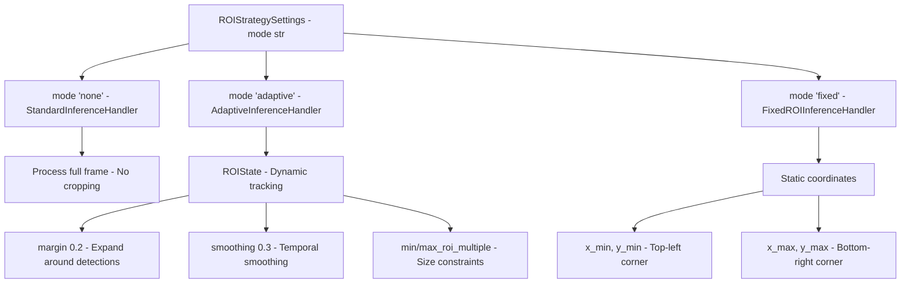
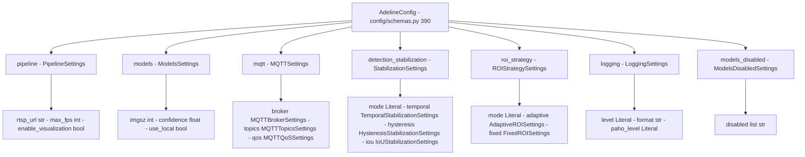
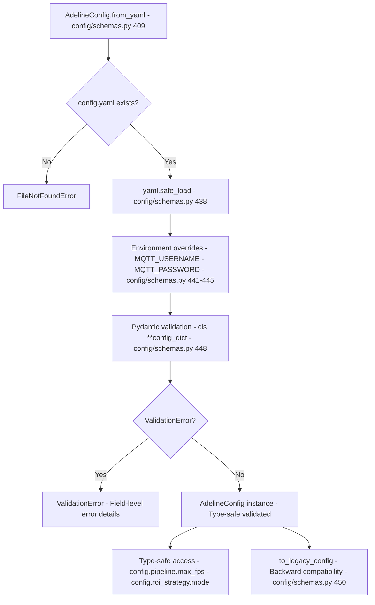

# Configuration Schema Reference

Relevant source files

- [adeline/.gitignore](https://github.com/acare7/kata-inference-251021-clean4/blob/a0662727/adeline/.gitignore)
- [adeline/TEST_CASES_FUNCIONALES.md](https://github.com/acare7/kata-inference-251021-clean4/blob/a0662727/adeline/TEST_CASES_FUNCIONALES.md)
- [adeline/config/__init__.py](https://github.com/acare7/kata-inference-251021-clean4/blob/a0662727/adeline/config/__init__.py)
- [adeline/config/schemas.py](https://github.com/acare7/kata-inference-251021-clean4/blob/a0662727/adeline/config/schemas.py)
- [adeline/test_pydantic_validation.py](https://github.com/acare7/kata-inference-251021-clean4/blob/a0662727/adeline/test_pydantic_validation.py)

This document provides a complete reference of all configuration options available in the Adeline inference pipeline. The configuration system uses Pydantic v2 for type-safe validation and is defined in [config/schemas.py](https://github.com/acare7/kata-inference-251021-clean4/blob/a0662727/config/schemas.py)

For information about validation rules and constraints, see [Validation Rules](https://deepwiki.com/acare7/kata-inference-251021-clean4/6.2-validation-rules). For general configuration guidance and setup instructions, see [Configuration](https://deepwiki.com/acare7/kata-inference-251021-clean4/2.2-configuration).

---

## Purpose and Scope

This page documents:

- All available configuration schemas and their fields
- Field types, defaults, and validation constraints
- How schemas compose into the root `AdelineConfig`
- Configuration loading methods and environment variable overrides
- Legacy compatibility layer

This is a technical reference. For practical configuration examples and setup, see [Configuration](https://deepwiki.com/acare7/kata-inference-251021-clean4/2.2-configuration).

---

## Configuration Loading

The configuration system loads from YAML files and validates using Pydantic schemas. Configuration is loaded at startup and validated before the pipeline begins execution, implementing a "fail fast" approach.

### Loading from YAML

```
from config.schemas import AdelineConfig

# Load and validate configuration
config = AdelineConfig.from_yaml("config/adeline/config.yaml")

# Type-safe access with IDE autocomplete
max_fps = config.pipeline.max_fps  # int
roi_mode = config.roi_strategy.mode  # Literal['none', 'adaptive', 'fixed']
```

### Environment Variable Overrides

Sensitive values can be overridden using environment variables:

- `MQTT_USERNAME` - Overrides `mqtt.broker.username`
- `MQTT_PASSWORD` - Overrides `mqtt.broker.password`
- `ROBOFLOW_API_KEY` - Used for Roboflow model access

The override logic is implemented in [config/schemas.py440-445](https://github.com/acare7/kata-inference-251021-clean4/blob/a0662727/config/schemas.py#L440-L445)

**Sources:** [config/schemas.py409-448](https://github.com/acare7/kata-inference-251021-clean4/blob/a0662727/config/schemas.py#L409-L448) [test_pydantic_validation.py11-40](https://github.com/acare7/kata-inference-251021-clean4/blob/a0662727/test_pydantic_validation.py#L11-L40)

---

## Schema Hierarchy

The configuration system uses a hierarchical schema structure where `AdelineConfig` is the root schema that composes multiple sub-schemas.




**Validation Flow:**




**Sources:** [config/schemas.py390-408](https://github.com/acare7/kata-inference-251021-clean4/blob/a0662727/config/schemas.py#L390-L408) [config/schemas.py17-21](https://github.com/acare7/kata-inference-251021-clean4/blob/a0662727/config/schemas.py#L17-L21)

---

## PipelineSettings

Controls core pipeline behavior including video source, model selection, and visualization.

**Class:** `PipelineSettings` [config/schemas.py28-51](https://github.com/acare7/kata-inference-251021-clean4/blob/a0662727/config/schemas.py#L28-L51)

|Field|Type|Default|Constraints|Description|
|---|---|---|---|---|
|`rtsp_url`|`str`|`"rtsp://127.0.0.1:8554/live"`|-|RTSP stream URL for video input|
|`model_id`|`str`|`"yolov11n-640"`|-|Roboflow model ID (when using Roboflow)|
|`max_fps`|`int`|`2`|`1 <= x <= 30`|Maximum frames per second to process|
|`enable_visualization`|`bool`|`True`|-|Enable OpenCV visualization window|
|`display_statistics`|`bool`|`True`|-|Display FPS and detection statistics in visualization|

### Example Configuration

```
pipeline:
  rtsp_url: "rtsp://192.168.1.100:8554/camera1"
  model_id: "yolov11n-640"
  max_fps: 2
  enable_visualization: true
  display_statistics: true
```

**Sources:** [config/schemas.py28-51](https://github.com/acare7/kata-inference-251021-clean4/blob/a0662727/config/schemas.py#L28-L51)

---

## ModelsSettings

Configures model loading (local ONNX vs Roboflow) and inference parameters.

**Class:** `ModelsSettings` [config/schemas.py54-89](https://github.com/acare7/kata-inference-251021-clean4/blob/a0662727/config/schemas.py#L54-L89)

|Field|Type|Default|Constraints|Description|
|---|---|---|---|---|
|`use_local`|`bool`|`False`|-|Use local ONNX model instead of downloading from Roboflow|
|`local_path`|`str`|`"models/yolov11n-320.onnx"`|-|Path to local ONNX model file|
|`imgsz`|`int`|`320`|`64 <= x <= 1280`  <br>`x % 32 == 0`|Model input size (must be multiple of 32 for YOLO)|
|`confidence`|`float`|`0.25`|`0.0 <= x <= 1.0`|Confidence threshold for detections|
|`iou_threshold`|`float`|`0.45`|`0.0 <= x <= 1.0`|IoU threshold for Non-Maximum Suppression (NMS)|

### Validation Rules

The `imgsz` field has a custom validator that enforces the YOLO requirement:

```
@field_validator('imgsz')
@classmethod
def validate_imgsz_multiple_of_32(cls, v: int) -> int:
    if v % 32 != 0:
        raise ValueError(f"imgsz must be multiple of 32, got {v}")
    return v
```

This validation is implemented in [config/schemas.py83-89](https://github.com/acare7/kata-inference-251021-clean4/blob/a0662727/config/schemas.py#L83-L89)

### Example Configuration

```
models:
  use_local: true
  local_path: "models/yolov11n-320.onnx"
  imgsz: 320
  confidence: 0.25
  iou_threshold: 0.45
```

**Sources:** [config/schemas.py54-89](https://github.com/acare7/kata-inference-251021-clean4/blob/a0662727/config/schemas.py#L54-L89) [test_pydantic_validation.py64-79](https://github.com/acare7/kata-inference-251021-clean4/blob/a0662727/test_pydantic_validation.py#L64-L79)

---

## MQTTSettings

Configures the dual-plane MQTT architecture including broker connection, topic names, and QoS levels. The MQTT system separates control commands (QoS 1) from data publishing (QoS 0) for optimal reliability vs performance tradeoffs.

**Class:** `MQTTSettings` [config/schemas.py150-154](https://github.com/acare7/kata-inference-251021-clean4/blob/a0662727/config/schemas.py#L150-L154)

### MQTTBrokerSettings

**Class:** `MQTTBrokerSettings` [config/schemas.py96-115](https://github.com/acare7/kata-inference-251021-clean4/blob/a0662727/config/schemas.py#L96-L115)

|Field|Type|Default|Constraints|Description|
|---|---|---|---|---|
|`host`|`str`|`"localhost"`|-|MQTT broker hostname or IP address|
|`port`|`int`|`1883`|`1 <= x <= 65535`|MQTT broker port|
|`username`|`Optional[str]`|`None`|-|MQTT username (optional, typically from env)|
|`password`|`Optional[str]`|`None`|-|MQTT password (optional, typically from env)|

### MQTTTopicsSettings

**Class:** `MQTTTopicsSettings` [config/schemas.py118-135](https://github.com/acare7/kata-inference-251021-clean4/blob/a0662727/config/schemas.py#L118-L135)

|Field|Type|Default|Description|
|---|---|---|---|
|`control_commands`|`str`|`"inference/control/commands"`|Topic for receiving control commands (QoS 1)|
|`control_status`|`str`|`"inference/control/status"`|Topic for publishing status updates|
|`data`|`str`|`"inference/data/detections"`|Topic for publishing detection results (QoS 0)|
|`metrics`|`str`|`"inference/data/metrics"`|Topic for publishing performance metrics|

### MQTTQoSSettings

**Class:** `MQTTQoSSettings` [config/schemas.py138-147](https://github.com/acare7/kata-inference-251021-clean4/blob/a0662727/config/schemas.py#L138-L147)

|Field|Type|Default|Description|
|---|---|---|---|
|`control`|`Literal[0, 1, 2]`|`1`|Control plane QoS (recommended: 1 for reliability)|
|`data`|`Literal[0, 1, 2]`|`0`|Data plane QoS (recommended: 0 for performance)|

### MQTT Configuration Structure




### Example Configuration

```
mqtt:
  broker:
    host: "192.168.1.50"
    port: 1883
    # username and password loaded from environment variables
  topics:
    control_commands: "inference/control/commands"
    control_status: "inference/control/status"
    data: "inference/data/detections"
    metrics: "inference/data/metrics"
  qos:
    control: 1  # Reliable for commands
    data: 0     # Best-effort for detections
```

**Sources:** [config/schemas.py96-154](https://github.com/acare7/kata-inference-251021-clean4/blob/a0662727/config/schemas.py#L96-L154)

---

## StabilizationSettings

Configures detection stabilization including temporal filtering, hysteresis thresholds, and IoU matching for multi-object tracking.

**Class:** `StabilizationSettings` [config/schemas.py211-225](https://github.com/acare7/kata-inference-251021-clean4/blob/a0662727/config/schemas.py#L211-L225)

|Field|Type|Default|Description|
|---|---|---|---|
|`mode`|`Literal['none', 'temporal']`|`'none'`|Stabilization mode: `'none'` = no filtering, `'temporal'` = use `TemporalHysteresisStabilizer`|
|`temporal`|`TemporalStabilizationSettings`|(see below)|Temporal filtering parameters|
|`hysteresis`|`HysteresisStabilizationSettings`|(see below)|Hysteresis threshold parameters|
|`iou`|`IoUStabilizationSettings`|(see below)|IoU matching parameters|

### TemporalStabilizationSettings

Controls when detections are confirmed and when tracks are removed.

**Class:** `TemporalStabilizationSettings` [config/schemas.py161-172](https://github.com/acare7/kata-inference-251021-clean4/blob/a0662727/config/schemas.py#L161-L172)

|Field|Type|Default|Constraints|Description|
|---|---|---|---|---|
|`min_frames`|`int`|`3`|`>= 1`|Minimum consecutive frames required to confirm a detection|
|`max_gap`|`int`|`2`|`>= 0`|Maximum frames a track can be missing before removal|

### HysteresisStabilizationSettings

Implements dual-threshold hysteresis filtering to reduce detection flickering.

**Class:** `HysteresisStabilizationSettings` [config/schemas.py175-198](https://github.com/acare7/kata-inference-251021-clean4/blob/a0662727/config/schemas.py#L175-L198)

|Field|Type|Default|Constraints|Description|
|---|---|---|---|---|
|`appear_confidence`|`float`|`0.5`|`0.0 <= x <= 1.0`|High confidence threshold for new detections|
|`persist_confidence`|`float`|`0.3`|`0.0 <= x <= 1.0`  <br>`<= appear_confidence`|Low confidence threshold for confirmed tracks|

**Validation:** The `persist_confidence` must be less than or equal to `appear_confidence`. This is enforced by a model validator at [config/schemas.py190-198](https://github.com/acare7/kata-inference-251021-clean4/blob/a0662727/config/schemas.py#L190-L198)

### IoUStabilizationSettings

Configures spatial matching for multi-object tracking using Intersection over Union (IoU).

**Class:** `IoUStabilizationSettings` [config/schemas.py201-208](https://github.com/acare7/kata-inference-251021-clean4/blob/a0662727/config/schemas.py#L201-L208)

|Field|Type|Default|Constraints|Description|
|---|---|---|---|---|
|`threshold`|`float`|`0.3`|`0.0 <= x <= 1.0`|Minimum IoU to match detection to existing track|

### Stabilization Parameter Flow





### Example Configuration

```
detection_stabilization:
  mode: temporal
  temporal:
    min_frames: 3
    max_gap: 2
  hysteresis:
    appear_confidence: 0.5
    persist_confidence: 0.3
  iou:
    threshold: 0.3
```

**Sources:** [config/schemas.py161-225](https://github.com/acare7/kata-inference-251021-clean4/blob/a0662727/config/schemas.py#L161-L225) [test_pydantic_validation.py41-62](https://github.com/acare7/kata-inference-251021-clean4/blob/a0662727/test_pydantic_validation.py#L41-L62) [TEST_CASES_FUNCIONALES.md260-265](https://github.com/acare7/kata-inference-251021-clean4/blob/a0662727/TEST_CASES_FUNCIONALES.md#L260-L265)

---

## ROIStrategySettings

Configures Region of Interest (ROI) processing modes for optimizing inference performance.

**Class:** `ROIStrategySettings` [config/schemas.py325-336](https://github.com/acare7/kata-inference-251021-clean4/blob/a0662727/config/schemas.py#L325-L336)

|Field|Type|Default|Description|
|---|---|---|---|
|`mode`|`Literal['none', 'adaptive', 'fixed']`|`'none'`|ROI mode: `'none'` = full frame, `'adaptive'` = dynamic ROI, `'fixed'` = static ROI|
|`adaptive`|`AdaptiveROISettings`|(see below)|Adaptive ROI parameters|
|`fixed`|`FixedROISettings`|(see below)|Fixed ROI parameters|

### AdaptiveROISettings

Configures dynamic ROI that adjusts based on detection locations.

**Class:** `AdaptiveROISettings` [config/schemas.py232-273](https://github.com/acare7/kata-inference-251021-clean4/blob/a0662727/config/schemas.py#L232-L273)

|Field|Type|Default|Constraints|Description|
|---|---|---|---|---|
|`margin`|`float`|`0.2`|`0.0 <= x <= 1.0`|Expansion margin around detections (normalized)|
|`smoothing`|`float`|`0.3`|`0.0 <= x <= 1.0`|Temporal smoothing factor (0=no smoothing, 1=full smoothing)|
|`min_roi_multiple`|`int`|`1`|`>= 1`  <br>`<= max_roi_multiple`|Minimum ROI size as multiple of `imgsz`|
|`max_roi_multiple`|`int`|`4`|`>= 1`  <br>`>= min_roi_multiple`|Maximum ROI size as multiple of `imgsz`|
|`show_statistics`|`bool`|`True`|-|Display ROI statistics in visualization|
|`resize_to_model`|`bool`|`False`|-|Resize ROI to exact model size (zoom) vs padding to multiple|

### FixedROISettings

Configures static ROI using normalized coordinates (0.0 to 1.0).

**Class:** `FixedROISettings` [config/schemas.py276-322](https://github.com/acare7/kata-inference-251021-clean4/blob/a0662727/config/schemas.py#L276-L322)

|Field|Type|Default|Constraints|Description|
|---|---|---|---|---|
|`x_min`|`float`|`0.2`|`0.0 <= x <= 1.0`  <br>`< x_max`|Left boundary (normalized: 0.0 = left edge)|
|`y_min`|`float`|`0.2`|`0.0 <= x <= 1.0`  <br>`< y_max`|Top boundary (normalized: 0.0 = top edge)|
|`x_max`|`float`|`0.8`|`0.0 <= x <= 1.0`  <br>`> x_min`|Right boundary (normalized: 1.0 = right edge)|
|`y_max`|`float`|`0.8`|`0.0 <= x <= 1.0`  <br>`> y_min`|Bottom boundary (normalized: 1.0 = bottom edge)|
|`show_overlay`|`bool`|`True`|-|Display fixed ROI rectangle in visualization|
|`resize_to_model`|`bool`|`False`|-|Resize ROI to exact model size vs padding|

**Validation:** The fixed ROI bounds are validated to ensure `x_min < x_max` and `y_min < y_max` by a model validator at [config/schemas.py311-322](https://github.com/acare7/kata-inference-251021-clean4/blob/a0662727/config/schemas.py#L311-L322)

### ROI Mode Comparison




### Example Configurations

**Adaptive ROI:**

```
roi_strategy:
  mode: adaptive
  adaptive:
    margin: 0.2
    smoothing: 0.3
    min_roi_multiple: 1
    max_roi_multiple: 4
    show_statistics: true
    resize_to_model: false
```

**Fixed ROI:**

```
roi_strategy:
  mode: fixed
  fixed:
    x_min: 0.2
    y_min: 0.2
    x_max: 0.8
    y_max: 0.8
    show_overlay: true
    resize_to_model: false
```

**Sources:** [config/schemas.py232-336](https://github.com/acare7/kata-inference-251021-clean4/blob/a0662727/config/schemas.py#L232-L336) [test_pydantic_validation.py81-102](https://github.com/acare7/kata-inference-251021-clean4/blob/a0662727/test_pydantic_validation.py#L81-L102)

---

## LoggingSettings

Configures logging levels and formats for the application and MQTT library.

**Class:** `LoggingSettings` [config/schemas.py343-356](https://github.com/acare7/kata-inference-251021-clean4/blob/a0662727/config/schemas.py#L343-L356)

|Field|Type|Default|Description|
|---|---|---|---|
|`level`|`Literal['DEBUG', 'INFO', 'WARNING', 'ERROR', 'CRITICAL']`|`'INFO'`|Main application log level|
|`format`|`str`|`'%(asctime)s - %(name)s - %(levelname)s - %(message)s'`|Python logging format string|
|`paho_level`|`Literal['DEBUG', 'INFO', 'WARNING', 'ERROR', 'CRITICAL']`|`'WARNING'`|Paho MQTT library log level (separate to reduce verbosity)|

### Example Configuration

```
logging:
  level: INFO
  format: '%(asctime)s - %(name)s - %(levelname)s - %(message)s'
  paho_level: WARNING  # Reduce MQTT library verbosity
```

**Sources:** [config/schemas.py343-356](https://github.com/acare7/kata-inference-251021-clean4/blob/a0662727/config/schemas.py#L343-L356)

---

## ModelsDisabledSettings

Configures which inference models to disable, preventing `ModelDependencyMissing` warnings from the Roboflow inference library.

**Class:** `ModelsDisabledSettings` [config/schemas.py363-383](https://github.com/acare7/kata-inference-251021-clean4/blob/a0662727/config/schemas.py#L363-L383)

|Field|Type|Default|Description|
|---|---|---|---|
|`disabled`|`List[str]`|(see below)|List of model identifiers to disable|

### Default Disabled Models

The following models are disabled by default as they are not used in the Adeline pipeline and generate unnecessary warnings:

```
[
    "PALIGEMMA",
    "FLORENCE2",
    "QWEN_2_5",
    "CORE_MODEL_SAM",
    "CORE_MODEL_SAM2",
    "CORE_MODEL_CLIP",
    "CORE_MODEL_GAZE",
    "SMOLVLM2",
    "DEPTH_ESTIMATION",
    "MOONDREAM2",
    "CORE_MODEL_TROCR",
    "CORE_MODEL_GROUNDINGDINO",
    "CORE_MODEL_YOLO_WORLD",
    "CORE_MODEL_PE",
]
```

These correspond to the constants defined in the inference library. The disable functionality is implemented using the `disable_models_from_config` utility.

### Example Configuration

```
models_disabled:
  disabled:
    - PALIGEMMA
    - FLORENCE2
    - QWEN_2_5
    # ... additional models to disable
```

**Sources:** [config/schemas.py363-383](https://github.com/acare7/kata-inference-251021-clean4/blob/a0662727/config/schemas.py#L363-L383)

---

## Root Configuration: AdelineConfig

The root configuration object that composes all sub-schemas.

**Class:** `AdelineConfig` [config/schemas.py390-408](https://github.com/acare7/kata-inference-251021-clean4/blob/a0662727/config/schemas.py#L390-L408)

### Schema Composition Map




### Loading and Validation Flow




### Methods

**`from_yaml(config_path: str) -> AdelineConfig`** [config/schemas.py409-448](https://github.com/acare7/kata-inference-251021-clean4/blob/a0662727/config/schemas.py#L409-L448)

Loads configuration from YAML file with validation.

- Raises `FileNotFoundError` if config file doesn't exist
- Raises `ValidationError` if configuration is invalid
- Overrides sensitive fields from environment variables
- Returns validated `AdelineConfig` instance

**`to_legacy_config() -> PipelineConfig`** [config/schemas.py450-526](https://github.com/acare7/kata-inference-251021-clean4/blob/a0662727/config/schemas.py#L450-L526)

Converts to legacy `PipelineConfig` format for backward compatibility. This allows gradual migration from the old configuration system without breaking existing code.

**Sources:** [config/schemas.py390-526](https://github.com/acare7/kata-inference-251021-clean4/blob/a0662727/config/schemas.py#L390-L526) [test_pydantic_validation.py11-40](https://github.com/acare7/kata-inference-251021-clean4/blob/a0662727/test_pydantic_validation.py#L11-L40)

---

## Validation Examples

The following examples demonstrate the validation behavior using the test script at [test_pydantic_validation.py](https://github.com/acare7/kata-inference-251021-clean4/blob/a0662727/test_pydantic_validation.py)

### Valid Configuration

```
config = AdelineConfig.from_yaml("config/adeline/config.yaml")
# ✅ Success - config is validated and type-safe
```

### Invalid Hysteresis (persist > appear)

```
config = AdelineConfig(
    detection_stabilization={
        'mode': 'temporal',
        'hysteresis': {
            'appear_confidence': 0.3,
            'persist_confidence': 0.5  # ❌ Error: must be <= appear
        }
    }
)
# Raises: ValidationError: persist_confidence must be <= appear_confidence
```

### Invalid imgsz (not multiple of 32)

```
config = AdelineConfig(
    models={'imgsz': 333}  # ❌ Error: must be multiple of 32
)
# Raises: ValidationError: imgsz must be multiple of 32, got 333
```

### Invalid ROI Bounds (min > max)

```
config = AdelineConfig(
    roi_strategy={
        'mode': 'fixed',
        'fixed': {
            'x_min': 0.8,
            'x_max': 0.2  # ❌ Error: min must be < max
        }
    }
)
# Raises: ValidationError: x_min must be < x_max
```

**Sources:** [test_pydantic_validation.py41-102](https://github.com/acare7/kata-inference-251021-clean4/blob/a0662727/test_pydantic_validation.py#L41-L102)

---

## Complete Configuration Example

Below is a complete configuration file showing all available options with typical values:

```
# Pipeline settings
pipeline:
  rtsp_url: "rtsp://127.0.0.1:8554/live"
  model_id: "yolov11n-640"
  max_fps: 2
  enable_visualization: true
  display_statistics: true

# Model configuration
models:
  use_local: false
  local_path: "models/yolov11n-320.onnx"
  imgsz: 320
  confidence: 0.25
  iou_threshold: 0.45

# MQTT configuration (dual-plane architecture)
mqtt:
  broker:
    host: "localhost"
    port: 1883
    # username and password from environment variables
  topics:
    control_commands: "inference/control/commands"
    control_status: "inference/control/status"
    data: "inference/data/detections"
    metrics: "inference/data/metrics"
  qos:
    control: 1  # QoS 1 for reliable command delivery
    data: 0     # QoS 0 for high-throughput data

# Detection stabilization (multi-object tracking)
detection_stabilization:
  mode: temporal
  temporal:
    min_frames: 3
    max_gap: 2
  hysteresis:
    appear_confidence: 0.5
    persist_confidence: 0.3
  iou:
    threshold: 0.3

# ROI strategy (performance optimization)
roi_strategy:
  mode: none  # Options: none, adaptive, fixed
  adaptive:
    margin: 0.2
    smoothing: 0.3
    min_roi_multiple: 1
    max_roi_multiple: 4
    show_statistics: true
    resize_to_model: false
  fixed:
    x_min: 0.2
    y_min: 0.2
    x_max: 0.8
    y_max: 0.8
    show_overlay: true
    resize_to_model: false

# Logging configuration
logging:
  level: INFO
  format: '%(asctime)s - %(name)s - %(levelname)s - %(message)s'
  paho_level: WARNING

# Disabled models (prevent warnings)
models_disabled:
  disabled:
    - PALIGEMMA
    - FLORENCE2
    - QWEN_2_5
    - CORE_MODEL_SAM
    - CORE_MODEL_SAM2
    - CORE_MODEL_CLIP
    - CORE_MODEL_GAZE
    - SMOLVLM2
    - DEPTH_ESTIMATION
    - MOONDREAM2
    - CORE_MODEL_TROCR
    - CORE_MODEL_GROUNDINGDINO
    - CORE_MODEL_YOLO_WORLD
    - CORE_MODEL_PE
```

**Sources:** [config/schemas.py](https://github.com/acare7/kata-inference-251021-clean4/blob/a0662727/config/schemas.py) [test_pydantic_validation.py11-40](https://github.com/acare7/kata-inference-251021-clean4/blob/a0662727/test_pydantic_validation.py#L11-L40)

---

## Configuration Field Quick Reference

This table provides a quick lookup of all configuration fields organized by category:

|Category|Field Path|Type|Default|Key Constraint|
|---|---|---|---|---|
|**Pipeline**|`pipeline.rtsp_url`|`str`|`"rtsp://127.0.0.1:8554/live"`|-|
||`pipeline.max_fps`|`int`|`2`|`1-30`|
||`pipeline.enable_visualization`|`bool`|`True`|-|
|**Models**|`models.imgsz`|`int`|`320`|`% 32 == 0`|
||`models.confidence`|`float`|`0.25`|`0.0-1.0`|
||`models.use_local`|`bool`|`False`|-|
|**MQTT**|`mqtt.broker.host`|`str`|`"localhost"`|-|
||`mqtt.broker.port`|`int`|`1883`|`1-65535`|
||`mqtt.qos.control`|`int`|`1`|`0, 1, or 2`|
||`mqtt.qos.data`|`int`|`0`|`0, 1, or 2`|
|**Stabilization**|`detection_stabilization.mode`|`str`|`"none"`|`none/temporal`|
||`detection_stabilization.temporal.min_frames`|`int`|`3`|`>= 1`|
||`detection_stabilization.temporal.max_gap`|`int`|`2`|`>= 0`|
||`detection_stabilization.hysteresis.appear_confidence`|`float`|`0.5`|`0.0-1.0`|
||`detection_stabilization.hysteresis.persist_confidence`|`float`|`0.3`|`<= appear_conf`|
||`detection_stabilization.iou.threshold`|`float`|`0.3`|`0.0-1.0`|
|**ROI**|`roi_strategy.mode`|`str`|`"none"`|`none/adaptive/fixed`|
||`roi_strategy.adaptive.margin`|`float`|`0.2`|`0.0-1.0`|
||`roi_strategy.adaptive.smoothing`|`float`|`0.3`|`0.0-1.0`|
||`roi_strategy.fixed.x_min`|`float`|`0.2`|`< x_max`|
||`roi_strategy.fixed.x_max`|`float`|`0.8`|`> x_min`|
|**Logging**|`logging.level`|`str`|`"INFO"`|DEBUG/INFO/WARNING/ERROR/CRITICAL|