# Validation Rules

Relevant source files

- [adeline/CLAUDE.md](https://github.com/acare7/kata-inference-251021-clean4/blob/a0662727/adeline/CLAUDE.md)
- [adeline/test_pydantic_validation.py](https://github.com/acare7/kata-inference-251021-clean4/blob/a0662727/adeline/test_pydantic_validation.py)

This document details the validation constraints enforced by the Pydantic-based configuration system. All validation occurs at configuration load time, implementing a "fail fast" philosophy that prevents invalid configurations from reaching runtime. For the overall configuration schema structure, see [Configuration Schema Reference](https://deepwiki.com/acare7/kata-inference-251021-clean4/6.1-configuration-schema-reference). For guidance on how to configure the system, see [Configuration](https://deepwiki.com/acare7/kata-inference-251021-clean4/2.2-configuration).

---

## Overview

The Adeline configuration system uses Pydantic v2 to enforce validation rules declaratively. When `AdelineConfig.from_yaml()` is called, all validation rules execute before the application starts. Invalid configurations immediately raise `ValidationError` with clear field-level error messages, preventing runtime failures.

**Sources:** [config/schemas.py](https://github.com/acare7/kata-inference-251021-clean4/blob/a0662727/config/schemas.py) [test_pydantic_validation.py1-137](https://github.com/acare7/kata-inference-251021-clean4/blob/a0662727/test_pydantic_validation.py#L1-L137)

---

## Validation Architecture

### Validation Flow


**Sources:** [config/schemas.py](https://github.com/acare7/kata-inference-251021-clean4/blob/a0662727/config/schemas.py) [test_pydantic_validation.py11-40](https://github.com/acare7/kata-inference-251021-clean4/blob/a0662727/test_pydantic_validation.py#L11-L40)

---

## Type Validation

Pydantic enforces strict type checking for all configuration fields. Type mismatches are caught at load time.

### Validated Types

|Field Example|Expected Type|Invalid Example|Error|
|---|---|---|---|
|`max_fps`|`int`|`"30"` (string)|Type mismatch|
|`imgsz`|`int`|`640.5` (float)|Type mismatch|
|`rtsp_url`|`str`|`123` (int)|Type mismatch|
|`confidence`|`float`|`"0.5"` (string)|Type mismatch|
|`enabled`|`bool`|`"true"` (string)|Type mismatch|

### Enum Validation

Configuration uses typed enums to constrain valid values:


**Enum Fields:**

- `ROIMode`: `none`, `adaptive`, `fixed`
- `StabilizationMode`: `none`, `temporal`

Any value not in the enum raises a validation error listing the allowed values.

**Sources:** [config/schemas.py](https://github.com/acare7/kata-inference-251021-clean4/blob/a0662727/config/schemas.py) [CLAUDE.md106-113](https://github.com/acare7/kata-inference-251021-clean4/blob/a0662727/CLAUDE.md#L106-L113)

---

## Numeric Constraints

### Image Size Validation

The `imgsz` field must be a multiple of 32 (YOLO model requirement).

```
# Valid values
imgsz: 640   # ✅ 640 = 32 * 20
imgsz: 1280  # ✅ 1280 = 32 * 40
imgsz: 416   # ✅ 416 = 32 * 13

# Invalid values
imgsz: 333   # ❌ Not divisible by 32
imgsz: 650   # ❌ Not divisible by 32
```

**Validation Logic:**

```
imgsz % 32 == 0
```

**Error Message:**

```
models -> imgsz: imgsz must be a multiple of 32 (e.g., 320, 640, 1280)
```

**Sources:** [test_pydantic_validation.py64-79](https://github.com/acare7/kata-inference-251021-clean4/blob/a0662727/test_pydantic_validation.py#L64-L79) [config/schemas.py](https://github.com/acare7/kata-inference-251021-clean4/blob/a0662727/config/schemas.py)

### Confidence Thresholds

Confidence values must be in range [0.0, 1.0]:

|Field|Range|Description|
|---|---|---|
|`appear_confidence`|0.0 - 1.0|Threshold for new detection appearance|
|`persist_confidence`|0.0 - 1.0|Threshold for track persistence|
|`iou_threshold`|0.0 - 1.0|IoU threshold for spatial matching|
|`confidence` (model)|0.0 - 1.0|YOLO confidence threshold|

**Sources:** [config/schemas.py](https://github.com/acare7/kata-inference-251021-clean4/blob/a0662727/config/schemas.py)

### ROI Coordinate Ranges

ROI coordinates are normalized to [0.0, 1.0]:

```
# Valid fixed ROI
fixed:
  x_min: 0.1   # ✅ 0.0 <= 0.1 <= 1.0
  x_max: 0.9   # ✅ 0.0 <= 0.9 <= 1.0
  y_min: 0.2   # ✅ 0.0 <= 0.2 <= 1.0
  y_max: 0.8   # ✅ 0.0 <= 0.8 <= 1.0

# Invalid ROI
fixed:
  x_min: -0.1  # ❌ < 0.0
  x_max: 1.5   # ❌ > 1.0
```

**Sources:** [test_pydantic_validation.py81-102](https://github.com/acare7/kata-inference-251021-clean4/blob/a0662727/test_pydantic_validation.py#L81-L102) [config/schemas.py](https://github.com/acare7/kata-inference-251021-clean4/blob/a0662727/config/schemas.py)

---

## Cross-Field Dependencies

Some validation rules depend on relationships between multiple fields. These are enforced using Pydantic's `@model_validator`.

### Hysteresis Constraint

The core stabilization invariant: `persist_confidence` must be less than or equal to `appear_confidence`.

acá va el mermaid limpio:

```mermaid
flowchart TB
  CONFIG[HysteresisSettings]

  APPEAR[appear_confidence\nnew detection threshold]
  PERSIST[persist_confidence\ntrack survival threshold]

  CONFIG --> APPEAR
  CONFIG --> PERSIST

  VALIDATE{persist_confidence <= appear_confidence}

  APPEAR --> VALIDATE
  PERSIST --> VALIDATE

  VALID[✅ Valid configuration\nLower bar to persist\nthan to appear]
  INVALID[❌ ValidationError\npersist_confidence must be <= appear_confidence]

  VALIDATE -- True --> VALID
  VALIDATE -- False --> INVALID

  EXAMPLE_VALID[Example:\nappear: 0.5\npersist: 0.3\n✅ Valid]
  EXAMPLE_INVALID[Example:\nappear: 0.3\npersist: 0.5\n❌ Invalid]

  VALID -.-> EXAMPLE_VALID
  INVALID -.-> EXAMPLE_INVALID

```



**Rationale:** Tracks should require higher confidence to appear initially than to persist once established. A persist threshold higher than appear threshold would cause tracks to immediately disappear, defeating the purpose of stabilization.

**Validation Logic:**

```
if self.persist_confidence > self.appear_confidence:
    raise ValueError("persist_confidence must be <= appear_confidence")
```

**Sources:** [test_pydantic_validation.py41-62](https://github.com/acare7/kata-inference-251021-clean4/blob/a0662727/test_pydantic_validation.py#L41-L62) [config/schemas.py](https://github.com/acare7/kata-inference-251021-clean4/blob/a0662727/config/schemas.py)

### ROI Bounds Constraints

For fixed ROI mode, minimum coordinates must not exceed maximum coordinates:

```
# Valid bounds
x_min: 0.2, x_max: 0.8  # ✅ 0.2 < 0.8
y_min: 0.1, y_max: 0.9  # ✅ 0.1 < 0.9

# Invalid bounds
x_min: 0.8, x_max: 0.2  # ❌ 0.8 > 0.2
y_min: 0.9, y_max: 0.1  # ❌ 0.9 > 0.1
```

**Validation Logic:**

```
x_min <= x_max
y_min <= y_max
```

**Error Message:**

```
roi_strategy -> fixed -> x_min: x_min must be <= x_max
roi_strategy -> fixed -> y_min: y_min must be <= y_max
```

**Sources:** [test_pydantic_validation.py81-102](https://github.com/acare7/kata-inference-251021-clean4/blob/a0662727/test_pydantic_validation.py#L81-L102) [config/schemas.py](https://github.com/acare7/kata-inference-251021-clean4/blob/a0662727/config/schemas.py)

### Temporal Stabilization Constraints

When `mode: 'temporal'`, temporal settings must satisfy:

|Field|Constraint|Description|
|---|---|---|
|`min_frames`|>= 1|Minimum frames to confirm track|
|`max_gap`|>= 0|Maximum frames to tolerate absence|
|`min_frames`|<= reasonable limit|Prevent excessively long confirmation delays|

**Sources:** [config/schemas.py](https://github.com/acare7/kata-inference-251021-clean4/blob/a0662727/config/schemas.py)

---

## Validation Rules by Schema

### AdelineConfig (Root)

No field-level validators. Delegates validation to nested schemas.

**Sources:** [config/schemas.py](https://github.com/acare7/kata-inference-251021-clean4/blob/a0662727/config/schemas.py)

### PipelineSettings

|Field|Type|Constraints|
|---|---|---|
|`max_fps`|`int`|> 0|
|`rtsp_url`|`str`|Valid URL format|
|`capture_resolution_width`|`int`|> 0|
|`capture_resolution_height`|`int`|> 0|

**Sources:** [config/schemas.py](https://github.com/acare7/kata-inference-251021-clean4/blob/a0662727/config/schemas.py)

### ModelsSettings

|Field|Type|Constraints|
|---|---|---|
|`model_id`|`str`|Non-empty|
|`imgsz`|`int`|Multiple of 32, > 0|
|`confidence`|`float`|0.0 - 1.0|
|`iou`|`float`|0.0 - 1.0|
|`device`|`str`|Valid device identifier|

**Validation:** `imgsz % 32 == 0`

**Sources:** [config/schemas.py](https://github.com/acare7/kata-inference-251021-clean4/blob/a0662727/config/schemas.py) [test_pydantic_validation.py64-79](https://github.com/acare7/kata-inference-251021-clean4/blob/a0662727/test_pydantic_validation.py#L64-L79)

### DetectionStabilizationSettings

|Field|Type|Constraints|
|---|---|---|
|`mode`|`StabilizationMode`|Enum: `none`, `temporal`|

Nested schemas validated when `mode == 'temporal'`:

- `temporal`: `TemporalSettings`
- `hysteresis`: `HysteresisSettings`
- `iou`: `IoUSettings`

**Sources:** [config/schemas.py](https://github.com/acare7/kata-inference-251021-clean4/blob/a0662727/config/schemas.py)

### HysteresisSettings

|Field|Type|Constraints|
|---|---|---|
|`appear_confidence`|`float`|0.0 - 1.0|
|`persist_confidence`|`float`|0.0 - 1.0|

**Cross-field:** `persist_confidence <= appear_confidence`

**Sources:** [config/schemas.py](https://github.com/acare7/kata-inference-251021-clean4/blob/a0662727/config/schemas.py) [test_pydantic_validation.py41-62](https://github.com/acare7/kata-inference-251021-clean4/blob/a0662727/test_pydantic_validation.py#L41-L62)

### TemporalSettings

|Field|Type|Constraints|
|---|---|---|
|`min_frames`|`int`|>= 1|
|`max_gap`|`int`|>= 0|

**Sources:** [config/schemas.py](https://github.com/acare7/kata-inference-251021-clean4/blob/a0662727/config/schemas.py)

### IoUSettings

|Field|Type|Constraints|
|---|---|---|
|`threshold`|`float`|0.0 - 1.0|

**Sources:** [config/schemas.py](https://github.com/acare7/kata-inference-251021-clean4/blob/a0662727/config/schemas.py)

### ROIStrategySettings

|Field|Type|Constraints|
|---|---|---|
|`mode`|`ROIMode`|Enum: `none`, `adaptive`, `fixed`|

Nested schemas validated based on mode:

- `mode == 'fixed'`: `fixed` field required → `FixedROISettings`
- `mode == 'adaptive'`: `adaptive` field optional → `AdaptiveROISettings`

**Sources:** [config/schemas.py](https://github.com/acare7/kata-inference-251021-clean4/blob/a0662727/config/schemas.py)

### FixedROISettings

|Field|Type|Constraints|
|---|---|---|
|`x_min`|`float`|0.0 - 1.0|
|`x_max`|`float`|0.0 - 1.0|
|`y_min`|`float`|0.0 - 1.0|
|`y_max`|`float`|0.0 - 1.0|

**Cross-field:**

- `x_min <= x_max`
- `y_min <= y_max`

**Sources:** [config/schemas.py](https://github.com/acare7/kata-inference-251021-clean4/blob/a0662727/config/schemas.py) [test_pydantic_validation.py81-102](https://github.com/acare7/kata-inference-251021-clean4/blob/a0662727/test_pydantic_validation.py#L81-L102)

### AdaptiveROISettings

|Field|Type|Constraints|
|---|---|---|
|`expansion_factor`|`float`|> 1.0|
|`temporal_smoothing`|`float`|0.0 - 1.0|

**Sources:** [config/schemas.py](https://github.com/acare7/kata-inference-251021-clean4/blob/a0662727/config/schemas.py)

### MQTTSettings

|Field|Type|Constraints|
|---|---|---|
|`broker.host`|`str`|Non-empty|
|`broker.port`|`int`|1 - 65535|
|`broker.keepalive`|`int`|> 0|
|`qos.control`|`int`|0, 1, or 2|
|`qos.data`|`int`|0, 1, or 2|

**Sources:** [config/schemas.py](https://github.com/acare7/kata-inference-251021-clean4/blob/a0662727/config/schemas.py)

---

## Validation Error Format

When validation fails, Pydantic provides structured error information:

```
# Example error structure
[
    {
        'type': 'less_than_equal',
        'loc': ('detection_stabilization', 'hysteresis', 'persist_confidence'),
        'msg': 'persist_confidence must be <= appear_confidence',
        'input': 0.5,
        'ctx': {'le': 0.3}
    },
    {
        'type': 'multiple_of',
        'loc': ('models', 'imgsz'),
        'msg': 'imgsz must be a multiple of 32',
        'input': 333
    }
]
```

### Error Fields

|Field|Description|
|---|---|
|`type`|Error category (e.g., `less_than_equal`, `multiple_of`, `enum`)|
|`loc`|Field path as tuple (e.g., `('models', 'imgsz')`)|
|`msg`|Human-readable error message|
|`input`|The invalid value that was provided|
|`ctx`|Additional context (e.g., expected bounds)|

**Sources:** [test_pydantic_validation.py34-37](https://github.com/acare7/kata-inference-251021-clean4/blob/a0662727/test_pydantic_validation.py#L34-L37) [test_pydantic_validation.py59-62](https://github.com/acare7/kata-inference-251021-clean4/blob/a0662727/test_pydantic_validation.py#L59-L62)

---

## Testing Validation

The test suite verifies all validation rules:

### Test Cases

```mermaid
flowchart TB
  TEST_SUITE[Validation Test Suite<br/>test_pydantic_validation.py]

  T1[test_valid_config<br/>Load valid YAML]
  T2[test_invalid_config_hysteresis<br/>persist &gt; appear]
  T3[test_invalid_config_imgsz<br/>imgsz not multiple of 32]
  T4[test_invalid_config_roi_bounds<br/>x_min &gt; x_max]
  T5[test_defaults<br/>Use Pydantic defaults]

  TEST_SUITE --> T1
  TEST_SUITE --> T2
  TEST_SUITE --> T3
  TEST_SUITE --> T4
  TEST_SUITE --> T5

  SUCCESS[✅ Config loaded<br/>✅ Legacy conversion works]
  FAIL[✅ ValidationError raised<br/>✅ Clear error message]

  T1 --> SUCCESS
  T2 --> FAIL
  T3 --> FAIL
  T4 --> FAIL
  T5 --> SUCCESS

```




### Running Validation Tests

```
# Test validation specifically
pytest test_pydantic_validation.py

# Or run the standalone script
python test_pydantic_validation.py
```

**Output Example:**

```
✅ Config loaded and validated successfully!
📊 Sample values:
   • Pipeline FPS: 30
   • Model imgsz: 640
   • Stabilization mode: temporal
   • ROI mode: adaptive

✅ Validation correctly rejected invalid config:
   • detection_stabilization -> hysteresis -> persist_confidence: persist_confidence must be <= appear_confidence
```

**Sources:** [test_pydantic_validation.py1-137](https://github.com/acare7/kata-inference-251021-clean4/blob/a0662727/test_pydantic_validation.py#L1-L137)

---

## Examples: Valid vs Invalid Configurations

### Example 1: Valid Configuration

```
models:
  imgsz: 640  # ✅ Multiple of 32
  confidence: 0.5

detection_stabilization:
  mode: temporal
  hysteresis:
    appear_confidence: 0.5  # ✅ appear >= persist
    persist_confidence: 0.3

roi_strategy:
  mode: fixed
  fixed:
    x_min: 0.1  # ✅ min < max
    x_max: 0.9
    y_min: 0.2
    y_max: 0.8
```

**Sources:** [test_pydantic_validation.py11-40](https://github.com/acare7/kata-inference-251021-clean4/blob/a0662727/test_pydantic_validation.py#L11-L40)

### Example 2: Invalid Hysteresis

```
detection_stabilization:
  mode: temporal
  hysteresis:
    appear_confidence: 0.3  # ❌
    persist_confidence: 0.5  # ❌ persist > appear
```

**Error:**

```
ValidationError: 1 validation error for AdelineConfig
detection_stabilization.hysteresis.persist_confidence
  persist_confidence must be <= appear_confidence
```

**Sources:** [test_pydantic_validation.py41-62](https://github.com/acare7/kata-inference-251021-clean4/blob/a0662727/test_pydantic_validation.py#L41-L62)

### Example 3: Invalid Image Size

```
models:
  imgsz: 333  # ❌ Not divisible by 32
```

**Error:**

```
ValidationError: 1 validation error for AdelineConfig
models.imgsz
  imgsz must be a multiple of 32 (e.g., 320, 640, 1280)
```

**Sources:** [test_pydantic_validation.py64-79](https://github.com/acare7/kata-inference-251021-clean4/blob/a0662727/test_pydantic_validation.py#L64-L79)

### Example 4: Invalid ROI Bounds

```
roi_strategy:
  mode: fixed
  fixed:
    x_min: 0.8  # ❌ min > max
    x_max: 0.2
```

**Error:**

```
ValidationError: 1 validation error for AdelineConfig
roi_strategy.fixed.x_min
  x_min must be <= x_max
```

**Sources:** [test_pydantic_validation.py81-102](https://github.com/acare7/kata-inference-251021-clean4/blob/a0662727/test_pydantic_validation.py#L81-L102)

---

## Validation Philosophy

The Adeline configuration system follows these principles:

### Fail Fast

Invalid configurations are rejected at load time, before any pipeline components are constructed. This prevents runtime failures and ensures the system never operates with invalid settings.

```mermaid
flowchart LR
  LOAD[Config Load]
  VALIDATE[Pydantic Validation]
  VALID[✅ Type-Safe Config]
  INVALID[❌ ValidationError]
  BUILD[Pipeline Construction]
  RUNTIME[Pipeline Runtime]
  ABORT[Application Exit]
  NOTE[No runtime validation checks<br/>Configuration guaranteed valid]

  LOAD --> VALIDATE
  VALIDATE -- Valid --> VALID
  VALIDATE -- Invalid --> INVALID
  VALID --> BUILD
  BUILD --> RUNTIME
  INVALID --> ABORT
  RUNTIME -.-> NOTE
```



**Sources:** [CLAUDE.md60-63](https://github.com/acare7/kata-inference-251021-clean4/blob/a0662727/CLAUDE.md#L60-L63) [test_pydantic_validation.py132-137](https://github.com/acare7/kata-inference-251021-clean4/blob/a0662727/test_pydantic_validation.py#L132-L137)

### Enforcement Over Discipline

Validation rules are enforced by the type system, not by documentation or developer discipline. Invalid configurations are impossible to construct.

### Clear Error Messages

Validation errors provide:

- **Field path**: Exact location of the error
- **Error type**: Category of validation failure
- **Human message**: Actionable error description
- **Context**: Expected vs actual values

**Sources:** [test_pydantic_validation.py34-37](https://github.com/acare7/kata-inference-251021-clean4/blob/a0662727/test_pydantic_validation.py#L34-L37)

---

## Related Configuration Files

|File|Purpose|
|---|---|
|`config/adeline/config.yaml`|Main configuration file (validated against schemas)|
|`config/schemas.py`|Pydantic schema definitions with validation rules|
|`test_pydantic_validation.py`|Validation test suite|
|`mypy.ini`|Type checking configuration (strict mode for schemas)|

**Sources:** [CLAUDE.md166-171](https://github.com/acare7/kata-inference-251021-clean4/blob/a0662727/CLAUDE.md#L166-L171) [config/schemas.py](https://github.com/acare7/kata-inference-251021-clean4/blob/a0662727/config/schemas.py)