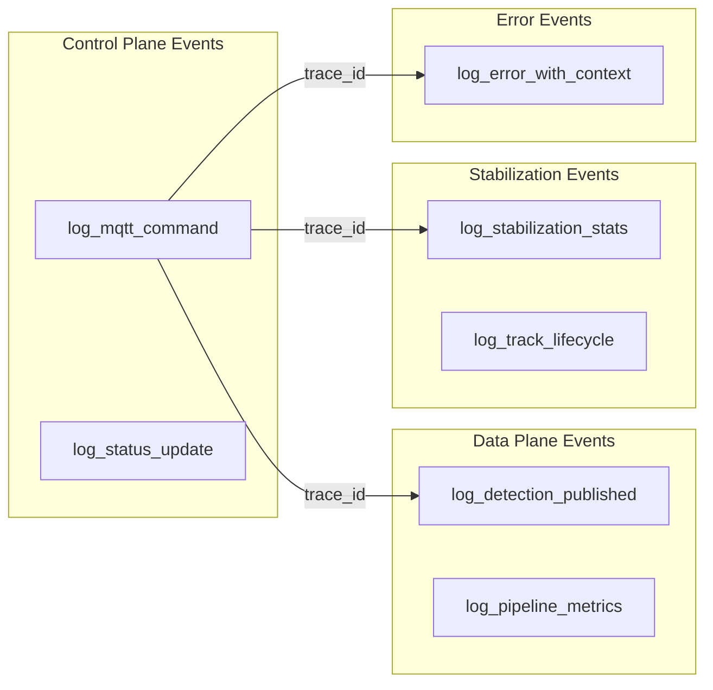
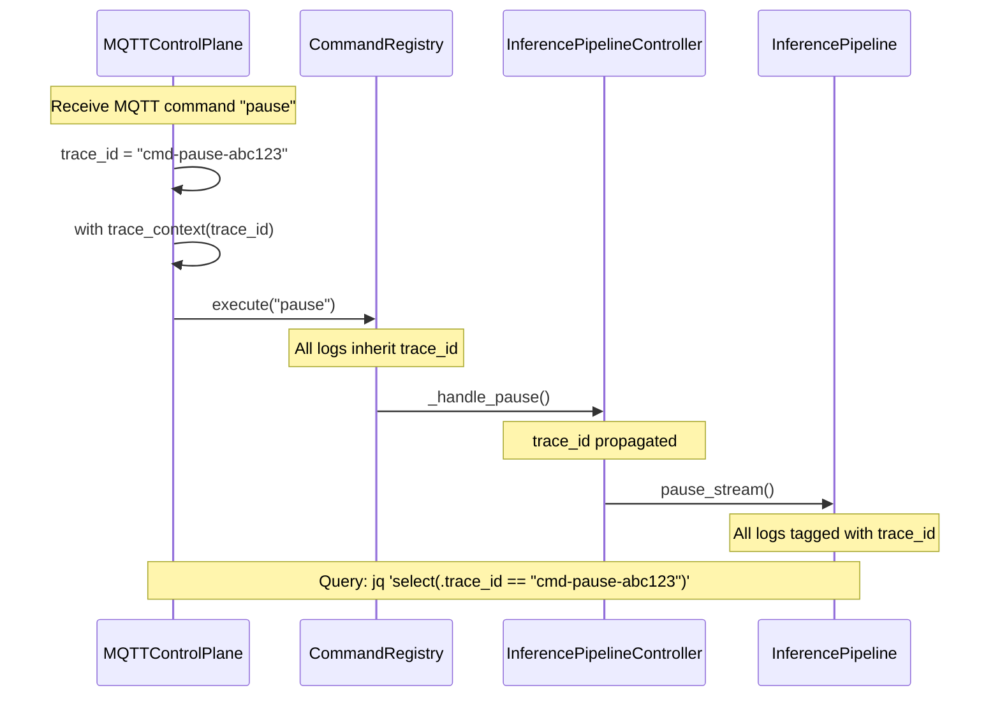

# Logging & Observability

Relevant source files

- [adeline/logging.py](https://github.com/acare7/kata-inference-251021-clean4/blob/master/adeline/logging.py)
- [adeline/CLAUDE.md](https://github.com/acare7/kata-inference-251021-clean4/blob/master/adeline/CLAUDE.md)
- [config/logrotate.d/adeline](https://github.com/acare7/kata-inference-251021-clean4/blob/master/config/logrotate.d/adeline)

## Purpose and Scope

This document describes the Adeline system's structured logging architecture, designed for **queryable observability in production**. The logging system uses JSON-structured events with trace context propagation to correlate MQTT commands with pipeline actions, enabling rapid debugging and performance analysis.

**Scope:**

- JSON structured logging philosophy and design
- Trace context propagation for command correlation
- Common log event patterns and helper functions
- Production query examples and troubleshooting

**For specific details about:**

- Log rotation configuration, see [Log Rotation](https://deepwiki.com/acare7/kata-inference-251021-clean4/7.4-log-rotation)
- Event pattern reference, see [Log Event Patterns](https://deepwiki.com/acare7/kata-inference-251021-clean4/7.2-log-event-patterns)
- Production query cookbook, see [Production Queries](https://deepwiki.com/acare7/kata-inference-251021-clean4/7.3-production-queries)

---

## Design Philosophy

### Queryable by Design, Not by Accident

The Adeline logging system follows the principle **"Solo JSON, queryable en producción"**. This means:

- **Structured from inception**: Logs are JSON objects with defined schemas, not arbitrary strings
- **Trace context propagation**: Every log can be correlated to its originating MQTT command
- **Domain events as vocabulary**: Log patterns reflect architectural boundaries (Control Plane, Data Plane, Stabilization)

**Rationale:**

|Traditional Logging|Structured JSON Logging|
|---|---|
|String parsing required for queries|Direct `jq` queries on structured fields|
|No correlation between command → action|`trace_id` links MQTT command to pipeline events|
|grep/sed for debugging|Semantic queries: `select(.component == "control_plane" and .level == "ERROR")`|

**Sources:** [adeline/logging.py](https://github.com/acare7/kata-inference-251021-clean4/blob/master/adeline/logging.py) [adeline/CLAUDE.md147-208](https://github.com/acare7/kata-inference-251021-clean4/blob/master/adeline/CLAUDE.md#L147-L208)

---

## Log Event Architecture

### Events Reflect Architectural Boundaries

Log events are designed to mirror the system's architectural components:



**Key Design:**

- **Helper functions** encode domain knowledge (e.g., `log_mqtt_command` always includes `component: "control_plane"`)
- **Trace context** flows through call stacks via `trace_context()` context manager
- **Consistent schema** across components enables cross-component queries

**Sources:** [adeline/logging.py53-187](https://github.com/acare7/kata-inference-251021-clean4/blob/master/adeline/logging.py#L53-L187)

---

## Trace Context Propagation

### Correlating Commands to Actions

The trace context system enables correlation between MQTT commands and resulting pipeline actions:



**API:**

```python
from adeline.logging import trace_context, get_trace_id

# Create trace context
with trace_context(f"cmd-pause-{uuid}"):
    registry.execute("pause")
    logger.info("Pipeline paused", extra={"trace_id": get_trace_id()})
```

**Sources:** [adeline/logging.py24-51](https://github.com/acare7/kata-inference-251021-clean4/blob/master/adeline/logging.py#L24-L51) [control/plane.py120-133](https://github.com/acare7/kata-inference-251021-clean4/blob/master/control/plane.py#L120-L133)

---

## Migration Status

The system has completed migration to structured logging across all production-critical paths:

|Phase|Modules|Logs Migrated|Status|
|---|---|---|---|
|**Fase 3**|control/plane, data/plane, inference/stabilization/core, app/controller|~60|✅|
|**Fase 4**|app/builder, app/sinks/registry, control/registry, inference/factories/handler_factory|21|✅|
|**Fase 5**|inference/models, inference/loader, inference/roi/adaptive/state, factories|24|✅|
|**Fase 6**|legacy_config, inference/roi/base, inference/roi/fixed, adaptive/pipeline, matching, publishers/metrics|21|✅|
|**Total**|**19 core modules**|**~126 logs**|✅ 100%|

**Sources:** [adeline/CLAUDE.md209-218](https://github.com/acare7/kata-inference-251021-clean4/blob/master/adeline/CLAUDE.md#L209-L218)

---

## Log Output Format

### JSON Schema

All logs follow a consistent JSON schema:

```json
{
  "timestamp": "2025-10-22T16:30:45.123Z",
  "level": "INFO",
  "logger": "adeline.control.plane",
  "message": "📥 Comando recibido: pause",
  "component": "control_plane",
  "command": "pause",
  "mqtt_topic": "inference/control/commands",
  "trace_id": "cmd-pause-abc123"
}
```

**Required fields:**

- `timestamp` (ISO 8601)
- `level` (DEBUG, INFO, WARNING, ERROR, CRITICAL)
- `logger` (Python logger name)
- `message` (Human-readable summary)

**Optional context fields:**

- `component` (architectural component: `control_plane`, `data_plane`, `stabilization`, etc.)
- `trace_id` (correlation ID)
- Domain-specific fields (e.g., `fps`, `latency_ms`, `track_id`)

**Sources:** [adeline/logging.py1-22](https://github.com/acare7/kata-inference-251021-clean4/blob/master/adeline/logging.py#L1-L22)

---

## Configuration

### Logging Settings

Logging is configured via `config/adeline/config.yaml`:

```yaml
logging:
  level: INFO
  json_indent: null  # null=compact (production), 2=pretty (development)
  paho_level: WARNING

  # File rotation (optional - if null, logs go to stdout)
  file: null  # e.g., "logs/adeline.log" to enable file logging
  max_bytes: 10485760  # 10 MB
  backup_count: 5  # Keep 5 backups (50 MB total)
```

**Production example:**

```yaml
logging:
  level: INFO
  json_indent: null  # Compact JSON
  file: "/var/log/adeline/adeline.log"
  max_bytes: 10485760  # 10 MB per file
  backup_count: 7  # 70 MB total retention
```

**Development example:**

```yaml
logging:
  level: DEBUG
  json_indent: 2  # Pretty-printed JSON
  file: null  # stdout only
```

**Sources:** [adeline/CLAUDE.md180-200](https://github.com/acare7/kata-inference-251021-clean4/blob/master/adeline/CLAUDE.md#L180-L200) [config/schemas.py LoggingSettings](https://github.com/acare7/kata-inference-251021-clean4/blob/master/config/schemas.py)

---

## Quick Reference

### Common Log Patterns

```python
from adeline.logging import (
    log_mqtt_command,         # Control plane commands
    log_pipeline_metrics,     # FPS, latency
    log_stabilization_stats,  # Multi-object tracking
    log_error_with_context    # Errors with full context
)

# Log MQTT command
log_mqtt_command(logger, command="pause", topic="inference/control/commands")

# Log pipeline metrics
log_pipeline_metrics(logger, fps=30.5, latency_ms=15.2)

# Log stabilization stats
log_stabilization_stats(logger, raw_count=12, stabilized_count=8, active_tracks=3)

# Log error with context
log_error_with_context(logger, "Connection failed", exception=e,
                       component="data_plane", broker_host="localhost")
```

**Sources:** [adeline/logging.py53-187](https://github.com/acare7/kata-inference-251021-clean4/blob/master/adeline/logging.py#L53-L187)

### Production Query Examples

```bash
# Trace specific command
jq 'select(.trace_id == "cmd-pause-abc123")' logs.json

# Errors by component
jq 'select(.level == "ERROR" and .component == "control_plane")' logs.json

# Average FPS
jq -s 'map(select(.metrics.fps)) | map(.metrics.fps) | add/length' logs.json

# Track lifecycle events
jq 'select(.event_type == "track_created" or .event_type == "track_lost")' logs.json
```

**For comprehensive query cookbook**, see [Production Queries](https://deepwiki.com/acare7/kata-inference-251021-clean4/7.3-production-queries).

---

## Benefits

The structured logging system provides:

1. **Queryable Production Logs** - No grep/sed, direct JSON queries with `jq`
2. **Command Traceability** - Trace MQTT commands through entire pipeline
3. **Performance Analysis** - Aggregate metrics (FPS, latency) across time windows
4. **Error Context** - Errors include full context (component, config, state)
5. **Design Vocabulary** - Log events reflect architectural boundaries

**Design Principle:** Logs are **first-class observability events**, not debug strings. The schema design is deliberate (complexity by design), enabling powerful runtime queries without ad-hoc parsing.

**Sources:** [adeline/CLAUDE.md147-218](https://github.com/acare7/kata-inference-251021-clean4/blob/master/adeline/CLAUDE.md#L147-L218)
