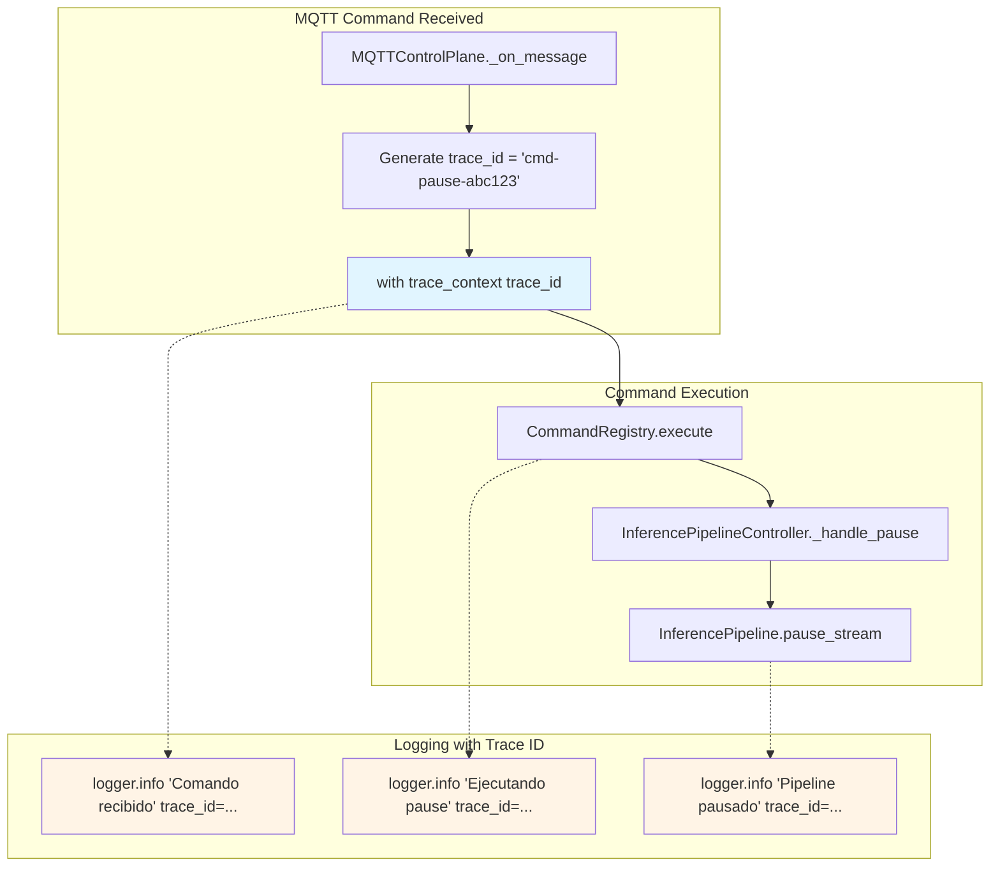
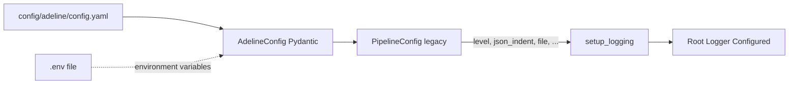

# Structured Logging Design

Relevant source files

- [adeline/logging.py](https://github.com/acare7/kata-inference-251021-clean4/blob/master/adeline/logging.py)
- [config/schemas.py](https://github.com/acare7/kata-inference-251021-clean4/blob/master/config/schemas.py)

## Purpose and Scope

This document describes the design principles and implementation details of Adeline's structured logging system. It covers the JSON schema design, trace context propagation mechanisms, and the philosophical approach to logging as first-class observability events.

**Scope:**

- JSON schema design and field conventions
- Trace context implementation and propagation
- Logger setup and configuration
- Integration with Python's standard logging framework

**For related topics:**

- Common log event patterns, see [Log Event Patterns](https://deepwiki.com/acare7/kata-inference-251021-clean4/7.2-log-event-patterns)
- Production query examples, see [Production Queries](https://deepwiki.com/acare7/kata-inference-251021-clean4/7.3-production-queries)

---

## Design Philosophy

### Logs as First-Class Events

The Adeline logging system treats logs as **first-class observability events** rather than debug strings:

|Principle|Implementation|Benefit|
|---|---|---|
|**Structured at Design Time**|JSON schema enforced by helper functions|Queryable without parsing|
|**Domain Events as Vocabulary**|Event types reflect architectural boundaries|Log patterns mirror system design|
|**Trace Context Propagation**|`trace_id` flows through call stacks|End-to-end request correlation|
|**Fail Fast for Observability**|Invalid log structures caught during development|Production logs guaranteed valid|

**Rationale:**

Traditional logging treats logs as afterthoughts - strings appended to files for future debugging. Structured logging inverts this: logs are **designed events** that enable runtime queries, performance analysis, and distributed tracing.

**Sources:** [adeline/CLAUDE.md147-153](https://github.com/acare7/kata-inference-251021-clean4/blob/master/adeline/CLAUDE.md#L147-L153)

---

## JSON Schema Design

### Core Log Structure

Every log entry follows a consistent JSON schema:

```json
{
  "timestamp": "2025-10-22T16:30:45.123456Z",
  "level": "INFO",
  "logger": "adeline.control.plane",
  "message": "📥 Comando recibido: pause",
  "component": "control_plane",
  "trace_id": "cmd-pause-abc123",
  "event_type": "mqtt_command_received",
  "command": "pause",
  "mqtt_topic": "inference/control/commands"
}
```

### Field Categories

**Required Base Fields:**

|Field|Type|Description|Source|
|---|---|---|---|
|`timestamp`|ISO 8601 string|UTC timestamp with microsecond precision|Python logging framework|
|`level`|String|Log level (DEBUG, INFO, WARNING, ERROR, CRITICAL)|Python logging framework|
|`logger`|String|Python logger name (e.g., `adeline.control.plane`)|Python logging framework|
|`message`|String|Human-readable summary|Application code|

**Context Fields (Optional):**

|Field|Type|Description|Usage|
|---|---|---|---|
|`component`|String|Architectural component (`control_plane`, `data_plane`, `stabilization`, etc.)|Cross-component queries|
|`trace_id`|String|Correlation ID for request tracing|End-to-end tracing|
|`event_type`|String|Semantic event type (`mqtt_command_received`, `track_created`, etc.)|Event filtering|

**Domain-Specific Fields:**

Vary by component and event type:

- **Control Plane**: `command`, `mqtt_topic`, `status`
- **Data Plane**: `detection_count`, `publish_latency_ms`
- **Stabilization**: `raw_count`, `stabilized_count`, `active_tracks`, `track_id`
- **Pipeline Metrics**: `fps`, `latency_ms`, `frame_count`

**Sources:** [adeline/logging.py1-22](https://github.com/acare7/kata-inference-251021-clean4/blob/master/adeline/logging.py#L1-L22)

---

## JSON Formatter Implementation

### Custom JSON Formatter

The `JSONFormatter` class converts Python `LogRecord` objects to JSON:

```python
class JSONFormatter(logging.Formatter):
    def __init__(self, indent: Optional[int] = None):
        super().__init__()
        self.indent = indent  # None=compact, 2=pretty

    def format(self, record: logging.LogRecord) -> str:
        log_data = {
            "timestamp": self.formatTime(record, datefmt="%Y-%m-%dT%H:%M:%S"),
            "level": record.levelname,
            "logger": record.name,
            "message": record.getMessage(),
        }

        # Add extra fields from record.__dict__
        for key, value in record.__dict__.items():
            if key not in RESERVED_ATTRS:
                log_data[key] = value

        return json.dumps(log_data, indent=self.indent, default=str)
```

**Key Design Decisions:**

1. **`indent` parameter**: Configurable pretty-printing (None for production, 2 for development)
2. **Extra fields**: Automatically includes fields from `extra={}` parameter
3. **`default=str`**: Handles non-serializable objects (e.g., exceptions) gracefully
4. **Reserved attributes**: Filters out Python logging internals (`args`, `exc_info`, `funcName`, etc.)

**Sources:** [adeline/logging.py1-22](https://github.com/acare7/kata-inference-251021-clean4/blob/master/adeline/logging.py#L1-L22)

---

## Trace Context System

### Design Overview

Trace context enables correlation between MQTT commands and their downstream effects:



### Implementation

**Thread-Local Storage:**

```python
import threading
from contextvars import ContextVar

_trace_context: ContextVar[Optional[str]] = ContextVar('trace_context', default=None)

def get_trace_id() -> Optional[str]:
    """Get current trace ID from context"""
    return _trace_context.get()
```

**Context Manager:**

```python
from contextlib import contextmanager

@contextmanager
def trace_context(trace_id: str):
    """Set trace context for current execution scope"""
    token = _trace_context.set(trace_id)
    try:
        yield trace_id
    finally:
        _trace_context.reset(token)
```

**Usage Pattern:**

```python
# In MQTTControlPlane._on_message()
trace_id = f"cmd-{command}-{uuid.uuid4().hex[:8]}"
with trace_context(trace_id):
    self.command_registry.execute(command)
    # All logs within this scope inherit trace_id
```

**Key Design Decisions:**

1. **`ContextVar` over `threading.local()`**: Supports async/await contexts (future-proof)
2. **Context manager pattern**: Automatic cleanup via `finally` block
3. **UUID generation**: Unique trace IDs prevent collisions
4. **Automatic propagation**: Helper functions inject `trace_id` from context

**Sources:** [adeline/logging.py24-51](https://github.com/acare7/kata-inference-251021-clean4/blob/master/adeline/logging.py#L24-L51) [control/plane.py117-123](https://github.com/acare7/kata-inference-251021-clean4/blob/master/control/plane.py#L117-L123)

---

## Logger Setup

### Setup Function

The `setup_logging()` function initializes the logging system:

```python
def setup_logging(
    level: str = "INFO",
    indent: Optional[int] = None,
    log_file: Optional[str] = None,
    max_bytes: int = 10 * 1024 * 1024,  # 10 MB
    backup_count: int = 5,
    paho_level: str = "WARNING"
) -> None:
    """
    Configure structured JSON logging.

    Args:
        level: Root logger level (DEBUG, INFO, WARNING, ERROR, CRITICAL)
        indent: JSON indent (None=compact, 2=pretty)
        log_file: Optional file path for rotating file handler
        max_bytes: Max file size before rotation (default 10 MB)
        backup_count: Number of backup files to keep (default 5)
        paho_level: Log level for paho.mqtt library (default WARNING)
    """
```

**Handler Configuration:**

```python
# Always configure stdout handler
formatter = JSONFormatter(indent=indent)
handler = logging.StreamHandler(sys.stdout)
handler.setFormatter(formatter)
root_logger.addHandler(handler)

# Optional file handler with rotation
if log_file:
    file_handler = RotatingFileHandler(
        log_file,
        maxBytes=max_bytes,
        backupCount=backup_count
    )
    file_handler.setFormatter(formatter)
    root_logger.addHandler(file_handler)
```

**MQTT Library Suppression:**

```python
# Suppress verbose paho-mqtt logs
logging.getLogger("paho.mqtt").setLevel(getattr(logging, paho_level.upper()))
```

**Sources:** [adeline/logging.py1-22](https://github.com/acare7/kata-inference-251021-clean4/blob/master/adeline/logging.py#L1-L22)

---

## Configuration Integration

### Configuration Schema

Logging settings are defined in `config/schemas.py`:

```python
class LoggingSettings(BaseModel):
    level: str = "INFO"
    json_indent: Optional[int] = None
    paho_level: str = "WARNING"
    file: Optional[str] = None
    max_bytes: int = 10 * 1024 * 1024  # 10 MB
    backup_count: int = 5
```

### Configuration Flow



**Invocation in `__main__.py`:**

```python
from adeline.logging import setup_logging

# Load configuration
config = AdelineConfig.from_yaml("config/adeline/config.yaml")

# Setup logging before any other imports
setup_logging(
    level=config.logging.level,
    indent=config.logging.json_indent,
    log_file=config.logging.file,
    max_bytes=config.logging.max_bytes,
    backup_count=config.logging.backup_count,
    paho_level=config.logging.paho_level
)
```

**Sources:** [config/schemas.py](https://github.com/acare7/kata-inference-251021-clean4/blob/master/config/schemas.py) [adeline/__main__.py](https://github.com/acare7/kata-inference-251021-clean4/blob/master/adeline/__main__.py)

---

## Development vs Production Configuration

### Development Configuration

**Optimized for readability:**

```yaml
logging:
  level: DEBUG
  json_indent: 2  # Pretty-printed JSON
  paho_level: WARNING
  file: null  # stdout only
```

**Output example:**

```json
{
  "timestamp": "2025-10-22T16:30:45.123456",
  "level": "DEBUG",
  "logger": "adeline.control.plane",
  "message": "📦 Payload: {\"command\": \"pause\"}",
  "component": "control_plane"
}
```

### Production Configuration

**Optimized for performance and storage:**

```yaml
logging:
  level: INFO
  json_indent: null  # Compact JSON (no whitespace)
  paho_level: WARNING
  file: "/var/log/adeline/adeline.log"
  max_bytes: 10485760  # 10 MB
  backup_count: 7  # 70 MB total retention
```

**Output example (single line):**

```json
{"timestamp":"2025-10-22T16:30:45.123456","level":"INFO","logger":"adeline.control.plane","message":"📥 Comando recibido: pause","component":"control_plane","command":"pause","trace_id":"cmd-pause-abc123"}
```

**Comparison:**

|Aspect|Development|Production|
|---|---|---|
|**Readability**|High (indented JSON)|Low (compact)|
|**Storage Efficiency**|Low (2x size)|High|
|**Log Destination**|stdout|Rotating file|
|**Verbosity**|DEBUG|INFO/WARNING|

**Sources:** [adeline/CLAUDE.md180-200](https://github.com/acare7/kata-inference-251021-clean4/blob/master/adeline/CLAUDE.md#L180-L200)

---

## Best Practices

### 1. Always Use Helper Functions

**❌ Avoid:**

```python
logger.info("MQTT command received", extra={
    "component": "control_plane",
    "command": command,
    "mqtt_topic": topic
})
```

**✅ Prefer:**

```python
from adeline.logging import log_mqtt_command
log_mqtt_command(logger, command=command, topic=topic)
```

**Rationale:** Helper functions encode domain knowledge and ensure consistent schemas.

---

### 2. Propagate Trace Context

**❌ Avoid:**

```python
def execute(self, command: str):
    logger.info(f"Executing {command}")  # No trace_id
```

**✅ Prefer:**

```python
def execute(self, command: str):
    trace_id = get_trace_id()
    logger.info(f"Executing {command}", extra={"trace_id": trace_id})
```

**Rationale:** Enables end-to-end request tracing.

---

### 3. Include Architectural Context

**❌ Avoid:**

```python
logger.error("Connection failed")
```

**✅ Prefer:**

```python
from adeline.logging import log_error_with_context
log_error_with_context(
    logger,
    "Connection failed",
    exception=e,
    component="data_plane",
    broker_host=self.broker_host,
    broker_port=self.broker_port
)
```

**Rationale:** Errors with context enable rapid troubleshooting.

---

### 4. Use Semantic Event Types

**❌ Avoid:**

```python
logger.info("Track created", extra={"track_id": 123})
```

**✅ Prefer:**

```python
logger.info("Track created", extra={
    "event_type": "track_created",
    "track_id": 123,
    "component": "stabilization"
})
```

**Rationale:** `event_type` enables semantic filtering (e.g., all track lifecycle events).

**Sources:** [adeline/logging.py53-187](https://github.com/acare7/kata-inference-251021-clean4/blob/master/adeline/logging.py#L53-L187)

---

## Summary

The structured logging design follows these principles:

1. **Logs as Events** - First-class observability events with defined schemas
2. **Trace Context** - End-to-end correlation via `trace_id`
3. **Domain Vocabulary** - Event types reflect architectural boundaries
4. **Helper Functions** - Encode logging patterns and domain knowledge
5. **Configuration-Driven** - Development vs production modes

**Design Philosophy:** Complexity by design - structured logging enables complex queries without ad-hoc parsing. The upfront design investment (JSON schemas, trace context, helper functions) pays off in production observability.

**Sources:** [adeline/logging.py](https://github.com/acare7/kata-inference-251021-clean4/blob/master/adeline/logging.py) [adeline/CLAUDE.md147-218](https://github.com/acare7/kata-inference-251021-clean4/blob/master/adeline/CLAUDE.md#L147-L218)
