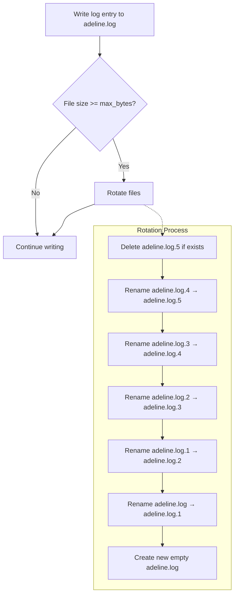
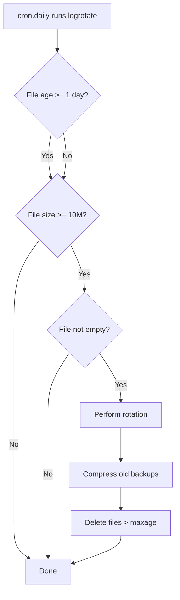

# Log Rotation

Relevant source files

- [adeline/logging.py](https://github.com/acare7/kata-inference-251021-clean4/blob/master/adeline/logging.py)
- [config/logrotate.d/adeline](https://github.com/acare7/kata-inference-251021-clean4/blob/master/config/logrotate.d/adeline)
- [config/schemas.py](https://github.com/acare7/kata-inference-251021-clean4/blob/master/config/schemas.py)

## Purpose and Scope

This document describes the log rotation strategies available in Adeline for managing log file growth in production environments. The system supports both application-level rotation (Python `RotatingFileHandler`) and OS-level rotation (Linux `logrotate`).

**Scope:**

- Built-in Python rotation configuration
- Linux `logrotate` configuration and installation
- Comparison of rotation strategies
- Production best practices

**For related topics:**

- Log configuration, see [Structured Logging Design](https://deepwiki.com/acare7/kata-inference-251021-clean4/7.1-structured-logging-design)
- Log event schemas, see [Log Event Patterns](https://deepwiki.com/acare7/kata-inference-251021-clean4/7.2-log-event-patterns)

---

## Rotation Strategies

Adeline supports two complementary rotation strategies:

|Strategy|Implementation|Best For|Control Level|
|---|---|---|---|
|**Application-Level**|Python `RotatingFileHandler`|Simple deployments, containerized environments|Application config|
|**OS-Level**|Linux `logrotate`|Multi-app servers, centralized log management|System admin|

**Recommendation:** Use **application-level rotation** for simplicity, add **OS-level rotation** for production environments with centralized log management.

---

## Application-Level Rotation (RotatingFileHandler)

### Configuration

Rotation is configured via `config/adeline/config.yaml`:

```yaml
logging:
  level: INFO
  json_indent: null  # Compact JSON for production
  paho_level: WARNING

  # File rotation settings
  file: "/var/log/adeline/adeline.log"  # null = stdout only
  max_bytes: 10485760  # 10 MB
  backup_count: 5  # Keep 5 backups (50 MB total)
```

**Pydantic Schema:**

```python
class LoggingSettings(BaseModel):
    level: str = "INFO"
    json_indent: Optional[int] = None
    paho_level: str = "WARNING"
    file: Optional[str] = None
    max_bytes: int = 10 * 1024 * 1024  # 10 MB
    backup_count: int = 5
```

**Sources:** [config/schemas.py](https://github.com/acare7/kata-inference-251021-clean4/blob/master/config/schemas.py)

---

### Rotation Behavior

When `file` is specified, the logging system uses Python's `RotatingFileHandler`:

```python
from logging.handlers import RotatingFileHandler

handler = RotatingFileHandler(
    filename=str(log_path),
    maxBytes=max_bytes,
    backupCount=backup_count,
    encoding='utf-8'
)
```

**Rotation Flow:**



**File Structure Example:**

```
/var/log/adeline/
├── adeline.log          # Current log (0-10 MB)
├── adeline.log.1        # Previous rotation (10 MB)
├── adeline.log.2        # (10 MB)
├── adeline.log.3        # (10 MB)
├── adeline.log.4        # (10 MB)
└── adeline.log.5        # Oldest backup (10 MB) - deleted on next rotation
```

**Total Retention:** `max_bytes * (backup_count + 1)` = 10 MB × 6 = **60 MB**

**Sources:** [adeline/logging.py109-211](https://github.com/acare7/kata-inference-251021-clean4/blob/master/adeline/logging.py#L109-L211)

---

### Configuration Examples

**Development (Stdout Only):**

```yaml
logging:
  level: DEBUG
  json_indent: 2  # Pretty-printed
  file: null  # No file logging
```

**Production (Small Retention):**

```yaml
logging:
  level: INFO
  json_indent: null  # Compact
  file: "/var/log/adeline/adeline.log"
  max_bytes: 5242880  # 5 MB
  backup_count: 3  # Total: 20 MB
```

**Production (Large Retention):**

```yaml
logging:
  level: INFO
  json_indent: null  # Compact
  file: "/var/log/adeline/adeline.log"
  max_bytes: 10485760  # 10 MB
  backup_count: 9  # Total: 100 MB
```

**High-Volume Production:**

```yaml
logging:
  level: WARNING  # Reduce log volume
  json_indent: null
  file: "/var/log/adeline/adeline.log"
  max_bytes: 20971520  # 20 MB
  backup_count: 14  # Total: 300 MB
```

---

## OS-Level Rotation (logrotate)

### Configuration File

Adeline provides a `logrotate` configuration at `config/logrotate.d/adeline`:

```bash
# /etc/logrotate.d/adeline
/var/log/adeline/adeline.log {
    # Rotation strategy
    daily               # Rotate daily
    rotate 7            # Keep 7 backups (7 days)
    size 10M            # Rotate if file exceeds 10 MB (even if not daily)
    maxage 30           # Delete files older than 30 days

    # Compression
    compress            # Compress rotated files with gzip
    delaycompress       # Don't compress most recent backup (debugging)
    compresscmd /bin/gzip
    compressext .gz

    # File permissions
    missingok           # No error if file doesn't exist
    notifempty          # Don't rotate if file is empty
    create 0640 adeline adeline  # Create new file with permissions 640

    # Optional: Postrotate hook
    # postrotate
    #     killall -USR1 python  # Signal Adeline to reopen log file
    # endscript
}
```

**Sources:** [config/logrotate.d/adeline](https://github.com/acare7/kata-inference-251021-clean4/blob/master/config/logrotate.d/adeline)

---

### Installation

**Step 1: Copy configuration to system**

```bash
sudo cp config/logrotate.d/adeline /etc/logrotate.d/adeline
sudo chmod 644 /etc/logrotate.d/adeline
```

**Step 2: Create log directory**

```bash
sudo mkdir -p /var/log/adeline
sudo chown adeline:adeline /var/log/adeline
sudo chmod 755 /var/log/adeline
```

**Step 3: Test configuration (dry run)**

```bash
sudo logrotate -d /etc/logrotate.d/adeline
```

**Expected output:**

```
reading config file /etc/logrotate.d/adeline
Allocating hash table for state file, size 15360 B

Handling 1 logs

rotating pattern: /var/log/adeline/adeline.log  after 1 days (7 rotations)
empty log files are not rotated, old logs are removed
considering log /var/log/adeline/adeline.log
  log does not need rotating (log has been rotated at 2025-10-22 10:0, that is not day ago yet)
```

**Step 4: Force rotation (test)**

```bash
sudo logrotate -f /etc/logrotate.d/adeline
```

**Step 5: Verify automatic execution**

```bash
# logrotate runs daily via cron
ls -l /etc/cron.daily/logrotate

# View last logrotate run
sudo cat /var/lib/logrotate/status | grep adeline
```

---

### Rotation Behavior (logrotate)

**Daily rotation with size threshold:**



**File Structure Example:**

```
/var/log/adeline/
├── adeline.log                # Current log (0-10 MB)
├── adeline.log.1              # Yesterday's log (uncompressed - delaycompress)
├── adeline.log.2.gz           # 2 days ago (compressed)
├── adeline.log.3.gz           # 3 days ago
├── adeline.log.4.gz           # 4 days ago
├── adeline.log.5.gz           # 5 days ago
├── adeline.log.6.gz           # 6 days ago
└── adeline.log.7.gz           # 7 days ago (deleted on next rotation)
```

**Naming with Dateformat:**

If `dateext` is enabled:

```
/var/log/adeline/
├── adeline.log                     # Current
├── adeline.log-2025-10-22          # Today's rotation
├── adeline.log-2025-10-21.gz       # Yesterday
├── adeline.log-2025-10-20.gz       # 2 days ago
└── ...
```

---

### Configuration Options Reference

|Option|Values|Description|
|---|---|---|
|**Frequency**|||
|`daily`|-|Rotate once per day|
|`weekly`|-|Rotate once per week|
|`monthly`|-|Rotate once per month|
|`size 10M`|Size (K, M, G)|Rotate when file exceeds size (overrides frequency)|
|**Retention**|||
|`rotate 7`|Count|Keep N rotated files|
|`maxage 30`|Days|Delete files older than N days|
|**Compression**|||
|`compress`|-|Compress rotated files|
|`delaycompress`|-|Don't compress most recent backup|
|`compresscmd /bin/gzip`|Command|Compression command to use|
|`compressext .gz`|Extension|File extension for compressed files|
|**File Handling**|||
|`missingok`|-|Don't error if file doesn't exist|
|`notifempty`|-|Don't rotate empty files|
|`create 0640 user group`|Mode, owner, group|Permissions for new log file|
|**Naming**|||
|`dateext`|-|Use date instead of numbers (.log-2025-10-22)|
|`dateformat -%Y-%m-%d`|strftime format|Date format for filenames|
|**Hooks**|||
|`postrotate` / `endscript`|-|Commands to run after rotation|
|`sharedscripts`|-|Run postrotate once for all files (not per file)|

**Sources:** [config/logrotate.d/adeline](https://github.com/acare7/kata-inference-251021-clean4/blob/master/config/logrotate.d/adeline)

---

## Comparison: Application vs OS Rotation

|Aspect|Application (RotatingFileHandler)|OS (logrotate)|
|---|---|---|
|**Setup Complexity**|Low (config.yaml)|Medium (sudo + system files)|
|**Configuration Location**|Application config|System-wide config|
|**Compression**|Not supported|gzip/bzip2/xz supported|
|**Date-based Naming**|Not supported|Supported (`dateext`)|
|**Postrotate Hooks**|Not supported|Supported (service reload, signals)|
|**Multi-App Management**|Per-application|Centralized for all apps|
|**Container-Friendly**|Yes|No (requires system access)|
|**Fine-Grained Control**|Size-based only|Size + time-based|

**Recommendations:**

- **Development:** Application rotation (simpler, no sudo required)
- **Containerized Production:** Application rotation (portable, no system dependencies)
- **Traditional Servers:** OS rotation (centralized management, compression, advanced features)
- **Hybrid:** Use both (application for fail-safe, OS for compression + cleanup)

---

## Production Best Practices

### 1. Size Retention Planning

**Calculate retention based on log volume:**

```
Average log rate: 100 KB/minute
Daily volume: 100 KB × 60 × 24 = 144 MB/day
Retention goal: 7 days
Required storage: 144 MB × 7 = 1 GB

With compression (gzip ~10:1):
Compressed retention: 1 GB / 10 = 100 MB
```

**Configuration:**

```yaml
# Application rotation
logging:
  max_bytes: 20971520  # 20 MB per file
  backup_count: 49  # Total: 1 GB uncompressed

# OS rotation (with compression)
# logrotate config:
#   size 20M
#   rotate 5
#   compress
# Total: ~100 MB compressed (1 GB uncompressed)
```

---

### 2. Directory Permissions

```bash
# Create dedicated log directory
sudo mkdir -p /var/log/adeline
sudo chown adeline:adeline /var/log/adeline
sudo chmod 755 /var/log/adeline

# Verify permissions
ls -ld /var/log/adeline
# Expected: drwxr-xr-x adeline adeline
```

**Log file permissions (via logrotate):**

```
create 0640 adeline adeline
```

- Owner (adeline): Read + Write
- Group (adeline): Read only
- Others: No access

---

### 3. Monitoring Rotation Health

**Check rotation is working:**

```bash
# List rotated files
ls -lh /var/log/adeline/

# Check file sizes
du -h /var/log/adeline/*

# Verify logrotate status
sudo cat /var/lib/logrotate/status | grep adeline
```

**Alert on rotation failures:**

```bash
# Add to cron (daily)
#!/bin/bash
LOG_SIZE=$(stat -c%s /var/log/adeline/adeline.log)
MAX_SIZE=$((50 * 1024 * 1024))  # 50 MB

if [ "$LOG_SIZE" -gt "$MAX_SIZE" ]; then
    echo "WARNING: adeline.log exceeds 50 MB - rotation may have failed"
    # Send alert (email, Slack, PagerDuty, etc.)
fi
```

---

### 4. Compression Trade-offs

**Pros:**

- 10x-20x size reduction (JSON compresses well)
- Long-term retention feasible
- Lower storage costs

**Cons:**

- Cannot `tail -f` compressed files (need `zless`, `zcat`)
- CPU overhead during rotation
- Slight delay accessing historical logs

**Recommendation:** Use `delaycompress` to keep most recent backup uncompressed for debugging.

---

### 5. Postrotate Hooks

**When to use:**

- Application doesn't handle log file recreation (needs signal to reopen)
- Need to sync logs to remote storage
- Run cleanup/archival scripts

**Example: Signal application to reopen log file**

```bash
postrotate
    # Send SIGUSR1 to Adeline (requires handling in Python)
    killall -USR1 python
endscript
```

**Example: Archive to S3**

```bash
postrotate
    # Upload compressed logs to S3
    aws s3 cp /var/log/adeline/adeline.log.1.gz \
        s3://my-bucket/logs/adeline/$(date +%Y-%m-%d).log.gz
    # Remove local copy after upload
    rm /var/log/adeline/adeline.log.1.gz
endscript
```

---

## Troubleshooting

### Application Rotation Not Working

**Symptom:** Log file grows beyond `max_bytes`, no rotation happens.

**Causes:**

1. **File path not writable**

```bash
# Fix permissions
sudo chown adeline:adeline /var/log/adeline
sudo chmod 755 /var/log/adeline
```

2. **Configuration not loaded**

```bash
# Verify config
python -c "from config.schemas import AdelineConfig; c = AdelineConfig.from_yaml('config/adeline/config.yaml'); print(c.logging.file, c.logging.max_bytes)"
```

3. **Multiple processes writing to same file**

```bash
# Use separate files per process
logging:
  file: "/var/log/adeline/adeline-{PID}.log"
```

---

### OS Rotation Not Working

**Symptom:** `logrotate` doesn't rotate files.

**Debug:**

```bash
# Dry run with verbose output
sudo logrotate -d -v /etc/logrotate.d/adeline

# Check state file
sudo cat /var/lib/logrotate/status | grep adeline

# Force rotation (ignores time constraints)
sudo logrotate -f /etc/logrotate.d/adeline
```

**Common issues:**

1. **File doesn't match pattern**

```bash
# Verify file path
ls -l /var/log/adeline/adeline.log

# Check pattern in config
grep "^/" /etc/logrotate.d/adeline
```

2. **Permissions**

```bash
# logrotate must run as root (via cron)
sudo logrotate -d /etc/logrotate.d/adeline
```

3. **Cron not running**

```bash
# Verify cron service
sudo systemctl status cron

# Manual run
sudo /etc/cron.daily/logrotate
```

---

## Summary

Log rotation in Adeline provides:

1. **Dual Strategies** - Application-level (simple) + OS-level (advanced)
2. **Flexible Configuration** - Size-based, time-based, or hybrid
3. **Production-Ready** - Compression, retention policies, postrotate hooks
4. **Container-Friendly** - Application rotation works without system access
5. **Queryable Archives** - Compressed logs retain JSON structure

**Design Philosophy:** Rotation by design - prevent disk exhaustion while maintaining queryable log history.

**Sources:** [adeline/logging.py109-211](https://github.com/acare7/kata-inference-251021-clean4/blob/master/adeline/logging.py#L109-L211) [config/logrotate.d/adeline](https://github.com/acare7/kata-inference-251021-clean4/blob/master/config/logrotate.d/adeline) [adeline/CLAUDE.md180-200](https://github.com/acare7/kata-inference-251021-clean4/blob/master/adeline/CLAUDE.md#L180-L200)
