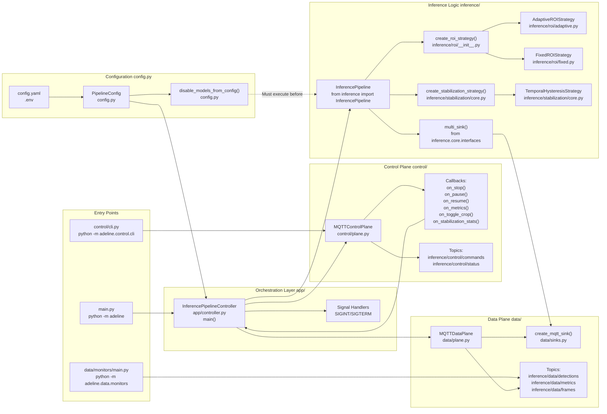
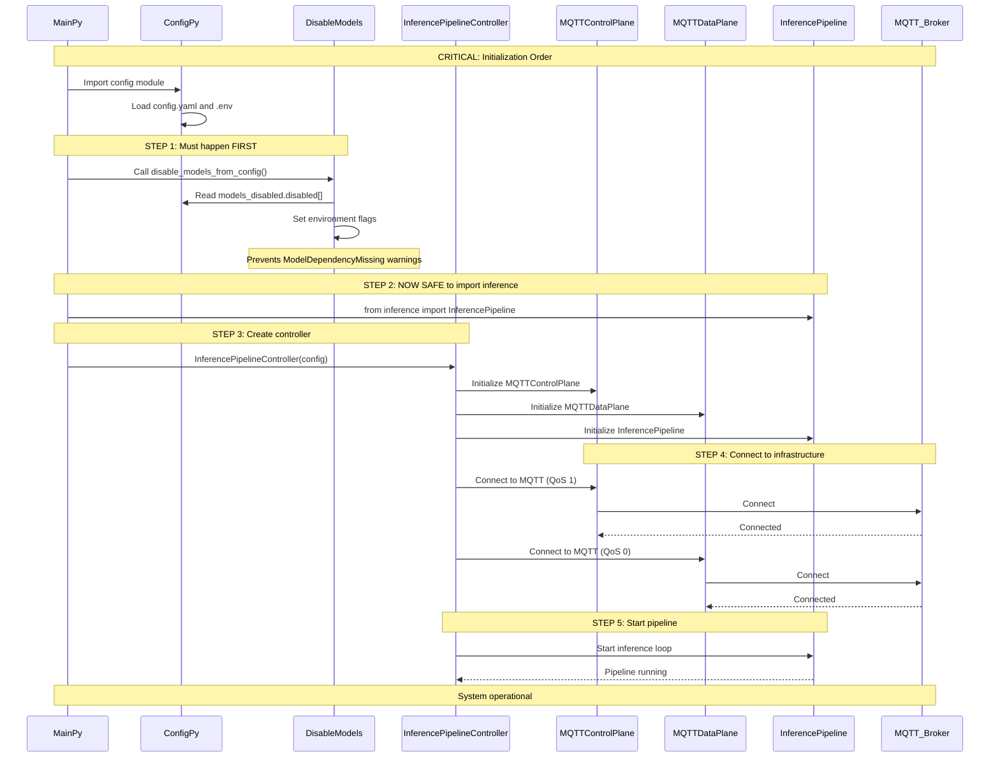
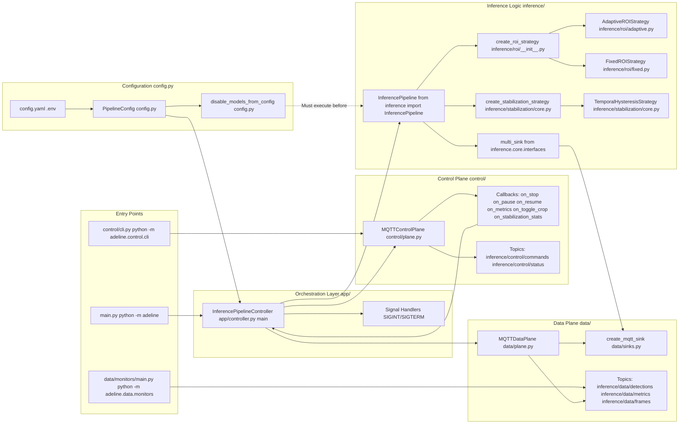

# Overview

Relevant source files

- [README.md](https://github.com/care-foundation/kata-inference-251021-clean2/blob/9a713ffb/README.md)
- [adeline/CLAUDE.md](https://github.com/care-foundation/kata-inference-251021-clean2/blob/9a713ffb/adeline/CLAUDE.md)
- [adeline/README.md](https://github.com/care-foundation/kata-inference-251021-clean2/blob/9a713ffb/adeline/README.md)

## Purpose and Scope

This document provides a high-level introduction to the **KataInference** project and its primary module, **Adeline**, a real-time object detection inference system built on YOLO models with MQTT-based remote control and data streaming capabilities.

This page covers:

- **System purpose** and key capabilities
- **High-level architecture** with actual code entities
- **Core components** and their interactions
- **Design philosophy** and patterns
- **Entry points** for running the system

For detailed setup and first-run instructions, see [Getting Started](https://deepwiki.com/care-foundation/kata-inference-251021-clean2/2-getting-started). For architectural deep-dives, see [System Architecture](https://deepwiki.com/care-foundation/kata-inference-251021-clean2/3-system-architecture). For configuration details, see [Configuration Reference](https://deepwiki.com/care-foundation/kata-inference-251021-clean2/6-configuration-reference). For operational procedures, see [Operations Guide](https://deepwiki.com/care-foundation/kata-inference-251021-clean2/7-operations-guide).

---

## System Purpose

**KataInference** is a multi-module computer vision inference project. The **Adeline** module implements a production-ready, MQTT-controlled object detection pipeline with the following capabilities:

|Capability|Description|
|---|---|
|**Real-time Object Detection**|YOLO-based inference on RTSP video streams|
|**Remote Control**|MQTT-based command interface (pause, resume, stop, metrics)|
|**Adaptive Processing**|Dynamic Region of Interest (ROI) cropping for performance optimization|
|**Detection Stabilization**|Temporal filtering with hysteresis to reduce flickering|
|**Distributed Architecture**|Separate control plane (reliable) and data plane (high-throughput)|
|**Configuration-Driven**|Runtime behavior controlled by YAML and environment variables|
|**Multi-Model Support**|Local ONNX models or Roboflow cloud inference API|

The system is designed for deployment scenarios requiring **remote management**, **high performance**, and **flexible configuration** without code changes.

**Sources:** [README.md1-7](https://github.com/care-foundation/kata-inference-251021-clean2/blob/9a713ffb/README.md#L1-L7) [adeline/CLAUDE.md23](https://github.com/care-foundation/kata-inference-251021-clean2/blob/9a713ffb/adeline/CLAUDE.md#L23-L23) [adeline/README.md1-19](https://github.com/care-foundation/kata-inference-251021-clean2/blob/9a713ffb/adeline/README.md#L1-L19)

---

## Key Features

### Control and Data Plane Separation

The system implements a **dual-plane architecture** for MQTT communication:

- **Control Plane (`MQTTControlPlane`)**: QoS 1 (at-least-once delivery) for reliable command processing
- **Data Plane (`MQTTDataPlane`)**: QoS 0 (best-effort delivery) for high-throughput detection results

This separation ensures control commands (pause, stop) are never blocked by data traffic, and detection streams never wait for acknowledgments. See [Control and Data Plane Separation](https://deepwiki.com/care-foundation/kata-inference-251021-clean2/3.1-control-and-data-plane-separation) for architectural details.

### Configuration-Driven Behavior

Runtime behavior is controlled by configuration files rather than code:

- **`config.yaml`**: Pipeline settings, ROI strategy, stabilization mode, model selection
- **`.env`**: Sensitive credentials (API keys, MQTT passwords)
- **Factory patterns**: Strategies are instantiated at runtime based on configuration

This enables deployment flexibility: the same codebase can run in different modes (adaptive vs. fixed ROI, local vs. cloud models) by changing configuration. See [Configuration-Driven Architecture](https://deepwiki.com/care-foundation/kata-inference-251021-clean2/4.1-configuration-driven-architecture).

### Inference Processing Features

|Feature|Implementation|Configuration|
|---|---|---|
|**ROI Strategies**|`create_roi_strategy()` factory|`roi_strategy.mode`: `none`, `adaptive`, `fixed`|
|**Detection Stabilization**|`create_stabilization_strategy()` factory|`stabilization.mode`: `none`, `temporal`|
|**Model Management**|`disable_models_from_config()`|`models_disabled.disabled[]` array|
|**Multi-Sink Output**|`multi_sink()` composition|Visualization + MQTT + ROI updates|

**Sources:** [adeline/CLAUDE.md56-74](https://github.com/care-foundation/kata-inference-251021-clean2/blob/9a713ffb/adeline/CLAUDE.md#L56-L74) [adeline/README.md10-19](https://github.com/care-foundation/kata-inference-251021-clean2/blob/9a713ffb/adeline/README.md#L10-L19)

---

## System Components and Code Entities

The following diagram maps the **system architecture to actual code entities** (classes, functions, modules) that implement each component:

### Diagram: Code Entity Architecture


---
---





**Sources:** [adeline/CLAUDE.md76-93](https://github.com/care-foundation/kata-inference-251021-clean2/blob/9a713ffb/adeline/CLAUDE.md#L76-L93) [adeline/__main__.py](https://github.com/care-foundation/kata-inference-251021-clean2/blob/9a713ffb/adeline/__main__.py) [adeline/app/controller.py](https://github.com/care-foundation/kata-inference-251021-clean2/blob/9a713ffb/adeline/app/controller.py) [adeline/control/plane.py](https://github.com/care-foundation/kata-inference-251021-clean2/blob/9a713ffb/adeline/control/plane.py) [adeline/data/plane.py](https://github.com/care-foundation/kata-inference-251021-clean2/blob/9a713ffb/adeline/data/plane.py) [adeline/config.py](https://github.com/care-foundation/kata-inference-251021-clean2/blob/9a713ffb/adeline/config.py)

---

## Component Responsibilities

The following table maps components to their primary responsibilities and key methods:

|Component|File Path|Key Responsibilities|Critical Methods|
|---|---|---|---|
|**`InferencePipelineController`**|[adeline/app/controller.py](https://github.com/care-foundation/kata-inference-251021-clean2/blob/9a713ffb/adeline/app/controller.py)|Orchestrates all components, manages lifecycle, handles signals|`main()`, signal handlers|
|**`MQTTControlPlane`**|[adeline/control/plane.py](https://github.com/care-foundation/kata-inference-251021-clean2/blob/9a713ffb/adeline/control/plane.py)|Receives control commands (QoS 1), publishes status updates|`on_stop()`, `on_pause()`, `on_resume()`, `on_metrics()`, `on_toggle_crop()`|
|**`MQTTDataPlane`**|[adeline/data/plane.py](https://github.com/care-foundation/kata-inference-251021-clean2/blob/9a713ffb/adeline/data/plane.py)|Publishes detection results (QoS 0), high-throughput data streaming|`publish_detection()`, `publish_metrics()`|
|**`InferencePipeline`**|[inference library](https://github.com/care-foundation/kata-inference-251021-clean2/blob/9a713ffb/inference%20library)|YOLO model inference, frame processing, prediction generation|`start()`, `on_prediction` callback|
|**`create_roi_strategy()`**|[adeline/inference/roi/__init__.py](https://github.com/care-foundation/kata-inference-251021-clean2/blob/9a713ffb/adeline/inference/roi/__init__.py)|Factory: instantiates ROI strategy based on config|Returns strategy instance|
|**`create_stabilization_strategy()`**|[adeline/inference/stabilization/core.py](https://github.com/care-foundation/kata-inference-251021-clean2/blob/9a713ffb/adeline/inference/stabilization/core.py)|Factory: instantiates stabilization strategy based on config|Returns strategy instance|
|**`PipelineConfig`**|[adeline/config.py](https://github.com/care-foundation/kata-inference-251021-clean2/blob/9a713ffb/adeline/config.py)|Loads and validates configuration from YAML and environment|Configuration data class|
|**`disable_models_from_config()`**|[adeline/config.py](https://github.com/care-foundation/kata-inference-251021-clean2/blob/9a713ffb/adeline/config.py)|Disables heavy models before imports to prevent warnings|Must call before importing `inference`|
|**`multi_sink()`**|[inference library](https://github.com/care-foundation/kata-inference-251021-clean2/blob/9a713ffb/inference%20library)|Composes multiple output sinks (MQTT, visualization, ROI updates)|Callback composition|

**Sources:** [adeline/CLAUDE.md27-43](https://github.com/care-foundation/kata-inference-251021-clean2/blob/9a713ffb/adeline/CLAUDE.md#L27-L43) [adeline/app/controller.py](https://github.com/care-foundation/kata-inference-251021-clean2/blob/9a713ffb/adeline/app/controller.py) [adeline/control/plane.py](https://github.com/care-foundation/kata-inference-251021-clean2/blob/9a713ffb/adeline/control/plane.py) [adeline/data/plane.py](https://github.com/care-foundation/kata-inference-251021-clean2/blob/9a713ffb/adeline/data/plane.py)

---

## System Initialization Flow

The system has a **critical initialization order** that must be followed to prevent model loading errors:

### Diagram: Initialization Sequence with Code Entities






**Explanation:** The `disable_models_from_config()` function **must execute before** importing the `inference` module. This is because the inference library attempts to load all YOLO models on import, which can cause:

- `ModelDependencyMissing` warnings for unused models
- Excessive memory consumption
- Slow startup times

By setting environment flags before import, we explicitly control which models are loaded.

**Sources:** [adeline/config.py](https://github.com/care-foundation/kata-inference-251021-clean2/blob/9a713ffb/adeline/config.py) [adeline/__main__.py](https://github.com/care-foundation/kata-inference-251021-clean2/blob/9a713ffb/adeline/__main__.py) [adeline/CLAUDE.md45-50](https://github.com/care-foundation/kata-inference-251021-clean2/blob/9a713ffb/adeline/CLAUDE.md#L45-L50)

---

## Module Organization

The codebase is organized into focused modules with clear separation of concerns:

```
adeline/                          # Main Python package
├── __init__.py                   # Public API
├── __main__.py                   # Entry point: python -m adeline
├── config.py                     # PipelineConfig, disable_models_from_config()
├── app/                          # Application orchestration
│   ├── __init__.py
│   └── controller.py             # InferencePipelineController, main()
├── control/                      # Control Plane (QoS 1)
│   ├── __init__.py
│   ├── __main__.py               # Entry point: python -m adeline.control.cli
│   ├── plane.py                  # MQTTControlPlane
│   └── cli.py                    # CLI commands (pause, resume, stop, etc.)
├── data/                         # Data Plane (QoS 0)
│   ├── __init__.py
│   ├── plane.py                  # MQTTDataPlane
│   ├── sinks.py                  # create_mqtt_sink()
│   └── monitors/                 # MQTT data monitors
│       └── __main__.py           # Entry point: python -m adeline.data.monitors
├── inference/                    # ML inference logic
│   ├── models.py                 # Model management
│   ├── roi/                      # ROI strategies
│   │   ├── __init__.py           # create_roi_strategy()
│   │   ├── adaptive.py           # AdaptiveROIStrategy
│   │   └── fixed.py              # FixedROIStrategy
│   └── stabilization/            # Detection stabilization
│       └── core.py               # create_stabilization_strategy()
└── visualization/                # OpenCV visualization sinks
    └── sinks.py                  # create_visualization_sink()
```

**Sources:** [adeline/CLAUDE.md76-93](https://github.com/care-foundation/kata-inference-251021-clean2/blob/9a713ffb/adeline/CLAUDE.md#L76-L93) [README.md36-45](https://github.com/care-foundation/kata-inference-251021-clean2/blob/9a713ffb/README.md#L36-L45)

---

## Entry Points and Commands

The system provides three primary entry points:

|Entry Point|Command|Purpose|File|
|---|---|---|---|
|**Main Pipeline**|`python -m adeline`|Start inference pipeline with automatic startup|[adeline/__main__.py](https://github.com/care-foundation/kata-inference-251021-clean2/blob/9a713ffb/adeline/__main__.py)|
|**Control CLI**|`python -m adeline.control.cli <command>`|Send control commands (pause, resume, stop, status, metrics)|[adeline/control/cli.py](https://github.com/care-foundation/kata-inference-251021-clean2/blob/9a713ffb/adeline/control/cli.py)|
|**Data Monitors**|`python -m adeline.data.monitors [data\|status]`|Monitor MQTT data or status streams|[adeline/data/monitors/__main__.py](https://github.com/care-foundation/kata-inference-251021-clean2/blob/9a713ffb/adeline/data/monitors/__main__.py)|

### Makefile Shortcuts

For convenience, the project includes a [Makefile](https://github.com/care-foundation/kata-inference-251021-clean2/blob/9a713ffb/Makefile) with common commands:

```
# Installation and infrastructure
make install           # Install dependencies with uv
make services-up       # Start MQTT broker (docker-compose)

# Pipeline control
make run              # Start pipeline (python -m adeline)
make pause            # Send pause command
make resume           # Send resume command
make stop             # Send stop command

# Monitoring
make monitor-data     # Monitor detection stream
make monitor-status   # Monitor status updates
make metrics          # Request metrics
```

**Sources:** [Makefile](https://github.com/care-foundation/kata-inference-251021-clean2/blob/9a713ffb/Makefile) [README.md56-103](https://github.com/care-foundation/kata-inference-251021-clean2/blob/9a713ffb/README.md#L56-L103) [adeline/CLAUDE.md5-19](https://github.com/care-foundation/kata-inference-251021-clean2/blob/9a713ffb/adeline/CLAUDE.md#L5-L19)

---

## Design Philosophy

The system adheres to a **"complexity by design"** philosophy:

### Core Principles

1. **Configuration-Driven Behavior**: Runtime behavior controlled by YAML/environment files, not code changes
2. **Factory Patterns**: Strategies (ROI, stabilization) instantiated at runtime based on configuration
3. **Separation of Concerns**: Control plane (reliable) vs. data plane (performant), orchestration vs. business logic
4. **Explicit Initialization**: Critical ordering (e.g., `disable_models_from_config()` before imports) made explicit
5. **Multi-Sink Composition**: Output directed to multiple destinations (MQTT, visualization, state updates) without modifying pipeline

### Key Patterns

|Pattern|Implementation|Purpose|
|---|---|---|
|**Control/Data Plane Separation**|`MQTTControlPlane` (QoS 1), `MQTTDataPlane` (QoS 0)|Reliable commands, high-throughput data|
|**Factory Pattern**|`create_roi_strategy()`, `create_stabilization_strategy()`|Runtime strategy selection from config|
|**Multi-Sink Pattern**|`multi_sink(mqtt_sink, viz_sink, roi_sink)`|Parallel output without pipeline modification|
|**Configuration Hierarchy**|`.env` (secrets), `config.yaml` (settings), `docker-compose.yml` (infrastructure)|Separation of concerns for deployment|

See [Design Principles and Patterns](https://deepwiki.com/care-foundation/kata-inference-251021-clean2/4-design-principles-and-patterns) for detailed explanations of each pattern.

**Sources:** [adeline/CLAUDE.md96-110](https://github.com/care-foundation/kata-inference-251021-clean2/blob/9a713ffb/adeline/CLAUDE.md#L96-L110) [adeline/README.md15-25](https://github.com/care-foundation/kata-inference-251021-clean2/blob/9a713ffb/adeline/README.md#L15-L25)

---

## Technology Stack

|Category|Technology|Purpose|
|---|---|---|
|**ML Inference**|`inference` (Roboflow SDK), `ultralytics` (YOLO)|Object detection models|
|**Computer Vision**|`supervision`, `opencv-python`|Detection post-processing, visualization|
|**Messaging**|`paho-mqtt`|MQTT client for control/data planes|
|**Video Streaming**|go2rtc|RTSP proxy server|
|**Configuration**|PyYAML, python-dotenv|YAML and environment file parsing|
|**Infrastructure**|Docker Compose, Mosquitto MQTT broker|Service orchestration|

**Sources:** [README.md164-171](https://github.com/care-foundation/kata-inference-251021-clean2/blob/9a713ffb/README.md#L164-L171) [pyproject.toml](https://github.com/care-foundation/kata-inference-251021-clean2/blob/9a713ffb/pyproject.toml)

---

## Next Steps

To get started with the system:

1. **Installation**: See [Installation and Dependencies](https://deepwiki.com/care-foundation/kata-inference-251021-clean2/2.1-installation-and-dependencies) for setup instructions
2. **Configuration**: See [Configuration Setup](https://deepwiki.com/care-foundation/kata-inference-251021-clean2/2.2-configuration-setup) for creating config files
3. **First Run**: See [Running Your First Pipeline](https://deepwiki.com/care-foundation/kata-inference-251021-clean2/2.3-running-your-first-pipeline) for launching the system
4. **Architecture Deep-Dive**: See [System Architecture](https://deepwiki.com/care-foundation/kata-inference-251021-clean2/3-system-architecture) for detailed component explanations
5. **Operations**: See [Operations Guide](https://deepwiki.com/care-foundation/kata-inference-251021-clean2/7-operations-guide) for monitoring, control, and troubleshooting

For understanding specific components:

- **Control Plane**: See [Control Plane](https://deepwiki.com/care-foundation/kata-inference-251021-clean2/5.3-control-plane) for command handling details
- **Data Plane**: See [Data Plane](https://deepwiki.com/care-foundation/kata-inference-251021-clean2/5.4-data-plane) for detection publishing details
- **ROI Strategies**: See [ROI Strategies](https://deepwiki.com/care-foundation/kata-inference-251021-clean2/5.5-roi-strategies) for adaptive/fixed cropping
- **Stabilization**: See [Detection Stabilization](https://deepwiki.com/care-foundation/kata-inference-251021-clean2/5.6-detection-stabilization) for temporal filtering

---

## Summary

**KataInference/Adeline** is a production-ready, MQTT-controlled YOLO inference pipeline designed for distributed deployment with remote management. The system's **control/data plane architecture**, **configuration-driven behavior**, and **factory-based strategy selection** enable flexible operation without code changes. The critical initialization sequence and explicit component orchestration ensure reliable startup and operation.

The system is implemented across focused modules (`app/`, `control/`, `data/`, `inference/`, `visualization/`) with clear responsibilities and multiple entry points for pipeline execution, remote control, and monitoring.

**Sources:** [adeline/CLAUDE.md1-143](https://github.com/care-foundation/kata-inference-251021-clean2/blob/9a713ffb/adeline/CLAUDE.md#L1-L143) [adeline/README.md1-26](https://github.com/care-foundation/kata-inference-251021-clean2/blob/9a713ffb/adeline/README.md#L1-L26) [README.md1-215](https://github.com/care-foundation/kata-inference-251021-clean2/blob/9a713ffb/README.md#L1-L215)