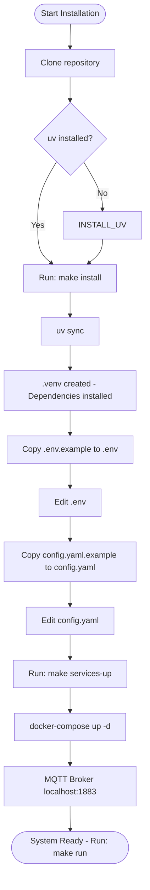
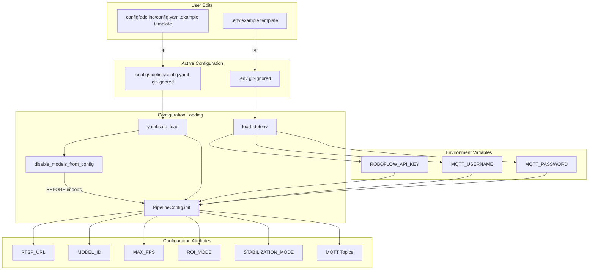
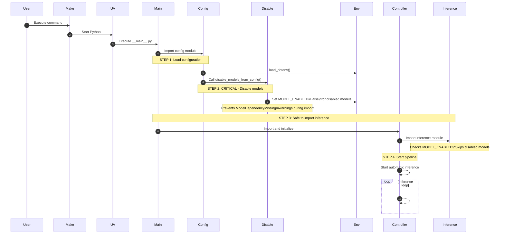
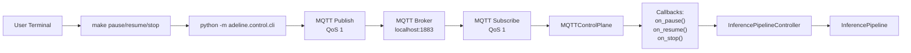
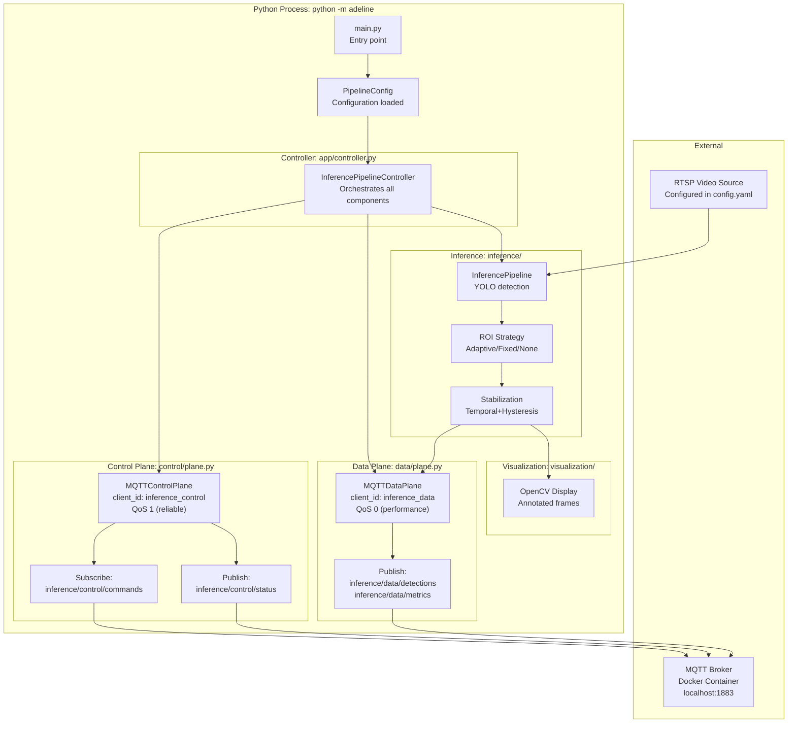

# Getting Started

Relevant source files

- [Makefile](https://github.com/care-foundation/kata-inference-251021-clean2/blob/9a713ffb/Makefile)
- [README.md](https://github.com/care-foundation/kata-inference-251021-clean2/blob/9a713ffb/README.md)
- [adeline/config.py](https://github.com/care-foundation/kata-inference-251021-clean2/blob/9a713ffb/adeline/config.py)

This document guides you through installing, configuring, and running the Adeline inference system for the first time. It covers dependency installation, configuration file setup, infrastructure service initialization, and executing your first inference pipeline run.

For detailed configuration options, see [Configuration Reference](https://deepwiki.com/care-foundation/kata-inference-251021-clean2/6-configuration-reference). For operational commands and monitoring, see [Operations Guide](https://deepwiki.com/care-foundation/kata-inference-251021-clean2/7-operations-guide). For architectural concepts, see [System Architecture](https://deepwiki.com/care-foundation/kata-inference-251021-clean2/3-system-architecture).

---

## Purpose and Scope

This guide covers:

- Installing Python dependencies using `uv`
- Creating required configuration files (`.env` and `config.yaml`)
- Starting infrastructure services (MQTT broker)
- Running the inference pipeline
- Sending basic control commands
- Verifying system operation

**Prerequisites:**

- Python 3.10 or higher
- Docker and Docker Compose (for MQTT broker)
- `uv` package manager
- RTSP video source (or use test stream)

---

## Installation Overview

The installation process follows this sequence:

**Sources:** [README.md54-103](https://github.com/care-foundation/kata-inference-251021-clean2/blob/9a713ffb/README.md#L54-L103) [Makefile52-65](https://github.com/care-foundation/kata-inference-251021-clean2/blob/9a713ffb/Makefile#L52-L65)

---

## Step 1: Install Dependencies

The project uses `uv` for fast, deterministic dependency management.

### Install uv (if needed)

```
curl -LsSf https://astral.sh/uv/install.sh | sh
```

### Install Project Dependencies

```
# From project root
make install
```

This command executes [Makefile52-55](https://github.com/care-foundation/kata-inference-251021-clean2/blob/9a713ffb/Makefile#L52-L55) which runs:

- `uv sync` - installs all dependencies from `pyproject.toml` and `uv.lock`
- Creates `.venv/` virtual environment
- Installs the `adeline` package in editable mode

**Verification:**

```
# Test that imports work
make test-imports
```

This runs [Makefile163-170](https://github.com/care-foundation/kata-inference-251021-clean2/blob/9a713ffb/Makefile#L163-L170) verifying that key modules can be imported:

- `adeline.PipelineConfig`
- `adeline.control.MQTTControlPlane`
- `adeline.data.MQTTDataPlane`
- `adeline.inference.roi.ROIBox`
- `adeline.inference.stabilization.TemporalHysteresisStabilizer`

**Sources:** [README.md56-64](https://github.com/care-foundation/kata-inference-251021-clean2/blob/9a713ffb/README.md#L56-L64) [Makefile52-65](https://github.com/care-foundation/kata-inference-251021-clean2/blob/9a713ffb/Makefile#L52-L65) [Makefile163-170](https://github.com/care-foundation/kata-inference-251021-clean2/blob/9a713ffb/Makefile#L163-L170)

---

## Step 2: Configuration Setup

The system requires two configuration files: `.env` (secrets) and `config.yaml` (settings).

### Configuration File Hierarchy


**Sources:** [adeline/config.py1-206](https://github.com/care-foundation/kata-inference-251021-clean2/blob/9a713ffb/adeline/config.py#L1-L206)

### Create .env File

```
# Copy template
cp .env.example .env
```

Edit `.env` and set required values:

|Variable|Purpose|Required|
|---|---|---|
|`ROBOFLOW_API_KEY`|Roboflow cloud inference API key|If using cloud models|
|`MQTT_USERNAME`|MQTT broker authentication|Optional (if broker requires auth)|
|`MQTT_PASSWORD`|MQTT broker authentication|Optional (if broker requires auth)|

The `.env` file is loaded by [adeline/config.py14](https://github.com/care-foundation/kata-inference-251021-clean2/blob/9a713ffb/adeline/config.py#L14-L14) using `load_dotenv()`.

**Sources:** [README.md66-76](https://github.com/care-foundation/kata-inference-251021-clean2/blob/9a713ffb/README.md#L66-L76) [adeline/config.py13-14](https://github.com/care-foundation/kata-inference-251021-clean2/blob/9a713ffb/adeline/config.py#L13-L14)

### Create config.yaml File

```
# Copy template
cp config/adeline/config.yaml.example config/adeline/config.yaml
```

Edit `config/adeline/config.yaml` to configure:

**Essential Settings:**

```
pipeline:
  rtsp_url: "rtsp://127.0.0.1:8554/live"  # Your RTSP video source
  model_id: "yolov11n-640"                 # YOLO model variant
  max_fps: 2                                # Inference frame rate
  enable_visualization: true                # Show OpenCV window

models:
  use_local: false                          # true = ONNX, false = Roboflow API
  local_path: "models/yolov11n-320.onnx"   # If use_local: true
  confidence: 0.25                          # Detection confidence threshold
```

These settings are loaded by `PipelineConfig.__init__()` at [adeline/config.py56-206](https://github.com/care-foundation/kata-inference-251021-clean2/blob/9a713ffb/adeline/config.py#L56-L206)

**Sources:** [adeline/config.py56-206](https://github.com/care-foundation/kata-inference-251021-clean2/blob/9a713ffb/adeline/config.py#L56-L206) [README.md66-76](https://github.com/care-foundation/kata-inference-251021-clean2/blob/9a713ffb/README.md#L66-L76)

---

## Step 3: Start Infrastructure Services

The system requires an MQTT broker for control/data plane communication.

```
# Start MQTT broker (Mosquitto in Docker)
make services-up
```

This executes [Makefile130-134](https://github.com/care-foundation/kata-inference-251021-clean2/blob/9a713ffb/Makefile#L130-L134) which runs:

```
docker-compose -f docker/adeline/docker-compose.mqtt.yml up -d
```

**Verification:**

```
# Check service status
make services-status

# View logs
make services-logs
```

The MQTT broker will be available at `localhost:1883` (configured at [adeline/config.py106](https://github.com/care-foundation/kata-inference-251021-clean2/blob/9a713ffb/adeline/config.py#L106-L106)).

**Sources:** [Makefile130-151](https://github.com/care-foundation/kata-inference-251021-clean2/blob/9a713ffb/Makefile#L130-L151) [README.md62-64](https://github.com/care-foundation/kata-inference-251021-clean2/blob/9a713ffb/README.md#L62-L64) [README.md183-199](https://github.com/care-foundation/kata-inference-251021-clean2/blob/9a713ffb/README.md#L183-L199)

---

## Step 4: Run Your First Pipeline

### Critical Initialization Order

The system requires a specific initialization sequence to prevent model loading warnings:



**Sources:** [adeline/config.py22-51](https://github.com/care-foundation/kata-inference-251021-clean2/blob/9a713ffb/adeline/config.py#L22-L51) Diagram 5 from high-level architecture

### Start the Pipeline

```
# Start inference pipeline
make run
```

This command [Makefile74-77](https://github.com/care-foundation/kata-inference-251021-clean2/blob/9a713ffb/Makefile#L74-L77) executes:

```
uv run python -m adeline
```

Which invokes the `__main__.py` entry point that:

1. Calls `disable_models_from_config()` [adeline/config.py22-51](https://github.com/care-foundation/kata-inference-251021-clean2/blob/9a713ffb/adeline/config.py#L22-L51)
2. Loads `PipelineConfig` [adeline/config.py56](https://github.com/care-foundation/kata-inference-251021-clean2/blob/9a713ffb/adeline/config.py#L56-L56)
3. Initializes `InferencePipelineController`
4. Starts automatic inference

**Expected Output:**

```
Starting Adeline Inference Pipeline...
Press Ctrl+C to stop
2024-01-15 10:30:00 - adeline.app.controller - INFO - Pipeline starting...
2024-01-15 10:30:01 - adeline.control.plane - INFO - Control plane connected to localhost:1883
2024-01-15 10:30:01 - adeline.data.plane - INFO - Data plane connected to localhost:1883
2024-01-15 10:30:02 - adeline.inference - INFO - Pipeline running at 2 FPS
```

**Sources:** [Makefile74-77](https://github.com/care-foundation/kata-inference-251021-clean2/blob/9a713ffb/Makefile#L74-L77) [README.md78-89](https://github.com/care-foundation/kata-inference-251021-clean2/blob/9a713ffb/README.md#L78-L89)

---

## Step 5: Basic Operations

### Control Commands

In a separate terminal, use control commands to manage the pipeline:

```
# Pause inference processing
make pause

# Resume processing
make resume

# Query current status
make status

# Request metrics
make metrics

# Stop pipeline (graceful shutdown)
make stop
```

**Command Execution Path:**


These commands are defined in [Makefile84-110](https://github.com/care-foundation/kata-inference-251021-clean2/blob/9a713ffb/Makefile#L84-L110) and invoke the control CLI at `adeline.control.cli`.

**Sources:** [Makefile84-110](https://github.com/care-foundation/kata-inference-251021-clean2/blob/9a713ffb/Makefile#L84-L110) [README.md84-89](https://github.com/care-foundation/kata-inference-251021-clean2/blob/9a713ffb/README.md#L84-L89)

### Monitor Output

```
# Monitor detection data stream
make monitor-data

# Monitor status updates
make monitor-status
```

The `monitor-data` command [Makefile115-118](https://github.com/care-foundation/kata-inference-251021-clean2/blob/9a713ffb/Makefile#L115-L118) runs:

```
uv run python -m adeline.data.monitors data --verbose
```

This subscribes to the MQTT data topics and displays:

- Detection results (bounding boxes, classes, confidence)
- Frame timestamps
- Inference metrics

**Sources:** [Makefile115-125](https://github.com/care-foundation/kata-inference-251021-clean2/blob/9a713ffb/Makefile#L115-L125) [README.md92-102](https://github.com/care-foundation/kata-inference-251021-clean2/blob/9a713ffb/README.md#L92-L102)

---

## Step 6: Verify System Operation

### Verification Checklist

|Component|Verification Method|Expected Result|
|---|---|---|
|**Dependencies**|`make test-imports`|All imports successful|
|**MQTT Broker**|`make services-status`|Container running|
|**Pipeline Running**|Check terminal output|FPS counter, no errors|
|**Control Plane**|`make status`|Status response received|
|**Data Plane**|`make monitor-data`|Detection messages visible|
|**Video Input**|Check visualization window|Video frames displayed|

### Quick Verification Script

```
# 1. Start services and pipeline
make services-up
make run &

# 2. Wait for initialization
sleep 5

# 3. Test control commands
make status
make pause
sleep 2
make resume

# 4. Monitor data (Ctrl+C to stop)
make monitor-data
```

**Sources:** [README.md145-154](https://github.com/care-foundation/kata-inference-251021-clean2/blob/9a713ffb/README.md#L145-L154)

---

## Step 7: Understanding What's Running

### System Components at Runtime

When you run `make run`, these components initialize:




**Key Classes:**

- `InferencePipelineController` - [adeline/app/controller.py](https://github.com/care-foundation/kata-inference-251021-clean2/blob/9a713ffb/adeline/app/controller.py)
- `MQTTControlPlane` - [adeline/control/plane.py](https://github.com/care-foundation/kata-inference-251021-clean2/blob/9a713ffb/adeline/control/plane.py)
- `MQTTDataPlane` - [adeline/data/plane.py](https://github.com/care-foundation/kata-inference-251021-clean2/blob/9a713ffb/adeline/data/plane.py)
- `PipelineConfig` - [adeline/config.py56](https://github.com/care-foundation/kata-inference-251021-clean2/blob/9a713ffb/adeline/config.py#L56-L56)

**Sources:** [adeline/config.py](https://github.com/care-foundation/kata-inference-251021-clean2/blob/9a713ffb/adeline/config.py) Diagram 1 and Diagram 3 from high-level architecture

---

## Troubleshooting Common Issues

### Issue: ModelDependencyMissing Warnings

**Symptom:**

```
WARNING: ModelDependencyMissing: PALIGEMMA dependencies not installed
```

**Cause:** Heavy models not disabled before `inference` module import.

**Solution:** Ensure `disable_models_from_config()` is called at [adeline/config.py22-51](https://github.com/care-foundation/kata-inference-251021-clean2/blob/9a713ffb/adeline/config.py#L22-L51) before any inference imports.

**Verification:** Check that models are listed in `config.yaml`:

```
models_disabled:
  disabled:
    - PALIGEMMA
    - FLORENCE2
    # ... other models
```

**Sources:** [adeline/config.py22-51](https://github.com/care-foundation/kata-inference-251021-clean2/blob/9a713ffb/adeline/config.py#L22-L51)

### Issue: MQTT Connection Failed

**Symptom:**

```
ERROR: Failed to connect to MQTT broker
```

**Solution:**

```
# Check if broker is running
make services-status

# Restart broker if needed
make services-down
make services-up

# Check logs
make services-logs
```

**Sources:** [Makefile130-151](https://github.com/care-foundation/kata-inference-251021-clean2/blob/9a713ffb/Makefile#L130-L151)

### Issue: ROBOFLOW_API_KEY Not Found

**Symptom:**

```
ValueError: ROBOFLOW_API_KEY not found in environment variables
```

**Cause:** Missing API key in `.env` file (required for cloud models).

**Solution:**

```
# Edit .env file
nano .env

# Add:
ROBOFLOW_API_KEY=your_key_here

# OR switch to local models in config.yaml:
models:
  use_local: true
  local_path: "models/yolov11n-320.onnx"
```

**Sources:** [adeline/config.py94-100](https://github.com/care-foundation/kata-inference-251021-clean2/blob/9a713ffb/adeline/config.py#L94-L100)

### Issue: Config File Not Found

**Symptom:**

```
FileNotFoundError: Config file not found: config/adeline/config.yaml
```

**Solution:**

```
# Copy example config
cp config/adeline/config.yaml.example config/adeline/config.yaml

# Edit as needed
nano config/adeline/config.yaml
```

**Sources:** [adeline/config.py67-72](https://github.com/care-foundation/kata-inference-251021-clean2/blob/9a713ffb/adeline/config.py#L67-L72)

---

## Next Steps

Now that you have the system running:

1. **Explore Configuration** - See [Configuration Reference](https://deepwiki.com/care-foundation/kata-inference-251021-clean2/6-configuration-reference) for all available options
2. **Learn Control Commands** - See [Control Commands](https://deepwiki.com/care-foundation/kata-inference-251021-clean2/7.2-control-commands) for advanced operations
3. **Understand Architecture** - See [System Architecture](https://deepwiki.com/care-foundation/kata-inference-251021-clean2/3-system-architecture) for design principles
4. **Configure ROI Strategies** - See [ROI Strategies](https://deepwiki.com/care-foundation/kata-inference-251021-clean2/5.5-roi-strategies) for performance optimization
5. **Set Up Monitoring** - See [Monitoring and Data Streams](https://deepwiki.com/care-foundation/kata-inference-251021-clean2/7.3-monitoring-and-data-streams) for production monitoring

### Quick Command Reference

```
# Installation
make install              # Install dependencies
make services-up          # Start MQTT broker

# Running
make run                  # Start pipeline

# Control
make pause                # Pause processing
make resume               # Resume processing
make stop                 # Stop pipeline

# Monitoring
make monitor-data         # Watch detections
make monitor-status       # Watch status updates
make metrics              # Request metrics

# Management
make services-down        # Stop infrastructure
make clean                # Clean temporary files
```

**Sources:** [Makefile1-240](https://github.com/care-foundation/kata-inference-251021-clean2/blob/9a713ffb/Makefile#L1-L240) [README.md54-103](https://github.com/care-foundation/kata-inference-251021-clean2/blob/9a713ffb/README.md#L54-L103)