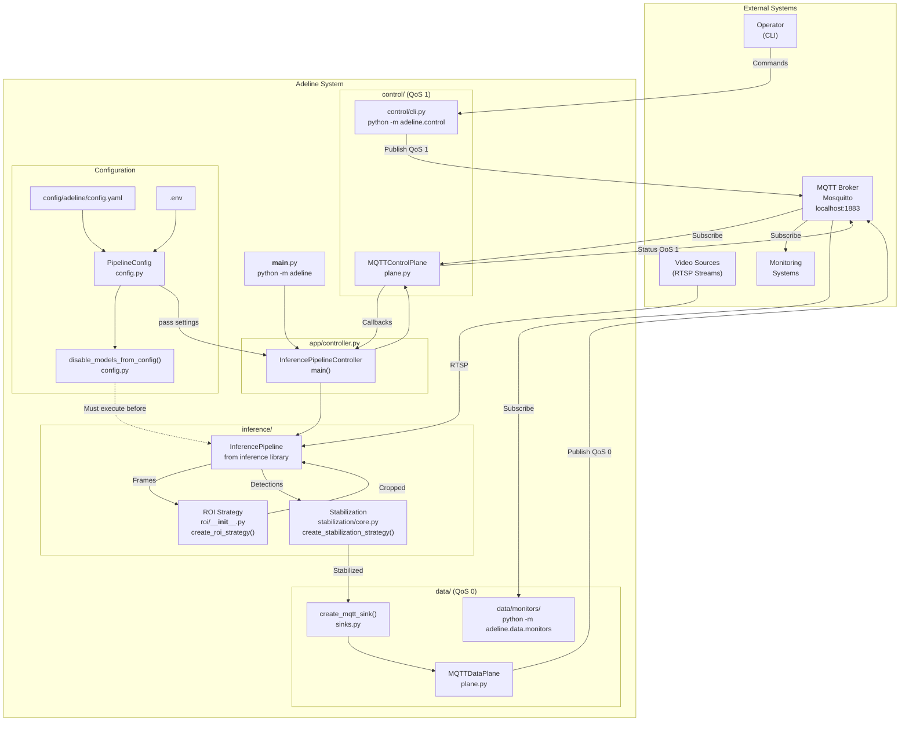
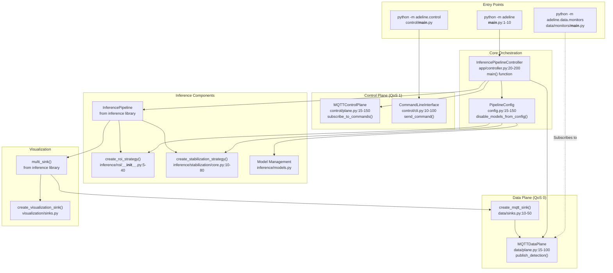
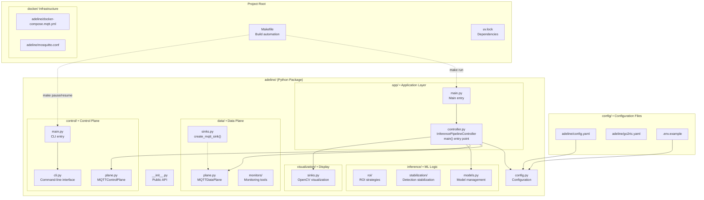
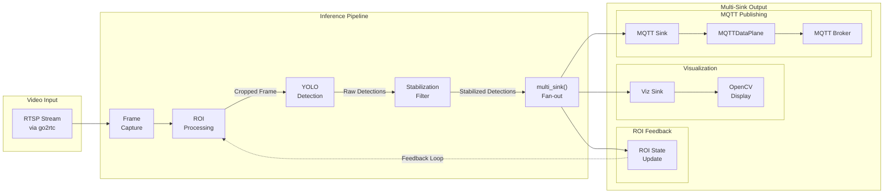
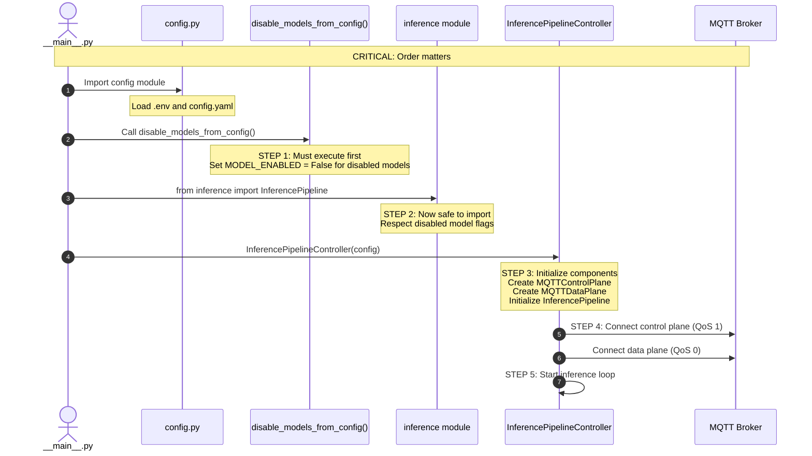

# System Architecture

Relevant source files

- [adeline/CLAUDE.md](https://github.com/care-foundation/kata-inference-251021-clean2/blob/9a713ffb/adeline/CLAUDE.md)
- [adeline/DESIGN.md](https://github.com/care-foundation/kata-inference-251021-clean2/blob/9a713ffb/adeline/DESIGN.md)
- [adeline/README.md](https://github.com/care-foundation/kata-inference-251021-clean2/blob/9a713ffb/adeline/README.md)

## Purpose and Scope

This document provides a high-level architectural overview of the Adeline inference system, explaining the core design principles, component organization, and communication patterns. This page focuses on the overall system structure and how major components interact.

For detailed information about specific aspects, see:

- Control and Data Plane implementation details: [Control and Data Plane Separation](https://deepwiki.com/care-foundation/kata-inference-251021-clean2/3.1-control-and-data-plane-separation)
- MQTT topics, QoS strategies, and message formats: [MQTT Communication Architecture](https://deepwiki.com/care-foundation/kata-inference-251021-clean2/3.2-mqtt-communication-architecture)
- Individual component responsibilities and interfaces: [Component Overview](https://deepwiki.com/care-foundation/kata-inference-251021-clean2/3.3-component-overview)
- Critical startup sequence and model disabling: [Initialization Sequence](https://deepwiki.com/care-foundation/kata-inference-251021-clean2/3.4-initialization-sequence)
- Configuration options and hierarchy: [Configuration Reference](https://deepwiki.com/care-foundation/kata-inference-251021-clean2/6-configuration-reference)

**Sources:** [adeline/CLAUDE.md21-43](https://github.com/care-foundation/kata-inference-251021-clean2/blob/9a713ffb/adeline/CLAUDE.md#L21-L43) [adeline/README.md1-26](https://github.com/care-foundation/kata-inference-251021-clean2/blob/9a713ffb/adeline/README.md#L1-L26) [adeline/DESIGN.md1-116](https://github.com/care-foundation/kata-inference-251021-clean2/blob/9a713ffb/adeline/DESIGN.md#L1-L116)

---

## Architectural Overview

The Adeline system implements a **control/data plane separation pattern** for real-time object detection with MQTT-based remote control. The architecture prioritizes reliability for control operations (QoS 1) while optimizing throughput for high-volume detection data (QoS 0).

### High-Level System Architecture

**Sources:** [adeline/CLAUDE.md21-43](https://github.com/care-foundation/kata-inference-251021-clean2/blob/9a713ffb/adeline/CLAUDE.md#L21-L43) [adeline/app/controller.py1-200](https://github.com/care-foundation/kata-inference-251021-clean2/blob/9a713ffb/adeline/app/controller.py#L1-L200) [adeline/control/plane.py1-150](https://github.com/care-foundation/kata-inference-251021-clean2/blob/9a713ffb/adeline/control/plane.py#L1-L150) [adeline/data/plane.py1-100](https://github.com/care-foundation/kata-inference-251021-clean2/blob/9a713ffb/adeline/data/plane.py#L1-L100)

---

## Core Architectural Principles

The system is built on three fundamental principles that drive its design:

### 1. Control/Data Plane Separation

The architecture separates **control operations** from **data publishing** using different MQTT quality-of-service levels:

|Plane|QoS Level|Purpose|Components|
|---|---|---|---|
|**Control Plane**|QoS 1 (At-least-once)|Reliable command delivery and status updates|`MQTTControlPlane` in [control/plane.py](https://github.com/care-foundation/kata-inference-251021-clean2/blob/9a713ffb/control/plane.py)|
|**Data Plane**|QoS 0 (Best-effort)|High-throughput detection publishing|`MQTTDataPlane` in [data/plane.py](https://github.com/care-foundation/kata-inference-251021-clean2/blob/9a713ffb/data/plane.py)|

This separation ensures that control commands (pause, resume, stop) are reliably delivered without being impacted by high-volume detection data, and conversely, that data throughput is not constrained by delivery guarantees.

**Detailed coverage:** See [Control and Data Plane Separation](https://deepwiki.com/care-foundation/kata-inference-251021-clean2/3.1-control-and-data-plane-separation)

### 2. Configuration-Driven Architecture

System behavior is controlled through declarative configuration rather than hardcoded logic. The configuration hierarchy is:

The `PipelineConfig` class in [adeline/config.py](https://github.com/care-foundation/kata-inference-251021-clean2/blob/9a713ffb/adeline/config.py) loads configuration from:

- `.env` - Sensitive credentials (API keys, MQTT passwords)
- `config/adeline/config.yaml` - Application settings and strategy parameters

Factory functions (`create_roi_strategy()`, `create_stabilization_strategy()`) instantiate concrete implementations based on configuration, enabling behavior changes without code modification.

**Detailed coverage:** See [Configuration-Driven Architecture](https://deepwiki.com/care-foundation/kata-inference-251021-clean2/4.1-configuration-driven-architecture)

### 3. Factory Pattern for Strategy Variants

The system uses the Factory Pattern to manage multiple implementations of ROI processing and detection stabilization:

|Strategy Type|Factory Function|Variants|Configuration Key|
|---|---|---|---|
|**ROI**|`create_roi_strategy()`|`none`, `adaptive`, `fixed`|`roi_strategy.mode`|
|**Stabilization**|`create_stabilization_strategy()`|`none`, `temporal`|`stabilization.mode`|

This pattern allows new strategies to be added without modifying existing code, following the Open/Closed Principle.

**Detailed coverage:** See [Factory Pattern for Strategies](https://deepwiki.com/care-foundation/kata-inference-251021-clean2/4.2-factory-pattern-for-strategies)

**Sources:** [adeline/DESIGN.md1-116](https://github.com/care-foundation/kata-inference-251021-clean2/blob/9a713ffb/adeline/DESIGN.md#L1-L116) [adeline/CLAUDE.md95-109](https://github.com/care-foundation/kata-inference-251021-clean2/blob/9a713ffb/adeline/CLAUDE.md#L95-L109) [adeline/config.py1-100](https://github.com/care-foundation/kata-inference-251021-clean2/blob/9a713ffb/adeline/config.py#L1-L100)

---

## System Components and Code Mapping

This section maps high-level components to their code implementations.

### Component Architecture

### Component Responsibilities

|Component|File Path|Primary Responsibilities|
|---|---|---|
|**InferencePipelineController**|[app/controller.py](https://github.com/care-foundation/kata-inference-251021-clean2/blob/9a713ffb/app/controller.py)|Orchestrates all components, handles SIGINT/SIGTERM signals, manages lifecycle|
|**PipelineConfig**|[config.py](https://github.com/care-foundation/kata-inference-251021-clean2/blob/9a713ffb/config.py)|Loads configuration from `.env` and `config.yaml`, validates schema|
|**disable_models_from_config()**|[config.py50-80](https://github.com/care-foundation/kata-inference-251021-clean2/blob/9a713ffb/config.py#L50-L80)|Disables unused models before imports to prevent warnings|
|**MQTTControlPlane**|[control/plane.py](https://github.com/care-foundation/kata-inference-251021-clean2/blob/9a713ffb/control/plane.py)|Handles control commands (pause/resume/stop), publishes status (QoS 1)|
|**MQTTDataPlane**|[data/plane.py](https://github.com/care-foundation/kata-inference-251021-clean2/blob/9a713ffb/data/plane.py)|Publishes detection results and metrics (QoS 0)|
|**InferencePipeline**|External library|Performs YOLO object detection on video frames|
|**create_roi_strategy()**|[inference/roi/__init__.py](https://github.com/care-foundation/kata-inference-251021-clean2/blob/9a713ffb/inference/roi/__init__.py)|Factory for ROI strategies (adaptive/fixed/none)|
|**create_stabilization_strategy()**|[inference/stabilization/core.py](https://github.com/care-foundation/kata-inference-251021-clean2/blob/9a713ffb/inference/stabilization/core.py)|Factory for detection stabilizers (temporal/none)|
|**create_mqtt_sink()**|[data/sinks.py](https://github.com/care-foundation/kata-inference-251021-clean2/blob/9a713ffb/data/sinks.py)|Creates MQTT output sink for detection results|

**Detailed coverage:** See [Component Overview](https://deepwiki.com/care-foundation/kata-inference-251021-clean2/3.3-component-overview)

**Sources:** [adeline/CLAUDE.md39-43](https://github.com/care-foundation/kata-inference-251021-clean2/blob/9a713ffb/adeline/CLAUDE.md#L39-L43) [adeline/app/controller.py1-200](https://github.com/care-foundation/kata-inference-251021-clean2/blob/9a713ffb/adeline/app/controller.py#L1-L200) [adeline/config.py1-150](https://github.com/care-foundation/kata-inference-251021-clean2/blob/9a713ffb/adeline/config.py#L1-L150)

---

## Module Organization

The codebase follows a clear separation of concerns with each module having specific responsibilities:

### Module Descriptions

| Module             | Purpose                                            | Key Files                                                                                 |
| ------------------ | -------------------------------------------------- | ----------------------------------------------------------------------------------------- |
| **app/**           | Application orchestration and lifecycle management | `controller.py` - main orchestrator                                                       |
| **control/**       | Control plane implementation (QoS 1)               | `plane.py` - MQTT control, `cli.py` - command sender                                      |
| **data/**          | Data plane implementation (QoS 0)                  | `plane.py` - MQTT publishing, `sinks.py` - sink factory, `monitors/` - monitoring tools   |
| **inference/**     | Machine learning logic and strategies              | `roi/` - ROI strategies, `stabilization/` - detection filters, `models.py` - model config |
| **visualization/** | OpenCV display and annotation                      | `sinks.py` - visualization sink creation                                                  |
| **config/**        | Configuration files (external to package)          | `config.yaml` - settings, `go2rtc.yaml` - RTSP proxy                                      |
| **docker/**        | Infrastructure as code                             | `docker-compose.mqtt.yml` - MQTT broker setup                                             |

**Sources:** [adeline/CLAUDE.md75-93](https://github.com/care-foundation/kata-inference-251021-clean2/blob/9a713ffb/adeline/CLAUDE.md#L75-L93) [adeline/app/controller.py](https://github.com/care-foundation/kata-inference-251021-clean2/blob/9a713ffb/adeline/app/controller.py) [adeline/control/plane.py](https://github.com/care-foundation/kata-inference-251021-clean2/blob/9a713ffb/adeline/control/plane.py) [adeline/data/plane.py](https://github.com/care-foundation/kata-inference-251021-clean2/blob/9a713ffb/adeline/data/plane.py)

---

## Data Flow Overview

The following diagram shows how data flows through the system from video input to multiple outputs:

### Data Flow Stages

1. **Video Capture**: RTSP stream provides video frames via go2rtc proxy
2. **ROI Processing**: Optional cropping based on strategy (adaptive/fixed/none)
3. **YOLO Detection**: Object detection on frames (or cropped regions)
4. **Stabilization**: Optional temporal filtering to reduce flickering
5. **Multi-Sink Output**: Parallel distribution to multiple destinations
    - **MQTT**: Detection results published to broker (QoS 0)
    - **Visualization**: Annotated frames displayed locally
    - **ROI Feedback**: Updates adaptive ROI state for next frame

The multi-sink pattern in [adeline/app/controller.py100-120](https://github.com/care-foundation/kata-inference-251021-clean2/blob/9a713ffb/adeline/app/controller.py#L100-L120) enables this parallel output without pipeline modification.

**Sources:** [adeline/CLAUDE.md56-73](https://github.com/care-foundation/kata-inference-251021-clean2/blob/9a713ffb/adeline/CLAUDE.md#L56-L73) [adeline/app/controller.py80-150](https://github.com/care-foundation/kata-inference-251021-clean2/blob/9a713ffb/adeline/app/controller.py#L80-L150) [adeline/data/sinks.py1-50](https://github.com/care-foundation/kata-inference-251021-clean2/blob/9a713ffb/adeline/data/sinks.py#L1-L50)

---

## Communication Architecture Overview

The system uses MQTT as its communication backbone with a topic hierarchy that separates control and data:

### Topic Structure

|Topic|QoS|Direction|Purpose|
|---|---|---|---|
|`inference/control/commands`|1|Operator → System|Control commands (pause/resume/stop/status/toggle_crop/stabilization_stats)|
|`inference/control/status`|1|System → Operator|Status updates and command acknowledgments|
|`inference/data/detections`|0|System → Monitors|Detection results with bounding boxes|
|`inference/data/metrics`|0|System → Monitors|Performance metrics (FPS, latency)|

### QoS Strategy Rationale

|QoS Level|Characteristics|Use Cases|
|---|---|---|
|**QoS 1**|At-least-once delivery, acknowledgment required, slower|Control commands (must not be lost), status updates|
|**QoS 0**|Best-effort, no acknowledgment, faster|Detection data (high volume, occasional loss acceptable)|

The separation ensures:

- Control commands are never lost due to data traffic
- Data throughput is not constrained by acknowledgment overhead
- Independent scaling of control and data subscribers

**Detailed coverage:** See [MQTT Communication Architecture](https://deepwiki.com/care-foundation/kata-inference-251021-clean2/3.2-mqtt-communication-architecture)

**Sources:** [adeline/CLAUDE.md27-37](https://github.com/care-foundation/kata-inference-251021-clean2/blob/9a713ffb/adeline/CLAUDE.md#L27-L37) [adeline/control/plane.py1-150](https://github.com/care-foundation/kata-inference-251021-clean2/blob/9a713ffb/adeline/control/plane.py#L1-L150) [adeline/data/plane.py1-100](https://github.com/care-foundation/kata-inference-251021-clean2/blob/9a713ffb/adeline/data/plane.py#L1-L100)

---

## Initialization and Lifecycle

The system has a critical initialization sequence that must be followed to avoid model loading issues:

### Initialization Order

### Critical Points

1. **Model Disabling**: The function `disable_models_from_config()` in [config.py50-80](https://github.com/care-foundation/kata-inference-251021-clean2/blob/9a713ffb/config.py#L50-L80) must execute **before** importing the `inference` module. This prevents `ModelDependencyMissing` warnings for unused models.
    
2. **Signal Handling**: The controller registers SIGINT and SIGTERM handlers in [app/controller.py30-50](https://github.com/care-foundation/kata-inference-251021-clean2/blob/9a713ffb/app/controller.py#L30-L50) to ensure graceful shutdown.
    
3. **MQTT Connection**: Both control and data planes connect to the broker before the pipeline starts, ensuring commands can be received immediately.
    

**Detailed coverage:** See [Initialization Sequence](https://deepwiki.com/care-foundation/kata-inference-251021-clean2/3.4-initialization-sequence)

**Sources:** [adeline/CLAUDE.md44-50](https://github.com/care-foundation/kata-inference-251021-clean2/blob/9a713ffb/adeline/CLAUDE.md#L44-L50) [adeline/config.py1-150](https://github.com/care-foundation/kata-inference-251021-clean2/blob/9a713ffb/adeline/config.py#L1-L150) [adeline/app/controller.py1-200](https://github.com/care-foundation/kata-inference-251021-clean2/blob/9a713ffb/adeline/app/controller.py#L1-L200)

---

## Summary

The Adeline system architecture is built on three core principles:

1. **Control/Data Plane Separation** - Different QoS levels ensure reliable control and high-throughput data
2. **Configuration-Driven Design** - Behavior controlled through declarative YAML, not code
3. **Factory Pattern** - Flexible strategy selection for ROI and stabilization

The architecture enables:

- **Reliability**: Control commands never lost due to data traffic
- **Performance**: Data plane optimized for throughput
- **Flexibility**: Runtime behavior modification via configuration
- **Extensibility**: New strategies added without modifying existing code

Key components are orchestrated by `InferencePipelineController` which coordinates the control plane (`MQTTControlPlane`), data plane (`MQTTDataPlane`), and inference pipeline (`InferencePipeline`) with configurable ROI and stabilization strategies.

**Sources:** [adeline/DESIGN.md1-116](https://github.com/care-foundation/kata-inference-251021-clean2/blob/9a713ffb/adeline/DESIGN.md#L1-L116) [adeline/CLAUDE.md1-143](https://github.com/care-foundation/kata-inference-251021-clean2/blob/9a713ffb/adeline/CLAUDE.md#L1-L143) [adeline/README.md1-26](https://github.com/care-foundation/kata-inference-251021-clean2/blob/9a713ffb/adeline/README.md#L1-L26)